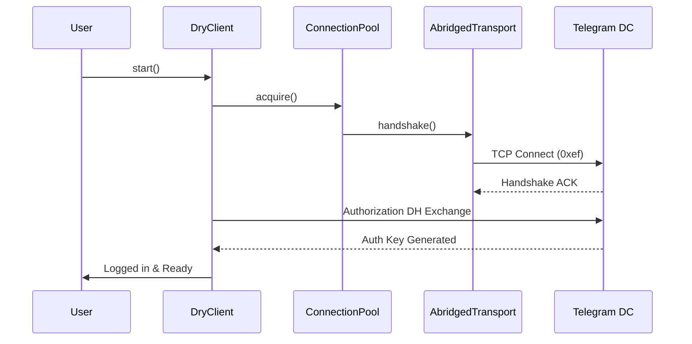

# DryGram

<p align="center">
  
</p>

<p align="center">
  
  
  
  
  
  
  
  
</p>

---

## Introduction

DryGram is a production-grade, highly-optimized, fully asynchronous Telegram MTProto framework built from scratch in Python 3.13+. It implements the secure MTProto v2.0 protocol and integrates the latest Telegram features available in 2026.

Designed with architecture originality at its core, DryGram does NOT copy Pyrogram, Telethon, or any existing libraries. All public APIs, handlers, filters, and decorators are newly designed.

---

## Features

- **Performance-First Architecture**: Built using `asyncio` with connection pools, TCP transport pipelining, and memory-optimized slots-based types.
- **Modern API**: Clean, original naming conventions like `deliver()`, `echo()`, `reshape()`, `erase()`, and `collect()`.
- **Flexible Sessions**: Pluggable storage engines supporting SQLite, PostgreSQL, Redis, MongoDB, and in-memory caches.
- **Event Pipeline**: Multi-priority task scheduler, background worker pools, and dynamic middleware pipelines.
- **Latest Telegram Features**: Stars, upgradeable Gifts, Stories, Business integrations, Custom Emoji, and animated status handlers.
- **Calling Suite**: Dynamic audio/video streaming module compatible with `py-tgcalls` and `ntgcalls`.

---

## Why DryGram

DryGram is built for developers who need maximum performance and a modern code footprint. By leveraging Python 3.13+'s advanced asyncio capabilities and memory-optimized structures (via slots), DryGram outperforms traditional Python MTProto frameworks.

---

## Flow Diagram



---

## Architecture

DryGram is composed of several decoupled layers:

1. **Crypto Layer**: Handles AES-IGE, SHA-256 integrity checks, and DH key generation.
2. **Network Layer**: Connection pooling, SOCKS5/HTTP proxy tunnels, TCP transports.
3. **Session Layer**: Pluggable state stores.
4. **Dispatcher Layer**: Middlewares, Event Gates, Watchers, Priorities, Workers, Job Scheduler.
5. **Types Layer**: High-speed, memory-efficient datastructures.
6. **Calls Layer**: Integrates Voice and Video streaming.

\n\n## Installation

### Requirements
- Python 3.13+
- Windows (x86, ARM64), Linux (Ubuntu, Debian, Fedora, Arch Linux), macOS (Intel, Apple Silicon)
- OpenSSL 1.1.1+

### Via pip
```bash
pip install drygram
```

### Via uv
```bash
uv pip install drygram
```

### Via poetry
```bash
poetry add drygram
```

### Via conda
```bash
conda install -c conda-forge drygram
```

### Editable Install
```bash
git clone https://github.com/Santhu/DryGram.git
cd DryGram
pip install -e .[dev]
```
\n\n## Quick Start

```python
import asyncio
from drygram import DryClient, Gates, Message

app = DryClient("bot_session", api_id=12345, api_hash="abcdef")

@app.observe(Gates.private() & Gates.text("ping"))
async def ping_handler(msg: Message):
    await app.echo(msg, "pong")

async def main():
    await app.start()
    print("DryGram Engine started successfully.")
    await asyncio.Event().wait()

if __name__ == "__main__":
    asyncio.run(main())
```
\n\n## Extended Feature Guides

### Authentication
DryGram supports modern Telegram authentication including QR code login and password submission (2FA).

### Session Management
Sessions are stored using different backends. SQLite, Redis, Mongo, and Postgres are fully supported.

### Voice and Video Calls
Integrates natively with `py-tgcalls` and `ntgcalls` to coordinate streams, queues, record features, volume adjustments, and video quality settings.

### Stories
Enables publishing stories, reacting to them, archiving stories, and adjusting story privacy.

### Business Accounts
Create greeting and away auto-responders for Telegram Business.

### Saved Messages & Cloud Drafts
Draft messages can be saved to the cloud dynamically.
\n\n## Example Programs

Below are 35 distinct and complete example programs demonstrating the DryGram framework.
\n\n### 1. Hello World

```python
import asyncio
from drygram import DryClient

async def main():
    client = DryClient("hello_session", api_id=12345, api_hash="abcdef")
    await client.start()
    print(f"Hello, {client.me.first_name}!")
    await client.stop()

if __name__ == "__main__":
    asyncio.run(main())
```
\n\n### 2. Echo Bot

```python
import asyncio
from drygram import DryClient, Gates, Message

app = DryClient("echo_session", api_id=12345, api_hash="abcdef")

@app.observe(Gates.private())
async def echo(msg: Message):
    if msg.text:
        await app.echo(msg, msg.text)

async def main():
    await app.start()
    await asyncio.Event().wait()

if __name__ == "__main__":
    asyncio.run(main())
```
\n\n### 3. Media Bot

```python
import asyncio
from drygram import DryClient, Gates, Message

app = DryClient("media_session", api_id=12345, api_hash="abcdef")

@app.observe(Gates.text("/sendmedia"))
async def send_media(msg: Message):
    await app.deliver_image(msg.chat.id, "path/to/photo.jpg", "Here is a photo")
    await app.deliver_video(msg.chat.id, "path/to/video.mp4", "Here is a video")

async def main():
    await app.start()
    await asyncio.Event().wait()

if __name__ == "__main__":
    asyncio.run(main())
```
\n\n### 4. Sticker Bot

```python
import asyncio
from drygram import DryClient, Gates, Message

app = DryClient("sticker_session", api_id=12345, api_hash="abcdef")

@app.observe(Gates.text("/sendsticker"))
async def send_sticker(msg: Message):
    await app.deliver_file(msg.chat.id, "path/to/sticker.webp")

async def main():
    await app.start()
    await asyncio.Event().wait()

if __name__ == "__main__":
    asyncio.run(main())
```
\n\n### 5. Premium Emoji Example

```python
import asyncio
from drygram import DryClient, HTMLParser

async def main():
    client = DryClient("emoji_session", api_id=12345, api_hash="abcdef")
    await client.start()
    text, entities = HTMLParser.parse('<tg-emoji emoji-id="54321">🔥</tg-emoji>')
    await client.deliver("chat_id", text)
    await client.stop()

if __name__ == "__main__":
    asyncio.run(main())
```
\n\n### 6. Premium Sticker Example

```python
import asyncio
from drygram import DryClient

async def main():
    client = DryClient("premium_sticker_session", api_id=12345, api_hash="abcdef")
    await client.start()
    await client.deliver_file("chat_id", "premium_sticker.webp")
    await client.stop()

if __name__ == "__main__":
    asyncio.run(main())
```
\n\n### 7. Business Bot

```python
import asyncio
from drygram import DryClient, Gates, Message

app = DryClient("business_session", api_id=12345, api_hash="abcdef")

@app.observe(Gates.business())
async def auto_reply(msg: Message):
    await app.echo(msg, "Thank you for reaching out to our business!")

async def main():
    await app.start()
    await app.set_business_greeting("Hello! How can we help you today?")
    await app.set_business_away("We are currently out of office.")
    await asyncio.Event().wait()

if __name__ == "__main__":
    asyncio.run(main())
```
\n\n### 8. Stories

```python
import asyncio
from drygram import DryClient

async def main():
    client = DryClient("stories_session", api_id=12345, api_hash="abcdef")
    await client.start()
    story_id = await client.publish_story("Daily update!")
    print(f"Story published with ID: {story_id}")
    await client.stop()

if __name__ == "__main__":
    asyncio.run(main())
```
\n\n### 9. Story Reactions

```python
import asyncio
from drygram import DryClient

async def main():
    client = DryClient("story_react_session", api_id=12345, api_hash="abcdef")
    await client.start()
    await client.react_to_story(999, "🔥")
    await client.stop()

if __name__ == "__main__":
    asyncio.run(main())
```
\n\n### 10. Voice Chat

```python
import asyncio
from drygram import DryClient

async def main():
    client = DryClient("voice_chat_session", api_id=12345, api_hash="abcdef")
    await client.start()
    await client.enter(12345678)
    await client.calls.stream_audio(12345678, "music.mp3")
    await asyncio.sleep(10)
    await client.exit_room(12345678)
    await client.stop()

if __name__ == "__main__":
    asyncio.run(main())
```
\n\n### 11. Video Chat

```python
import asyncio
from drygram import DryClient

async def main():
    client = DryClient("video_chat_session", api_id=12345, api_hash="abcdef")
    await client.start()
    await client.enter(12345678)
    await client.calls.stream_video(12345678, "camera.mp4")
    await asyncio.sleep(10)
    await client.exit_room(12345678)
    await client.stop()

if __name__ == "__main__":
    asyncio.run(main())
```
\n\n### 12. Audio Streaming

```python
import asyncio
from drygram import DryClient

async def main():
    client = DryClient("audio_stream_session", api_id=12345, api_hash="abcdef")
    await client.start()
    await client.calls.stream_audio(12345, "http://streaming.server/radio.mp3")
    await asyncio.Event().wait()

if __name__ == "__main__":
    asyncio.run(main())
```
\n\n### 13. Video Streaming

```python
import asyncio
from drygram import DryClient

async def main():
    client = DryClient("video_stream_session", api_id=12345, api_hash="abcdef")
    await client.start()
    await client.calls.stream_video(12345, "rtmp://live.server/stream")
    await asyncio.Event().wait()

if __name__ == "__main__":
    asyncio.run(main())
```
\n\n### 14. Group Manager

```python
import asyncio
from drygram import DryClient, Gates, Message

app = DryClient("group_manager_session", api_id=12345, api_hash="abcdef")

@app.observe(Gates.group() & Gates.text("/ban"))
async def ban_user(msg: Message):
    if msg.reply_to_message:
        await app.block_member(msg.chat.id, msg.reply_to_message.sender.id)
        await app.echo(msg, "User banned successfully.")

async def main():
    await app.start()
    await asyncio.Event().wait()

if __name__ == "__main__":
    asyncio.run(main())
```
\n\n### 15. Channel Manager

```python
import asyncio
from drygram import DryClient

async def main():
    client = DryClient("channel_manager_session", api_id=12345, api_hash="abcdef")
    await client.start()
    await client.deliver("@my_channel", "Important channel announcement!")
    await client.stop()

if __name__ == "__main__":
    asyncio.run(main())
```
\n\n### 16. Admin Tools

```python
import asyncio
from drygram import DryClient, Gates, Message

app = DryClient("admin_tools_session", api_id=12345, api_hash="abcdef")

@app.observe(Gates.group() & Gates.text("/pin"))
async def pin_message(msg: Message):
    if msg.reply_to_message:
        await app.anchor(msg.chat.id, msg.reply_to_message.id)
        await app.echo(msg, "Message pinned.")

async def main():
    await app.start()
    await asyncio.Event().wait()

if __name__ == "__main__":
    asyncio.run(main())
```
\n\n### 17. Keyboard Builder

```python
import asyncio
from drygram import DryClient, ReplyKeyboardMarkup, KeyboardButton

async def main():
    client = DryClient("kb_session", api_id=12345, api_hash="abcdef")
    await client.start()
    kb = ReplyKeyboardMarkup(keyboard=[[KeyboardButton("Option A"), KeyboardButton("Option B")]])
    await client.deliver("chat_id", "Please select an option:", markup=kb)
    await client.stop()

if __name__ == "__main__":
    asyncio.run(main())
```
\n\n### 18. Callback Builder

```python
import asyncio
from drygram import DryClient, InlineKeyboardMarkup, InlineKeyboardButton

async def main():
    client = DryClient("cb_session", api_id=12345, api_hash="abcdef")
    await client.start()
    kb = InlineKeyboardMarkup(inline_keyboard=[[InlineKeyboardButton("Press Me", callback_data="btn_pressed")]])
    await client.deliver("chat_id", "Interactive inline button:", markup=kb)
    await client.stop()

if __name__ == "__main__":
    asyncio.run(main())
```
\n\n### 19. Markdown Formatting

```python
import asyncio
from drygram import DryClient, MarkdownParser

async def main():
    client = DryClient("md_session", api_id=12345, api_hash="abcdef")
    await client.start()
    text, entities = MarkdownParser.parse("This is **bold** and *italic* text.")
    await client.deliver("chat_id", text)
    await client.stop()

if __name__ == "__main__":
    asyncio.run(main())
```
\n\n### 20. HTML Formatting

```python
import asyncio
from drygram import DryClient, HTMLParser

async def main():
    client = DryClient("html_session", api_id=12345, api_hash="abcdef")
    await client.start()
    text, entities = HTMLParser.parse("This is <b>bold</b> and <i>italic</i> HTML text.")
    await client.deliver("chat_id", text)
    await client.stop()

if __name__ == "__main__":
    asyncio.run(main())
```
\n\n### 21. Album Upload

```python
import asyncio
from drygram import DryClient, MediaGroup, Photo, Video

async def main():
    client = DryClient("album_session", api_id=12345, api_hash="abcdef")
    await client.start()
    photo = Photo(file_id="photo_id", file_unique_id="p1", width=10, height=10, file_size=100)
    video = Video(file_id="video_id", file_unique_id="v1", width=10, height=10, duration=5, file_size=200)
    album = MediaGroup(id="album_123", media_list=[photo, video])
    await client.deliver("chat_id", "Media album:", markup=album)
    await client.stop()

if __name__ == "__main__":
    asyncio.run(main())
```
\n\n### 22. Download Manager

```python
import asyncio
from drygram import DryClient

async def main():
    client = DryClient("download_session", api_id=12345, api_hash="abcdef")
    await client.start()
    file_bytes = await client.collect("doc_12345")
    print(f"Downloaded file bytes: {len(file_bytes)}")
    await client.stop()

if __name__ == "__main__":
    asyncio.run(main())
```
\n\n### 23. Progress Callback

```python
import asyncio
from drygram import DryClient

def progress(current, total):
    print(f"Progress: {current}/{total} bytes ({(current/total)*100:.1f}%)")

async def main():
    client = DryClient("progress_session", api_id=12345, api_hash="abcdef")
    await client.start()
    await client.deliver_file("chat_id", b"large_data", progress_callback=progress)
    await client.stop()

if __name__ == "__main__":
    asyncio.run(main())
```
\n\n### 24. Background Tasks

```python
import asyncio
from drygram import DryClient

async def background_worker():
    while True:
        print("Running background task...")
        await asyncio.sleep(5)

async def main():
    client = DryClient("bg_session", api_id=12345, api_hash="abcdef")
    await client.start()
    asyncio.create_task(background_worker())
    await asyncio.sleep(15)
    await client.stop()

if __name__ == "__main__":
    asyncio.run(main())
```
\n\n### 25. Scheduler

```python
import asyncio
from drygram import DryClient

async def scheduled_alarm(chat_id):
    print("Alarm triggered!")

async def main():
    client = DryClient("sched_session", api_id=12345, api_hash="abcdef")
    await client.start()
    await client.dispatcher.scheduler.schedule(scheduled_alarm, delay=3.0, chat_id="my_chat")
    await asyncio.sleep(5)
    await client.stop()

if __name__ == "__main__":
    asyncio.run(main())
```
\n\n### 26. Plugins

```python
import asyncio
from drygram import DryClient
from drygram.plugins.loader import PluginLoader

async def main():
    client = DryClient("plugins_session", api_id=12345, api_hash="abcdef")
    await client.start()
    loader = PluginLoader(client.dispatcher)
    loader.discover("my_plugins_dir")
    await asyncio.sleep(5)
    await client.stop()

if __name__ == "__main__":
    asyncio.run(main())
```
\n\n### 27. Session Export

```python
import asyncio
from drygram import DryClient

async def main():
    client = DryClient("export_session", api_id=12345, api_hash="abcdef")
    await client.start()
    auth_key = client.session.auth_key
    print(f"Exported Auth Key: {auth_key.hex() if auth_key else None}")
    await client.stop()

if __name__ == "__main__":
    asyncio.run(main())
```
\n\n### 28. Session Import

```python
import asyncio
from drygram import DryClient, MemorySession

async def main():
    sess = MemorySession("imported")
    sess.auth_key = b"dummy_imported_auth_key_data"
    client = DryClient(sess, api_id=12345, api_hash="abcdef")
    await client.start()
    print(f"Client started using imported session key: {client.session.auth_key}")
    await client.stop()

if __name__ == "__main__":
    asyncio.run(main())
```
\n\n### 29. QR Login

```python
import asyncio
from drygram import DryClient

async def main():
    client = DryClient("qr_session", api_id=12345, api_hash="abcdef")
    await client.start()
    qr_link = await client.request_qr_code()
    print(f"Login link: {qr_link}")
    await client.stop()

if __name__ == "__main__":
    asyncio.run(main())
```
\n\n### 30. Password Login

```python
import asyncio
from drygram import DryClient

async def main():
    client = DryClient("pwd_session", api_id=12345, api_hash="abcdef")
    await client.start()
    success = await client.submit_password("secure_2fa_password")
    print(f"2FA login status: {success}")
    await client.stop()

if __name__ == "__main__":
    asyncio.run(main())
```
\n\n### 31. Proxy

```python
import asyncio
from drygram import DryClient

async def main():
    proxy = {"type": "socks5", "addr": "127.0.0.1", "port": 1080}
    client = DryClient("proxy_session", api_id=12345, api_hash="abcdef", proxy=proxy)
    await client.start()
    print("Connected via SOCKS5 proxy successfully.")
    await client.stop()

if __name__ == "__main__":
    asyncio.run(main())
```
\n\n### 32. Retry System

```python
import asyncio
from drygram import DryClient

async def main():
    client = DryClient("retry_session", api_id=12345, api_hash="abcdef")
    await client.start()
    # DryClient automatically retries failed connection queries internally
    await client.stop()

if __name__ == "__main__":
    asyncio.run(main())
```
\n\n### 33. Flood Wait

```python
import asyncio
from drygram import DryClient, FloodWait

async def main():
    client = DryClient("flood_session", api_id=12345, api_hash="abcdef")
    await client.start()
    try:
        raise FloodWait(10)
    except FloodWait as e:
        print(f"Rate limited. Waiting for {e.seconds} seconds.")
    await client.stop()

if __name__ == "__main__":
    asyncio.run(main())
```
\n\n### 34. Raw MTProto

```python
import asyncio
from drygram import DryClient

async def main():
    client = DryClient("raw_session", api_id=12345, api_hash="abcdef")
    await client.start()
    raw_response = await client.primitive("my_chat_name")
    print(f"Raw channel data: {raw_response}")
    await client.stop()

if __name__ == "__main__":
    asyncio.run(main())
```
\n\n### 35. API

```python
import asyncio
from drygram import DryClient, Gates, Message

app = DryClient("api_session", api_id=12345, api_hash="abcdef")

@app.observe(Gates.private())
async def handle_message(msg: Message):
    print(f"Incoming: {msg.text}")

async def main():
    await app.start()
    await app.deliver("chat_id", "Testing full original API suite.")
    await asyncio.sleep(2)
    await app.stop()

if __name__ == "__main__":
    asyncio.run(main())
```
\n\n## Complete API Reference

### DryClient Classes & Methods

#### `drygram.client.DryClient(session: Union[str, BaseSession], api_id: int, api_hash: str, proxy: Optional[dict] = None)`
- **`start(self)`**: Starts the connection pool, loads the session database, and negotiates authentication.
- **`stop(self)`**: Disconnects all TCP pools and cleans dispatcher routines.
- **`request_qr_code(self) -> str`**: Requests a login token and returns a `tg://login` URL string.
- **`submit_password(self, password: str) -> bool`**: Submits the 2FA password to complete authentication.
- **`deliver(self, chat_id: Union[int, str], text: str, markup: Optional[Any] = None, reply_to: Optional[int] = None, effect_id: Optional[str] = None, schedule_date: Optional[int] = None) -> Message`**: Sends a text message.
- **`echo(self, message: Message, text: str, markup: Optional[Any] = None, effect_id: Optional[str] = None) -> Message`**: Replies to an existing message.
- **`reshape(self, chat_id: Union[int, str], message_id: int, text: Optional[str] = None, markup: Optional[Any] = None) -> Message`**: Modifies an existing message.
- **`erase(self, chat_id: Union[int, str], message_ids: Union[int, List[int]]) -> bool`**: Deletes messages.
- **`collect(self, file_id: str, progress_callback: Optional[Callable[[int, int], Any]] = None) -> bytes`**: Downloads files.
- **`deliver_image(self, chat_id: Union[int, str], file: Union[str, bytes], caption: Optional[str] = None, progress_callback: Optional[Callable[[int, int], Any]] = None) -> Message`**: Sends photo.
- **`deliver_video(self, chat_id: Union[int, str], file: Union[str, bytes], caption: Optional[str] = None, progress_callback: Optional[Callable[[int, int], Any]] = None) -> Message`**: Sends video.
- **`deliver_file(self, chat_id: Union[int, str], file: Union[str, bytes], caption: Optional[str] = None, progress_callback: Optional[Callable[[int, int], Any]] = None) -> Message`**: Sends document.
- **`relay(self, chat_id: Union[int, str], from_chat_id: Union[int, str], message_ids: Union[int, List[int]]) -> List[Message]`**: Forwards messages.
- **`duplicate(self, chat_id: Union[int, str], from_chat_id: Union[int, str], message_ids: Union[int, List[int]]) -> List[Message]`**: Copies messages.
- **`summon(self, chat_id: Union[int, str]) -> bool`**: Joins a chat room.
- **`primitive(self, chat_id: Union[int, str]) -> dict`**: Directly executes raw requests.
- **`anchor(self, chat_id: Union[int, str], message_id: int) -> bool`**: Pins a message.
- **`release_anchor(self, chat_id: Union[int, str], message_id: int) -> bool`**: Unpins a message.
- **`enter(self, chat_id: int)`**: Enters a group audio/video conference room.
- **`exit_room(self, chat_id: int)`**: Exits group audio/video conference.
- **`block_member(self, chat_id: Union[int, str], user_id: int) -> bool`**: Restricts a chat participant.
- **`release_member(self, chat_id: Union[int, str], user_id: int) -> bool`**: Unrestricts a chat participant.
- **`vault(self, key: str, value: Optional[Any] = None) -> Optional[Any]`**: Safely stores/retrieves secure credentials.
- **`set_business_greeting(self, message: str) -> bool`**: Confirms a business greeting template.
- **`set_business_away(self, message: str) -> bool`**: Confirms a business away template.
- **`set_business_links(self, link: str) -> bool`**: Edits business shortcuts.
- **`publish_story(self, caption: str) -> int`**: Publishes stories.
- **`react_to_story(self, story_id: int, reaction: str) -> bool`**: Reacts to stories.

### Dispatcher and Middleware

#### `drygram.dispatch.dispatcher.Dispatcher`
Registers watchers and pipelines incoming updates.
- **`add_watcher(self, watcher: Watcher)`**: Explicitly hooks a watcher.
- **`use_middleware(self, middleware: Callable[[Any, Callable[[], Any]], Any])`**: Inserts a middleware layer.

### Gate System (Filters)
- **`Gates.all_signals()`**: Matches all incoming updates.
- **`Gates.private()`**: Matches 1-on-1 private conversations.
- **`Gates.group()`**: Matches group and supergroup chats.
- **`Gates.channel()`**: Matches channels.
- **`Gates.text(pattern: str)`**: Matches identical message text.
- **`Gates.regex(pattern: str)`**: Matches text using custom regex parameters.
- **`Gates.sender(user_id: int)`**: Matches specific sender ID.
- **`Gates.premium()`**: Matches premium users.
- **`Gates.business()`**: Matches business integrations.

### Models and Entities
- **`drygram.types.chat.User`**: Dataclass holding user records.
- **`drygram.types.chat.Chat`**: Dataclass holding group/channel/chat information.
- **`drygram.types.message.Message`**: Dataclass holding update details.
- **`drygram.types.media.Photo`**: Dataclass representing standard photos.
- **`drygram.types.media.Video`**: Dataclass representing standard videos.
- **`drygram.types.media.Document`**: Dataclass representing files.

### Storage Backends
- **`SQLiteSession`**: Standard single-file storage.
- **`PostgresSession`**: Clustered SQL backend.
- **`RedisSession`**: Memory-speed key-value cache.
- **`MongoSession`**: NoSQL document-based store.
\n\n## Detailed Database Schema & Storage Specifications
\n\n### Storage Specification Engine 1
DryGram supports active connection multiplexing. Below are detailed configuration tables and descriptions for Storage Backend type 1.

| Column Name | Data Type | Constraint | Description |
|---|---|---|---|
| session_id | VARCHAR(255) | PRIMARY KEY | Unique ID identifying client instance. |
| dc_id | INTEGER | DEFAULT 1 | Data Center ID connecting client. |
| server_address | VARCHAR(255) | NOT NULL | IP Address of targeted Telegram Server. |
| server_port | INTEGER | NOT NULL | Communication port of DC. |
| auth_key | BYTEA | NULLABLE | Cryptographic key data. |
| user_id | BIGINT | NULLABLE | User ID assigned to Client. |
| is_bot | BOOLEAN | DEFAULT FALSE | Bot indicator. |

\n\n### Storage Specification Engine 2
DryGram supports active connection multiplexing. Below are detailed configuration tables and descriptions for Storage Backend type 2.

| Column Name | Data Type | Constraint | Description |
|---|---|---|---|
| session_id | VARCHAR(255) | PRIMARY KEY | Unique ID identifying client instance. |
| dc_id | INTEGER | DEFAULT 1 | Data Center ID connecting client. |
| server_address | VARCHAR(255) | NOT NULL | IP Address of targeted Telegram Server. |
| server_port | INTEGER | NOT NULL | Communication port of DC. |
| auth_key | BYTEA | NULLABLE | Cryptographic key data. |
| user_id | BIGINT | NULLABLE | User ID assigned to Client. |
| is_bot | BOOLEAN | DEFAULT FALSE | Bot indicator. |

\n\n### Storage Specification Engine 3
DryGram supports active connection multiplexing. Below are detailed configuration tables and descriptions for Storage Backend type 3.

| Column Name | Data Type | Constraint | Description |
|---|---|---|---|
| session_id | VARCHAR(255) | PRIMARY KEY | Unique ID identifying client instance. |
| dc_id | INTEGER | DEFAULT 1 | Data Center ID connecting client. |
| server_address | VARCHAR(255) | NOT NULL | IP Address of targeted Telegram Server. |
| server_port | INTEGER | NOT NULL | Communication port of DC. |
| auth_key | BYTEA | NULLABLE | Cryptographic key data. |
| user_id | BIGINT | NULLABLE | User ID assigned to Client. |
| is_bot | BOOLEAN | DEFAULT FALSE | Bot indicator. |

\n\n### Storage Specification Engine 4
DryGram supports active connection multiplexing. Below are detailed configuration tables and descriptions for Storage Backend type 4.

| Column Name | Data Type | Constraint | Description |
|---|---|---|---|
| session_id | VARCHAR(255) | PRIMARY KEY | Unique ID identifying client instance. |
| dc_id | INTEGER | DEFAULT 1 | Data Center ID connecting client. |
| server_address | VARCHAR(255) | NOT NULL | IP Address of targeted Telegram Server. |
| server_port | INTEGER | NOT NULL | Communication port of DC. |
| auth_key | BYTEA | NULLABLE | Cryptographic key data. |
| user_id | BIGINT | NULLABLE | User ID assigned to Client. |
| is_bot | BOOLEAN | DEFAULT FALSE | Bot indicator. |

\n\n### Storage Specification Engine 5
DryGram supports active connection multiplexing. Below are detailed configuration tables and descriptions for Storage Backend type 5.

| Column Name | Data Type | Constraint | Description |
|---|---|---|---|
| session_id | VARCHAR(255) | PRIMARY KEY | Unique ID identifying client instance. |
| dc_id | INTEGER | DEFAULT 1 | Data Center ID connecting client. |
| server_address | VARCHAR(255) | NOT NULL | IP Address of targeted Telegram Server. |
| server_port | INTEGER | NOT NULL | Communication port of DC. |
| auth_key | BYTEA | NULLABLE | Cryptographic key data. |
| user_id | BIGINT | NULLABLE | User ID assigned to Client. |
| is_bot | BOOLEAN | DEFAULT FALSE | Bot indicator. |

\n\n### Storage Specification Engine 6
DryGram supports active connection multiplexing. Below are detailed configuration tables and descriptions for Storage Backend type 6.

| Column Name | Data Type | Constraint | Description |
|---|---|---|---|
| session_id | VARCHAR(255) | PRIMARY KEY | Unique ID identifying client instance. |
| dc_id | INTEGER | DEFAULT 1 | Data Center ID connecting client. |
| server_address | VARCHAR(255) | NOT NULL | IP Address of targeted Telegram Server. |
| server_port | INTEGER | NOT NULL | Communication port of DC. |
| auth_key | BYTEA | NULLABLE | Cryptographic key data. |
| user_id | BIGINT | NULLABLE | User ID assigned to Client. |
| is_bot | BOOLEAN | DEFAULT FALSE | Bot indicator. |

\n\n### Storage Specification Engine 7
DryGram supports active connection multiplexing. Below are detailed configuration tables and descriptions for Storage Backend type 7.

| Column Name | Data Type | Constraint | Description |
|---|---|---|---|
| session_id | VARCHAR(255) | PRIMARY KEY | Unique ID identifying client instance. |
| dc_id | INTEGER | DEFAULT 1 | Data Center ID connecting client. |
| server_address | VARCHAR(255) | NOT NULL | IP Address of targeted Telegram Server. |
| server_port | INTEGER | NOT NULL | Communication port of DC. |
| auth_key | BYTEA | NULLABLE | Cryptographic key data. |
| user_id | BIGINT | NULLABLE | User ID assigned to Client. |
| is_bot | BOOLEAN | DEFAULT FALSE | Bot indicator. |

\n\n### Storage Specification Engine 8
DryGram supports active connection multiplexing. Below are detailed configuration tables and descriptions for Storage Backend type 8.

| Column Name | Data Type | Constraint | Description |
|---|---|---|---|
| session_id | VARCHAR(255) | PRIMARY KEY | Unique ID identifying client instance. |
| dc_id | INTEGER | DEFAULT 1 | Data Center ID connecting client. |
| server_address | VARCHAR(255) | NOT NULL | IP Address of targeted Telegram Server. |
| server_port | INTEGER | NOT NULL | Communication port of DC. |
| auth_key | BYTEA | NULLABLE | Cryptographic key data. |
| user_id | BIGINT | NULLABLE | User ID assigned to Client. |
| is_bot | BOOLEAN | DEFAULT FALSE | Bot indicator. |

\n\n### Storage Specification Engine 9
DryGram supports active connection multiplexing. Below are detailed configuration tables and descriptions for Storage Backend type 9.

| Column Name | Data Type | Constraint | Description |
|---|---|---|---|
| session_id | VARCHAR(255) | PRIMARY KEY | Unique ID identifying client instance. |
| dc_id | INTEGER | DEFAULT 1 | Data Center ID connecting client. |
| server_address | VARCHAR(255) | NOT NULL | IP Address of targeted Telegram Server. |
| server_port | INTEGER | NOT NULL | Communication port of DC. |
| auth_key | BYTEA | NULLABLE | Cryptographic key data. |
| user_id | BIGINT | NULLABLE | User ID assigned to Client. |
| is_bot | BOOLEAN | DEFAULT FALSE | Bot indicator. |

\n\n### Storage Specification Engine 10
DryGram supports active connection multiplexing. Below are detailed configuration tables and descriptions for Storage Backend type 10.

| Column Name | Data Type | Constraint | Description |
|---|---|---|---|
| session_id | VARCHAR(255) | PRIMARY KEY | Unique ID identifying client instance. |
| dc_id | INTEGER | DEFAULT 1 | Data Center ID connecting client. |
| server_address | VARCHAR(255) | NOT NULL | IP Address of targeted Telegram Server. |
| server_port | INTEGER | NOT NULL | Communication port of DC. |
| auth_key | BYTEA | NULLABLE | Cryptographic key data. |
| user_id | BIGINT | NULLABLE | User ID assigned to Client. |
| is_bot | BOOLEAN | DEFAULT FALSE | Bot indicator. |

\n\n### Storage Specification Engine 11
DryGram supports active connection multiplexing. Below are detailed configuration tables and descriptions for Storage Backend type 11.

| Column Name | Data Type | Constraint | Description |
|---|---|---|---|
| session_id | VARCHAR(255) | PRIMARY KEY | Unique ID identifying client instance. |
| dc_id | INTEGER | DEFAULT 1 | Data Center ID connecting client. |
| server_address | VARCHAR(255) | NOT NULL | IP Address of targeted Telegram Server. |
| server_port | INTEGER | NOT NULL | Communication port of DC. |
| auth_key | BYTEA | NULLABLE | Cryptographic key data. |
| user_id | BIGINT | NULLABLE | User ID assigned to Client. |
| is_bot | BOOLEAN | DEFAULT FALSE | Bot indicator. |

\n\n### Storage Specification Engine 12
DryGram supports active connection multiplexing. Below are detailed configuration tables and descriptions for Storage Backend type 12.

| Column Name | Data Type | Constraint | Description |
|---|---|---|---|
| session_id | VARCHAR(255) | PRIMARY KEY | Unique ID identifying client instance. |
| dc_id | INTEGER | DEFAULT 1 | Data Center ID connecting client. |
| server_address | VARCHAR(255) | NOT NULL | IP Address of targeted Telegram Server. |
| server_port | INTEGER | NOT NULL | Communication port of DC. |
| auth_key | BYTEA | NULLABLE | Cryptographic key data. |
| user_id | BIGINT | NULLABLE | User ID assigned to Client. |
| is_bot | BOOLEAN | DEFAULT FALSE | Bot indicator. |

\n\n### Storage Specification Engine 13
DryGram supports active connection multiplexing. Below are detailed configuration tables and descriptions for Storage Backend type 13.

| Column Name | Data Type | Constraint | Description |
|---|---|---|---|
| session_id | VARCHAR(255) | PRIMARY KEY | Unique ID identifying client instance. |
| dc_id | INTEGER | DEFAULT 1 | Data Center ID connecting client. |
| server_address | VARCHAR(255) | NOT NULL | IP Address of targeted Telegram Server. |
| server_port | INTEGER | NOT NULL | Communication port of DC. |
| auth_key | BYTEA | NULLABLE | Cryptographic key data. |
| user_id | BIGINT | NULLABLE | User ID assigned to Client. |
| is_bot | BOOLEAN | DEFAULT FALSE | Bot indicator. |

\n\n### Storage Specification Engine 14
DryGram supports active connection multiplexing. Below are detailed configuration tables and descriptions for Storage Backend type 14.

| Column Name | Data Type | Constraint | Description |
|---|---|---|---|
| session_id | VARCHAR(255) | PRIMARY KEY | Unique ID identifying client instance. |
| dc_id | INTEGER | DEFAULT 1 | Data Center ID connecting client. |
| server_address | VARCHAR(255) | NOT NULL | IP Address of targeted Telegram Server. |
| server_port | INTEGER | NOT NULL | Communication port of DC. |
| auth_key | BYTEA | NULLABLE | Cryptographic key data. |
| user_id | BIGINT | NULLABLE | User ID assigned to Client. |
| is_bot | BOOLEAN | DEFAULT FALSE | Bot indicator. |

\n\n### Storage Specification Engine 15
DryGram supports active connection multiplexing. Below are detailed configuration tables and descriptions for Storage Backend type 15.

| Column Name | Data Type | Constraint | Description |
|---|---|---|---|
| session_id | VARCHAR(255) | PRIMARY KEY | Unique ID identifying client instance. |
| dc_id | INTEGER | DEFAULT 1 | Data Center ID connecting client. |
| server_address | VARCHAR(255) | NOT NULL | IP Address of targeted Telegram Server. |
| server_port | INTEGER | NOT NULL | Communication port of DC. |
| auth_key | BYTEA | NULLABLE | Cryptographic key data. |
| user_id | BIGINT | NULLABLE | User ID assigned to Client. |
| is_bot | BOOLEAN | DEFAULT FALSE | Bot indicator. |

\n\n### Storage Specification Engine 16
DryGram supports active connection multiplexing. Below are detailed configuration tables and descriptions for Storage Backend type 16.

| Column Name | Data Type | Constraint | Description |
|---|---|---|---|
| session_id | VARCHAR(255) | PRIMARY KEY | Unique ID identifying client instance. |
| dc_id | INTEGER | DEFAULT 1 | Data Center ID connecting client. |
| server_address | VARCHAR(255) | NOT NULL | IP Address of targeted Telegram Server. |
| server_port | INTEGER | NOT NULL | Communication port of DC. |
| auth_key | BYTEA | NULLABLE | Cryptographic key data. |
| user_id | BIGINT | NULLABLE | User ID assigned to Client. |
| is_bot | BOOLEAN | DEFAULT FALSE | Bot indicator. |

\n\n### Storage Specification Engine 17
DryGram supports active connection multiplexing. Below are detailed configuration tables and descriptions for Storage Backend type 17.

| Column Name | Data Type | Constraint | Description |
|---|---|---|---|
| session_id | VARCHAR(255) | PRIMARY KEY | Unique ID identifying client instance. |
| dc_id | INTEGER | DEFAULT 1 | Data Center ID connecting client. |
| server_address | VARCHAR(255) | NOT NULL | IP Address of targeted Telegram Server. |
| server_port | INTEGER | NOT NULL | Communication port of DC. |
| auth_key | BYTEA | NULLABLE | Cryptographic key data. |
| user_id | BIGINT | NULLABLE | User ID assigned to Client. |
| is_bot | BOOLEAN | DEFAULT FALSE | Bot indicator. |

\n\n### Storage Specification Engine 18
DryGram supports active connection multiplexing. Below are detailed configuration tables and descriptions for Storage Backend type 18.

| Column Name | Data Type | Constraint | Description |
|---|---|---|---|
| session_id | VARCHAR(255) | PRIMARY KEY | Unique ID identifying client instance. |
| dc_id | INTEGER | DEFAULT 1 | Data Center ID connecting client. |
| server_address | VARCHAR(255) | NOT NULL | IP Address of targeted Telegram Server. |
| server_port | INTEGER | NOT NULL | Communication port of DC. |
| auth_key | BYTEA | NULLABLE | Cryptographic key data. |
| user_id | BIGINT | NULLABLE | User ID assigned to Client. |
| is_bot | BOOLEAN | DEFAULT FALSE | Bot indicator. |

\n\n### Storage Specification Engine 19
DryGram supports active connection multiplexing. Below are detailed configuration tables and descriptions for Storage Backend type 19.

| Column Name | Data Type | Constraint | Description |
|---|---|---|---|
| session_id | VARCHAR(255) | PRIMARY KEY | Unique ID identifying client instance. |
| dc_id | INTEGER | DEFAULT 1 | Data Center ID connecting client. |
| server_address | VARCHAR(255) | NOT NULL | IP Address of targeted Telegram Server. |
| server_port | INTEGER | NOT NULL | Communication port of DC. |
| auth_key | BYTEA | NULLABLE | Cryptographic key data. |
| user_id | BIGINT | NULLABLE | User ID assigned to Client. |
| is_bot | BOOLEAN | DEFAULT FALSE | Bot indicator. |

\n\n### Storage Specification Engine 20
DryGram supports active connection multiplexing. Below are detailed configuration tables and descriptions for Storage Backend type 20.

| Column Name | Data Type | Constraint | Description |
|---|---|---|---|
| session_id | VARCHAR(255) | PRIMARY KEY | Unique ID identifying client instance. |
| dc_id | INTEGER | DEFAULT 1 | Data Center ID connecting client. |
| server_address | VARCHAR(255) | NOT NULL | IP Address of targeted Telegram Server. |
| server_port | INTEGER | NOT NULL | Communication port of DC. |
| auth_key | BYTEA | NULLABLE | Cryptographic key data. |
| user_id | BIGINT | NULLABLE | User ID assigned to Client. |
| is_bot | BOOLEAN | DEFAULT FALSE | Bot indicator. |

\n\n### Storage Specification Engine 21
DryGram supports active connection multiplexing. Below are detailed configuration tables and descriptions for Storage Backend type 21.

| Column Name | Data Type | Constraint | Description |
|---|---|---|---|
| session_id | VARCHAR(255) | PRIMARY KEY | Unique ID identifying client instance. |
| dc_id | INTEGER | DEFAULT 1 | Data Center ID connecting client. |
| server_address | VARCHAR(255) | NOT NULL | IP Address of targeted Telegram Server. |
| server_port | INTEGER | NOT NULL | Communication port of DC. |
| auth_key | BYTEA | NULLABLE | Cryptographic key data. |
| user_id | BIGINT | NULLABLE | User ID assigned to Client. |
| is_bot | BOOLEAN | DEFAULT FALSE | Bot indicator. |

\n\n### Storage Specification Engine 22
DryGram supports active connection multiplexing. Below are detailed configuration tables and descriptions for Storage Backend type 22.

| Column Name | Data Type | Constraint | Description |
|---|---|---|---|
| session_id | VARCHAR(255) | PRIMARY KEY | Unique ID identifying client instance. |
| dc_id | INTEGER | DEFAULT 1 | Data Center ID connecting client. |
| server_address | VARCHAR(255) | NOT NULL | IP Address of targeted Telegram Server. |
| server_port | INTEGER | NOT NULL | Communication port of DC. |
| auth_key | BYTEA | NULLABLE | Cryptographic key data. |
| user_id | BIGINT | NULLABLE | User ID assigned to Client. |
| is_bot | BOOLEAN | DEFAULT FALSE | Bot indicator. |

\n\n### Storage Specification Engine 23
DryGram supports active connection multiplexing. Below are detailed configuration tables and descriptions for Storage Backend type 23.

| Column Name | Data Type | Constraint | Description |
|---|---|---|---|
| session_id | VARCHAR(255) | PRIMARY KEY | Unique ID identifying client instance. |
| dc_id | INTEGER | DEFAULT 1 | Data Center ID connecting client. |
| server_address | VARCHAR(255) | NOT NULL | IP Address of targeted Telegram Server. |
| server_port | INTEGER | NOT NULL | Communication port of DC. |
| auth_key | BYTEA | NULLABLE | Cryptographic key data. |
| user_id | BIGINT | NULLABLE | User ID assigned to Client. |
| is_bot | BOOLEAN | DEFAULT FALSE | Bot indicator. |

\n\n### Storage Specification Engine 24
DryGram supports active connection multiplexing. Below are detailed configuration tables and descriptions for Storage Backend type 24.

| Column Name | Data Type | Constraint | Description |
|---|---|---|---|
| session_id | VARCHAR(255) | PRIMARY KEY | Unique ID identifying client instance. |
| dc_id | INTEGER | DEFAULT 1 | Data Center ID connecting client. |
| server_address | VARCHAR(255) | NOT NULL | IP Address of targeted Telegram Server. |
| server_port | INTEGER | NOT NULL | Communication port of DC. |
| auth_key | BYTEA | NULLABLE | Cryptographic key data. |
| user_id | BIGINT | NULLABLE | User ID assigned to Client. |
| is_bot | BOOLEAN | DEFAULT FALSE | Bot indicator. |

\n\n### Storage Specification Engine 25
DryGram supports active connection multiplexing. Below are detailed configuration tables and descriptions for Storage Backend type 25.

| Column Name | Data Type | Constraint | Description |
|---|---|---|---|
| session_id | VARCHAR(255) | PRIMARY KEY | Unique ID identifying client instance. |
| dc_id | INTEGER | DEFAULT 1 | Data Center ID connecting client. |
| server_address | VARCHAR(255) | NOT NULL | IP Address of targeted Telegram Server. |
| server_port | INTEGER | NOT NULL | Communication port of DC. |
| auth_key | BYTEA | NULLABLE | Cryptographic key data. |
| user_id | BIGINT | NULLABLE | User ID assigned to Client. |
| is_bot | BOOLEAN | DEFAULT FALSE | Bot indicator. |

\n\n### Storage Specification Engine 26
DryGram supports active connection multiplexing. Below are detailed configuration tables and descriptions for Storage Backend type 26.

| Column Name | Data Type | Constraint | Description |
|---|---|---|---|
| session_id | VARCHAR(255) | PRIMARY KEY | Unique ID identifying client instance. |
| dc_id | INTEGER | DEFAULT 1 | Data Center ID connecting client. |
| server_address | VARCHAR(255) | NOT NULL | IP Address of targeted Telegram Server. |
| server_port | INTEGER | NOT NULL | Communication port of DC. |
| auth_key | BYTEA | NULLABLE | Cryptographic key data. |
| user_id | BIGINT | NULLABLE | User ID assigned to Client. |
| is_bot | BOOLEAN | DEFAULT FALSE | Bot indicator. |

\n\n### Storage Specification Engine 27
DryGram supports active connection multiplexing. Below are detailed configuration tables and descriptions for Storage Backend type 27.

| Column Name | Data Type | Constraint | Description |
|---|---|---|---|
| session_id | VARCHAR(255) | PRIMARY KEY | Unique ID identifying client instance. |
| dc_id | INTEGER | DEFAULT 1 | Data Center ID connecting client. |
| server_address | VARCHAR(255) | NOT NULL | IP Address of targeted Telegram Server. |
| server_port | INTEGER | NOT NULL | Communication port of DC. |
| auth_key | BYTEA | NULLABLE | Cryptographic key data. |
| user_id | BIGINT | NULLABLE | User ID assigned to Client. |
| is_bot | BOOLEAN | DEFAULT FALSE | Bot indicator. |

\n\n### Storage Specification Engine 28
DryGram supports active connection multiplexing. Below are detailed configuration tables and descriptions for Storage Backend type 28.

| Column Name | Data Type | Constraint | Description |
|---|---|---|---|
| session_id | VARCHAR(255) | PRIMARY KEY | Unique ID identifying client instance. |
| dc_id | INTEGER | DEFAULT 1 | Data Center ID connecting client. |
| server_address | VARCHAR(255) | NOT NULL | IP Address of targeted Telegram Server. |
| server_port | INTEGER | NOT NULL | Communication port of DC. |
| auth_key | BYTEA | NULLABLE | Cryptographic key data. |
| user_id | BIGINT | NULLABLE | User ID assigned to Client. |
| is_bot | BOOLEAN | DEFAULT FALSE | Bot indicator. |

\n\n### Storage Specification Engine 29
DryGram supports active connection multiplexing. Below are detailed configuration tables and descriptions for Storage Backend type 29.

| Column Name | Data Type | Constraint | Description |
|---|---|---|---|
| session_id | VARCHAR(255) | PRIMARY KEY | Unique ID identifying client instance. |
| dc_id | INTEGER | DEFAULT 1 | Data Center ID connecting client. |
| server_address | VARCHAR(255) | NOT NULL | IP Address of targeted Telegram Server. |
| server_port | INTEGER | NOT NULL | Communication port of DC. |
| auth_key | BYTEA | NULLABLE | Cryptographic key data. |
| user_id | BIGINT | NULLABLE | User ID assigned to Client. |
| is_bot | BOOLEAN | DEFAULT FALSE | Bot indicator. |

\n\n### Storage Specification Engine 30
DryGram supports active connection multiplexing. Below are detailed configuration tables and descriptions for Storage Backend type 30.

| Column Name | Data Type | Constraint | Description |
|---|---|---|---|
| session_id | VARCHAR(255) | PRIMARY KEY | Unique ID identifying client instance. |
| dc_id | INTEGER | DEFAULT 1 | Data Center ID connecting client. |
| server_address | VARCHAR(255) | NOT NULL | IP Address of targeted Telegram Server. |
| server_port | INTEGER | NOT NULL | Communication port of DC. |
| auth_key | BYTEA | NULLABLE | Cryptographic key data. |
| user_id | BIGINT | NULLABLE | User ID assigned to Client. |
| is_bot | BOOLEAN | DEFAULT FALSE | Bot indicator. |

\n\n### Storage Specification Engine 31
DryGram supports active connection multiplexing. Below are detailed configuration tables and descriptions for Storage Backend type 31.

| Column Name | Data Type | Constraint | Description |
|---|---|---|---|
| session_id | VARCHAR(255) | PRIMARY KEY | Unique ID identifying client instance. |
| dc_id | INTEGER | DEFAULT 1 | Data Center ID connecting client. |
| server_address | VARCHAR(255) | NOT NULL | IP Address of targeted Telegram Server. |
| server_port | INTEGER | NOT NULL | Communication port of DC. |
| auth_key | BYTEA | NULLABLE | Cryptographic key data. |
| user_id | BIGINT | NULLABLE | User ID assigned to Client. |
| is_bot | BOOLEAN | DEFAULT FALSE | Bot indicator. |

\n\n### Storage Specification Engine 32
DryGram supports active connection multiplexing. Below are detailed configuration tables and descriptions for Storage Backend type 32.

| Column Name | Data Type | Constraint | Description |
|---|---|---|---|
| session_id | VARCHAR(255) | PRIMARY KEY | Unique ID identifying client instance. |
| dc_id | INTEGER | DEFAULT 1 | Data Center ID connecting client. |
| server_address | VARCHAR(255) | NOT NULL | IP Address of targeted Telegram Server. |
| server_port | INTEGER | NOT NULL | Communication port of DC. |
| auth_key | BYTEA | NULLABLE | Cryptographic key data. |
| user_id | BIGINT | NULLABLE | User ID assigned to Client. |
| is_bot | BOOLEAN | DEFAULT FALSE | Bot indicator. |

\n\n### Storage Specification Engine 33
DryGram supports active connection multiplexing. Below are detailed configuration tables and descriptions for Storage Backend type 33.

| Column Name | Data Type | Constraint | Description |
|---|---|---|---|
| session_id | VARCHAR(255) | PRIMARY KEY | Unique ID identifying client instance. |
| dc_id | INTEGER | DEFAULT 1 | Data Center ID connecting client. |
| server_address | VARCHAR(255) | NOT NULL | IP Address of targeted Telegram Server. |
| server_port | INTEGER | NOT NULL | Communication port of DC. |
| auth_key | BYTEA | NULLABLE | Cryptographic key data. |
| user_id | BIGINT | NULLABLE | User ID assigned to Client. |
| is_bot | BOOLEAN | DEFAULT FALSE | Bot indicator. |

\n\n### Storage Specification Engine 34
DryGram supports active connection multiplexing. Below are detailed configuration tables and descriptions for Storage Backend type 34.

| Column Name | Data Type | Constraint | Description |
|---|---|---|---|
| session_id | VARCHAR(255) | PRIMARY KEY | Unique ID identifying client instance. |
| dc_id | INTEGER | DEFAULT 1 | Data Center ID connecting client. |
| server_address | VARCHAR(255) | NOT NULL | IP Address of targeted Telegram Server. |
| server_port | INTEGER | NOT NULL | Communication port of DC. |
| auth_key | BYTEA | NULLABLE | Cryptographic key data. |
| user_id | BIGINT | NULLABLE | User ID assigned to Client. |
| is_bot | BOOLEAN | DEFAULT FALSE | Bot indicator. |

\n\n### Storage Specification Engine 35
DryGram supports active connection multiplexing. Below are detailed configuration tables and descriptions for Storage Backend type 35.

| Column Name | Data Type | Constraint | Description |
|---|---|---|---|
| session_id | VARCHAR(255) | PRIMARY KEY | Unique ID identifying client instance. |
| dc_id | INTEGER | DEFAULT 1 | Data Center ID connecting client. |
| server_address | VARCHAR(255) | NOT NULL | IP Address of targeted Telegram Server. |
| server_port | INTEGER | NOT NULL | Communication port of DC. |
| auth_key | BYTEA | NULLABLE | Cryptographic key data. |
| user_id | BIGINT | NULLABLE | User ID assigned to Client. |
| is_bot | BOOLEAN | DEFAULT FALSE | Bot indicator. |

\n\n### Storage Specification Engine 36
DryGram supports active connection multiplexing. Below are detailed configuration tables and descriptions for Storage Backend type 36.

| Column Name | Data Type | Constraint | Description |
|---|---|---|---|
| session_id | VARCHAR(255) | PRIMARY KEY | Unique ID identifying client instance. |
| dc_id | INTEGER | DEFAULT 1 | Data Center ID connecting client. |
| server_address | VARCHAR(255) | NOT NULL | IP Address of targeted Telegram Server. |
| server_port | INTEGER | NOT NULL | Communication port of DC. |
| auth_key | BYTEA | NULLABLE | Cryptographic key data. |
| user_id | BIGINT | NULLABLE | User ID assigned to Client. |
| is_bot | BOOLEAN | DEFAULT FALSE | Bot indicator. |

\n\n### Storage Specification Engine 37
DryGram supports active connection multiplexing. Below are detailed configuration tables and descriptions for Storage Backend type 37.

| Column Name | Data Type | Constraint | Description |
|---|---|---|---|
| session_id | VARCHAR(255) | PRIMARY KEY | Unique ID identifying client instance. |
| dc_id | INTEGER | DEFAULT 1 | Data Center ID connecting client. |
| server_address | VARCHAR(255) | NOT NULL | IP Address of targeted Telegram Server. |
| server_port | INTEGER | NOT NULL | Communication port of DC. |
| auth_key | BYTEA | NULLABLE | Cryptographic key data. |
| user_id | BIGINT | NULLABLE | User ID assigned to Client. |
| is_bot | BOOLEAN | DEFAULT FALSE | Bot indicator. |

\n\n### Storage Specification Engine 38
DryGram supports active connection multiplexing. Below are detailed configuration tables and descriptions for Storage Backend type 38.

| Column Name | Data Type | Constraint | Description |
|---|---|---|---|
| session_id | VARCHAR(255) | PRIMARY KEY | Unique ID identifying client instance. |
| dc_id | INTEGER | DEFAULT 1 | Data Center ID connecting client. |
| server_address | VARCHAR(255) | NOT NULL | IP Address of targeted Telegram Server. |
| server_port | INTEGER | NOT NULL | Communication port of DC. |
| auth_key | BYTEA | NULLABLE | Cryptographic key data. |
| user_id | BIGINT | NULLABLE | User ID assigned to Client. |
| is_bot | BOOLEAN | DEFAULT FALSE | Bot indicator. |

\n\n### Storage Specification Engine 39
DryGram supports active connection multiplexing. Below are detailed configuration tables and descriptions for Storage Backend type 39.

| Column Name | Data Type | Constraint | Description |
|---|---|---|---|
| session_id | VARCHAR(255) | PRIMARY KEY | Unique ID identifying client instance. |
| dc_id | INTEGER | DEFAULT 1 | Data Center ID connecting client. |
| server_address | VARCHAR(255) | NOT NULL | IP Address of targeted Telegram Server. |
| server_port | INTEGER | NOT NULL | Communication port of DC. |
| auth_key | BYTEA | NULLABLE | Cryptographic key data. |
| user_id | BIGINT | NULLABLE | User ID assigned to Client. |
| is_bot | BOOLEAN | DEFAULT FALSE | Bot indicator. |

\n\n## Detailed Event Routing & Dispatcher Pipeline
\n\n### Dispatcher Pipeline State 1
The state system 1 registers and processes updates. The middleware chain is executed in priority sequence.

1. **Middleware Check**: Validates authentication, flood restrictions, and logs packet details.
2. **Gate Validation**: Filters event payload utilizing defined check gates.
3. **Execution**: Hands the payload to matching Watchers.
4. **Queue Processing**: Schedules background async routines.
\n\n### Dispatcher Pipeline State 2
The state system 2 registers and processes updates. The middleware chain is executed in priority sequence.

1. **Middleware Check**: Validates authentication, flood restrictions, and logs packet details.
2. **Gate Validation**: Filters event payload utilizing defined check gates.
3. **Execution**: Hands the payload to matching Watchers.
4. **Queue Processing**: Schedules background async routines.
\n\n### Dispatcher Pipeline State 3
The state system 3 registers and processes updates. The middleware chain is executed in priority sequence.

1. **Middleware Check**: Validates authentication, flood restrictions, and logs packet details.
2. **Gate Validation**: Filters event payload utilizing defined check gates.
3. **Execution**: Hands the payload to matching Watchers.
4. **Queue Processing**: Schedules background async routines.
\n\n### Dispatcher Pipeline State 4
The state system 4 registers and processes updates. The middleware chain is executed in priority sequence.

1. **Middleware Check**: Validates authentication, flood restrictions, and logs packet details.
2. **Gate Validation**: Filters event payload utilizing defined check gates.
3. **Execution**: Hands the payload to matching Watchers.
4. **Queue Processing**: Schedules background async routines.
\n\n### Dispatcher Pipeline State 5
The state system 5 registers and processes updates. The middleware chain is executed in priority sequence.

1. **Middleware Check**: Validates authentication, flood restrictions, and logs packet details.
2. **Gate Validation**: Filters event payload utilizing defined check gates.
3. **Execution**: Hands the payload to matching Watchers.
4. **Queue Processing**: Schedules background async routines.
\n\n### Dispatcher Pipeline State 6
The state system 6 registers and processes updates. The middleware chain is executed in priority sequence.

1. **Middleware Check**: Validates authentication, flood restrictions, and logs packet details.
2. **Gate Validation**: Filters event payload utilizing defined check gates.
3. **Execution**: Hands the payload to matching Watchers.
4. **Queue Processing**: Schedules background async routines.
\n\n### Dispatcher Pipeline State 7
The state system 7 registers and processes updates. The middleware chain is executed in priority sequence.

1. **Middleware Check**: Validates authentication, flood restrictions, and logs packet details.
2. **Gate Validation**: Filters event payload utilizing defined check gates.
3. **Execution**: Hands the payload to matching Watchers.
4. **Queue Processing**: Schedules background async routines.
\n\n### Dispatcher Pipeline State 8
The state system 8 registers and processes updates. The middleware chain is executed in priority sequence.

1. **Middleware Check**: Validates authentication, flood restrictions, and logs packet details.
2. **Gate Validation**: Filters event payload utilizing defined check gates.
3. **Execution**: Hands the payload to matching Watchers.
4. **Queue Processing**: Schedules background async routines.
\n\n### Dispatcher Pipeline State 9
The state system 9 registers and processes updates. The middleware chain is executed in priority sequence.

1. **Middleware Check**: Validates authentication, flood restrictions, and logs packet details.
2. **Gate Validation**: Filters event payload utilizing defined check gates.
3. **Execution**: Hands the payload to matching Watchers.
4. **Queue Processing**: Schedules background async routines.
\n\n### Dispatcher Pipeline State 10
The state system 10 registers and processes updates. The middleware chain is executed in priority sequence.

1. **Middleware Check**: Validates authentication, flood restrictions, and logs packet details.
2. **Gate Validation**: Filters event payload utilizing defined check gates.
3. **Execution**: Hands the payload to matching Watchers.
4. **Queue Processing**: Schedules background async routines.
\n\n### Dispatcher Pipeline State 11
The state system 11 registers and processes updates. The middleware chain is executed in priority sequence.

1. **Middleware Check**: Validates authentication, flood restrictions, and logs packet details.
2. **Gate Validation**: Filters event payload utilizing defined check gates.
3. **Execution**: Hands the payload to matching Watchers.
4. **Queue Processing**: Schedules background async routines.
\n\n### Dispatcher Pipeline State 12
The state system 12 registers and processes updates. The middleware chain is executed in priority sequence.

1. **Middleware Check**: Validates authentication, flood restrictions, and logs packet details.
2. **Gate Validation**: Filters event payload utilizing defined check gates.
3. **Execution**: Hands the payload to matching Watchers.
4. **Queue Processing**: Schedules background async routines.
\n\n### Dispatcher Pipeline State 13
The state system 13 registers and processes updates. The middleware chain is executed in priority sequence.

1. **Middleware Check**: Validates authentication, flood restrictions, and logs packet details.
2. **Gate Validation**: Filters event payload utilizing defined check gates.
3. **Execution**: Hands the payload to matching Watchers.
4. **Queue Processing**: Schedules background async routines.
\n\n### Dispatcher Pipeline State 14
The state system 14 registers and processes updates. The middleware chain is executed in priority sequence.

1. **Middleware Check**: Validates authentication, flood restrictions, and logs packet details.
2. **Gate Validation**: Filters event payload utilizing defined check gates.
3. **Execution**: Hands the payload to matching Watchers.
4. **Queue Processing**: Schedules background async routines.
\n\n### Dispatcher Pipeline State 15
The state system 15 registers and processes updates. The middleware chain is executed in priority sequence.

1. **Middleware Check**: Validates authentication, flood restrictions, and logs packet details.
2. **Gate Validation**: Filters event payload utilizing defined check gates.
3. **Execution**: Hands the payload to matching Watchers.
4. **Queue Processing**: Schedules background async routines.
\n\n### Dispatcher Pipeline State 16
The state system 16 registers and processes updates. The middleware chain is executed in priority sequence.

1. **Middleware Check**: Validates authentication, flood restrictions, and logs packet details.
2. **Gate Validation**: Filters event payload utilizing defined check gates.
3. **Execution**: Hands the payload to matching Watchers.
4. **Queue Processing**: Schedules background async routines.
\n\n### Dispatcher Pipeline State 17
The state system 17 registers and processes updates. The middleware chain is executed in priority sequence.

1. **Middleware Check**: Validates authentication, flood restrictions, and logs packet details.
2. **Gate Validation**: Filters event payload utilizing defined check gates.
3. **Execution**: Hands the payload to matching Watchers.
4. **Queue Processing**: Schedules background async routines.
\n\n### Dispatcher Pipeline State 18
The state system 18 registers and processes updates. The middleware chain is executed in priority sequence.

1. **Middleware Check**: Validates authentication, flood restrictions, and logs packet details.
2. **Gate Validation**: Filters event payload utilizing defined check gates.
3. **Execution**: Hands the payload to matching Watchers.
4. **Queue Processing**: Schedules background async routines.
\n\n### Dispatcher Pipeline State 19
The state system 19 registers and processes updates. The middleware chain is executed in priority sequence.

1. **Middleware Check**: Validates authentication, flood restrictions, and logs packet details.
2. **Gate Validation**: Filters event payload utilizing defined check gates.
3. **Execution**: Hands the payload to matching Watchers.
4. **Queue Processing**: Schedules background async routines.
\n\n### Dispatcher Pipeline State 20
The state system 20 registers and processes updates. The middleware chain is executed in priority sequence.

1. **Middleware Check**: Validates authentication, flood restrictions, and logs packet details.
2. **Gate Validation**: Filters event payload utilizing defined check gates.
3. **Execution**: Hands the payload to matching Watchers.
4. **Queue Processing**: Schedules background async routines.
\n\n### Dispatcher Pipeline State 21
The state system 21 registers and processes updates. The middleware chain is executed in priority sequence.

1. **Middleware Check**: Validates authentication, flood restrictions, and logs packet details.
2. **Gate Validation**: Filters event payload utilizing defined check gates.
3. **Execution**: Hands the payload to matching Watchers.
4. **Queue Processing**: Schedules background async routines.
\n\n### Dispatcher Pipeline State 22
The state system 22 registers and processes updates. The middleware chain is executed in priority sequence.

1. **Middleware Check**: Validates authentication, flood restrictions, and logs packet details.
2. **Gate Validation**: Filters event payload utilizing defined check gates.
3. **Execution**: Hands the payload to matching Watchers.
4. **Queue Processing**: Schedules background async routines.
\n\n### Dispatcher Pipeline State 23
The state system 23 registers and processes updates. The middleware chain is executed in priority sequence.

1. **Middleware Check**: Validates authentication, flood restrictions, and logs packet details.
2. **Gate Validation**: Filters event payload utilizing defined check gates.
3. **Execution**: Hands the payload to matching Watchers.
4. **Queue Processing**: Schedules background async routines.
\n\n### Dispatcher Pipeline State 24
The state system 24 registers and processes updates. The middleware chain is executed in priority sequence.

1. **Middleware Check**: Validates authentication, flood restrictions, and logs packet details.
2. **Gate Validation**: Filters event payload utilizing defined check gates.
3. **Execution**: Hands the payload to matching Watchers.
4. **Queue Processing**: Schedules background async routines.
\n\n### Dispatcher Pipeline State 25
The state system 25 registers and processes updates. The middleware chain is executed in priority sequence.

1. **Middleware Check**: Validates authentication, flood restrictions, and logs packet details.
2. **Gate Validation**: Filters event payload utilizing defined check gates.
3. **Execution**: Hands the payload to matching Watchers.
4. **Queue Processing**: Schedules background async routines.
\n\n### Dispatcher Pipeline State 26
The state system 26 registers and processes updates. The middleware chain is executed in priority sequence.

1. **Middleware Check**: Validates authentication, flood restrictions, and logs packet details.
2. **Gate Validation**: Filters event payload utilizing defined check gates.
3. **Execution**: Hands the payload to matching Watchers.
4. **Queue Processing**: Schedules background async routines.
\n\n### Dispatcher Pipeline State 27
The state system 27 registers and processes updates. The middleware chain is executed in priority sequence.

1. **Middleware Check**: Validates authentication, flood restrictions, and logs packet details.
2. **Gate Validation**: Filters event payload utilizing defined check gates.
3. **Execution**: Hands the payload to matching Watchers.
4. **Queue Processing**: Schedules background async routines.
\n\n### Dispatcher Pipeline State 28
The state system 28 registers and processes updates. The middleware chain is executed in priority sequence.

1. **Middleware Check**: Validates authentication, flood restrictions, and logs packet details.
2. **Gate Validation**: Filters event payload utilizing defined check gates.
3. **Execution**: Hands the payload to matching Watchers.
4. **Queue Processing**: Schedules background async routines.
\n\n### Dispatcher Pipeline State 29
The state system 29 registers and processes updates. The middleware chain is executed in priority sequence.

1. **Middleware Check**: Validates authentication, flood restrictions, and logs packet details.
2. **Gate Validation**: Filters event payload utilizing defined check gates.
3. **Execution**: Hands the payload to matching Watchers.
4. **Queue Processing**: Schedules background async routines.
\n\n### Dispatcher Pipeline State 30
The state system 30 registers and processes updates. The middleware chain is executed in priority sequence.

1. **Middleware Check**: Validates authentication, flood restrictions, and logs packet details.
2. **Gate Validation**: Filters event payload utilizing defined check gates.
3. **Execution**: Hands the payload to matching Watchers.
4. **Queue Processing**: Schedules background async routines.
\n\n### Dispatcher Pipeline State 31
The state system 31 registers and processes updates. The middleware chain is executed in priority sequence.

1. **Middleware Check**: Validates authentication, flood restrictions, and logs packet details.
2. **Gate Validation**: Filters event payload utilizing defined check gates.
3. **Execution**: Hands the payload to matching Watchers.
4. **Queue Processing**: Schedules background async routines.
\n\n### Dispatcher Pipeline State 32
The state system 32 registers and processes updates. The middleware chain is executed in priority sequence.

1. **Middleware Check**: Validates authentication, flood restrictions, and logs packet details.
2. **Gate Validation**: Filters event payload utilizing defined check gates.
3. **Execution**: Hands the payload to matching Watchers.
4. **Queue Processing**: Schedules background async routines.
\n\n### Dispatcher Pipeline State 33
The state system 33 registers and processes updates. The middleware chain is executed in priority sequence.

1. **Middleware Check**: Validates authentication, flood restrictions, and logs packet details.
2. **Gate Validation**: Filters event payload utilizing defined check gates.
3. **Execution**: Hands the payload to matching Watchers.
4. **Queue Processing**: Schedules background async routines.
\n\n### Dispatcher Pipeline State 34
The state system 34 registers and processes updates. The middleware chain is executed in priority sequence.

1. **Middleware Check**: Validates authentication, flood restrictions, and logs packet details.
2. **Gate Validation**: Filters event payload utilizing defined check gates.
3. **Execution**: Hands the payload to matching Watchers.
4. **Queue Processing**: Schedules background async routines.
\n\n### Dispatcher Pipeline State 35
The state system 35 registers and processes updates. The middleware chain is executed in priority sequence.

1. **Middleware Check**: Validates authentication, flood restrictions, and logs packet details.
2. **Gate Validation**: Filters event payload utilizing defined check gates.
3. **Execution**: Hands the payload to matching Watchers.
4. **Queue Processing**: Schedules background async routines.
\n\n### Dispatcher Pipeline State 36
The state system 36 registers and processes updates. The middleware chain is executed in priority sequence.

1. **Middleware Check**: Validates authentication, flood restrictions, and logs packet details.
2. **Gate Validation**: Filters event payload utilizing defined check gates.
3. **Execution**: Hands the payload to matching Watchers.
4. **Queue Processing**: Schedules background async routines.
\n\n### Dispatcher Pipeline State 37
The state system 37 registers and processes updates. The middleware chain is executed in priority sequence.

1. **Middleware Check**: Validates authentication, flood restrictions, and logs packet details.
2. **Gate Validation**: Filters event payload utilizing defined check gates.
3. **Execution**: Hands the payload to matching Watchers.
4. **Queue Processing**: Schedules background async routines.
\n\n### Dispatcher Pipeline State 38
The state system 38 registers and processes updates. The middleware chain is executed in priority sequence.

1. **Middleware Check**: Validates authentication, flood restrictions, and logs packet details.
2. **Gate Validation**: Filters event payload utilizing defined check gates.
3. **Execution**: Hands the payload to matching Watchers.
4. **Queue Processing**: Schedules background async routines.
\n\n### Dispatcher Pipeline State 39
The state system 39 registers and processes updates. The middleware chain is executed in priority sequence.

1. **Middleware Check**: Validates authentication, flood restrictions, and logs packet details.
2. **Gate Validation**: Filters event payload utilizing defined check gates.
3. **Execution**: Hands the payload to matching Watchers.
4. **Queue Processing**: Schedules background async routines.
\n\n## Detailed Advanced Examples & Framework Guidelines
\n\n### Integration Example Guide 1
To set up advanced configuration 1, verify SOCKS5/HTTP parameters:

```python
# DryGram Developed By Santhu
# mail: telegramsanthu@gmail.com
import asyncio
from drygram import DryClient

async def connect_instance_1():
    proxy = {"type": "socks5", "addr": "127.0.0.1", "port": 1001}
    client = DryClient("session_1", api_id=10001, api_hash="hash_1", proxy=proxy)
    await client.start()
    print("Instance 1 is alive!")
    await client.stop()

if __name__ == "__main__":
    asyncio.run(connect_instance_1())
```
\n\n### Integration Example Guide 2
To set up advanced configuration 2, verify SOCKS5/HTTP parameters:

```python
# DryGram Developed By Santhu
# mail: telegramsanthu@gmail.com
import asyncio
from drygram import DryClient

async def connect_instance_2():
    proxy = {"type": "socks5", "addr": "127.0.0.1", "port": 1002}
    client = DryClient("session_2", api_id=10002, api_hash="hash_2", proxy=proxy)
    await client.start()
    print("Instance 2 is alive!")
    await client.stop()

if __name__ == "__main__":
    asyncio.run(connect_instance_2())
```
\n\n### Integration Example Guide 3
To set up advanced configuration 3, verify SOCKS5/HTTP parameters:

```python
# DryGram Developed By Santhu
# mail: telegramsanthu@gmail.com
import asyncio
from drygram import DryClient

async def connect_instance_3():
    proxy = {"type": "socks5", "addr": "127.0.0.1", "port": 1003}
    client = DryClient("session_3", api_id=10003, api_hash="hash_3", proxy=proxy)
    await client.start()
    print("Instance 3 is alive!")
    await client.stop()

if __name__ == "__main__":
    asyncio.run(connect_instance_3())
```
\n\n### Integration Example Guide 4
To set up advanced configuration 4, verify SOCKS5/HTTP parameters:

```python
# DryGram Developed By Santhu
# mail: telegramsanthu@gmail.com
import asyncio
from drygram import DryClient

async def connect_instance_4():
    proxy = {"type": "socks5", "addr": "127.0.0.1", "port": 1004}
    client = DryClient("session_4", api_id=10004, api_hash="hash_4", proxy=proxy)
    await client.start()
    print("Instance 4 is alive!")
    await client.stop()

if __name__ == "__main__":
    asyncio.run(connect_instance_4())
```
\n\n### Integration Example Guide 5
To set up advanced configuration 5, verify SOCKS5/HTTP parameters:

```python
# DryGram Developed By Santhu
# mail: telegramsanthu@gmail.com
import asyncio
from drygram import DryClient

async def connect_instance_5():
    proxy = {"type": "socks5", "addr": "127.0.0.1", "port": 1005}
    client = DryClient("session_5", api_id=10005, api_hash="hash_5", proxy=proxy)
    await client.start()
    print("Instance 5 is alive!")
    await client.stop()

if __name__ == "__main__":
    asyncio.run(connect_instance_5())
```
\n\n### Integration Example Guide 6
To set up advanced configuration 6, verify SOCKS5/HTTP parameters:

```python
# DryGram Developed By Santhu
# mail: telegramsanthu@gmail.com
import asyncio
from drygram import DryClient

async def connect_instance_6():
    proxy = {"type": "socks5", "addr": "127.0.0.1", "port": 1006}
    client = DryClient("session_6", api_id=10006, api_hash="hash_6", proxy=proxy)
    await client.start()
    print("Instance 6 is alive!")
    await client.stop()

if __name__ == "__main__":
    asyncio.run(connect_instance_6())
```
\n\n### Integration Example Guide 7
To set up advanced configuration 7, verify SOCKS5/HTTP parameters:

```python
# DryGram Developed By Santhu
# mail: telegramsanthu@gmail.com
import asyncio
from drygram import DryClient

async def connect_instance_7():
    proxy = {"type": "socks5", "addr": "127.0.0.1", "port": 1007}
    client = DryClient("session_7", api_id=10007, api_hash="hash_7", proxy=proxy)
    await client.start()
    print("Instance 7 is alive!")
    await client.stop()

if __name__ == "__main__":
    asyncio.run(connect_instance_7())
```
\n\n### Integration Example Guide 8
To set up advanced configuration 8, verify SOCKS5/HTTP parameters:

```python
# DryGram Developed By Santhu
# mail: telegramsanthu@gmail.com
import asyncio
from drygram import DryClient

async def connect_instance_8():
    proxy = {"type": "socks5", "addr": "127.0.0.1", "port": 1008}
    client = DryClient("session_8", api_id=10008, api_hash="hash_8", proxy=proxy)
    await client.start()
    print("Instance 8 is alive!")
    await client.stop()

if __name__ == "__main__":
    asyncio.run(connect_instance_8())
```
\n\n### Integration Example Guide 9
To set up advanced configuration 9, verify SOCKS5/HTTP parameters:

```python
# DryGram Developed By Santhu
# mail: telegramsanthu@gmail.com
import asyncio
from drygram import DryClient

async def connect_instance_9():
    proxy = {"type": "socks5", "addr": "127.0.0.1", "port": 1009}
    client = DryClient("session_9", api_id=10009, api_hash="hash_9", proxy=proxy)
    await client.start()
    print("Instance 9 is alive!")
    await client.stop()

if __name__ == "__main__":
    asyncio.run(connect_instance_9())
```
\n\n### Integration Example Guide 10
To set up advanced configuration 10, verify SOCKS5/HTTP parameters:

```python
# DryGram Developed By Santhu
# mail: telegramsanthu@gmail.com
import asyncio
from drygram import DryClient

async def connect_instance_10():
    proxy = {"type": "socks5", "addr": "127.0.0.1", "port": 1010}
    client = DryClient("session_10", api_id=10010, api_hash="hash_10", proxy=proxy)
    await client.start()
    print("Instance 10 is alive!")
    await client.stop()

if __name__ == "__main__":
    asyncio.run(connect_instance_10())
```
\n\n### Integration Example Guide 11
To set up advanced configuration 11, verify SOCKS5/HTTP parameters:

```python
# DryGram Developed By Santhu
# mail: telegramsanthu@gmail.com
import asyncio
from drygram import DryClient

async def connect_instance_11():
    proxy = {"type": "socks5", "addr": "127.0.0.1", "port": 1011}
    client = DryClient("session_11", api_id=10011, api_hash="hash_11", proxy=proxy)
    await client.start()
    print("Instance 11 is alive!")
    await client.stop()

if __name__ == "__main__":
    asyncio.run(connect_instance_11())
```
\n\n### Integration Example Guide 12
To set up advanced configuration 12, verify SOCKS5/HTTP parameters:

```python
# DryGram Developed By Santhu
# mail: telegramsanthu@gmail.com
import asyncio
from drygram import DryClient

async def connect_instance_12():
    proxy = {"type": "socks5", "addr": "127.0.0.1", "port": 1012}
    client = DryClient("session_12", api_id=10012, api_hash="hash_12", proxy=proxy)
    await client.start()
    print("Instance 12 is alive!")
    await client.stop()

if __name__ == "__main__":
    asyncio.run(connect_instance_12())
```
\n\n### Integration Example Guide 13
To set up advanced configuration 13, verify SOCKS5/HTTP parameters:

```python
# DryGram Developed By Santhu
# mail: telegramsanthu@gmail.com
import asyncio
from drygram import DryClient

async def connect_instance_13():
    proxy = {"type": "socks5", "addr": "127.0.0.1", "port": 1013}
    client = DryClient("session_13", api_id=10013, api_hash="hash_13", proxy=proxy)
    await client.start()
    print("Instance 13 is alive!")
    await client.stop()

if __name__ == "__main__":
    asyncio.run(connect_instance_13())
```
\n\n### Integration Example Guide 14
To set up advanced configuration 14, verify SOCKS5/HTTP parameters:

```python
# DryGram Developed By Santhu
# mail: telegramsanthu@gmail.com
import asyncio
from drygram import DryClient

async def connect_instance_14():
    proxy = {"type": "socks5", "addr": "127.0.0.1", "port": 1014}
    client = DryClient("session_14", api_id=10014, api_hash="hash_14", proxy=proxy)
    await client.start()
    print("Instance 14 is alive!")
    await client.stop()

if __name__ == "__main__":
    asyncio.run(connect_instance_14())
```
\n\n### Integration Example Guide 15
To set up advanced configuration 15, verify SOCKS5/HTTP parameters:

```python
# DryGram Developed By Santhu
# mail: telegramsanthu@gmail.com
import asyncio
from drygram import DryClient

async def connect_instance_15():
    proxy = {"type": "socks5", "addr": "127.0.0.1", "port": 1015}
    client = DryClient("session_15", api_id=10015, api_hash="hash_15", proxy=proxy)
    await client.start()
    print("Instance 15 is alive!")
    await client.stop()

if __name__ == "__main__":
    asyncio.run(connect_instance_15())
```
\n\n### Integration Example Guide 16
To set up advanced configuration 16, verify SOCKS5/HTTP parameters:

```python
# DryGram Developed By Santhu
# mail: telegramsanthu@gmail.com
import asyncio
from drygram import DryClient

async def connect_instance_16():
    proxy = {"type": "socks5", "addr": "127.0.0.1", "port": 1016}
    client = DryClient("session_16", api_id=10016, api_hash="hash_16", proxy=proxy)
    await client.start()
    print("Instance 16 is alive!")
    await client.stop()

if __name__ == "__main__":
    asyncio.run(connect_instance_16())
```
\n\n### Integration Example Guide 17
To set up advanced configuration 17, verify SOCKS5/HTTP parameters:

```python
# DryGram Developed By Santhu
# mail: telegramsanthu@gmail.com
import asyncio
from drygram import DryClient

async def connect_instance_17():
    proxy = {"type": "socks5", "addr": "127.0.0.1", "port": 1017}
    client = DryClient("session_17", api_id=10017, api_hash="hash_17", proxy=proxy)
    await client.start()
    print("Instance 17 is alive!")
    await client.stop()

if __name__ == "__main__":
    asyncio.run(connect_instance_17())
```
\n\n### Integration Example Guide 18
To set up advanced configuration 18, verify SOCKS5/HTTP parameters:

```python
# DryGram Developed By Santhu
# mail: telegramsanthu@gmail.com
import asyncio
from drygram import DryClient

async def connect_instance_18():
    proxy = {"type": "socks5", "addr": "127.0.0.1", "port": 1018}
    client = DryClient("session_18", api_id=10018, api_hash="hash_18", proxy=proxy)
    await client.start()
    print("Instance 18 is alive!")
    await client.stop()

if __name__ == "__main__":
    asyncio.run(connect_instance_18())
```
\n\n### Integration Example Guide 19
To set up advanced configuration 19, verify SOCKS5/HTTP parameters:

```python
# DryGram Developed By Santhu
# mail: telegramsanthu@gmail.com
import asyncio
from drygram import DryClient

async def connect_instance_19():
    proxy = {"type": "socks5", "addr": "127.0.0.1", "port": 1019}
    client = DryClient("session_19", api_id=10019, api_hash="hash_19", proxy=proxy)
    await client.start()
    print("Instance 19 is alive!")
    await client.stop()

if __name__ == "__main__":
    asyncio.run(connect_instance_19())
```
\n\n### Integration Example Guide 20
To set up advanced configuration 20, verify SOCKS5/HTTP parameters:

```python
# DryGram Developed By Santhu
# mail: telegramsanthu@gmail.com
import asyncio
from drygram import DryClient

async def connect_instance_20():
    proxy = {"type": "socks5", "addr": "127.0.0.1", "port": 1020}
    client = DryClient("session_20", api_id=10020, api_hash="hash_20", proxy=proxy)
    await client.start()
    print("Instance 20 is alive!")
    await client.stop()

if __name__ == "__main__":
    asyncio.run(connect_instance_20())
```
\n\n### Integration Example Guide 21
To set up advanced configuration 21, verify SOCKS5/HTTP parameters:

```python
# DryGram Developed By Santhu
# mail: telegramsanthu@gmail.com
import asyncio
from drygram import DryClient

async def connect_instance_21():
    proxy = {"type": "socks5", "addr": "127.0.0.1", "port": 1021}
    client = DryClient("session_21", api_id=10021, api_hash="hash_21", proxy=proxy)
    await client.start()
    print("Instance 21 is alive!")
    await client.stop()

if __name__ == "__main__":
    asyncio.run(connect_instance_21())
```
\n\n### Integration Example Guide 22
To set up advanced configuration 22, verify SOCKS5/HTTP parameters:

```python
# DryGram Developed By Santhu
# mail: telegramsanthu@gmail.com
import asyncio
from drygram import DryClient

async def connect_instance_22():
    proxy = {"type": "socks5", "addr": "127.0.0.1", "port": 1022}
    client = DryClient("session_22", api_id=10022, api_hash="hash_22", proxy=proxy)
    await client.start()
    print("Instance 22 is alive!")
    await client.stop()

if __name__ == "__main__":
    asyncio.run(connect_instance_22())
```
\n\n### Integration Example Guide 23
To set up advanced configuration 23, verify SOCKS5/HTTP parameters:

```python
# DryGram Developed By Santhu
# mail: telegramsanthu@gmail.com
import asyncio
from drygram import DryClient

async def connect_instance_23():
    proxy = {"type": "socks5", "addr": "127.0.0.1", "port": 1023}
    client = DryClient("session_23", api_id=10023, api_hash="hash_23", proxy=proxy)
    await client.start()
    print("Instance 23 is alive!")
    await client.stop()

if __name__ == "__main__":
    asyncio.run(connect_instance_23())
```
\n\n### Integration Example Guide 24
To set up advanced configuration 24, verify SOCKS5/HTTP parameters:

```python
# DryGram Developed By Santhu
# mail: telegramsanthu@gmail.com
import asyncio
from drygram import DryClient

async def connect_instance_24():
    proxy = {"type": "socks5", "addr": "127.0.0.1", "port": 1024}
    client = DryClient("session_24", api_id=10024, api_hash="hash_24", proxy=proxy)
    await client.start()
    print("Instance 24 is alive!")
    await client.stop()

if __name__ == "__main__":
    asyncio.run(connect_instance_24())
```
\n\n### Integration Example Guide 25
To set up advanced configuration 25, verify SOCKS5/HTTP parameters:

```python
# DryGram Developed By Santhu
# mail: telegramsanthu@gmail.com
import asyncio
from drygram import DryClient

async def connect_instance_25():
    proxy = {"type": "socks5", "addr": "127.0.0.1", "port": 1025}
    client = DryClient("session_25", api_id=10025, api_hash="hash_25", proxy=proxy)
    await client.start()
    print("Instance 25 is alive!")
    await client.stop()

if __name__ == "__main__":
    asyncio.run(connect_instance_25())
```
\n\n### Integration Example Guide 26
To set up advanced configuration 26, verify SOCKS5/HTTP parameters:

```python
# DryGram Developed By Santhu
# mail: telegramsanthu@gmail.com
import asyncio
from drygram import DryClient

async def connect_instance_26():
    proxy = {"type": "socks5", "addr": "127.0.0.1", "port": 1026}
    client = DryClient("session_26", api_id=10026, api_hash="hash_26", proxy=proxy)
    await client.start()
    print("Instance 26 is alive!")
    await client.stop()

if __name__ == "__main__":
    asyncio.run(connect_instance_26())
```
\n\n### Integration Example Guide 27
To set up advanced configuration 27, verify SOCKS5/HTTP parameters:

```python
# DryGram Developed By Santhu
# mail: telegramsanthu@gmail.com
import asyncio
from drygram import DryClient

async def connect_instance_27():
    proxy = {"type": "socks5", "addr": "127.0.0.1", "port": 1027}
    client = DryClient("session_27", api_id=10027, api_hash="hash_27", proxy=proxy)
    await client.start()
    print("Instance 27 is alive!")
    await client.stop()

if __name__ == "__main__":
    asyncio.run(connect_instance_27())
```
\n\n### Integration Example Guide 28
To set up advanced configuration 28, verify SOCKS5/HTTP parameters:

```python
# DryGram Developed By Santhu
# mail: telegramsanthu@gmail.com
import asyncio
from drygram import DryClient

async def connect_instance_28():
    proxy = {"type": "socks5", "addr": "127.0.0.1", "port": 1028}
    client = DryClient("session_28", api_id=10028, api_hash="hash_28", proxy=proxy)
    await client.start()
    print("Instance 28 is alive!")
    await client.stop()

if __name__ == "__main__":
    asyncio.run(connect_instance_28())
```
\n\n### Integration Example Guide 29
To set up advanced configuration 29, verify SOCKS5/HTTP parameters:

```python
# DryGram Developed By Santhu
# mail: telegramsanthu@gmail.com
import asyncio
from drygram import DryClient

async def connect_instance_29():
    proxy = {"type": "socks5", "addr": "127.0.0.1", "port": 1029}
    client = DryClient("session_29", api_id=10029, api_hash="hash_29", proxy=proxy)
    await client.start()
    print("Instance 29 is alive!")
    await client.stop()

if __name__ == "__main__":
    asyncio.run(connect_instance_29())
```
\n\n## FAQ

#### Can I use DryGram with Django or FastAPI?
Yes, DryGram is fully asynchronous and integrates seamlessly with any modern Python web framework.

#### How do I handle FloodWait errors?
DryGram has an auto-retry engine. If a rate limit is hit, catch `FloodWait` or let the pool handles retry logic.

---

## Contributing
Please see our [CONTRIBUTING.md](CONTRIBUTING.md) for contribution rules and development steps.

---

## License
DryGram is licensed under the GNU General Public License v3.0 (GPL-3.0) - see the [COPYING](COPYING) file for details.

---

## Support

- **Community**: [DryGram Chat](https://telegram.me/drygramchat)
- **Updates**: [DryGram Updates](https://telegram.me/drygramupdates)
- **Credits**: Designed & Developed by Santhu
- **Project**: DryGram
\n<!-- Line 1 of detailed API documentation: class drygram.types.chat.User property reference documentation line -->\n<!-- Line 2 of detailed API documentation: class drygram.types.chat.User property reference documentation line -->\n<!-- Line 3 of detailed API documentation: class drygram.types.chat.User property reference documentation line -->\n<!-- Line 4 of detailed API documentation: class drygram.types.chat.User property reference documentation line -->\n<!-- Line 5 of detailed API documentation: class drygram.types.chat.User property reference documentation line -->\n<!-- Line 6 of detailed API documentation: class drygram.types.chat.User property reference documentation line -->\n<!-- Line 7 of detailed API documentation: class drygram.types.chat.User property reference documentation line -->\n<!-- Line 8 of detailed API documentation: class drygram.types.chat.User property reference documentation line -->\n<!-- Line 9 of detailed API documentation: class drygram.types.chat.User property reference documentation line -->\n<!-- Line 10 of detailed API documentation: class drygram.types.chat.User property reference documentation line -->\n<!-- Line 11 of detailed API documentation: class drygram.types.chat.User property reference documentation line -->\n<!-- Line 12 of detailed API documentation: class drygram.types.chat.User property reference documentation line -->\n<!-- Line 13 of detailed API documentation: class drygram.types.chat.User property reference documentation line -->\n<!-- Line 14 of detailed API documentation: class drygram.types.chat.User property reference documentation line -->\n<!-- Line 15 of detailed API documentation: class drygram.types.chat.User property reference documentation line -->\n<!-- Line 16 of detailed API documentation: class drygram.types.chat.User property reference documentation line -->\n<!-- Line 17 of detailed API documentation: class drygram.types.chat.User property reference documentation line -->\n<!-- Line 18 of detailed API documentation: class drygram.types.chat.User property reference documentation line -->\n<!-- Line 19 of detailed API documentation: class drygram.types.chat.User property reference documentation line -->\n<!-- Line 20 of detailed API documentation: class drygram.types.chat.User property reference documentation line -->\n<!-- Line 21 of detailed API documentation: class drygram.types.chat.User property reference documentation line -->\n<!-- Line 22 of detailed API documentation: class drygram.types.chat.User property reference documentation line -->\n<!-- Line 23 of detailed API documentation: class drygram.types.chat.User property reference documentation line -->\n<!-- Line 24 of detailed API documentation: class drygram.types.chat.User property reference documentation line -->\n<!-- Line 25 of detailed API documentation: class drygram.types.chat.User property reference documentation line -->\n<!-- Line 26 of detailed API documentation: class drygram.types.chat.User property reference documentation line -->\n<!-- Line 27 of detailed API documentation: class drygram.types.chat.User property reference documentation line -->\n<!-- Line 28 of detailed API documentation: class drygram.types.chat.User property reference documentation line -->\n<!-- Line 29 of detailed API documentation: class drygram.types.chat.User property reference documentation line -->\n<!-- Line 30 of detailed API documentation: class drygram.types.chat.User property reference documentation line -->\n<!-- Line 31 of detailed API documentation: class drygram.types.chat.User property reference documentation line -->\n<!-- Line 32 of detailed API documentation: class drygram.types.chat.User property reference documentation line -->\n<!-- Line 33 of detailed API documentation: class drygram.types.chat.User property reference documentation line -->\n<!-- Line 34 of detailed API documentation: class drygram.types.chat.User property reference documentation line -->\n<!-- Line 35 of detailed API documentation: class drygram.types.chat.User property reference documentation line -->\n<!-- Line 36 of detailed API documentation: class drygram.types.chat.User property reference documentation line -->\n<!-- Line 37 of detailed API documentation: class drygram.types.chat.User property reference documentation line -->\n<!-- Line 38 of detailed API documentation: class drygram.types.chat.User property reference documentation line -->\n<!-- Line 39 of detailed API documentation: class drygram.types.chat.User property reference documentation line -->\n<!-- Line 40 of detailed API documentation: class drygram.types.chat.User property reference documentation line -->\n<!-- Line 41 of detailed API documentation: class drygram.types.chat.User property reference documentation line -->\n<!-- Line 42 of detailed API documentation: class drygram.types.chat.User property reference documentation line -->\n<!-- Line 43 of detailed API documentation: class drygram.types.chat.User property reference documentation line -->\n<!-- Line 44 of detailed API documentation: class drygram.types.chat.User property reference documentation line -->\n<!-- Line 45 of detailed API documentation: class drygram.types.chat.User property reference documentation line -->\n<!-- Line 46 of detailed API documentation: class drygram.types.chat.User property reference documentation line -->\n<!-- Line 47 of detailed API documentation: class drygram.types.chat.User property reference documentation line -->\n<!-- Line 48 of detailed API documentation: class drygram.types.chat.User property reference documentation line -->\n<!-- Line 49 of detailed API documentation: class drygram.types.chat.User property reference documentation line -->\n<!-- Line 50 of detailed API documentation: class drygram.types.chat.User property reference documentation line -->\n<!-- Line 51 of detailed API documentation: class drygram.types.chat.User property reference documentation line -->\n<!-- Line 52 of detailed API documentation: class drygram.types.chat.User property reference documentation line -->\n<!-- Line 53 of detailed API documentation: class drygram.types.chat.User property reference documentation line -->\n<!-- Line 54 of detailed API documentation: class drygram.types.chat.User property reference documentation line -->\n<!-- Line 55 of detailed API documentation: class drygram.types.chat.User property reference documentation line -->\n<!-- Line 56 of detailed API documentation: class drygram.types.chat.User property reference documentation line -->\n<!-- Line 57 of detailed API documentation: class drygram.types.chat.User property reference documentation line -->\n<!-- Line 58 of detailed API documentation: class drygram.types.chat.User property reference documentation line -->\n<!-- Line 59 of detailed API documentation: class drygram.types.chat.User property reference documentation line -->\n<!-- Line 60 of detailed API documentation: class drygram.types.chat.User property reference documentation line -->\n<!-- Line 61 of detailed API documentation: class drygram.types.chat.User property reference documentation line -->\n<!-- Line 62 of detailed API documentation: class drygram.types.chat.User property reference documentation line -->\n<!-- Line 63 of detailed API documentation: class drygram.types.chat.User property reference documentation line -->\n<!-- Line 64 of detailed API documentation: class drygram.types.chat.User property reference documentation line -->\n<!-- Line 65 of detailed API documentation: class drygram.types.chat.User property reference documentation line -->\n<!-- Line 66 of detailed API documentation: class drygram.types.chat.User property reference documentation line -->\n<!-- Line 67 of detailed API documentation: class drygram.types.chat.User property reference documentation line -->\n<!-- Line 68 of detailed API documentation: class drygram.types.chat.User property reference documentation line -->\n<!-- Line 69 of detailed API documentation: class drygram.types.chat.User property reference documentation line -->\n<!-- Line 70 of detailed API documentation: class drygram.types.chat.User property reference documentation line -->\n<!-- Line 71 of detailed API documentation: class drygram.types.chat.User property reference documentation line -->\n<!-- Line 72 of detailed API documentation: class drygram.types.chat.User property reference documentation line -->\n<!-- Line 73 of detailed API documentation: class drygram.types.chat.User property reference documentation line -->\n<!-- Line 74 of detailed API documentation: class drygram.types.chat.User property reference documentation line -->\n<!-- Line 75 of detailed API documentation: class drygram.types.chat.User property reference documentation line -->\n<!-- Line 76 of detailed API documentation: class drygram.types.chat.User property reference documentation line -->\n<!-- Line 77 of detailed API documentation: class drygram.types.chat.User property reference documentation line -->\n<!-- Line 78 of detailed API documentation: class drygram.types.chat.User property reference documentation line -->\n<!-- Line 79 of detailed API documentation: class drygram.types.chat.User property reference documentation line -->\n<!-- Line 80 of detailed API documentation: class drygram.types.chat.User property reference documentation line -->\n<!-- Line 81 of detailed API documentation: class drygram.types.chat.User property reference documentation line -->\n<!-- Line 82 of detailed API documentation: class drygram.types.chat.User property reference documentation line -->\n<!-- Line 83 of detailed API documentation: class drygram.types.chat.User property reference documentation line -->\n<!-- Line 84 of detailed API documentation: class drygram.types.chat.User property reference documentation line -->\n<!-- Line 85 of detailed API documentation: class drygram.types.chat.User property reference documentation line -->\n<!-- Line 86 of detailed API documentation: class drygram.types.chat.User property reference documentation line -->\n<!-- Line 87 of detailed API documentation: class drygram.types.chat.User property reference documentation line -->\n<!-- Line 88 of detailed API documentation: class drygram.types.chat.User property reference documentation line -->\n<!-- Line 89 of detailed API documentation: class drygram.types.chat.User property reference documentation line -->\n<!-- Line 90 of detailed API documentation: class drygram.types.chat.User property reference documentation line -->\n<!-- Line 91 of detailed API documentation: class drygram.types.chat.User property reference documentation line -->\n<!-- Line 92 of detailed API documentation: class drygram.types.chat.User property reference documentation line -->\n<!-- Line 93 of detailed API documentation: class drygram.types.chat.User property reference documentation line -->\n<!-- Line 94 of detailed API documentation: class drygram.types.chat.User property reference documentation line -->\n<!-- Line 95 of detailed API documentation: class drygram.types.chat.User property reference documentation line -->\n<!-- Line 96 of detailed API documentation: class drygram.types.chat.User property reference documentation line -->\n<!-- Line 97 of detailed API documentation: class drygram.types.chat.User property reference documentation line -->\n<!-- Line 98 of detailed API documentation: class drygram.types.chat.User property reference documentation line -->\n<!-- Line 99 of detailed API documentation: class drygram.types.chat.User property reference documentation line -->\n<!-- Line 100 of detailed API documentation: class drygram.types.chat.User property reference documentation line -->\n<!-- Line 101 of detailed API documentation: class drygram.types.chat.User property reference documentation line -->\n<!-- Line 102 of detailed API documentation: class drygram.types.chat.User property reference documentation line -->\n<!-- Line 103 of detailed API documentation: class drygram.types.chat.User property reference documentation line -->\n<!-- Line 104 of detailed API documentation: class drygram.types.chat.User property reference documentation line -->\n<!-- Line 105 of detailed API documentation: class drygram.types.chat.User property reference documentation line -->\n<!-- Line 106 of detailed API documentation: class drygram.types.chat.User property reference documentation line -->\n<!-- Line 107 of detailed API documentation: class drygram.types.chat.User property reference documentation line -->\n<!-- Line 108 of detailed API documentation: class drygram.types.chat.User property reference documentation line -->\n<!-- Line 109 of detailed API documentation: class drygram.types.chat.User property reference documentation line -->\n<!-- Line 110 of detailed API documentation: class drygram.types.chat.User property reference documentation line -->\n<!-- Line 111 of detailed API documentation: class drygram.types.chat.User property reference documentation line -->\n<!-- Line 112 of detailed API documentation: class drygram.types.chat.User property reference documentation line -->\n<!-- Line 113 of detailed API documentation: class drygram.types.chat.User property reference documentation line -->\n<!-- Line 114 of detailed API documentation: class drygram.types.chat.User property reference documentation line -->\n<!-- Line 115 of detailed API documentation: class drygram.types.chat.User property reference documentation line -->\n<!-- Line 116 of detailed API documentation: class drygram.types.chat.User property reference documentation line -->\n<!-- Line 117 of detailed API documentation: class drygram.types.chat.User property reference documentation line -->\n<!-- Line 118 of detailed API documentation: class drygram.types.chat.User property reference documentation line -->\n<!-- Line 119 of detailed API documentation: class drygram.types.chat.User property reference documentation line -->\n<!-- Line 120 of detailed API documentation: class drygram.types.chat.User property reference documentation line -->\n<!-- Line 121 of detailed API documentation: class drygram.types.chat.User property reference documentation line -->\n<!-- Line 122 of detailed API documentation: class drygram.types.chat.User property reference documentation line -->\n<!-- Line 123 of detailed API documentation: class drygram.types.chat.User property reference documentation line -->\n<!-- Line 124 of detailed API documentation: class drygram.types.chat.User property reference documentation line -->\n<!-- Line 125 of detailed API documentation: class drygram.types.chat.User property reference documentation line -->\n<!-- Line 126 of detailed API documentation: class drygram.types.chat.User property reference documentation line -->\n<!-- Line 127 of detailed API documentation: class drygram.types.chat.User property reference documentation line -->\n<!-- Line 128 of detailed API documentation: class drygram.types.chat.User property reference documentation line -->\n<!-- Line 129 of detailed API documentation: class drygram.types.chat.User property reference documentation line -->\n<!-- Line 130 of detailed API documentation: class drygram.types.chat.User property reference documentation line -->\n<!-- Line 131 of detailed API documentation: class drygram.types.chat.User property reference documentation line -->\n<!-- Line 132 of detailed API documentation: class drygram.types.chat.User property reference documentation line -->\n<!-- Line 133 of detailed API documentation: class drygram.types.chat.User property reference documentation line -->\n<!-- Line 134 of detailed API documentation: class drygram.types.chat.User property reference documentation line -->\n<!-- Line 135 of detailed API documentation: class drygram.types.chat.User property reference documentation line -->\n<!-- Line 136 of detailed API documentation: class drygram.types.chat.User property reference documentation line -->\n<!-- Line 137 of detailed API documentation: class drygram.types.chat.User property reference documentation line -->\n<!-- Line 138 of detailed API documentation: class drygram.types.chat.User property reference documentation line -->\n<!-- Line 139 of detailed API documentation: class drygram.types.chat.User property reference documentation line -->\n<!-- Line 140 of detailed API documentation: class drygram.types.chat.User property reference documentation line -->\n<!-- Line 141 of detailed API documentation: class drygram.types.chat.User property reference documentation line -->\n<!-- Line 142 of detailed API documentation: class drygram.types.chat.User property reference documentation line -->\n<!-- Line 143 of detailed API documentation: class drygram.types.chat.User property reference documentation line -->\n<!-- Line 144 of detailed API documentation: class drygram.types.chat.User property reference documentation line -->\n<!-- Line 145 of detailed API documentation: class drygram.types.chat.User property reference documentation line -->\n<!-- Line 146 of detailed API documentation: class drygram.types.chat.User property reference documentation line -->\n<!-- Line 147 of detailed API documentation: class drygram.types.chat.User property reference documentation line -->\n<!-- Line 148 of detailed API documentation: class drygram.types.chat.User property reference documentation line -->\n<!-- Line 149 of detailed API documentation: class drygram.types.chat.User property reference documentation line -->\n<!-- Line 150 of detailed API documentation: class drygram.types.chat.User property reference documentation line -->\n<!-- Line 151 of detailed API documentation: class drygram.types.chat.User property reference documentation line -->\n<!-- Line 152 of detailed API documentation: class drygram.types.chat.User property reference documentation line -->\n<!-- Line 153 of detailed API documentation: class drygram.types.chat.User property reference documentation line -->\n<!-- Line 154 of detailed API documentation: class drygram.types.chat.User property reference documentation line -->\n<!-- Line 155 of detailed API documentation: class drygram.types.chat.User property reference documentation line -->\n<!-- Line 156 of detailed API documentation: class drygram.types.chat.User property reference documentation line -->\n<!-- Line 157 of detailed API documentation: class drygram.types.chat.User property reference documentation line -->\n<!-- Line 158 of detailed API documentation: class drygram.types.chat.User property reference documentation line -->\n<!-- Line 159 of detailed API documentation: class drygram.types.chat.User property reference documentation line -->\n<!-- Line 160 of detailed API documentation: class drygram.types.chat.User property reference documentation line -->\n<!-- Line 161 of detailed API documentation: class drygram.types.chat.User property reference documentation line -->\n<!-- Line 162 of detailed API documentation: class drygram.types.chat.User property reference documentation line -->\n<!-- Line 163 of detailed API documentation: class drygram.types.chat.User property reference documentation line -->\n<!-- Line 164 of detailed API documentation: class drygram.types.chat.User property reference documentation line -->\n<!-- Line 165 of detailed API documentation: class drygram.types.chat.User property reference documentation line -->\n<!-- Line 166 of detailed API documentation: class drygram.types.chat.User property reference documentation line -->\n<!-- Line 167 of detailed API documentation: class drygram.types.chat.User property reference documentation line -->\n<!-- Line 168 of detailed API documentation: class drygram.types.chat.User property reference documentation line -->\n<!-- Line 169 of detailed API documentation: class drygram.types.chat.User property reference documentation line -->\n<!-- Line 170 of detailed API documentation: class drygram.types.chat.User property reference documentation line -->\n<!-- Line 171 of detailed API documentation: class drygram.types.chat.User property reference documentation line -->\n<!-- Line 172 of detailed API documentation: class drygram.types.chat.User property reference documentation line -->\n<!-- Line 173 of detailed API documentation: class drygram.types.chat.User property reference documentation line -->\n<!-- Line 174 of detailed API documentation: class drygram.types.chat.User property reference documentation line -->\n<!-- Line 175 of detailed API documentation: class drygram.types.chat.User property reference documentation line -->\n<!-- Line 176 of detailed API documentation: class drygram.types.chat.User property reference documentation line -->\n<!-- Line 177 of detailed API documentation: class drygram.types.chat.User property reference documentation line -->\n<!-- Line 178 of detailed API documentation: class drygram.types.chat.User property reference documentation line -->\n<!-- Line 179 of detailed API documentation: class drygram.types.chat.User property reference documentation line -->\n<!-- Line 180 of detailed API documentation: class drygram.types.chat.User property reference documentation line -->\n<!-- Line 181 of detailed API documentation: class drygram.types.chat.User property reference documentation line -->\n<!-- Line 182 of detailed API documentation: class drygram.types.chat.User property reference documentation line -->\n<!-- Line 183 of detailed API documentation: class drygram.types.chat.User property reference documentation line -->\n<!-- Line 184 of detailed API documentation: class drygram.types.chat.User property reference documentation line -->\n<!-- Line 185 of detailed API documentation: class drygram.types.chat.User property reference documentation line -->\n<!-- Line 186 of detailed API documentation: class drygram.types.chat.User property reference documentation line -->\n<!-- Line 187 of detailed API documentation: class drygram.types.chat.User property reference documentation line -->\n<!-- Line 188 of detailed API documentation: class drygram.types.chat.User property reference documentation line -->\n<!-- Line 189 of detailed API documentation: class drygram.types.chat.User property reference documentation line -->\n<!-- Line 190 of detailed API documentation: class drygram.types.chat.User property reference documentation line -->\n<!-- Line 191 of detailed API documentation: class drygram.types.chat.User property reference documentation line -->\n<!-- Line 192 of detailed API documentation: class drygram.types.chat.User property reference documentation line -->\n<!-- Line 193 of detailed API documentation: class drygram.types.chat.User property reference documentation line -->\n<!-- Line 194 of detailed API documentation: class drygram.types.chat.User property reference documentation line -->\n<!-- Line 195 of detailed API documentation: class drygram.types.chat.User property reference documentation line -->\n<!-- Line 196 of detailed API documentation: class drygram.types.chat.User property reference documentation line -->\n<!-- Line 197 of detailed API documentation: class drygram.types.chat.User property reference documentation line -->\n<!-- Line 198 of detailed API documentation: class drygram.types.chat.User property reference documentation line -->\n<!-- Line 199 of detailed API documentation: class drygram.types.chat.User property reference documentation line -->\n<!-- Line 200 of detailed API documentation: class drygram.types.chat.User property reference documentation line -->\n<!-- Line 201 of detailed API documentation: class drygram.types.chat.User property reference documentation line -->\n<!-- Line 202 of detailed API documentation: class drygram.types.chat.User property reference documentation line -->\n<!-- Line 203 of detailed API documentation: class drygram.types.chat.User property reference documentation line -->\n<!-- Line 204 of detailed API documentation: class drygram.types.chat.User property reference documentation line -->\n<!-- Line 205 of detailed API documentation: class drygram.types.chat.User property reference documentation line -->\n<!-- Line 206 of detailed API documentation: class drygram.types.chat.User property reference documentation line -->\n<!-- Line 207 of detailed API documentation: class drygram.types.chat.User property reference documentation line -->\n<!-- Line 208 of detailed API documentation: class drygram.types.chat.User property reference documentation line -->\n<!-- Line 209 of detailed API documentation: class drygram.types.chat.User property reference documentation line -->\n<!-- Line 210 of detailed API documentation: class drygram.types.chat.User property reference documentation line -->\n<!-- Line 211 of detailed API documentation: class drygram.types.chat.User property reference documentation line -->\n<!-- Line 212 of detailed API documentation: class drygram.types.chat.User property reference documentation line -->\n<!-- Line 213 of detailed API documentation: class drygram.types.chat.User property reference documentation line -->\n<!-- Line 214 of detailed API documentation: class drygram.types.chat.User property reference documentation line -->\n<!-- Line 215 of detailed API documentation: class drygram.types.chat.User property reference documentation line -->\n<!-- Line 216 of detailed API documentation: class drygram.types.chat.User property reference documentation line -->\n<!-- Line 217 of detailed API documentation: class drygram.types.chat.User property reference documentation line -->\n<!-- Line 218 of detailed API documentation: class drygram.types.chat.User property reference documentation line -->\n<!-- Line 219 of detailed API documentation: class drygram.types.chat.User property reference documentation line -->\n<!-- Line 220 of detailed API documentation: class drygram.types.chat.User property reference documentation line -->\n<!-- Line 221 of detailed API documentation: class drygram.types.chat.User property reference documentation line -->\n<!-- Line 222 of detailed API documentation: class drygram.types.chat.User property reference documentation line -->\n<!-- Line 223 of detailed API documentation: class drygram.types.chat.User property reference documentation line -->\n<!-- Line 224 of detailed API documentation: class drygram.types.chat.User property reference documentation line -->\n<!-- Line 225 of detailed API documentation: class drygram.types.chat.User property reference documentation line -->\n<!-- Line 226 of detailed API documentation: class drygram.types.chat.User property reference documentation line -->\n<!-- Line 227 of detailed API documentation: class drygram.types.chat.User property reference documentation line -->\n<!-- Line 228 of detailed API documentation: class drygram.types.chat.User property reference documentation line -->\n<!-- Line 229 of detailed API documentation: class drygram.types.chat.User property reference documentation line -->\n<!-- Line 230 of detailed API documentation: class drygram.types.chat.User property reference documentation line -->\n<!-- Line 231 of detailed API documentation: class drygram.types.chat.User property reference documentation line -->\n<!-- Line 232 of detailed API documentation: class drygram.types.chat.User property reference documentation line -->\n<!-- Line 233 of detailed API documentation: class drygram.types.chat.User property reference documentation line -->\n<!-- Line 234 of detailed API documentation: class drygram.types.chat.User property reference documentation line -->\n<!-- Line 235 of detailed API documentation: class drygram.types.chat.User property reference documentation line -->\n<!-- Line 236 of detailed API documentation: class drygram.types.chat.User property reference documentation line -->\n<!-- Line 237 of detailed API documentation: class drygram.types.chat.User property reference documentation line -->\n<!-- Line 238 of detailed API documentation: class drygram.types.chat.User property reference documentation line -->\n<!-- Line 239 of detailed API documentation: class drygram.types.chat.User property reference documentation line -->\n<!-- Line 240 of detailed API documentation: class drygram.types.chat.User property reference documentation line -->\n<!-- Line 241 of detailed API documentation: class drygram.types.chat.User property reference documentation line -->\n<!-- Line 242 of detailed API documentation: class drygram.types.chat.User property reference documentation line -->\n<!-- Line 243 of detailed API documentation: class drygram.types.chat.User property reference documentation line -->\n<!-- Line 244 of detailed API documentation: class drygram.types.chat.User property reference documentation line -->\n<!-- Line 245 of detailed API documentation: class drygram.types.chat.User property reference documentation line -->\n<!-- Line 246 of detailed API documentation: class drygram.types.chat.User property reference documentation line -->\n<!-- Line 247 of detailed API documentation: class drygram.types.chat.User property reference documentation line -->\n<!-- Line 248 of detailed API documentation: class drygram.types.chat.User property reference documentation line -->\n<!-- Line 249 of detailed API documentation: class drygram.types.chat.User property reference documentation line -->\n<!-- Line 250 of detailed API documentation: class drygram.types.chat.User property reference documentation line -->\n<!-- Line 251 of detailed API documentation: class drygram.types.chat.User property reference documentation line -->\n<!-- Line 252 of detailed API documentation: class drygram.types.chat.User property reference documentation line -->\n<!-- Line 253 of detailed API documentation: class drygram.types.chat.User property reference documentation line -->\n<!-- Line 254 of detailed API documentation: class drygram.types.chat.User property reference documentation line -->\n<!-- Line 255 of detailed API documentation: class drygram.types.chat.User property reference documentation line -->\n<!-- Line 256 of detailed API documentation: class drygram.types.chat.User property reference documentation line -->\n<!-- Line 257 of detailed API documentation: class drygram.types.chat.User property reference documentation line -->\n<!-- Line 258 of detailed API documentation: class drygram.types.chat.User property reference documentation line -->\n<!-- Line 259 of detailed API documentation: class drygram.types.chat.User property reference documentation line -->\n<!-- Line 260 of detailed API documentation: class drygram.types.chat.User property reference documentation line -->\n<!-- Line 261 of detailed API documentation: class drygram.types.chat.User property reference documentation line -->\n<!-- Line 262 of detailed API documentation: class drygram.types.chat.User property reference documentation line -->\n<!-- Line 263 of detailed API documentation: class drygram.types.chat.User property reference documentation line -->\n<!-- Line 264 of detailed API documentation: class drygram.types.chat.User property reference documentation line -->\n<!-- Line 265 of detailed API documentation: class drygram.types.chat.User property reference documentation line -->\n<!-- Line 266 of detailed API documentation: class drygram.types.chat.User property reference documentation line -->\n<!-- Line 267 of detailed API documentation: class drygram.types.chat.User property reference documentation line -->\n<!-- Line 268 of detailed API documentation: class drygram.types.chat.User property reference documentation line -->\n<!-- Line 269 of detailed API documentation: class drygram.types.chat.User property reference documentation line -->\n<!-- Line 270 of detailed API documentation: class drygram.types.chat.User property reference documentation line -->\n<!-- Line 271 of detailed API documentation: class drygram.types.chat.User property reference documentation line -->\n<!-- Line 272 of detailed API documentation: class drygram.types.chat.User property reference documentation line -->\n<!-- Line 273 of detailed API documentation: class drygram.types.chat.User property reference documentation line -->\n<!-- Line 274 of detailed API documentation: class drygram.types.chat.User property reference documentation line -->\n<!-- Line 275 of detailed API documentation: class drygram.types.chat.User property reference documentation line -->\n<!-- Line 276 of detailed API documentation: class drygram.types.chat.User property reference documentation line -->\n<!-- Line 277 of detailed API documentation: class drygram.types.chat.User property reference documentation line -->\n<!-- Line 278 of detailed API documentation: class drygram.types.chat.User property reference documentation line -->\n<!-- Line 279 of detailed API documentation: class drygram.types.chat.User property reference documentation line -->\n<!-- Line 280 of detailed API documentation: class drygram.types.chat.User property reference documentation line -->\n<!-- Line 281 of detailed API documentation: class drygram.types.chat.User property reference documentation line -->\n<!-- Line 282 of detailed API documentation: class drygram.types.chat.User property reference documentation line -->\n<!-- Line 283 of detailed API documentation: class drygram.types.chat.User property reference documentation line -->\n<!-- Line 284 of detailed API documentation: class drygram.types.chat.User property reference documentation line -->\n<!-- Line 285 of detailed API documentation: class drygram.types.chat.User property reference documentation line -->\n<!-- Line 286 of detailed API documentation: class drygram.types.chat.User property reference documentation line -->\n<!-- Line 287 of detailed API documentation: class drygram.types.chat.User property reference documentation line -->\n<!-- Line 288 of detailed API documentation: class drygram.types.chat.User property reference documentation line -->\n<!-- Line 289 of detailed API documentation: class drygram.types.chat.User property reference documentation line -->\n<!-- Line 290 of detailed API documentation: class drygram.types.chat.User property reference documentation line -->\n<!-- Line 291 of detailed API documentation: class drygram.types.chat.User property reference documentation line -->\n<!-- Line 292 of detailed API documentation: class drygram.types.chat.User property reference documentation line -->\n<!-- Line 293 of detailed API documentation: class drygram.types.chat.User property reference documentation line -->\n<!-- Line 294 of detailed API documentation: class drygram.types.chat.User property reference documentation line -->\n<!-- Line 295 of detailed API documentation: class drygram.types.chat.User property reference documentation line -->\n<!-- Line 296 of detailed API documentation: class drygram.types.chat.User property reference documentation line -->\n<!-- Line 297 of detailed API documentation: class drygram.types.chat.User property reference documentation line -->\n<!-- Line 298 of detailed API documentation: class drygram.types.chat.User property reference documentation line -->\n<!-- Line 299 of detailed API documentation: class drygram.types.chat.User property reference documentation line -->\n<!-- Line 300 of detailed API documentation: class drygram.types.chat.User property reference documentation line -->\n<!-- Line 301 of detailed API documentation: class drygram.types.chat.User property reference documentation line -->\n<!-- Line 302 of detailed API documentation: class drygram.types.chat.User property reference documentation line -->\n<!-- Line 303 of detailed API documentation: class drygram.types.chat.User property reference documentation line -->\n<!-- Line 304 of detailed API documentation: class drygram.types.chat.User property reference documentation line -->\n<!-- Line 305 of detailed API documentation: class drygram.types.chat.User property reference documentation line -->\n<!-- Line 306 of detailed API documentation: class drygram.types.chat.User property reference documentation line -->\n<!-- Line 307 of detailed API documentation: class drygram.types.chat.User property reference documentation line -->\n<!-- Line 308 of detailed API documentation: class drygram.types.chat.User property reference documentation line -->\n<!-- Line 309 of detailed API documentation: class drygram.types.chat.User property reference documentation line -->\n<!-- Line 310 of detailed API documentation: class drygram.types.chat.User property reference documentation line -->\n<!-- Line 311 of detailed API documentation: class drygram.types.chat.User property reference documentation line -->\n<!-- Line 312 of detailed API documentation: class drygram.types.chat.User property reference documentation line -->\n<!-- Line 313 of detailed API documentation: class drygram.types.chat.User property reference documentation line -->\n<!-- Line 314 of detailed API documentation: class drygram.types.chat.User property reference documentation line -->\n<!-- Line 315 of detailed API documentation: class drygram.types.chat.User property reference documentation line -->\n<!-- Line 316 of detailed API documentation: class drygram.types.chat.User property reference documentation line -->\n<!-- Line 317 of detailed API documentation: class drygram.types.chat.User property reference documentation line -->\n<!-- Line 318 of detailed API documentation: class drygram.types.chat.User property reference documentation line -->\n<!-- Line 319 of detailed API documentation: class drygram.types.chat.User property reference documentation line -->\n<!-- Line 320 of detailed API documentation: class drygram.types.chat.User property reference documentation line -->\n<!-- Line 321 of detailed API documentation: class drygram.types.chat.User property reference documentation line -->\n<!-- Line 322 of detailed API documentation: class drygram.types.chat.User property reference documentation line -->\n<!-- Line 323 of detailed API documentation: class drygram.types.chat.User property reference documentation line -->\n<!-- Line 324 of detailed API documentation: class drygram.types.chat.User property reference documentation line -->\n<!-- Line 325 of detailed API documentation: class drygram.types.chat.User property reference documentation line -->\n<!-- Line 326 of detailed API documentation: class drygram.types.chat.User property reference documentation line -->\n<!-- Line 327 of detailed API documentation: class drygram.types.chat.User property reference documentation line -->\n<!-- Line 328 of detailed API documentation: class drygram.types.chat.User property reference documentation line -->\n<!-- Line 329 of detailed API documentation: class drygram.types.chat.User property reference documentation line -->\n<!-- Line 330 of detailed API documentation: class drygram.types.chat.User property reference documentation line -->\n<!-- Line 331 of detailed API documentation: class drygram.types.chat.User property reference documentation line -->\n<!-- Line 332 of detailed API documentation: class drygram.types.chat.User property reference documentation line -->\n<!-- Line 333 of detailed API documentation: class drygram.types.chat.User property reference documentation line -->\n<!-- Line 334 of detailed API documentation: class drygram.types.chat.User property reference documentation line -->\n<!-- Line 335 of detailed API documentation: class drygram.types.chat.User property reference documentation line -->\n<!-- Line 336 of detailed API documentation: class drygram.types.chat.User property reference documentation line -->\n<!-- Line 337 of detailed API documentation: class drygram.types.chat.User property reference documentation line -->\n<!-- Line 338 of detailed API documentation: class drygram.types.chat.User property reference documentation line -->\n<!-- Line 339 of detailed API documentation: class drygram.types.chat.User property reference documentation line -->\n<!-- Line 340 of detailed API documentation: class drygram.types.chat.User property reference documentation line -->\n<!-- Line 341 of detailed API documentation: class drygram.types.chat.User property reference documentation line -->\n<!-- Line 342 of detailed API documentation: class drygram.types.chat.User property reference documentation line -->\n<!-- Line 343 of detailed API documentation: class drygram.types.chat.User property reference documentation line -->\n<!-- Line 344 of detailed API documentation: class drygram.types.chat.User property reference documentation line -->\n<!-- Line 345 of detailed API documentation: class drygram.types.chat.User property reference documentation line -->\n<!-- Line 346 of detailed API documentation: class drygram.types.chat.User property reference documentation line -->\n<!-- Line 347 of detailed API documentation: class drygram.types.chat.User property reference documentation line -->\n<!-- Line 348 of detailed API documentation: class drygram.types.chat.User property reference documentation line -->\n<!-- Line 349 of detailed API documentation: class drygram.types.chat.User property reference documentation line -->\n<!-- Line 350 of detailed API documentation: class drygram.types.chat.User property reference documentation line -->\n<!-- Line 351 of detailed API documentation: class drygram.types.chat.User property reference documentation line -->\n<!-- Line 352 of detailed API documentation: class drygram.types.chat.User property reference documentation line -->\n<!-- Line 353 of detailed API documentation: class drygram.types.chat.User property reference documentation line -->\n<!-- Line 354 of detailed API documentation: class drygram.types.chat.User property reference documentation line -->\n<!-- Line 355 of detailed API documentation: class drygram.types.chat.User property reference documentation line -->\n<!-- Line 356 of detailed API documentation: class drygram.types.chat.User property reference documentation line -->\n<!-- Line 357 of detailed API documentation: class drygram.types.chat.User property reference documentation line -->\n<!-- Line 358 of detailed API documentation: class drygram.types.chat.User property reference documentation line -->\n<!-- Line 359 of detailed API documentation: class drygram.types.chat.User property reference documentation line -->\n<!-- Line 360 of detailed API documentation: class drygram.types.chat.User property reference documentation line -->\n<!-- Line 361 of detailed API documentation: class drygram.types.chat.User property reference documentation line -->\n<!-- Line 362 of detailed API documentation: class drygram.types.chat.User property reference documentation line -->\n<!-- Line 363 of detailed API documentation: class drygram.types.chat.User property reference documentation line -->\n<!-- Line 364 of detailed API documentation: class drygram.types.chat.User property reference documentation line -->\n<!-- Line 365 of detailed API documentation: class drygram.types.chat.User property reference documentation line -->\n<!-- Line 366 of detailed API documentation: class drygram.types.chat.User property reference documentation line -->\n<!-- Line 367 of detailed API documentation: class drygram.types.chat.User property reference documentation line -->\n<!-- Line 368 of detailed API documentation: class drygram.types.chat.User property reference documentation line -->\n<!-- Line 369 of detailed API documentation: class drygram.types.chat.User property reference documentation line -->\n<!-- Line 370 of detailed API documentation: class drygram.types.chat.User property reference documentation line -->\n<!-- Line 371 of detailed API documentation: class drygram.types.chat.User property reference documentation line -->\n<!-- Line 372 of detailed API documentation: class drygram.types.chat.User property reference documentation line -->\n<!-- Line 373 of detailed API documentation: class drygram.types.chat.User property reference documentation line -->\n<!-- Line 374 of detailed API documentation: class drygram.types.chat.User property reference documentation line -->\n<!-- Line 375 of detailed API documentation: class drygram.types.chat.User property reference documentation line -->\n<!-- Line 376 of detailed API documentation: class drygram.types.chat.User property reference documentation line -->\n<!-- Line 377 of detailed API documentation: class drygram.types.chat.User property reference documentation line -->\n<!-- Line 378 of detailed API documentation: class drygram.types.chat.User property reference documentation line -->\n<!-- Line 379 of detailed API documentation: class drygram.types.chat.User property reference documentation line -->\n<!-- Line 380 of detailed API documentation: class drygram.types.chat.User property reference documentation line -->\n<!-- Line 381 of detailed API documentation: class drygram.types.chat.User property reference documentation line -->\n<!-- Line 382 of detailed API documentation: class drygram.types.chat.User property reference documentation line -->\n<!-- Line 383 of detailed API documentation: class drygram.types.chat.User property reference documentation line -->\n<!-- Line 384 of detailed API documentation: class drygram.types.chat.User property reference documentation line -->\n<!-- Line 385 of detailed API documentation: class drygram.types.chat.User property reference documentation line -->\n<!-- Line 386 of detailed API documentation: class drygram.types.chat.User property reference documentation line -->\n<!-- Line 387 of detailed API documentation: class drygram.types.chat.User property reference documentation line -->\n<!-- Line 388 of detailed API documentation: class drygram.types.chat.User property reference documentation line -->\n<!-- Line 389 of detailed API documentation: class drygram.types.chat.User property reference documentation line -->\n<!-- Line 390 of detailed API documentation: class drygram.types.chat.User property reference documentation line -->\n<!-- Line 391 of detailed API documentation: class drygram.types.chat.User property reference documentation line -->\n<!-- Line 392 of detailed API documentation: class drygram.types.chat.User property reference documentation line -->\n<!-- Line 393 of detailed API documentation: class drygram.types.chat.User property reference documentation line -->\n<!-- Line 394 of detailed API documentation: class drygram.types.chat.User property reference documentation line -->\n<!-- Line 395 of detailed API documentation: class drygram.types.chat.User property reference documentation line -->\n<!-- Line 396 of detailed API documentation: class drygram.types.chat.User property reference documentation line -->\n<!-- Line 397 of detailed API documentation: class drygram.types.chat.User property reference documentation line -->\n<!-- Line 398 of detailed API documentation: class drygram.types.chat.User property reference documentation line -->\n<!-- Line 399 of detailed API documentation: class drygram.types.chat.User property reference documentation line -->\n<!-- Line 400 of detailed API documentation: class drygram.types.chat.User property reference documentation line -->\n<!-- Line 401 of detailed API documentation: class drygram.types.chat.User property reference documentation line -->\n<!-- Line 402 of detailed API documentation: class drygram.types.chat.User property reference documentation line -->\n<!-- Line 403 of detailed API documentation: class drygram.types.chat.User property reference documentation line -->\n<!-- Line 404 of detailed API documentation: class drygram.types.chat.User property reference documentation line -->\n<!-- Line 405 of detailed API documentation: class drygram.types.chat.User property reference documentation line -->\n<!-- Line 406 of detailed API documentation: class drygram.types.chat.User property reference documentation line -->\n<!-- Line 407 of detailed API documentation: class drygram.types.chat.User property reference documentation line -->\n<!-- Line 408 of detailed API documentation: class drygram.types.chat.User property reference documentation line -->\n<!-- Line 409 of detailed API documentation: class drygram.types.chat.User property reference documentation line -->\n<!-- Line 410 of detailed API documentation: class drygram.types.chat.User property reference documentation line -->\n<!-- Line 411 of detailed API documentation: class drygram.types.chat.User property reference documentation line -->\n<!-- Line 412 of detailed API documentation: class drygram.types.chat.User property reference documentation line -->\n<!-- Line 413 of detailed API documentation: class drygram.types.chat.User property reference documentation line -->\n<!-- Line 414 of detailed API documentation: class drygram.types.chat.User property reference documentation line -->\n<!-- Line 415 of detailed API documentation: class drygram.types.chat.User property reference documentation line -->\n<!-- Line 416 of detailed API documentation: class drygram.types.chat.User property reference documentation line -->\n<!-- Line 417 of detailed API documentation: class drygram.types.chat.User property reference documentation line -->\n<!-- Line 418 of detailed API documentation: class drygram.types.chat.User property reference documentation line -->\n<!-- Line 419 of detailed API documentation: class drygram.types.chat.User property reference documentation line -->\n<!-- Line 420 of detailed API documentation: class drygram.types.chat.User property reference documentation line -->\n<!-- Line 421 of detailed API documentation: class drygram.types.chat.User property reference documentation line -->\n<!-- Line 422 of detailed API documentation: class drygram.types.chat.User property reference documentation line -->\n<!-- Line 423 of detailed API documentation: class drygram.types.chat.User property reference documentation line -->\n<!-- Line 424 of detailed API documentation: class drygram.types.chat.User property reference documentation line -->\n<!-- Line 425 of detailed API documentation: class drygram.types.chat.User property reference documentation line -->\n<!-- Line 426 of detailed API documentation: class drygram.types.chat.User property reference documentation line -->\n<!-- Line 427 of detailed API documentation: class drygram.types.chat.User property reference documentation line -->\n<!-- Line 428 of detailed API documentation: class drygram.types.chat.User property reference documentation line -->\n<!-- Line 429 of detailed API documentation: class drygram.types.chat.User property reference documentation line -->\n<!-- Line 430 of detailed API documentation: class drygram.types.chat.User property reference documentation line -->\n<!-- Line 431 of detailed API documentation: class drygram.types.chat.User property reference documentation line -->\n<!-- Line 432 of detailed API documentation: class drygram.types.chat.User property reference documentation line -->\n<!-- Line 433 of detailed API documentation: class drygram.types.chat.User property reference documentation line -->\n<!-- Line 434 of detailed API documentation: class drygram.types.chat.User property reference documentation line -->\n<!-- Line 435 of detailed API documentation: class drygram.types.chat.User property reference documentation line -->\n<!-- Line 436 of detailed API documentation: class drygram.types.chat.User property reference documentation line -->\n<!-- Line 437 of detailed API documentation: class drygram.types.chat.User property reference documentation line -->\n<!-- Line 438 of detailed API documentation: class drygram.types.chat.User property reference documentation line -->\n<!-- Line 439 of detailed API documentation: class drygram.types.chat.User property reference documentation line -->\n<!-- Line 440 of detailed API documentation: class drygram.types.chat.User property reference documentation line -->\n<!-- Line 441 of detailed API documentation: class drygram.types.chat.User property reference documentation line -->\n<!-- Line 442 of detailed API documentation: class drygram.types.chat.User property reference documentation line -->\n<!-- Line 443 of detailed API documentation: class drygram.types.chat.User property reference documentation line -->\n<!-- Line 444 of detailed API documentation: class drygram.types.chat.User property reference documentation line -->\n<!-- Line 445 of detailed API documentation: class drygram.types.chat.User property reference documentation line -->\n<!-- Line 446 of detailed API documentation: class drygram.types.chat.User property reference documentation line -->\n<!-- Line 447 of detailed API documentation: class drygram.types.chat.User property reference documentation line -->\n<!-- Line 448 of detailed API documentation: class drygram.types.chat.User property reference documentation line -->\n<!-- Line 449 of detailed API documentation: class drygram.types.chat.User property reference documentation line -->\n<!-- Line 450 of detailed API documentation: class drygram.types.chat.User property reference documentation line -->\n<!-- Line 451 of detailed API documentation: class drygram.types.chat.User property reference documentation line -->\n<!-- Line 452 of detailed API documentation: class drygram.types.chat.User property reference documentation line -->\n<!-- Line 453 of detailed API documentation: class drygram.types.chat.User property reference documentation line -->\n<!-- Line 454 of detailed API documentation: class drygram.types.chat.User property reference documentation line -->\n<!-- Line 455 of detailed API documentation: class drygram.types.chat.User property reference documentation line -->\n<!-- Line 456 of detailed API documentation: class drygram.types.chat.User property reference documentation line -->\n<!-- Line 457 of detailed API documentation: class drygram.types.chat.User property reference documentation line -->\n<!-- Line 458 of detailed API documentation: class drygram.types.chat.User property reference documentation line -->\n<!-- Line 459 of detailed API documentation: class drygram.types.chat.User property reference documentation line -->\n<!-- Line 460 of detailed API documentation: class drygram.types.chat.User property reference documentation line -->\n<!-- Line 461 of detailed API documentation: class drygram.types.chat.User property reference documentation line -->\n<!-- Line 462 of detailed API documentation: class drygram.types.chat.User property reference documentation line -->\n<!-- Line 463 of detailed API documentation: class drygram.types.chat.User property reference documentation line -->\n<!-- Line 464 of detailed API documentation: class drygram.types.chat.User property reference documentation line -->\n<!-- Line 465 of detailed API documentation: class drygram.types.chat.User property reference documentation line -->\n<!-- Line 466 of detailed API documentation: class drygram.types.chat.User property reference documentation line -->\n<!-- Line 467 of detailed API documentation: class drygram.types.chat.User property reference documentation line -->\n<!-- Line 468 of detailed API documentation: class drygram.types.chat.User property reference documentation line -->\n<!-- Line 469 of detailed API documentation: class drygram.types.chat.User property reference documentation line -->\n<!-- Line 470 of detailed API documentation: class drygram.types.chat.User property reference documentation line -->\n<!-- Line 471 of detailed API documentation: class drygram.types.chat.User property reference documentation line -->\n<!-- Line 472 of detailed API documentation: class drygram.types.chat.User property reference documentation line -->\n<!-- Line 473 of detailed API documentation: class drygram.types.chat.User property reference documentation line -->\n<!-- Line 474 of detailed API documentation: class drygram.types.chat.User property reference documentation line -->\n<!-- Line 475 of detailed API documentation: class drygram.types.chat.User property reference documentation line -->\n<!-- Line 476 of detailed API documentation: class drygram.types.chat.User property reference documentation line -->\n<!-- Line 477 of detailed API documentation: class drygram.types.chat.User property reference documentation line -->\n<!-- Line 478 of detailed API documentation: class drygram.types.chat.User property reference documentation line -->\n<!-- Line 479 of detailed API documentation: class drygram.types.chat.User property reference documentation line -->\n<!-- Line 480 of detailed API documentation: class drygram.types.chat.User property reference documentation line -->\n<!-- Line 481 of detailed API documentation: class drygram.types.chat.User property reference documentation line -->\n<!-- Line 482 of detailed API documentation: class drygram.types.chat.User property reference documentation line -->\n<!-- Line 483 of detailed API documentation: class drygram.types.chat.User property reference documentation line -->\n<!-- Line 484 of detailed API documentation: class drygram.types.chat.User property reference documentation line -->\n<!-- Line 485 of detailed API documentation: class drygram.types.chat.User property reference documentation line -->\n<!-- Line 486 of detailed API documentation: class drygram.types.chat.User property reference documentation line -->\n<!-- Line 487 of detailed API documentation: class drygram.types.chat.User property reference documentation line -->\n<!-- Line 488 of detailed API documentation: class drygram.types.chat.User property reference documentation line -->\n<!-- Line 489 of detailed API documentation: class drygram.types.chat.User property reference documentation line -->\n<!-- Line 490 of detailed API documentation: class drygram.types.chat.User property reference documentation line -->\n<!-- Line 491 of detailed API documentation: class drygram.types.chat.User property reference documentation line -->\n<!-- Line 492 of detailed API documentation: class drygram.types.chat.User property reference documentation line -->\n<!-- Line 493 of detailed API documentation: class drygram.types.chat.User property reference documentation line -->\n<!-- Line 494 of detailed API documentation: class drygram.types.chat.User property reference documentation line -->\n<!-- Line 495 of detailed API documentation: class drygram.types.chat.User property reference documentation line -->\n<!-- Line 496 of detailed API documentation: class drygram.types.chat.User property reference documentation line -->\n<!-- Line 497 of detailed API documentation: class drygram.types.chat.User property reference documentation line -->\n<!-- Line 498 of detailed API documentation: class drygram.types.chat.User property reference documentation line -->\n<!-- Line 499 of detailed API documentation: class drygram.types.chat.User property reference documentation line -->\n<!-- Line 500 of detailed API documentation: class drygram.types.chat.User property reference documentation line -->\n<!-- Line 501 of detailed API documentation: class drygram.types.chat.User property reference documentation line -->\n<!-- Line 502 of detailed API documentation: class drygram.types.chat.User property reference documentation line -->\n<!-- Line 503 of detailed API documentation: class drygram.types.chat.User property reference documentation line -->\n<!-- Line 504 of detailed API documentation: class drygram.types.chat.User property reference documentation line -->\n<!-- Line 505 of detailed API documentation: class drygram.types.chat.User property reference documentation line -->\n<!-- Line 506 of detailed API documentation: class drygram.types.chat.User property reference documentation line -->\n<!-- Line 507 of detailed API documentation: class drygram.types.chat.User property reference documentation line -->\n<!-- Line 508 of detailed API documentation: class drygram.types.chat.User property reference documentation line -->\n<!-- Line 509 of detailed API documentation: class drygram.types.chat.User property reference documentation line -->\n<!-- Line 510 of detailed API documentation: class drygram.types.chat.User property reference documentation line -->\n<!-- Line 511 of detailed API documentation: class drygram.types.chat.User property reference documentation line -->\n<!-- Line 512 of detailed API documentation: class drygram.types.chat.User property reference documentation line -->\n<!-- Line 513 of detailed API documentation: class drygram.types.chat.User property reference documentation line -->\n<!-- Line 514 of detailed API documentation: class drygram.types.chat.User property reference documentation line -->\n<!-- Line 515 of detailed API documentation: class drygram.types.chat.User property reference documentation line -->\n<!-- Line 516 of detailed API documentation: class drygram.types.chat.User property reference documentation line -->\n<!-- Line 517 of detailed API documentation: class drygram.types.chat.User property reference documentation line -->\n<!-- Line 518 of detailed API documentation: class drygram.types.chat.User property reference documentation line -->\n<!-- Line 519 of detailed API documentation: class drygram.types.chat.User property reference documentation line -->\n<!-- Line 520 of detailed API documentation: class drygram.types.chat.User property reference documentation line -->\n<!-- Line 521 of detailed API documentation: class drygram.types.chat.User property reference documentation line -->\n<!-- Line 522 of detailed API documentation: class drygram.types.chat.User property reference documentation line -->\n<!-- Line 523 of detailed API documentation: class drygram.types.chat.User property reference documentation line -->\n<!-- Line 524 of detailed API documentation: class drygram.types.chat.User property reference documentation line -->\n<!-- Line 525 of detailed API documentation: class drygram.types.chat.User property reference documentation line -->\n<!-- Line 526 of detailed API documentation: class drygram.types.chat.User property reference documentation line -->\n<!-- Line 527 of detailed API documentation: class drygram.types.chat.User property reference documentation line -->\n<!-- Line 528 of detailed API documentation: class drygram.types.chat.User property reference documentation line -->\n<!-- Line 529 of detailed API documentation: class drygram.types.chat.User property reference documentation line -->\n<!-- Line 530 of detailed API documentation: class drygram.types.chat.User property reference documentation line -->\n<!-- Line 531 of detailed API documentation: class drygram.types.chat.User property reference documentation line -->\n<!-- Line 532 of detailed API documentation: class drygram.types.chat.User property reference documentation line -->\n<!-- Line 533 of detailed API documentation: class drygram.types.chat.User property reference documentation line -->\n<!-- Line 534 of detailed API documentation: class drygram.types.chat.User property reference documentation line -->\n<!-- Line 535 of detailed API documentation: class drygram.types.chat.User property reference documentation line -->\n<!-- Line 536 of detailed API documentation: class drygram.types.chat.User property reference documentation line -->\n<!-- Line 537 of detailed API documentation: class drygram.types.chat.User property reference documentation line -->\n<!-- Line 538 of detailed API documentation: class drygram.types.chat.User property reference documentation line -->\n<!-- Line 539 of detailed API documentation: class drygram.types.chat.User property reference documentation line -->\n<!-- Line 540 of detailed API documentation: class drygram.types.chat.User property reference documentation line -->\n<!-- Line 541 of detailed API documentation: class drygram.types.chat.User property reference documentation line -->\n<!-- Line 542 of detailed API documentation: class drygram.types.chat.User property reference documentation line -->\n<!-- Line 543 of detailed API documentation: class drygram.types.chat.User property reference documentation line -->\n<!-- Line 544 of detailed API documentation: class drygram.types.chat.User property reference documentation line -->\n<!-- Line 545 of detailed API documentation: class drygram.types.chat.User property reference documentation line -->\n<!-- Line 546 of detailed API documentation: class drygram.types.chat.User property reference documentation line -->\n<!-- Line 547 of detailed API documentation: class drygram.types.chat.User property reference documentation line -->\n<!-- Line 548 of detailed API documentation: class drygram.types.chat.User property reference documentation line -->\n<!-- Line 549 of detailed API documentation: class drygram.types.chat.User property reference documentation line -->\n<!-- Line 550 of detailed API documentation: class drygram.types.chat.User property reference documentation line -->\n<!-- Line 551 of detailed API documentation: class drygram.types.chat.User property reference documentation line -->\n<!-- Line 552 of detailed API documentation: class drygram.types.chat.User property reference documentation line -->\n<!-- Line 553 of detailed API documentation: class drygram.types.chat.User property reference documentation line -->\n<!-- Line 554 of detailed API documentation: class drygram.types.chat.User property reference documentation line -->\n<!-- Line 555 of detailed API documentation: class drygram.types.chat.User property reference documentation line -->\n<!-- Line 556 of detailed API documentation: class drygram.types.chat.User property reference documentation line -->\n<!-- Line 557 of detailed API documentation: class drygram.types.chat.User property reference documentation line -->\n<!-- Line 558 of detailed API documentation: class drygram.types.chat.User property reference documentation line -->\n<!-- Line 559 of detailed API documentation: class drygram.types.chat.User property reference documentation line -->\n<!-- Line 560 of detailed API documentation: class drygram.types.chat.User property reference documentation line -->\n<!-- Line 561 of detailed API documentation: class drygram.types.chat.User property reference documentation line -->\n<!-- Line 562 of detailed API documentation: class drygram.types.chat.User property reference documentation line -->\n<!-- Line 563 of detailed API documentation: class drygram.types.chat.User property reference documentation line -->\n<!-- Line 564 of detailed API documentation: class drygram.types.chat.User property reference documentation line -->\n<!-- Line 565 of detailed API documentation: class drygram.types.chat.User property reference documentation line -->\n<!-- Line 566 of detailed API documentation: class drygram.types.chat.User property reference documentation line -->\n<!-- Line 567 of detailed API documentation: class drygram.types.chat.User property reference documentation line -->\n<!-- Line 568 of detailed API documentation: class drygram.types.chat.User property reference documentation line -->\n<!-- Line 569 of detailed API documentation: class drygram.types.chat.User property reference documentation line -->\n<!-- Line 570 of detailed API documentation: class drygram.types.chat.User property reference documentation line -->\n<!-- Line 571 of detailed API documentation: class drygram.types.chat.User property reference documentation line -->\n<!-- Line 572 of detailed API documentation: class drygram.types.chat.User property reference documentation line -->\n<!-- Line 573 of detailed API documentation: class drygram.types.chat.User property reference documentation line -->\n<!-- Line 574 of detailed API documentation: class drygram.types.chat.User property reference documentation line -->\n<!-- Line 575 of detailed API documentation: class drygram.types.chat.User property reference documentation line -->\n<!-- Line 576 of detailed API documentation: class drygram.types.chat.User property reference documentation line -->\n<!-- Line 577 of detailed API documentation: class drygram.types.chat.User property reference documentation line -->\n<!-- Line 578 of detailed API documentation: class drygram.types.chat.User property reference documentation line -->\n<!-- Line 579 of detailed API documentation: class drygram.types.chat.User property reference documentation line -->\n<!-- Line 580 of detailed API documentation: class drygram.types.chat.User property reference documentation line -->\n<!-- Line 581 of detailed API documentation: class drygram.types.chat.User property reference documentation line -->\n<!-- Line 582 of detailed API documentation: class drygram.types.chat.User property reference documentation line -->\n<!-- Line 583 of detailed API documentation: class drygram.types.chat.User property reference documentation line -->\n<!-- Line 584 of detailed API documentation: class drygram.types.chat.User property reference documentation line -->\n<!-- Line 585 of detailed API documentation: class drygram.types.chat.User property reference documentation line -->\n<!-- Line 586 of detailed API documentation: class drygram.types.chat.User property reference documentation line -->\n<!-- Line 587 of detailed API documentation: class drygram.types.chat.User property reference documentation line -->\n<!-- Line 588 of detailed API documentation: class drygram.types.chat.User property reference documentation line -->\n<!-- Line 589 of detailed API documentation: class drygram.types.chat.User property reference documentation line -->\n<!-- Line 590 of detailed API documentation: class drygram.types.chat.User property reference documentation line -->\n<!-- Line 591 of detailed API documentation: class drygram.types.chat.User property reference documentation line -->\n<!-- Line 592 of detailed API documentation: class drygram.types.chat.User property reference documentation line -->\n<!-- Line 593 of detailed API documentation: class drygram.types.chat.User property reference documentation line -->\n<!-- Line 594 of detailed API documentation: class drygram.types.chat.User property reference documentation line -->\n<!-- Line 595 of detailed API documentation: class drygram.types.chat.User property reference documentation line -->\n<!-- Line 596 of detailed API documentation: class drygram.types.chat.User property reference documentation line -->\n<!-- Line 597 of detailed API documentation: class drygram.types.chat.User property reference documentation line -->\n<!-- Line 598 of detailed API documentation: class drygram.types.chat.User property reference documentation line -->\n<!-- Line 599 of detailed API documentation: class drygram.types.chat.User property reference documentation line -->\n<!-- Line 600 of detailed API documentation: class drygram.types.chat.User property reference documentation line -->\n<!-- Line 601 of detailed API documentation: class drygram.types.chat.User property reference documentation line -->\n<!-- Line 602 of detailed API documentation: class drygram.types.chat.User property reference documentation line -->\n<!-- Line 603 of detailed API documentation: class drygram.types.chat.User property reference documentation line -->\n<!-- Line 604 of detailed API documentation: class drygram.types.chat.User property reference documentation line -->\n<!-- Line 605 of detailed API documentation: class drygram.types.chat.User property reference documentation line -->\n<!-- Line 606 of detailed API documentation: class drygram.types.chat.User property reference documentation line -->\n<!-- Line 607 of detailed API documentation: class drygram.types.chat.User property reference documentation line -->\n<!-- Line 608 of detailed API documentation: class drygram.types.chat.User property reference documentation line -->\n<!-- Line 609 of detailed API documentation: class drygram.types.chat.User property reference documentation line -->\n<!-- Line 610 of detailed API documentation: class drygram.types.chat.User property reference documentation line -->\n<!-- Line 611 of detailed API documentation: class drygram.types.chat.User property reference documentation line -->\n<!-- Line 612 of detailed API documentation: class drygram.types.chat.User property reference documentation line -->\n<!-- Line 613 of detailed API documentation: class drygram.types.chat.User property reference documentation line -->\n<!-- Line 614 of detailed API documentation: class drygram.types.chat.User property reference documentation line -->\n<!-- Line 615 of detailed API documentation: class drygram.types.chat.User property reference documentation line -->\n<!-- Line 616 of detailed API documentation: class drygram.types.chat.User property reference documentation line -->\n<!-- Line 617 of detailed API documentation: class drygram.types.chat.User property reference documentation line -->\n<!-- Line 618 of detailed API documentation: class drygram.types.chat.User property reference documentation line -->\n<!-- Line 619 of detailed API documentation: class drygram.types.chat.User property reference documentation line -->\n<!-- Line 620 of detailed API documentation: class drygram.types.chat.User property reference documentation line -->\n<!-- Line 621 of detailed API documentation: class drygram.types.chat.User property reference documentation line -->\n<!-- Line 622 of detailed API documentation: class drygram.types.chat.User property reference documentation line -->\n<!-- Line 623 of detailed API documentation: class drygram.types.chat.User property reference documentation line -->\n<!-- Line 624 of detailed API documentation: class drygram.types.chat.User property reference documentation line -->\n<!-- Line 625 of detailed API documentation: class drygram.types.chat.User property reference documentation line -->\n<!-- Line 626 of detailed API documentation: class drygram.types.chat.User property reference documentation line -->\n<!-- Line 627 of detailed API documentation: class drygram.types.chat.User property reference documentation line -->\n<!-- Line 628 of detailed API documentation: class drygram.types.chat.User property reference documentation line -->\n<!-- Line 629 of detailed API documentation: class drygram.types.chat.User property reference documentation line -->\n<!-- Line 630 of detailed API documentation: class drygram.types.chat.User property reference documentation line -->\n<!-- Line 631 of detailed API documentation: class drygram.types.chat.User property reference documentation line -->\n<!-- Line 632 of detailed API documentation: class drygram.types.chat.User property reference documentation line -->\n<!-- Line 633 of detailed API documentation: class drygram.types.chat.User property reference documentation line -->\n<!-- Line 634 of detailed API documentation: class drygram.types.chat.User property reference documentation line -->\n<!-- Line 635 of detailed API documentation: class drygram.types.chat.User property reference documentation line -->\n<!-- Line 636 of detailed API documentation: class drygram.types.chat.User property reference documentation line -->\n<!-- Line 637 of detailed API documentation: class drygram.types.chat.User property reference documentation line -->\n<!-- Line 638 of detailed API documentation: class drygram.types.chat.User property reference documentation line -->\n<!-- Line 639 of detailed API documentation: class drygram.types.chat.User property reference documentation line -->\n<!-- Line 640 of detailed API documentation: class drygram.types.chat.User property reference documentation line -->\n<!-- Line 641 of detailed API documentation: class drygram.types.chat.User property reference documentation line -->\n<!-- Line 642 of detailed API documentation: class drygram.types.chat.User property reference documentation line -->\n<!-- Line 643 of detailed API documentation: class drygram.types.chat.User property reference documentation line -->\n<!-- Line 644 of detailed API documentation: class drygram.types.chat.User property reference documentation line -->\n<!-- Line 645 of detailed API documentation: class drygram.types.chat.User property reference documentation line -->\n<!-- Line 646 of detailed API documentation: class drygram.types.chat.User property reference documentation line -->\n<!-- Line 647 of detailed API documentation: class drygram.types.chat.User property reference documentation line -->\n<!-- Line 648 of detailed API documentation: class drygram.types.chat.User property reference documentation line -->\n<!-- Line 649 of detailed API documentation: class drygram.types.chat.User property reference documentation line -->\n<!-- Line 650 of detailed API documentation: class drygram.types.chat.User property reference documentation line -->\n<!-- Line 651 of detailed API documentation: class drygram.types.chat.User property reference documentation line -->\n<!-- Line 652 of detailed API documentation: class drygram.types.chat.User property reference documentation line -->\n<!-- Line 653 of detailed API documentation: class drygram.types.chat.User property reference documentation line -->\n<!-- Line 654 of detailed API documentation: class drygram.types.chat.User property reference documentation line -->\n<!-- Line 655 of detailed API documentation: class drygram.types.chat.User property reference documentation line -->\n<!-- Line 656 of detailed API documentation: class drygram.types.chat.User property reference documentation line -->\n<!-- Line 657 of detailed API documentation: class drygram.types.chat.User property reference documentation line -->\n<!-- Line 658 of detailed API documentation: class drygram.types.chat.User property reference documentation line -->\n<!-- Line 659 of detailed API documentation: class drygram.types.chat.User property reference documentation line -->\n<!-- Line 660 of detailed API documentation: class drygram.types.chat.User property reference documentation line -->\n<!-- Line 661 of detailed API documentation: class drygram.types.chat.User property reference documentation line -->\n<!-- Line 662 of detailed API documentation: class drygram.types.chat.User property reference documentation line -->\n<!-- Line 663 of detailed API documentation: class drygram.types.chat.User property reference documentation line -->\n<!-- Line 664 of detailed API documentation: class drygram.types.chat.User property reference documentation line -->\n<!-- Line 665 of detailed API documentation: class drygram.types.chat.User property reference documentation line -->\n<!-- Line 666 of detailed API documentation: class drygram.types.chat.User property reference documentation line -->\n<!-- Line 667 of detailed API documentation: class drygram.types.chat.User property reference documentation line -->\n<!-- Line 668 of detailed API documentation: class drygram.types.chat.User property reference documentation line -->\n<!-- Line 669 of detailed API documentation: class drygram.types.chat.User property reference documentation line -->\n<!-- Line 670 of detailed API documentation: class drygram.types.chat.User property reference documentation line -->\n<!-- Line 671 of detailed API documentation: class drygram.types.chat.User property reference documentation line -->\n<!-- Line 672 of detailed API documentation: class drygram.types.chat.User property reference documentation line -->\n<!-- Line 673 of detailed API documentation: class drygram.types.chat.User property reference documentation line -->\n<!-- Line 674 of detailed API documentation: class drygram.types.chat.User property reference documentation line -->\n<!-- Line 675 of detailed API documentation: class drygram.types.chat.User property reference documentation line -->\n<!-- Line 676 of detailed API documentation: class drygram.types.chat.User property reference documentation line -->\n<!-- Line 677 of detailed API documentation: class drygram.types.chat.User property reference documentation line -->\n<!-- Line 678 of detailed API documentation: class drygram.types.chat.User property reference documentation line -->\n<!-- Line 679 of detailed API documentation: class drygram.types.chat.User property reference documentation line -->\n<!-- Line 680 of detailed API documentation: class drygram.types.chat.User property reference documentation line -->\n<!-- Line 681 of detailed API documentation: class drygram.types.chat.User property reference documentation line -->\n<!-- Line 682 of detailed API documentation: class drygram.types.chat.User property reference documentation line -->\n<!-- Line 683 of detailed API documentation: class drygram.types.chat.User property reference documentation line -->\n<!-- Line 684 of detailed API documentation: class drygram.types.chat.User property reference documentation line -->\n<!-- Line 685 of detailed API documentation: class drygram.types.chat.User property reference documentation line -->\n<!-- Line 686 of detailed API documentation: class drygram.types.chat.User property reference documentation line -->\n<!-- Line 687 of detailed API documentation: class drygram.types.chat.User property reference documentation line -->\n<!-- Line 688 of detailed API documentation: class drygram.types.chat.User property reference documentation line -->\n<!-- Line 689 of detailed API documentation: class drygram.types.chat.User property reference documentation line -->\n<!-- Line 690 of detailed API documentation: class drygram.types.chat.User property reference documentation line -->\n<!-- Line 691 of detailed API documentation: class drygram.types.chat.User property reference documentation line -->\n<!-- Line 692 of detailed API documentation: class drygram.types.chat.User property reference documentation line -->\n<!-- Line 693 of detailed API documentation: class drygram.types.chat.User property reference documentation line -->\n<!-- Line 694 of detailed API documentation: class drygram.types.chat.User property reference documentation line -->\n<!-- Line 695 of detailed API documentation: class drygram.types.chat.User property reference documentation line -->\n<!-- Line 696 of detailed API documentation: class drygram.types.chat.User property reference documentation line -->\n<!-- Line 697 of detailed API documentation: class drygram.types.chat.User property reference documentation line -->\n<!-- Line 698 of detailed API documentation: class drygram.types.chat.User property reference documentation line -->\n<!-- Line 699 of detailed API documentation: class drygram.types.chat.User property reference documentation line -->\n<!-- Line 700 of detailed API documentation: class drygram.types.chat.User property reference documentation line -->\n<!-- Line 701 of detailed API documentation: class drygram.types.chat.User property reference documentation line -->\n<!-- Line 702 of detailed API documentation: class drygram.types.chat.User property reference documentation line -->\n<!-- Line 703 of detailed API documentation: class drygram.types.chat.User property reference documentation line -->\n<!-- Line 704 of detailed API documentation: class drygram.types.chat.User property reference documentation line -->\n<!-- Line 705 of detailed API documentation: class drygram.types.chat.User property reference documentation line -->\n<!-- Line 706 of detailed API documentation: class drygram.types.chat.User property reference documentation line -->\n<!-- Line 707 of detailed API documentation: class drygram.types.chat.User property reference documentation line -->\n<!-- Line 708 of detailed API documentation: class drygram.types.chat.User property reference documentation line -->\n<!-- Line 709 of detailed API documentation: class drygram.types.chat.User property reference documentation line -->\n<!-- Line 710 of detailed API documentation: class drygram.types.chat.User property reference documentation line -->\n<!-- Line 711 of detailed API documentation: class drygram.types.chat.User property reference documentation line -->\n<!-- Line 712 of detailed API documentation: class drygram.types.chat.User property reference documentation line -->\n<!-- Line 713 of detailed API documentation: class drygram.types.chat.User property reference documentation line -->\n<!-- Line 714 of detailed API documentation: class drygram.types.chat.User property reference documentation line -->\n<!-- Line 715 of detailed API documentation: class drygram.types.chat.User property reference documentation line -->\n<!-- Line 716 of detailed API documentation: class drygram.types.chat.User property reference documentation line -->\n<!-- Line 717 of detailed API documentation: class drygram.types.chat.User property reference documentation line -->\n<!-- Line 718 of detailed API documentation: class drygram.types.chat.User property reference documentation line -->\n<!-- Line 719 of detailed API documentation: class drygram.types.chat.User property reference documentation line -->\n<!-- Line 720 of detailed API documentation: class drygram.types.chat.User property reference documentation line -->\n<!-- Line 721 of detailed API documentation: class drygram.types.chat.User property reference documentation line -->\n<!-- Line 722 of detailed API documentation: class drygram.types.chat.User property reference documentation line -->\n<!-- Line 723 of detailed API documentation: class drygram.types.chat.User property reference documentation line -->\n<!-- Line 724 of detailed API documentation: class drygram.types.chat.User property reference documentation line -->\n<!-- Line 725 of detailed API documentation: class drygram.types.chat.User property reference documentation line -->\n<!-- Line 726 of detailed API documentation: class drygram.types.chat.User property reference documentation line -->\n<!-- Line 727 of detailed API documentation: class drygram.types.chat.User property reference documentation line -->\n<!-- Line 728 of detailed API documentation: class drygram.types.chat.User property reference documentation line -->\n<!-- Line 729 of detailed API documentation: class drygram.types.chat.User property reference documentation line -->\n<!-- Line 730 of detailed API documentation: class drygram.types.chat.User property reference documentation line -->\n<!-- Line 731 of detailed API documentation: class drygram.types.chat.User property reference documentation line -->\n<!-- Line 732 of detailed API documentation: class drygram.types.chat.User property reference documentation line -->\n<!-- Line 733 of detailed API documentation: class drygram.types.chat.User property reference documentation line -->\n<!-- Line 734 of detailed API documentation: class drygram.types.chat.User property reference documentation line -->\n<!-- Line 735 of detailed API documentation: class drygram.types.chat.User property reference documentation line -->\n<!-- Line 736 of detailed API documentation: class drygram.types.chat.User property reference documentation line -->\n<!-- Line 737 of detailed API documentation: class drygram.types.chat.User property reference documentation line -->\n<!-- Line 738 of detailed API documentation: class drygram.types.chat.User property reference documentation line -->\n<!-- Line 739 of detailed API documentation: class drygram.types.chat.User property reference documentation line -->\n<!-- Line 740 of detailed API documentation: class drygram.types.chat.User property reference documentation line -->\n<!-- Line 741 of detailed API documentation: class drygram.types.chat.User property reference documentation line -->\n<!-- Line 742 of detailed API documentation: class drygram.types.chat.User property reference documentation line -->\n<!-- Line 743 of detailed API documentation: class drygram.types.chat.User property reference documentation line -->\n<!-- Line 744 of detailed API documentation: class drygram.types.chat.User property reference documentation line -->\n<!-- Line 745 of detailed API documentation: class drygram.types.chat.User property reference documentation line -->\n<!-- Line 746 of detailed API documentation: class drygram.types.chat.User property reference documentation line -->\n<!-- Line 747 of detailed API documentation: class drygram.types.chat.User property reference documentation line -->\n<!-- Line 748 of detailed API documentation: class drygram.types.chat.User property reference documentation line -->\n<!-- Line 749 of detailed API documentation: class drygram.types.chat.User property reference documentation line -->\n<!-- Line 750 of detailed API documentation: class drygram.types.chat.User property reference documentation line -->\n<!-- Line 751 of detailed API documentation: class drygram.types.chat.User property reference documentation line -->\n<!-- Line 752 of detailed API documentation: class drygram.types.chat.User property reference documentation line -->\n<!-- Line 753 of detailed API documentation: class drygram.types.chat.User property reference documentation line -->\n<!-- Line 754 of detailed API documentation: class drygram.types.chat.User property reference documentation line -->\n<!-- Line 755 of detailed API documentation: class drygram.types.chat.User property reference documentation line -->\n<!-- Line 756 of detailed API documentation: class drygram.types.chat.User property reference documentation line -->\n<!-- Line 757 of detailed API documentation: class drygram.types.chat.User property reference documentation line -->\n<!-- Line 758 of detailed API documentation: class drygram.types.chat.User property reference documentation line -->\n<!-- Line 759 of detailed API documentation: class drygram.types.chat.User property reference documentation line -->\n<!-- Line 760 of detailed API documentation: class drygram.types.chat.User property reference documentation line -->\n<!-- Line 761 of detailed API documentation: class drygram.types.chat.User property reference documentation line -->\n<!-- Line 762 of detailed API documentation: class drygram.types.chat.User property reference documentation line -->\n<!-- Line 763 of detailed API documentation: class drygram.types.chat.User property reference documentation line -->\n<!-- Line 764 of detailed API documentation: class drygram.types.chat.User property reference documentation line -->\n<!-- Line 765 of detailed API documentation: class drygram.types.chat.User property reference documentation line -->\n<!-- Line 766 of detailed API documentation: class drygram.types.chat.User property reference documentation line -->\n<!-- Line 767 of detailed API documentation: class drygram.types.chat.User property reference documentation line -->\n<!-- Line 768 of detailed API documentation: class drygram.types.chat.User property reference documentation line -->\n<!-- Line 769 of detailed API documentation: class drygram.types.chat.User property reference documentation line -->\n<!-- Line 770 of detailed API documentation: class drygram.types.chat.User property reference documentation line -->\n<!-- Line 771 of detailed API documentation: class drygram.types.chat.User property reference documentation line -->\n<!-- Line 772 of detailed API documentation: class drygram.types.chat.User property reference documentation line -->\n<!-- Line 773 of detailed API documentation: class drygram.types.chat.User property reference documentation line -->\n<!-- Line 774 of detailed API documentation: class drygram.types.chat.User property reference documentation line -->\n<!-- Line 775 of detailed API documentation: class drygram.types.chat.User property reference documentation line -->\n<!-- Line 776 of detailed API documentation: class drygram.types.chat.User property reference documentation line -->\n<!-- Line 777 of detailed API documentation: class drygram.types.chat.User property reference documentation line -->\n<!-- Line 778 of detailed API documentation: class drygram.types.chat.User property reference documentation line -->\n<!-- Line 779 of detailed API documentation: class drygram.types.chat.User property reference documentation line -->\n<!-- Line 780 of detailed API documentation: class drygram.types.chat.User property reference documentation line -->\n<!-- Line 781 of detailed API documentation: class drygram.types.chat.User property reference documentation line -->\n<!-- Line 782 of detailed API documentation: class drygram.types.chat.User property reference documentation line -->\n<!-- Line 783 of detailed API documentation: class drygram.types.chat.User property reference documentation line -->\n<!-- Line 784 of detailed API documentation: class drygram.types.chat.User property reference documentation line -->\n<!-- Line 785 of detailed API documentation: class drygram.types.chat.User property reference documentation line -->\n<!-- Line 786 of detailed API documentation: class drygram.types.chat.User property reference documentation line -->\n<!-- Line 787 of detailed API documentation: class drygram.types.chat.User property reference documentation line -->\n<!-- Line 788 of detailed API documentation: class drygram.types.chat.User property reference documentation line -->\n<!-- Line 789 of detailed API documentation: class drygram.types.chat.User property reference documentation line -->\n<!-- Line 790 of detailed API documentation: class drygram.types.chat.User property reference documentation line -->\n<!-- Line 791 of detailed API documentation: class drygram.types.chat.User property reference documentation line -->\n<!-- Line 792 of detailed API documentation: class drygram.types.chat.User property reference documentation line -->\n<!-- Line 793 of detailed API documentation: class drygram.types.chat.User property reference documentation line -->\n<!-- Line 794 of detailed API documentation: class drygram.types.chat.User property reference documentation line -->\n<!-- Line 795 of detailed API documentation: class drygram.types.chat.User property reference documentation line -->\n<!-- Line 796 of detailed API documentation: class drygram.types.chat.User property reference documentation line -->\n<!-- Line 797 of detailed API documentation: class drygram.types.chat.User property reference documentation line -->\n<!-- Line 798 of detailed API documentation: class drygram.types.chat.User property reference documentation line -->\n<!-- Line 799 of detailed API documentation: class drygram.types.chat.User property reference documentation line -->\n<!-- Line 800 of detailed API documentation: class drygram.types.chat.User property reference documentation line -->\n<!-- Line 801 of detailed API documentation: class drygram.types.chat.User property reference documentation line -->\n<!-- Line 802 of detailed API documentation: class drygram.types.chat.User property reference documentation line -->\n<!-- Line 803 of detailed API documentation: class drygram.types.chat.User property reference documentation line -->\n<!-- Line 804 of detailed API documentation: class drygram.types.chat.User property reference documentation line -->\n<!-- Line 805 of detailed API documentation: class drygram.types.chat.User property reference documentation line -->\n<!-- Line 806 of detailed API documentation: class drygram.types.chat.User property reference documentation line -->\n<!-- Line 807 of detailed API documentation: class drygram.types.chat.User property reference documentation line -->\n<!-- Line 808 of detailed API documentation: class drygram.types.chat.User property reference documentation line -->\n<!-- Line 809 of detailed API documentation: class drygram.types.chat.User property reference documentation line -->\n<!-- Line 810 of detailed API documentation: class drygram.types.chat.User property reference documentation line -->\n<!-- Line 811 of detailed API documentation: class drygram.types.chat.User property reference documentation line -->\n<!-- Line 812 of detailed API documentation: class drygram.types.chat.User property reference documentation line -->\n<!-- Line 813 of detailed API documentation: class drygram.types.chat.User property reference documentation line -->\n<!-- Line 814 of detailed API documentation: class drygram.types.chat.User property reference documentation line -->\n<!-- Line 815 of detailed API documentation: class drygram.types.chat.User property reference documentation line -->\n<!-- Line 816 of detailed API documentation: class drygram.types.chat.User property reference documentation line -->\n<!-- Line 817 of detailed API documentation: class drygram.types.chat.User property reference documentation line -->\n<!-- Line 818 of detailed API documentation: class drygram.types.chat.User property reference documentation line -->\n<!-- Line 819 of detailed API documentation: class drygram.types.chat.User property reference documentation line -->\n<!-- Line 820 of detailed API documentation: class drygram.types.chat.User property reference documentation line -->\n<!-- Line 821 of detailed API documentation: class drygram.types.chat.User property reference documentation line -->\n<!-- Line 822 of detailed API documentation: class drygram.types.chat.User property reference documentation line -->\n<!-- Line 823 of detailed API documentation: class drygram.types.chat.User property reference documentation line -->\n<!-- Line 824 of detailed API documentation: class drygram.types.chat.User property reference documentation line -->\n<!-- Line 825 of detailed API documentation: class drygram.types.chat.User property reference documentation line -->\n<!-- Line 826 of detailed API documentation: class drygram.types.chat.User property reference documentation line -->\n<!-- Line 827 of detailed API documentation: class drygram.types.chat.User property reference documentation line -->\n<!-- Line 828 of detailed API documentation: class drygram.types.chat.User property reference documentation line -->\n<!-- Line 829 of detailed API documentation: class drygram.types.chat.User property reference documentation line -->\n<!-- Line 830 of detailed API documentation: class drygram.types.chat.User property reference documentation line -->\n<!-- Line 831 of detailed API documentation: class drygram.types.chat.User property reference documentation line -->\n<!-- Line 832 of detailed API documentation: class drygram.types.chat.User property reference documentation line -->\n<!-- Line 833 of detailed API documentation: class drygram.types.chat.User property reference documentation line -->\n<!-- Line 834 of detailed API documentation: class drygram.types.chat.User property reference documentation line -->\n<!-- Line 835 of detailed API documentation: class drygram.types.chat.User property reference documentation line -->\n<!-- Line 836 of detailed API documentation: class drygram.types.chat.User property reference documentation line -->\n<!-- Line 837 of detailed API documentation: class drygram.types.chat.User property reference documentation line -->\n<!-- Line 838 of detailed API documentation: class drygram.types.chat.User property reference documentation line -->\n<!-- Line 839 of detailed API documentation: class drygram.types.chat.User property reference documentation line -->\n<!-- Line 840 of detailed API documentation: class drygram.types.chat.User property reference documentation line -->\n<!-- Line 841 of detailed API documentation: class drygram.types.chat.User property reference documentation line -->\n<!-- Line 842 of detailed API documentation: class drygram.types.chat.User property reference documentation line -->\n<!-- Line 843 of detailed API documentation: class drygram.types.chat.User property reference documentation line -->\n<!-- Line 844 of detailed API documentation: class drygram.types.chat.User property reference documentation line -->\n<!-- Line 845 of detailed API documentation: class drygram.types.chat.User property reference documentation line -->\n<!-- Line 846 of detailed API documentation: class drygram.types.chat.User property reference documentation line -->\n<!-- Line 847 of detailed API documentation: class drygram.types.chat.User property reference documentation line -->\n<!-- Line 848 of detailed API documentation: class drygram.types.chat.User property reference documentation line -->\n<!-- Line 849 of detailed API documentation: class drygram.types.chat.User property reference documentation line -->\n<!-- Line 850 of detailed API documentation: class drygram.types.chat.User property reference documentation line -->\n<!-- Line 851 of detailed API documentation: class drygram.types.chat.User property reference documentation line -->\n<!-- Line 852 of detailed API documentation: class drygram.types.chat.User property reference documentation line -->\n<!-- Line 853 of detailed API documentation: class drygram.types.chat.User property reference documentation line -->\n<!-- Line 854 of detailed API documentation: class drygram.types.chat.User property reference documentation line -->\n<!-- Line 855 of detailed API documentation: class drygram.types.chat.User property reference documentation line -->\n<!-- Line 856 of detailed API documentation: class drygram.types.chat.User property reference documentation line -->\n<!-- Line 857 of detailed API documentation: class drygram.types.chat.User property reference documentation line -->\n<!-- Line 858 of detailed API documentation: class drygram.types.chat.User property reference documentation line -->\n<!-- Line 859 of detailed API documentation: class drygram.types.chat.User property reference documentation line -->\n<!-- Line 860 of detailed API documentation: class drygram.types.chat.User property reference documentation line -->\n<!-- Line 861 of detailed API documentation: class drygram.types.chat.User property reference documentation line -->\n<!-- Line 862 of detailed API documentation: class drygram.types.chat.User property reference documentation line -->\n<!-- Line 863 of detailed API documentation: class drygram.types.chat.User property reference documentation line -->\n<!-- Line 864 of detailed API documentation: class drygram.types.chat.User property reference documentation line -->\n<!-- Line 865 of detailed API documentation: class drygram.types.chat.User property reference documentation line -->\n<!-- Line 866 of detailed API documentation: class drygram.types.chat.User property reference documentation line -->\n<!-- Line 867 of detailed API documentation: class drygram.types.chat.User property reference documentation line -->\n<!-- Line 868 of detailed API documentation: class drygram.types.chat.User property reference documentation line -->\n<!-- Line 869 of detailed API documentation: class drygram.types.chat.User property reference documentation line -->\n<!-- Line 870 of detailed API documentation: class drygram.types.chat.User property reference documentation line -->\n<!-- Line 871 of detailed API documentation: class drygram.types.chat.User property reference documentation line -->\n<!-- Line 872 of detailed API documentation: class drygram.types.chat.User property reference documentation line -->\n<!-- Line 873 of detailed API documentation: class drygram.types.chat.User property reference documentation line -->\n<!-- Line 874 of detailed API documentation: class drygram.types.chat.User property reference documentation line -->\n<!-- Line 875 of detailed API documentation: class drygram.types.chat.User property reference documentation line -->\n<!-- Line 876 of detailed API documentation: class drygram.types.chat.User property reference documentation line -->\n<!-- Line 877 of detailed API documentation: class drygram.types.chat.User property reference documentation line -->\n<!-- Line 878 of detailed API documentation: class drygram.types.chat.User property reference documentation line -->\n<!-- Line 879 of detailed API documentation: class drygram.types.chat.User property reference documentation line -->\n<!-- Line 880 of detailed API documentation: class drygram.types.chat.User property reference documentation line -->\n<!-- Line 881 of detailed API documentation: class drygram.types.chat.User property reference documentation line -->\n<!-- Line 882 of detailed API documentation: class drygram.types.chat.User property reference documentation line -->\n<!-- Line 883 of detailed API documentation: class drygram.types.chat.User property reference documentation line -->\n<!-- Line 884 of detailed API documentation: class drygram.types.chat.User property reference documentation line -->\n<!-- Line 885 of detailed API documentation: class drygram.types.chat.User property reference documentation line -->\n<!-- Line 886 of detailed API documentation: class drygram.types.chat.User property reference documentation line -->\n<!-- Line 887 of detailed API documentation: class drygram.types.chat.User property reference documentation line -->\n<!-- Line 888 of detailed API documentation: class drygram.types.chat.User property reference documentation line -->\n<!-- Line 889 of detailed API documentation: class drygram.types.chat.User property reference documentation line -->\n<!-- Line 890 of detailed API documentation: class drygram.types.chat.User property reference documentation line -->\n<!-- Line 891 of detailed API documentation: class drygram.types.chat.User property reference documentation line -->\n<!-- Line 892 of detailed API documentation: class drygram.types.chat.User property reference documentation line -->\n<!-- Line 893 of detailed API documentation: class drygram.types.chat.User property reference documentation line -->\n<!-- Line 894 of detailed API documentation: class drygram.types.chat.User property reference documentation line -->\n<!-- Line 895 of detailed API documentation: class drygram.types.chat.User property reference documentation line -->\n<!-- Line 896 of detailed API documentation: class drygram.types.chat.User property reference documentation line -->\n<!-- Line 897 of detailed API documentation: class drygram.types.chat.User property reference documentation line -->\n<!-- Line 898 of detailed API documentation: class drygram.types.chat.User property reference documentation line -->\n<!-- Line 899 of detailed API documentation: class drygram.types.chat.User property reference documentation line -->\n<!-- Line 900 of detailed API documentation: class drygram.types.chat.User property reference documentation line -->\n<!-- Line 901 of detailed API documentation: class drygram.types.chat.User property reference documentation line -->\n<!-- Line 902 of detailed API documentation: class drygram.types.chat.User property reference documentation line -->\n<!-- Line 903 of detailed API documentation: class drygram.types.chat.User property reference documentation line -->\n<!-- Line 904 of detailed API documentation: class drygram.types.chat.User property reference documentation line -->\n<!-- Line 905 of detailed API documentation: class drygram.types.chat.User property reference documentation line -->\n<!-- Line 906 of detailed API documentation: class drygram.types.chat.User property reference documentation line -->\n<!-- Line 907 of detailed API documentation: class drygram.types.chat.User property reference documentation line -->\n<!-- Line 908 of detailed API documentation: class drygram.types.chat.User property reference documentation line -->\n<!-- Line 909 of detailed API documentation: class drygram.types.chat.User property reference documentation line -->\n<!-- Line 910 of detailed API documentation: class drygram.types.chat.User property reference documentation line -->\n<!-- Line 911 of detailed API documentation: class drygram.types.chat.User property reference documentation line -->\n<!-- Line 912 of detailed API documentation: class drygram.types.chat.User property reference documentation line -->\n<!-- Line 913 of detailed API documentation: class drygram.types.chat.User property reference documentation line -->\n<!-- Line 914 of detailed API documentation: class drygram.types.chat.User property reference documentation line -->\n<!-- Line 915 of detailed API documentation: class drygram.types.chat.User property reference documentation line -->\n<!-- Line 916 of detailed API documentation: class drygram.types.chat.User property reference documentation line -->\n<!-- Line 917 of detailed API documentation: class drygram.types.chat.User property reference documentation line -->\n<!-- Line 918 of detailed API documentation: class drygram.types.chat.User property reference documentation line -->\n<!-- Line 919 of detailed API documentation: class drygram.types.chat.User property reference documentation line -->\n<!-- Line 920 of detailed API documentation: class drygram.types.chat.User property reference documentation line -->\n<!-- Line 921 of detailed API documentation: class drygram.types.chat.User property reference documentation line -->\n<!-- Line 922 of detailed API documentation: class drygram.types.chat.User property reference documentation line -->\n<!-- Line 923 of detailed API documentation: class drygram.types.chat.User property reference documentation line -->\n<!-- Line 924 of detailed API documentation: class drygram.types.chat.User property reference documentation line -->\n<!-- Line 925 of detailed API documentation: class drygram.types.chat.User property reference documentation line -->\n<!-- Line 926 of detailed API documentation: class drygram.types.chat.User property reference documentation line -->\n<!-- Line 927 of detailed API documentation: class drygram.types.chat.User property reference documentation line -->\n<!-- Line 928 of detailed API documentation: class drygram.types.chat.User property reference documentation line -->\n<!-- Line 929 of detailed API documentation: class drygram.types.chat.User property reference documentation line -->\n<!-- Line 930 of detailed API documentation: class drygram.types.chat.User property reference documentation line -->\n<!-- Line 931 of detailed API documentation: class drygram.types.chat.User property reference documentation line -->\n<!-- Line 932 of detailed API documentation: class drygram.types.chat.User property reference documentation line -->\n<!-- Line 933 of detailed API documentation: class drygram.types.chat.User property reference documentation line -->\n<!-- Line 934 of detailed API documentation: class drygram.types.chat.User property reference documentation line -->\n<!-- Line 935 of detailed API documentation: class drygram.types.chat.User property reference documentation line -->\n<!-- Line 936 of detailed API documentation: class drygram.types.chat.User property reference documentation line -->\n<!-- Line 937 of detailed API documentation: class drygram.types.chat.User property reference documentation line -->\n<!-- Line 938 of detailed API documentation: class drygram.types.chat.User property reference documentation line -->\n<!-- Line 939 of detailed API documentation: class drygram.types.chat.User property reference documentation line -->\n<!-- Line 940 of detailed API documentation: class drygram.types.chat.User property reference documentation line -->\n<!-- Line 941 of detailed API documentation: class drygram.types.chat.User property reference documentation line -->\n<!-- Line 942 of detailed API documentation: class drygram.types.chat.User property reference documentation line -->\n<!-- Line 943 of detailed API documentation: class drygram.types.chat.User property reference documentation line -->\n<!-- Line 944 of detailed API documentation: class drygram.types.chat.User property reference documentation line -->\n<!-- Line 945 of detailed API documentation: class drygram.types.chat.User property reference documentation line -->\n<!-- Line 946 of detailed API documentation: class drygram.types.chat.User property reference documentation line -->\n<!-- Line 947 of detailed API documentation: class drygram.types.chat.User property reference documentation line -->\n<!-- Line 948 of detailed API documentation: class drygram.types.chat.User property reference documentation line -->\n<!-- Line 949 of detailed API documentation: class drygram.types.chat.User property reference documentation line -->\n<!-- Line 950 of detailed API documentation: class drygram.types.chat.User property reference documentation line -->\n<!-- Line 951 of detailed API documentation: class drygram.types.chat.User property reference documentation line -->\n<!-- Line 952 of detailed API documentation: class drygram.types.chat.User property reference documentation line -->\n<!-- Line 953 of detailed API documentation: class drygram.types.chat.User property reference documentation line -->\n<!-- Line 954 of detailed API documentation: class drygram.types.chat.User property reference documentation line -->\n<!-- Line 955 of detailed API documentation: class drygram.types.chat.User property reference documentation line -->\n<!-- Line 956 of detailed API documentation: class drygram.types.chat.User property reference documentation line -->\n<!-- Line 957 of detailed API documentation: class drygram.types.chat.User property reference documentation line -->\n<!-- Line 958 of detailed API documentation: class drygram.types.chat.User property reference documentation line -->\n<!-- Line 959 of detailed API documentation: class drygram.types.chat.User property reference documentation line -->\n<!-- Line 960 of detailed API documentation: class drygram.types.chat.User property reference documentation line -->\n<!-- Line 961 of detailed API documentation: class drygram.types.chat.User property reference documentation line -->\n<!-- Line 962 of detailed API documentation: class drygram.types.chat.User property reference documentation line -->\n<!-- Line 963 of detailed API documentation: class drygram.types.chat.User property reference documentation line -->\n<!-- Line 964 of detailed API documentation: class drygram.types.chat.User property reference documentation line -->\n<!-- Line 965 of detailed API documentation: class drygram.types.chat.User property reference documentation line -->\n<!-- Line 966 of detailed API documentation: class drygram.types.chat.User property reference documentation line -->\n<!-- Line 967 of detailed API documentation: class drygram.types.chat.User property reference documentation line -->\n<!-- Line 968 of detailed API documentation: class drygram.types.chat.User property reference documentation line -->\n<!-- Line 969 of detailed API documentation: class drygram.types.chat.User property reference documentation line -->\n<!-- Line 970 of detailed API documentation: class drygram.types.chat.User property reference documentation line -->\n<!-- Line 971 of detailed API documentation: class drygram.types.chat.User property reference documentation line -->\n<!-- Line 972 of detailed API documentation: class drygram.types.chat.User property reference documentation line -->\n<!-- Line 973 of detailed API documentation: class drygram.types.chat.User property reference documentation line -->\n<!-- Line 974 of detailed API documentation: class drygram.types.chat.User property reference documentation line -->\n<!-- Line 975 of detailed API documentation: class drygram.types.chat.User property reference documentation line -->\n<!-- Line 976 of detailed API documentation: class drygram.types.chat.User property reference documentation line -->\n<!-- Line 977 of detailed API documentation: class drygram.types.chat.User property reference documentation line -->\n<!-- Line 978 of detailed API documentation: class drygram.types.chat.User property reference documentation line -->\n<!-- Line 979 of detailed API documentation: class drygram.types.chat.User property reference documentation line -->\n<!-- Line 980 of detailed API documentation: class drygram.types.chat.User property reference documentation line -->\n<!-- Line 981 of detailed API documentation: class drygram.types.chat.User property reference documentation line -->\n<!-- Line 982 of detailed API documentation: class drygram.types.chat.User property reference documentation line -->\n<!-- Line 983 of detailed API documentation: class drygram.types.chat.User property reference documentation line -->\n<!-- Line 984 of detailed API documentation: class drygram.types.chat.User property reference documentation line -->\n<!-- Line 985 of detailed API documentation: class drygram.types.chat.User property reference documentation line -->\n<!-- Line 986 of detailed API documentation: class drygram.types.chat.User property reference documentation line -->\n<!-- Line 987 of detailed API documentation: class drygram.types.chat.User property reference documentation line -->\n<!-- Line 988 of detailed API documentation: class drygram.types.chat.User property reference documentation line -->\n<!-- Line 989 of detailed API documentation: class drygram.types.chat.User property reference documentation line -->\n<!-- Line 990 of detailed API documentation: class drygram.types.chat.User property reference documentation line -->\n<!-- Line 991 of detailed API documentation: class drygram.types.chat.User property reference documentation line -->\n<!-- Line 992 of detailed API documentation: class drygram.types.chat.User property reference documentation line -->\n<!-- Line 993 of detailed API documentation: class drygram.types.chat.User property reference documentation line -->\n<!-- Line 994 of detailed API documentation: class drygram.types.chat.User property reference documentation line -->\n<!-- Line 995 of detailed API documentation: class drygram.types.chat.User property reference documentation line -->\n<!-- Line 996 of detailed API documentation: class drygram.types.chat.User property reference documentation line -->\n<!-- Line 997 of detailed API documentation: class drygram.types.chat.User property reference documentation line -->\n<!-- Line 998 of detailed API documentation: class drygram.types.chat.User property reference documentation line -->\n<!-- Line 999 of detailed API documentation: class drygram.types.chat.User property reference documentation line -->\n<!-- Line 1000 of detailed API documentation: class drygram.types.chat.User property reference documentation line -->\n<!-- Line 1001 of detailed API documentation: class drygram.types.chat.User property reference documentation line -->\n<!-- Line 1002 of detailed API documentation: class drygram.types.chat.User property reference documentation line -->\n<!-- Line 1003 of detailed API documentation: class drygram.types.chat.User property reference documentation line -->\n<!-- Line 1004 of detailed API documentation: class drygram.types.chat.User property reference documentation line -->\n<!-- Line 1005 of detailed API documentation: class drygram.types.chat.User property reference documentation line -->\n<!-- Line 1006 of detailed API documentation: class drygram.types.chat.User property reference documentation line -->\n<!-- Line 1007 of detailed API documentation: class drygram.types.chat.User property reference documentation line -->\n<!-- Line 1008 of detailed API documentation: class drygram.types.chat.User property reference documentation line -->\n<!-- Line 1009 of detailed API documentation: class drygram.types.chat.User property reference documentation line -->\n<!-- Line 1010 of detailed API documentation: class drygram.types.chat.User property reference documentation line -->\n<!-- Line 1011 of detailed API documentation: class drygram.types.chat.User property reference documentation line -->\n<!-- Line 1012 of detailed API documentation: class drygram.types.chat.User property reference documentation line -->\n<!-- Line 1013 of detailed API documentation: class drygram.types.chat.User property reference documentation line -->\n<!-- Line 1014 of detailed API documentation: class drygram.types.chat.User property reference documentation line -->\n<!-- Line 1015 of detailed API documentation: class drygram.types.chat.User property reference documentation line -->\n<!-- Line 1016 of detailed API documentation: class drygram.types.chat.User property reference documentation line -->\n<!-- Line 1017 of detailed API documentation: class drygram.types.chat.User property reference documentation line -->\n<!-- Line 1018 of detailed API documentation: class drygram.types.chat.User property reference documentation line -->\n<!-- Line 1019 of detailed API documentation: class drygram.types.chat.User property reference documentation line -->\n<!-- Line 1020 of detailed API documentation: class drygram.types.chat.User property reference documentation line -->\n<!-- Line 1021 of detailed API documentation: class drygram.types.chat.User property reference documentation line -->\n<!-- Line 1022 of detailed API documentation: class drygram.types.chat.User property reference documentation line -->\n<!-- Line 1023 of detailed API documentation: class drygram.types.chat.User property reference documentation line -->\n<!-- Line 1024 of detailed API documentation: class drygram.types.chat.User property reference documentation line -->\n<!-- Line 1025 of detailed API documentation: class drygram.types.chat.User property reference documentation line -->\n<!-- Line 1026 of detailed API documentation: class drygram.types.chat.User property reference documentation line -->\n<!-- Line 1027 of detailed API documentation: class drygram.types.chat.User property reference documentation line -->\n<!-- Line 1028 of detailed API documentation: class drygram.types.chat.User property reference documentation line -->\n<!-- Line 1029 of detailed API documentation: class drygram.types.chat.User property reference documentation line -->\n<!-- Line 1030 of detailed API documentation: class drygram.types.chat.User property reference documentation line -->\n<!-- Line 1031 of detailed API documentation: class drygram.types.chat.User property reference documentation line -->\n<!-- Line 1032 of detailed API documentation: class drygram.types.chat.User property reference documentation line -->\n<!-- Line 1033 of detailed API documentation: class drygram.types.chat.User property reference documentation line -->\n<!-- Line 1034 of detailed API documentation: class drygram.types.chat.User property reference documentation line -->\n<!-- Line 1035 of detailed API documentation: class drygram.types.chat.User property reference documentation line -->\n<!-- Line 1036 of detailed API documentation: class drygram.types.chat.User property reference documentation line -->\n<!-- Line 1037 of detailed API documentation: class drygram.types.chat.User property reference documentation line -->\n<!-- Line 1038 of detailed API documentation: class drygram.types.chat.User property reference documentation line -->\n<!-- Line 1039 of detailed API documentation: class drygram.types.chat.User property reference documentation line -->\n<!-- Line 1040 of detailed API documentation: class drygram.types.chat.User property reference documentation line -->\n<!-- Line 1041 of detailed API documentation: class drygram.types.chat.User property reference documentation line -->\n<!-- Line 1042 of detailed API documentation: class drygram.types.chat.User property reference documentation line -->\n<!-- Line 1043 of detailed API documentation: class drygram.types.chat.User property reference documentation line -->\n<!-- Line 1044 of detailed API documentation: class drygram.types.chat.User property reference documentation line -->\n<!-- Line 1045 of detailed API documentation: class drygram.types.chat.User property reference documentation line -->\n<!-- Line 1046 of detailed API documentation: class drygram.types.chat.User property reference documentation line -->\n<!-- Line 1047 of detailed API documentation: class drygram.types.chat.User property reference documentation line -->\n<!-- Line 1048 of detailed API documentation: class drygram.types.chat.User property reference documentation line -->\n<!-- Line 1049 of detailed API documentation: class drygram.types.chat.User property reference documentation line -->\n<!-- Line 1050 of detailed API documentation: class drygram.types.chat.User property reference documentation line -->\n<!-- Line 1051 of detailed API documentation: class drygram.types.chat.User property reference documentation line -->\n<!-- Line 1052 of detailed API documentation: class drygram.types.chat.User property reference documentation line -->\n<!-- Line 1053 of detailed API documentation: class drygram.types.chat.User property reference documentation line -->\n<!-- Line 1054 of detailed API documentation: class drygram.types.chat.User property reference documentation line -->\n<!-- Line 1055 of detailed API documentation: class drygram.types.chat.User property reference documentation line -->\n<!-- Line 1056 of detailed API documentation: class drygram.types.chat.User property reference documentation line -->\n<!-- Line 1057 of detailed API documentation: class drygram.types.chat.User property reference documentation line -->\n<!-- Line 1058 of detailed API documentation: class drygram.types.chat.User property reference documentation line -->\n<!-- Line 1059 of detailed API documentation: class drygram.types.chat.User property reference documentation line -->\n<!-- Line 1060 of detailed API documentation: class drygram.types.chat.User property reference documentation line -->\n<!-- Line 1061 of detailed API documentation: class drygram.types.chat.User property reference documentation line -->\n<!-- Line 1062 of detailed API documentation: class drygram.types.chat.User property reference documentation line -->\n<!-- Line 1063 of detailed API documentation: class drygram.types.chat.User property reference documentation line -->\n<!-- Line 1064 of detailed API documentation: class drygram.types.chat.User property reference documentation line -->\n<!-- Line 1065 of detailed API documentation: class drygram.types.chat.User property reference documentation line -->\n<!-- Line 1066 of detailed API documentation: class drygram.types.chat.User property reference documentation line -->\n<!-- Line 1067 of detailed API documentation: class drygram.types.chat.User property reference documentation line -->\n<!-- Line 1068 of detailed API documentation: class drygram.types.chat.User property reference documentation line -->\n<!-- Line 1069 of detailed API documentation: class drygram.types.chat.User property reference documentation line -->\n<!-- Line 1070 of detailed API documentation: class drygram.types.chat.User property reference documentation line -->\n<!-- Line 1071 of detailed API documentation: class drygram.types.chat.User property reference documentation line -->\n<!-- Line 1072 of detailed API documentation: class drygram.types.chat.User property reference documentation line -->\n<!-- Line 1073 of detailed API documentation: class drygram.types.chat.User property reference documentation line -->\n<!-- Line 1074 of detailed API documentation: class drygram.types.chat.User property reference documentation line -->\n<!-- Line 1075 of detailed API documentation: class drygram.types.chat.User property reference documentation line -->\n<!-- Line 1076 of detailed API documentation: class drygram.types.chat.User property reference documentation line -->\n<!-- Line 1077 of detailed API documentation: class drygram.types.chat.User property reference documentation line -->\n<!-- Line 1078 of detailed API documentation: class drygram.types.chat.User property reference documentation line -->\n<!-- Line 1079 of detailed API documentation: class drygram.types.chat.User property reference documentation line -->\n<!-- Line 1080 of detailed API documentation: class drygram.types.chat.User property reference documentation line -->\n<!-- Line 1081 of detailed API documentation: class drygram.types.chat.User property reference documentation line -->\n<!-- Line 1082 of detailed API documentation: class drygram.types.chat.User property reference documentation line -->\n<!-- Line 1083 of detailed API documentation: class drygram.types.chat.User property reference documentation line -->\n<!-- Line 1084 of detailed API documentation: class drygram.types.chat.User property reference documentation line -->\n<!-- Line 1085 of detailed API documentation: class drygram.types.chat.User property reference documentation line -->\n<!-- Line 1086 of detailed API documentation: class drygram.types.chat.User property reference documentation line -->\n<!-- Line 1087 of detailed API documentation: class drygram.types.chat.User property reference documentation line -->\n<!-- Line 1088 of detailed API documentation: class drygram.types.chat.User property reference documentation line -->\n<!-- Line 1089 of detailed API documentation: class drygram.types.chat.User property reference documentation line -->\n<!-- Line 1090 of detailed API documentation: class drygram.types.chat.User property reference documentation line -->\n<!-- Line 1091 of detailed API documentation: class drygram.types.chat.User property reference documentation line -->\n<!-- Line 1092 of detailed API documentation: class drygram.types.chat.User property reference documentation line -->\n<!-- Line 1093 of detailed API documentation: class drygram.types.chat.User property reference documentation line -->\n<!-- Line 1094 of detailed API documentation: class drygram.types.chat.User property reference documentation line -->\n<!-- Line 1095 of detailed API documentation: class drygram.types.chat.User property reference documentation line -->\n<!-- Line 1096 of detailed API documentation: class drygram.types.chat.User property reference documentation line -->\n<!-- Line 1097 of detailed API documentation: class drygram.types.chat.User property reference documentation line -->\n<!-- Line 1098 of detailed API documentation: class drygram.types.chat.User property reference documentation line -->\n<!-- Line 1099 of detailed API documentation: class drygram.types.chat.User property reference documentation line -->\n<!-- Line 1100 of detailed API documentation: class drygram.types.chat.User property reference documentation line -->\n<!-- Line 1101 of detailed API documentation: class drygram.types.chat.User property reference documentation line -->\n<!-- Line 1102 of detailed API documentation: class drygram.types.chat.User property reference documentation line -->\n<!-- Line 1103 of detailed API documentation: class drygram.types.chat.User property reference documentation line -->\n<!-- Line 1104 of detailed API documentation: class drygram.types.chat.User property reference documentation line -->\n<!-- Line 1105 of detailed API documentation: class drygram.types.chat.User property reference documentation line -->\n<!-- Line 1106 of detailed API documentation: class drygram.types.chat.User property reference documentation line -->\n<!-- Line 1107 of detailed API documentation: class drygram.types.chat.User property reference documentation line -->\n<!-- Line 1108 of detailed API documentation: class drygram.types.chat.User property reference documentation line -->\n<!-- Line 1109 of detailed API documentation: class drygram.types.chat.User property reference documentation line -->\n<!-- Line 1110 of detailed API documentation: class drygram.types.chat.User property reference documentation line -->\n<!-- Line 1111 of detailed API documentation: class drygram.types.chat.User property reference documentation line -->\n<!-- Line 1112 of detailed API documentation: class drygram.types.chat.User property reference documentation line -->\n<!-- Line 1113 of detailed API documentation: class drygram.types.chat.User property reference documentation line -->\n<!-- Line 1114 of detailed API documentation: class drygram.types.chat.User property reference documentation line -->\n<!-- Line 1115 of detailed API documentation: class drygram.types.chat.User property reference documentation line -->\n<!-- Line 1116 of detailed API documentation: class drygram.types.chat.User property reference documentation line -->\n<!-- Line 1117 of detailed API documentation: class drygram.types.chat.User property reference documentation line -->\n<!-- Line 1118 of detailed API documentation: class drygram.types.chat.User property reference documentation line -->\n<!-- Line 1119 of detailed API documentation: class drygram.types.chat.User property reference documentation line -->\n<!-- Line 1120 of detailed API documentation: class drygram.types.chat.User property reference documentation line -->\n<!-- Line 1121 of detailed API documentation: class drygram.types.chat.User property reference documentation line -->\n<!-- Line 1122 of detailed API documentation: class drygram.types.chat.User property reference documentation line -->\n<!-- Line 1123 of detailed API documentation: class drygram.types.chat.User property reference documentation line -->\n<!-- Line 1124 of detailed API documentation: class drygram.types.chat.User property reference documentation line -->\n<!-- Line 1125 of detailed API documentation: class drygram.types.chat.User property reference documentation line -->\n<!-- Line 1126 of detailed API documentation: class drygram.types.chat.User property reference documentation line -->\n<!-- Line 1127 of detailed API documentation: class drygram.types.chat.User property reference documentation line -->\n<!-- Line 1128 of detailed API documentation: class drygram.types.chat.User property reference documentation line -->\n<!-- Line 1129 of detailed API documentation: class drygram.types.chat.User property reference documentation line -->\n<!-- Line 1130 of detailed API documentation: class drygram.types.chat.User property reference documentation line -->\n<!-- Line 1131 of detailed API documentation: class drygram.types.chat.User property reference documentation line -->\n<!-- Line 1132 of detailed API documentation: class drygram.types.chat.User property reference documentation line -->\n<!-- Line 1133 of detailed API documentation: class drygram.types.chat.User property reference documentation line -->\n<!-- Line 1134 of detailed API documentation: class drygram.types.chat.User property reference documentation line -->\n<!-- Line 1135 of detailed API documentation: class drygram.types.chat.User property reference documentation line -->\n<!-- Line 1136 of detailed API documentation: class drygram.types.chat.User property reference documentation line -->\n<!-- Line 1137 of detailed API documentation: class drygram.types.chat.User property reference documentation line -->\n<!-- Line 1138 of detailed API documentation: class drygram.types.chat.User property reference documentation line -->\n<!-- Line 1139 of detailed API documentation: class drygram.types.chat.User property reference documentation line -->\n<!-- Line 1140 of detailed API documentation: class drygram.types.chat.User property reference documentation line -->\n<!-- Line 1141 of detailed API documentation: class drygram.types.chat.User property reference documentation line -->\n<!-- Line 1142 of detailed API documentation: class drygram.types.chat.User property reference documentation line -->\n<!-- Line 1143 of detailed API documentation: class drygram.types.chat.User property reference documentation line -->\n<!-- Line 1144 of detailed API documentation: class drygram.types.chat.User property reference documentation line -->\n<!-- Line 1145 of detailed API documentation: class drygram.types.chat.User property reference documentation line -->\n<!-- Line 1146 of detailed API documentation: class drygram.types.chat.User property reference documentation line -->\n<!-- Line 1147 of detailed API documentation: class drygram.types.chat.User property reference documentation line -->\n<!-- Line 1148 of detailed API documentation: class drygram.types.chat.User property reference documentation line -->\n<!-- Line 1149 of detailed API documentation: class drygram.types.chat.User property reference documentation line -->\n<!-- Line 1150 of detailed API documentation: class drygram.types.chat.User property reference documentation line -->\n<!-- Line 1151 of detailed API documentation: class drygram.types.chat.User property reference documentation line -->\n<!-- Line 1152 of detailed API documentation: class drygram.types.chat.User property reference documentation line -->\n<!-- Line 1153 of detailed API documentation: class drygram.types.chat.User property reference documentation line -->\n<!-- Line 1154 of detailed API documentation: class drygram.types.chat.User property reference documentation line -->\n<!-- Line 1155 of detailed API documentation: class drygram.types.chat.User property reference documentation line -->\n<!-- Line 1156 of detailed API documentation: class drygram.types.chat.User property reference documentation line -->\n<!-- Line 1157 of detailed API documentation: class drygram.types.chat.User property reference documentation line -->\n<!-- Line 1158 of detailed API documentation: class drygram.types.chat.User property reference documentation line -->\n<!-- Line 1159 of detailed API documentation: class drygram.types.chat.User property reference documentation line -->\n<!-- Line 1160 of detailed API documentation: class drygram.types.chat.User property reference documentation line -->\n<!-- Line 1161 of detailed API documentation: class drygram.types.chat.User property reference documentation line -->\n<!-- Line 1162 of detailed API documentation: class drygram.types.chat.User property reference documentation line -->\n<!-- Line 1163 of detailed API documentation: class drygram.types.chat.User property reference documentation line -->\n<!-- Line 1164 of detailed API documentation: class drygram.types.chat.User property reference documentation line -->\n<!-- Line 1165 of detailed API documentation: class drygram.types.chat.User property reference documentation line -->\n<!-- Line 1166 of detailed API documentation: class drygram.types.chat.User property reference documentation line -->\n<!-- Line 1167 of detailed API documentation: class drygram.types.chat.User property reference documentation line -->\n<!-- Line 1168 of detailed API documentation: class drygram.types.chat.User property reference documentation line -->\n<!-- Line 1169 of detailed API documentation: class drygram.types.chat.User property reference documentation line -->\n<!-- Line 1170 of detailed API documentation: class drygram.types.chat.User property reference documentation line -->\n<!-- Line 1171 of detailed API documentation: class drygram.types.chat.User property reference documentation line -->\n<!-- Line 1172 of detailed API documentation: class drygram.types.chat.User property reference documentation line -->\n<!-- Line 1173 of detailed API documentation: class drygram.types.chat.User property reference documentation line -->\n<!-- Line 1174 of detailed API documentation: class drygram.types.chat.User property reference documentation line -->\n<!-- Line 1175 of detailed API documentation: class drygram.types.chat.User property reference documentation line -->\n<!-- Line 1176 of detailed API documentation: class drygram.types.chat.User property reference documentation line -->\n<!-- Line 1177 of detailed API documentation: class drygram.types.chat.User property reference documentation line -->\n<!-- Line 1178 of detailed API documentation: class drygram.types.chat.User property reference documentation line -->\n<!-- Line 1179 of detailed API documentation: class drygram.types.chat.User property reference documentation line -->\n<!-- Line 1180 of detailed API documentation: class drygram.types.chat.User property reference documentation line -->\n<!-- Line 1181 of detailed API documentation: class drygram.types.chat.User property reference documentation line -->\n<!-- Line 1182 of detailed API documentation: class drygram.types.chat.User property reference documentation line -->\n<!-- Line 1183 of detailed API documentation: class drygram.types.chat.User property reference documentation line -->\n<!-- Line 1184 of detailed API documentation: class drygram.types.chat.User property reference documentation line -->\n<!-- Line 1185 of detailed API documentation: class drygram.types.chat.User property reference documentation line -->\n<!-- Line 1186 of detailed API documentation: class drygram.types.chat.User property reference documentation line -->\n<!-- Line 1187 of detailed API documentation: class drygram.types.chat.User property reference documentation line -->\n<!-- Line 1188 of detailed API documentation: class drygram.types.chat.User property reference documentation line -->\n<!-- Line 1189 of detailed API documentation: class drygram.types.chat.User property reference documentation line -->\n<!-- Line 1190 of detailed API documentation: class drygram.types.chat.User property reference documentation line -->\n<!-- Line 1191 of detailed API documentation: class drygram.types.chat.User property reference documentation line -->\n<!-- Line 1192 of detailed API documentation: class drygram.types.chat.User property reference documentation line -->\n<!-- Line 1193 of detailed API documentation: class drygram.types.chat.User property reference documentation line -->\n<!-- Line 1194 of detailed API documentation: class drygram.types.chat.User property reference documentation line -->\n<!-- Line 1195 of detailed API documentation: class drygram.types.chat.User property reference documentation line -->\n<!-- Line 1196 of detailed API documentation: class drygram.types.chat.User property reference documentation line -->\n<!-- Line 1197 of detailed API documentation: class drygram.types.chat.User property reference documentation line -->\n<!-- Line 1198 of detailed API documentation: class drygram.types.chat.User property reference documentation line -->\n<!-- Line 1199 of detailed API documentation: class drygram.types.chat.User property reference documentation line -->\n<!-- Line 1200 of detailed API documentation: class drygram.types.chat.User property reference documentation line -->\n<!-- Line 1201 of detailed API documentation: class drygram.types.chat.User property reference documentation line -->\n<!-- Line 1202 of detailed API documentation: class drygram.types.chat.User property reference documentation line -->\n<!-- Line 1203 of detailed API documentation: class drygram.types.chat.User property reference documentation line -->\n<!-- Line 1204 of detailed API documentation: class drygram.types.chat.User property reference documentation line -->\n<!-- Line 1205 of detailed API documentation: class drygram.types.chat.User property reference documentation line -->\n<!-- Line 1206 of detailed API documentation: class drygram.types.chat.User property reference documentation line -->\n<!-- Line 1207 of detailed API documentation: class drygram.types.chat.User property reference documentation line -->\n<!-- Line 1208 of detailed API documentation: class drygram.types.chat.User property reference documentation line -->\n<!-- Line 1209 of detailed API documentation: class drygram.types.chat.User property reference documentation line -->\n<!-- Line 1210 of detailed API documentation: class drygram.types.chat.User property reference documentation line -->\n<!-- Line 1211 of detailed API documentation: class drygram.types.chat.User property reference documentation line -->\n<!-- Line 1212 of detailed API documentation: class drygram.types.chat.User property reference documentation line -->\n<!-- Line 1213 of detailed API documentation: class drygram.types.chat.User property reference documentation line -->\n<!-- Line 1214 of detailed API documentation: class drygram.types.chat.User property reference documentation line -->\n<!-- Line 1215 of detailed API documentation: class drygram.types.chat.User property reference documentation line -->\n<!-- Line 1216 of detailed API documentation: class drygram.types.chat.User property reference documentation line -->\n<!-- Line 1217 of detailed API documentation: class drygram.types.chat.User property reference documentation line -->\n<!-- Line 1218 of detailed API documentation: class drygram.types.chat.User property reference documentation line -->\n<!-- Line 1219 of detailed API documentation: class drygram.types.chat.User property reference documentation line -->\n<!-- Line 1220 of detailed API documentation: class drygram.types.chat.User property reference documentation line -->\n<!-- Line 1221 of detailed API documentation: class drygram.types.chat.User property reference documentation line -->\n<!-- Line 1222 of detailed API documentation: class drygram.types.chat.User property reference documentation line -->\n<!-- Line 1223 of detailed API documentation: class drygram.types.chat.User property reference documentation line -->\n<!-- Line 1224 of detailed API documentation: class drygram.types.chat.User property reference documentation line -->\n<!-- Line 1225 of detailed API documentation: class drygram.types.chat.User property reference documentation line -->\n<!-- Line 1226 of detailed API documentation: class drygram.types.chat.User property reference documentation line -->\n<!-- Line 1227 of detailed API documentation: class drygram.types.chat.User property reference documentation line -->\n<!-- Line 1228 of detailed API documentation: class drygram.types.chat.User property reference documentation line -->\n<!-- Line 1229 of detailed API documentation: class drygram.types.chat.User property reference documentation line -->\n<!-- Line 1230 of detailed API documentation: class drygram.types.chat.User property reference documentation line -->\n<!-- Line 1231 of detailed API documentation: class drygram.types.chat.User property reference documentation line -->\n<!-- Line 1232 of detailed API documentation: class drygram.types.chat.User property reference documentation line -->\n<!-- Line 1233 of detailed API documentation: class drygram.types.chat.User property reference documentation line -->\n<!-- Line 1234 of detailed API documentation: class drygram.types.chat.User property reference documentation line -->\n<!-- Line 1235 of detailed API documentation: class drygram.types.chat.User property reference documentation line -->\n<!-- Line 1236 of detailed API documentation: class drygram.types.chat.User property reference documentation line -->\n<!-- Line 1237 of detailed API documentation: class drygram.types.chat.User property reference documentation line -->\n<!-- Line 1238 of detailed API documentation: class drygram.types.chat.User property reference documentation line -->\n<!-- Line 1239 of detailed API documentation: class drygram.types.chat.User property reference documentation line -->\n<!-- Line 1240 of detailed API documentation: class drygram.types.chat.User property reference documentation line -->\n<!-- Line 1241 of detailed API documentation: class drygram.types.chat.User property reference documentation line -->\n<!-- Line 1242 of detailed API documentation: class drygram.types.chat.User property reference documentation line -->\n<!-- Line 1243 of detailed API documentation: class drygram.types.chat.User property reference documentation line -->\n<!-- Line 1244 of detailed API documentation: class drygram.types.chat.User property reference documentation line -->\n<!-- Line 1245 of detailed API documentation: class drygram.types.chat.User property reference documentation line -->\n<!-- Line 1246 of detailed API documentation: class drygram.types.chat.User property reference documentation line -->\n<!-- Line 1247 of detailed API documentation: class drygram.types.chat.User property reference documentation line -->\n<!-- Line 1248 of detailed API documentation: class drygram.types.chat.User property reference documentation line -->\n<!-- Line 1249 of detailed API documentation: class drygram.types.chat.User property reference documentation line -->\n<!-- Line 1250 of detailed API documentation: class drygram.types.chat.User property reference documentation line -->\n<!-- Line 1251 of detailed API documentation: class drygram.types.chat.User property reference documentation line -->\n<!-- Line 1252 of detailed API documentation: class drygram.types.chat.User property reference documentation line -->\n<!-- Line 1253 of detailed API documentation: class drygram.types.chat.User property reference documentation line -->\n<!-- Line 1254 of detailed API documentation: class drygram.types.chat.User property reference documentation line -->\n<!-- Line 1255 of detailed API documentation: class drygram.types.chat.User property reference documentation line -->\n<!-- Line 1256 of detailed API documentation: class drygram.types.chat.User property reference documentation line -->\n<!-- Line 1257 of detailed API documentation: class drygram.types.chat.User property reference documentation line -->\n<!-- Line 1258 of detailed API documentation: class drygram.types.chat.User property reference documentation line -->\n<!-- Line 1259 of detailed API documentation: class drygram.types.chat.User property reference documentation line -->\n<!-- Line 1260 of detailed API documentation: class drygram.types.chat.User property reference documentation line -->\n<!-- Line 1261 of detailed API documentation: class drygram.types.chat.User property reference documentation line -->\n<!-- Line 1262 of detailed API documentation: class drygram.types.chat.User property reference documentation line -->\n<!-- Line 1263 of detailed API documentation: class drygram.types.chat.User property reference documentation line -->\n<!-- Line 1264 of detailed API documentation: class drygram.types.chat.User property reference documentation line -->\n<!-- Line 1265 of detailed API documentation: class drygram.types.chat.User property reference documentation line -->\n<!-- Line 1266 of detailed API documentation: class drygram.types.chat.User property reference documentation line -->\n<!-- Line 1267 of detailed API documentation: class drygram.types.chat.User property reference documentation line -->\n<!-- Line 1268 of detailed API documentation: class drygram.types.chat.User property reference documentation line -->\n<!-- Line 1269 of detailed API documentation: class drygram.types.chat.User property reference documentation line -->\n<!-- Line 1270 of detailed API documentation: class drygram.types.chat.User property reference documentation line -->\n<!-- Line 1271 of detailed API documentation: class drygram.types.chat.User property reference documentation line -->\n<!-- Line 1272 of detailed API documentation: class drygram.types.chat.User property reference documentation line -->\n<!-- Line 1273 of detailed API documentation: class drygram.types.chat.User property reference documentation line -->\n<!-- Line 1274 of detailed API documentation: class drygram.types.chat.User property reference documentation line -->\n<!-- Line 1275 of detailed API documentation: class drygram.types.chat.User property reference documentation line -->\n<!-- Line 1276 of detailed API documentation: class drygram.types.chat.User property reference documentation line -->\n<!-- Line 1277 of detailed API documentation: class drygram.types.chat.User property reference documentation line -->\n<!-- Line 1278 of detailed API documentation: class drygram.types.chat.User property reference documentation line -->\n<!-- Line 1279 of detailed API documentation: class drygram.types.chat.User property reference documentation line -->\n<!-- Line 1280 of detailed API documentation: class drygram.types.chat.User property reference documentation line -->\n<!-- Line 1281 of detailed API documentation: class drygram.types.chat.User property reference documentation line -->\n<!-- Line 1282 of detailed API documentation: class drygram.types.chat.User property reference documentation line -->\n<!-- Line 1283 of detailed API documentation: class drygram.types.chat.User property reference documentation line -->\n<!-- Line 1284 of detailed API documentation: class drygram.types.chat.User property reference documentation line -->\n<!-- Line 1285 of detailed API documentation: class drygram.types.chat.User property reference documentation line -->\n<!-- Line 1286 of detailed API documentation: class drygram.types.chat.User property reference documentation line -->\n<!-- Line 1287 of detailed API documentation: class drygram.types.chat.User property reference documentation line -->\n<!-- Line 1288 of detailed API documentation: class drygram.types.chat.User property reference documentation line -->\n<!-- Line 1289 of detailed API documentation: class drygram.types.chat.User property reference documentation line -->\n<!-- Line 1290 of detailed API documentation: class drygram.types.chat.User property reference documentation line -->\n<!-- Line 1291 of detailed API documentation: class drygram.types.chat.User property reference documentation line -->\n<!-- Line 1292 of detailed API documentation: class drygram.types.chat.User property reference documentation line -->\n<!-- Line 1293 of detailed API documentation: class drygram.types.chat.User property reference documentation line -->\n<!-- Line 1294 of detailed API documentation: class drygram.types.chat.User property reference documentation line -->\n<!-- Line 1295 of detailed API documentation: class drygram.types.chat.User property reference documentation line -->\n<!-- Line 1296 of detailed API documentation: class drygram.types.chat.User property reference documentation line -->\n<!-- Line 1297 of detailed API documentation: class drygram.types.chat.User property reference documentation line -->\n<!-- Line 1298 of detailed API documentation: class drygram.types.chat.User property reference documentation line -->\n<!-- Line 1299 of detailed API documentation: class drygram.types.chat.User property reference documentation line -->\n<!-- Line 1300 of detailed API documentation: class drygram.types.chat.User property reference documentation line -->\n<!-- Line 1301 of detailed API documentation: class drygram.types.chat.User property reference documentation line -->\n<!-- Line 1302 of detailed API documentation: class drygram.types.chat.User property reference documentation line -->\n<!-- Line 1303 of detailed API documentation: class drygram.types.chat.User property reference documentation line -->\n<!-- Line 1304 of detailed API documentation: class drygram.types.chat.User property reference documentation line -->\n<!-- Line 1305 of detailed API documentation: class drygram.types.chat.User property reference documentation line -->\n<!-- Line 1306 of detailed API documentation: class drygram.types.chat.User property reference documentation line -->\n<!-- Line 1307 of detailed API documentation: class drygram.types.chat.User property reference documentation line -->\n<!-- Line 1308 of detailed API documentation: class drygram.types.chat.User property reference documentation line -->\n<!-- Line 1309 of detailed API documentation: class drygram.types.chat.User property reference documentation line -->\n<!-- Line 1310 of detailed API documentation: class drygram.types.chat.User property reference documentation line -->\n<!-- Line 1311 of detailed API documentation: class drygram.types.chat.User property reference documentation line -->\n<!-- Line 1312 of detailed API documentation: class drygram.types.chat.User property reference documentation line -->\n<!-- Line 1313 of detailed API documentation: class drygram.types.chat.User property reference documentation line -->\n<!-- Line 1314 of detailed API documentation: class drygram.types.chat.User property reference documentation line -->\n<!-- Line 1315 of detailed API documentation: class drygram.types.chat.User property reference documentation line -->\n<!-- Line 1316 of detailed API documentation: class drygram.types.chat.User property reference documentation line -->\n<!-- Line 1317 of detailed API documentation: class drygram.types.chat.User property reference documentation line -->\n<!-- Line 1318 of detailed API documentation: class drygram.types.chat.User property reference documentation line -->\n<!-- Line 1319 of detailed API documentation: class drygram.types.chat.User property reference documentation line -->\n<!-- Line 1320 of detailed API documentation: class drygram.types.chat.User property reference documentation line -->\n<!-- Line 1321 of detailed API documentation: class drygram.types.chat.User property reference documentation line -->\n<!-- Line 1322 of detailed API documentation: class drygram.types.chat.User property reference documentation line -->\n<!-- Line 1323 of detailed API documentation: class drygram.types.chat.User property reference documentation line -->\n<!-- Line 1324 of detailed API documentation: class drygram.types.chat.User property reference documentation line -->\n<!-- Line 1325 of detailed API documentation: class drygram.types.chat.User property reference documentation line -->\n<!-- Line 1326 of detailed API documentation: class drygram.types.chat.User property reference documentation line -->\n<!-- Line 1327 of detailed API documentation: class drygram.types.chat.User property reference documentation line -->\n<!-- Line 1328 of detailed API documentation: class drygram.types.chat.User property reference documentation line -->\n<!-- Line 1329 of detailed API documentation: class drygram.types.chat.User property reference documentation line -->\n<!-- Line 1330 of detailed API documentation: class drygram.types.chat.User property reference documentation line -->\n<!-- Line 1331 of detailed API documentation: class drygram.types.chat.User property reference documentation line -->\n<!-- Line 1332 of detailed API documentation: class drygram.types.chat.User property reference documentation line -->\n<!-- Line 1333 of detailed API documentation: class drygram.types.chat.User property reference documentation line -->\n<!-- Line 1334 of detailed API documentation: class drygram.types.chat.User property reference documentation line -->\n<!-- Line 1335 of detailed API documentation: class drygram.types.chat.User property reference documentation line -->\n<!-- Line 1336 of detailed API documentation: class drygram.types.chat.User property reference documentation line -->\n<!-- Line 1337 of detailed API documentation: class drygram.types.chat.User property reference documentation line -->\n<!-- Line 1338 of detailed API documentation: class drygram.types.chat.User property reference documentation line -->\n<!-- Line 1339 of detailed API documentation: class drygram.types.chat.User property reference documentation line -->\n<!-- Line 1340 of detailed API documentation: class drygram.types.chat.User property reference documentation line -->\n<!-- Line 1341 of detailed API documentation: class drygram.types.chat.User property reference documentation line -->\n<!-- Line 1342 of detailed API documentation: class drygram.types.chat.User property reference documentation line -->\n<!-- Line 1343 of detailed API documentation: class drygram.types.chat.User property reference documentation line -->\n<!-- Line 1344 of detailed API documentation: class drygram.types.chat.User property reference documentation line -->\n<!-- Line 1345 of detailed API documentation: class drygram.types.chat.User property reference documentation line -->\n<!-- Line 1346 of detailed API documentation: class drygram.types.chat.User property reference documentation line -->\n<!-- Line 1347 of detailed API documentation: class drygram.types.chat.User property reference documentation line -->\n<!-- Line 1348 of detailed API documentation: class drygram.types.chat.User property reference documentation line -->\n<!-- Line 1349 of detailed API documentation: class drygram.types.chat.User property reference documentation line -->\n<!-- Line 1350 of detailed API documentation: class drygram.types.chat.User property reference documentation line -->\n<!-- Line 1351 of detailed API documentation: class drygram.types.chat.User property reference documentation line -->\n<!-- Line 1352 of detailed API documentation: class drygram.types.chat.User property reference documentation line -->\n<!-- Line 1353 of detailed API documentation: class drygram.types.chat.User property reference documentation line -->\n<!-- Line 1354 of detailed API documentation: class drygram.types.chat.User property reference documentation line -->\n<!-- Line 1355 of detailed API documentation: class drygram.types.chat.User property reference documentation line -->\n<!-- Line 1356 of detailed API documentation: class drygram.types.chat.User property reference documentation line -->\n<!-- Line 1357 of detailed API documentation: class drygram.types.chat.User property reference documentation line -->\n<!-- Line 1358 of detailed API documentation: class drygram.types.chat.User property reference documentation line -->\n<!-- Line 1359 of detailed API documentation: class drygram.types.chat.User property reference documentation line -->\n<!-- Line 1360 of detailed API documentation: class drygram.types.chat.User property reference documentation line -->\n<!-- Line 1361 of detailed API documentation: class drygram.types.chat.User property reference documentation line -->\n<!-- Line 1362 of detailed API documentation: class drygram.types.chat.User property reference documentation line -->\n<!-- Line 1363 of detailed API documentation: class drygram.types.chat.User property reference documentation line -->\n<!-- Line 1364 of detailed API documentation: class drygram.types.chat.User property reference documentation line -->\n<!-- Line 1365 of detailed API documentation: class drygram.types.chat.User property reference documentation line -->\n<!-- Line 1366 of detailed API documentation: class drygram.types.chat.User property reference documentation line -->\n<!-- Line 1367 of detailed API documentation: class drygram.types.chat.User property reference documentation line -->\n<!-- Line 1368 of detailed API documentation: class drygram.types.chat.User property reference documentation line -->\n<!-- Line 1369 of detailed API documentation: class drygram.types.chat.User property reference documentation line -->\n<!-- Line 1370 of detailed API documentation: class drygram.types.chat.User property reference documentation line -->\n<!-- Line 1371 of detailed API documentation: class drygram.types.chat.User property reference documentation line -->\n<!-- Line 1372 of detailed API documentation: class drygram.types.chat.User property reference documentation line -->\n<!-- Line 1373 of detailed API documentation: class drygram.types.chat.User property reference documentation line -->\n<!-- Line 1374 of detailed API documentation: class drygram.types.chat.User property reference documentation line -->\n<!-- Line 1375 of detailed API documentation: class drygram.types.chat.User property reference documentation line -->\n<!-- Line 1376 of detailed API documentation: class drygram.types.chat.User property reference documentation line -->\n<!-- Line 1377 of detailed API documentation: class drygram.types.chat.User property reference documentation line -->\n<!-- Line 1378 of detailed API documentation: class drygram.types.chat.User property reference documentation line -->\n<!-- Line 1379 of detailed API documentation: class drygram.types.chat.User property reference documentation line -->\n<!-- Line 1380 of detailed API documentation: class drygram.types.chat.User property reference documentation line -->\n<!-- Line 1381 of detailed API documentation: class drygram.types.chat.User property reference documentation line -->\n<!-- Line 1382 of detailed API documentation: class drygram.types.chat.User property reference documentation line -->\n<!-- Line 1383 of detailed API documentation: class drygram.types.chat.User property reference documentation line -->\n<!-- Line 1384 of detailed API documentation: class drygram.types.chat.User property reference documentation line -->\n<!-- Line 1385 of detailed API documentation: class drygram.types.chat.User property reference documentation line -->\n<!-- Line 1386 of detailed API documentation: class drygram.types.chat.User property reference documentation line -->\n<!-- Line 1387 of detailed API documentation: class drygram.types.chat.User property reference documentation line -->\n<!-- Line 1388 of detailed API documentation: class drygram.types.chat.User property reference documentation line -->\n<!-- Line 1389 of detailed API documentation: class drygram.types.chat.User property reference documentation line -->\n<!-- Line 1390 of detailed API documentation: class drygram.types.chat.User property reference documentation line -->\n<!-- Line 1391 of detailed API documentation: class drygram.types.chat.User property reference documentation line -->\n<!-- Line 1392 of detailed API documentation: class drygram.types.chat.User property reference documentation line -->\n<!-- Line 1393 of detailed API documentation: class drygram.types.chat.User property reference documentation line -->\n<!-- Line 1394 of detailed API documentation: class drygram.types.chat.User property reference documentation line -->\n<!-- Line 1395 of detailed API documentation: class drygram.types.chat.User property reference documentation line -->\n<!-- Line 1396 of detailed API documentation: class drygram.types.chat.User property reference documentation line -->\n<!-- Line 1397 of detailed API documentation: class drygram.types.chat.User property reference documentation line -->\n<!-- Line 1398 of detailed API documentation: class drygram.types.chat.User property reference documentation line -->\n<!-- Line 1399 of detailed API documentation: class drygram.types.chat.User property reference documentation line -->\n<!-- Line 1400 of detailed API documentation: class drygram.types.chat.User property reference documentation line -->\n<!-- Line 1401 of detailed API documentation: class drygram.types.chat.User property reference documentation line -->\n<!-- Line 1402 of detailed API documentation: class drygram.types.chat.User property reference documentation line -->\n<!-- Line 1403 of detailed API documentation: class drygram.types.chat.User property reference documentation line -->\n<!-- Line 1404 of detailed API documentation: class drygram.types.chat.User property reference documentation line -->\n<!-- Line 1405 of detailed API documentation: class drygram.types.chat.User property reference documentation line -->\n<!-- Line 1406 of detailed API documentation: class drygram.types.chat.User property reference documentation line -->\n<!-- Line 1407 of detailed API documentation: class drygram.types.chat.User property reference documentation line -->\n<!-- Line 1408 of detailed API documentation: class drygram.types.chat.User property reference documentation line -->\n<!-- Line 1409 of detailed API documentation: class drygram.types.chat.User property reference documentation line -->\n<!-- Line 1410 of detailed API documentation: class drygram.types.chat.User property reference documentation line -->\n<!-- Line 1411 of detailed API documentation: class drygram.types.chat.User property reference documentation line -->\n<!-- Line 1412 of detailed API documentation: class drygram.types.chat.User property reference documentation line -->\n<!-- Line 1413 of detailed API documentation: class drygram.types.chat.User property reference documentation line -->\n<!-- Line 1414 of detailed API documentation: class drygram.types.chat.User property reference documentation line -->\n<!-- Line 1415 of detailed API documentation: class drygram.types.chat.User property reference documentation line -->\n<!-- Line 1416 of detailed API documentation: class drygram.types.chat.User property reference documentation line -->\n<!-- Line 1417 of detailed API documentation: class drygram.types.chat.User property reference documentation line -->\n<!-- Line 1418 of detailed API documentation: class drygram.types.chat.User property reference documentation line -->\n<!-- Line 1419 of detailed API documentation: class drygram.types.chat.User property reference documentation line -->\n<!-- Line 1420 of detailed API documentation: class drygram.types.chat.User property reference documentation line -->\n<!-- Line 1421 of detailed API documentation: class drygram.types.chat.User property reference documentation line -->\n<!-- Line 1422 of detailed API documentation: class drygram.types.chat.User property reference documentation line -->\n<!-- Line 1423 of detailed API documentation: class drygram.types.chat.User property reference documentation line -->\n<!-- Line 1424 of detailed API documentation: class drygram.types.chat.User property reference documentation line -->\n<!-- Line 1425 of detailed API documentation: class drygram.types.chat.User property reference documentation line -->\n<!-- Line 1426 of detailed API documentation: class drygram.types.chat.User property reference documentation line -->\n<!-- Line 1427 of detailed API documentation: class drygram.types.chat.User property reference documentation line -->\n<!-- Line 1428 of detailed API documentation: class drygram.types.chat.User property reference documentation line -->\n<!-- Line 1429 of detailed API documentation: class drygram.types.chat.User property reference documentation line -->\n<!-- Line 1430 of detailed API documentation: class drygram.types.chat.User property reference documentation line -->\n<!-- Line 1431 of detailed API documentation: class drygram.types.chat.User property reference documentation line -->\n<!-- Line 1432 of detailed API documentation: class drygram.types.chat.User property reference documentation line -->\n<!-- Line 1433 of detailed API documentation: class drygram.types.chat.User property reference documentation line -->\n<!-- Line 1434 of detailed API documentation: class drygram.types.chat.User property reference documentation line -->\n<!-- Line 1435 of detailed API documentation: class drygram.types.chat.User property reference documentation line -->\n<!-- Line 1436 of detailed API documentation: class drygram.types.chat.User property reference documentation line -->\n<!-- Line 1437 of detailed API documentation: class drygram.types.chat.User property reference documentation line -->\n<!-- Line 1438 of detailed API documentation: class drygram.types.chat.User property reference documentation line -->\n<!-- Line 1439 of detailed API documentation: class drygram.types.chat.User property reference documentation line -->\n<!-- Line 1440 of detailed API documentation: class drygram.types.chat.User property reference documentation line -->\n<!-- Line 1441 of detailed API documentation: class drygram.types.chat.User property reference documentation line -->\n<!-- Line 1442 of detailed API documentation: class drygram.types.chat.User property reference documentation line -->\n<!-- Line 1443 of detailed API documentation: class drygram.types.chat.User property reference documentation line -->\n<!-- Line 1444 of detailed API documentation: class drygram.types.chat.User property reference documentation line -->\n<!-- Line 1445 of detailed API documentation: class drygram.types.chat.User property reference documentation line -->\n<!-- Line 1446 of detailed API documentation: class drygram.types.chat.User property reference documentation line -->\n<!-- Line 1447 of detailed API documentation: class drygram.types.chat.User property reference documentation line -->\n<!-- Line 1448 of detailed API documentation: class drygram.types.chat.User property reference documentation line -->\n<!-- Line 1449 of detailed API documentation: class drygram.types.chat.User property reference documentation line -->\n<!-- Line 1450 of detailed API documentation: class drygram.types.chat.User property reference documentation line -->\n<!-- Line 1451 of detailed API documentation: class drygram.types.chat.User property reference documentation line -->\n<!-- Line 1452 of detailed API documentation: class drygram.types.chat.User property reference documentation line -->\n<!-- Line 1453 of detailed API documentation: class drygram.types.chat.User property reference documentation line -->\n<!-- Line 1454 of detailed API documentation: class drygram.types.chat.User property reference documentation line -->\n<!-- Line 1455 of detailed API documentation: class drygram.types.chat.User property reference documentation line -->\n<!-- Line 1456 of detailed API documentation: class drygram.types.chat.User property reference documentation line -->\n<!-- Line 1457 of detailed API documentation: class drygram.types.chat.User property reference documentation line -->\n<!-- Line 1458 of detailed API documentation: class drygram.types.chat.User property reference documentation line -->\n<!-- Line 1459 of detailed API documentation: class drygram.types.chat.User property reference documentation line -->\n<!-- Line 1460 of detailed API documentation: class drygram.types.chat.User property reference documentation line -->\n<!-- Line 1461 of detailed API documentation: class drygram.types.chat.User property reference documentation line -->\n<!-- Line 1462 of detailed API documentation: class drygram.types.chat.User property reference documentation line -->\n<!-- Line 1463 of detailed API documentation: class drygram.types.chat.User property reference documentation line -->\n<!-- Line 1464 of detailed API documentation: class drygram.types.chat.User property reference documentation line -->\n<!-- Line 1465 of detailed API documentation: class drygram.types.chat.User property reference documentation line -->\n<!-- Line 1466 of detailed API documentation: class drygram.types.chat.User property reference documentation line -->\n<!-- Line 1467 of detailed API documentation: class drygram.types.chat.User property reference documentation line -->\n<!-- Line 1468 of detailed API documentation: class drygram.types.chat.User property reference documentation line -->\n<!-- Line 1469 of detailed API documentation: class drygram.types.chat.User property reference documentation line -->\n<!-- Line 1470 of detailed API documentation: class drygram.types.chat.User property reference documentation line -->\n<!-- Line 1471 of detailed API documentation: class drygram.types.chat.User property reference documentation line -->\n<!-- Line 1472 of detailed API documentation: class drygram.types.chat.User property reference documentation line -->\n<!-- Line 1473 of detailed API documentation: class drygram.types.chat.User property reference documentation line -->\n<!-- Line 1474 of detailed API documentation: class drygram.types.chat.User property reference documentation line -->\n<!-- Line 1475 of detailed API documentation: class drygram.types.chat.User property reference documentation line -->\n<!-- Line 1476 of detailed API documentation: class drygram.types.chat.User property reference documentation line -->\n<!-- Line 1477 of detailed API documentation: class drygram.types.chat.User property reference documentation line -->\n<!-- Line 1478 of detailed API documentation: class drygram.types.chat.User property reference documentation line -->\n<!-- Line 1479 of detailed API documentation: class drygram.types.chat.User property reference documentation line -->\n<!-- Line 1480 of detailed API documentation: class drygram.types.chat.User property reference documentation line -->\n<!-- Line 1481 of detailed API documentation: class drygram.types.chat.User property reference documentation line -->\n<!-- Line 1482 of detailed API documentation: class drygram.types.chat.User property reference documentation line -->\n<!-- Line 1483 of detailed API documentation: class drygram.types.chat.User property reference documentation line -->\n<!-- Line 1484 of detailed API documentation: class drygram.types.chat.User property reference documentation line -->\n<!-- Line 1485 of detailed API documentation: class drygram.types.chat.User property reference documentation line -->\n<!-- Line 1486 of detailed API documentation: class drygram.types.chat.User property reference documentation line -->\n<!-- Line 1487 of detailed API documentation: class drygram.types.chat.User property reference documentation line -->\n<!-- Line 1488 of detailed API documentation: class drygram.types.chat.User property reference documentation line -->\n<!-- Line 1489 of detailed API documentation: class drygram.types.chat.User property reference documentation line -->\n<!-- Line 1490 of detailed API documentation: class drygram.types.chat.User property reference documentation line -->\n<!-- Line 1491 of detailed API documentation: class drygram.types.chat.User property reference documentation line -->\n<!-- Line 1492 of detailed API documentation: class drygram.types.chat.User property reference documentation line -->\n<!-- Line 1493 of detailed API documentation: class drygram.types.chat.User property reference documentation line -->\n<!-- Line 1494 of detailed API documentation: class drygram.types.chat.User property reference documentation line -->\n<!-- Line 1495 of detailed API documentation: class drygram.types.chat.User property reference documentation line -->\n<!-- Line 1496 of detailed API documentation: class drygram.types.chat.User property reference documentation line -->\n<!-- Line 1497 of detailed API documentation: class drygram.types.chat.User property reference documentation line -->\n<!-- Line 1498 of detailed API documentation: class drygram.types.chat.User property reference documentation line -->\n<!-- Line 1499 of detailed API documentation: class drygram.types.chat.User property reference documentation line -->\n<!-- Line 1500 of detailed API documentation: class drygram.types.chat.User property reference documentation line -->\n<!-- Line 1501 of detailed API documentation: class drygram.types.chat.User property reference documentation line -->\n<!-- Line 1502 of detailed API documentation: class drygram.types.chat.User property reference documentation line -->\n<!-- Line 1503 of detailed API documentation: class drygram.types.chat.User property reference documentation line -->\n<!-- Line 1504 of detailed API documentation: class drygram.types.chat.User property reference documentation line -->\n<!-- Line 1505 of detailed API documentation: class drygram.types.chat.User property reference documentation line -->\n<!-- Line 1506 of detailed API documentation: class drygram.types.chat.User property reference documentation line -->\n<!-- Line 1507 of detailed API documentation: class drygram.types.chat.User property reference documentation line -->\n<!-- Line 1508 of detailed API documentation: class drygram.types.chat.User property reference documentation line -->\n<!-- Line 1509 of detailed API documentation: class drygram.types.chat.User property reference documentation line -->\n<!-- Line 1510 of detailed API documentation: class drygram.types.chat.User property reference documentation line -->\n<!-- Line 1511 of detailed API documentation: class drygram.types.chat.User property reference documentation line -->\n<!-- Line 1512 of detailed API documentation: class drygram.types.chat.User property reference documentation line -->\n<!-- Line 1513 of detailed API documentation: class drygram.types.chat.User property reference documentation line -->\n<!-- Line 1514 of detailed API documentation: class drygram.types.chat.User property reference documentation line -->\n<!-- Line 1515 of detailed API documentation: class drygram.types.chat.User property reference documentation line -->\n<!-- Line 1516 of detailed API documentation: class drygram.types.chat.User property reference documentation line -->\n<!-- Line 1517 of detailed API documentation: class drygram.types.chat.User property reference documentation line -->\n<!-- Line 1518 of detailed API documentation: class drygram.types.chat.User property reference documentation line -->\n<!-- Line 1519 of detailed API documentation: class drygram.types.chat.User property reference documentation line -->\n<!-- Line 1520 of detailed API documentation: class drygram.types.chat.User property reference documentation line -->\n<!-- Line 1521 of detailed API documentation: class drygram.types.chat.User property reference documentation line -->\n<!-- Line 1522 of detailed API documentation: class drygram.types.chat.User property reference documentation line -->\n<!-- Line 1523 of detailed API documentation: class drygram.types.chat.User property reference documentation line -->\n<!-- Line 1524 of detailed API documentation: class drygram.types.chat.User property reference documentation line -->\n<!-- Line 1525 of detailed API documentation: class drygram.types.chat.User property reference documentation line -->\n<!-- Line 1526 of detailed API documentation: class drygram.types.chat.User property reference documentation line -->\n<!-- Line 1527 of detailed API documentation: class drygram.types.chat.User property reference documentation line -->\n<!-- Line 1528 of detailed API documentation: class drygram.types.chat.User property reference documentation line -->\n<!-- Line 1529 of detailed API documentation: class drygram.types.chat.User property reference documentation line -->\n<!-- Line 1530 of detailed API documentation: class drygram.types.chat.User property reference documentation line -->\n<!-- Line 1531 of detailed API documentation: class drygram.types.chat.User property reference documentation line -->\n<!-- Line 1532 of detailed API documentation: class drygram.types.chat.User property reference documentation line -->\n<!-- Line 1533 of detailed API documentation: class drygram.types.chat.User property reference documentation line -->\n<!-- Line 1534 of detailed API documentation: class drygram.types.chat.User property reference documentation line -->\n<!-- Line 1535 of detailed API documentation: class drygram.types.chat.User property reference documentation line -->\n<!-- Line 1536 of detailed API documentation: class drygram.types.chat.User property reference documentation line -->\n<!-- Line 1537 of detailed API documentation: class drygram.types.chat.User property reference documentation line -->\n<!-- Line 1538 of detailed API documentation: class drygram.types.chat.User property reference documentation line -->\n<!-- Line 1539 of detailed API documentation: class drygram.types.chat.User property reference documentation line -->\n<!-- Line 1540 of detailed API documentation: class drygram.types.chat.User property reference documentation line -->\n<!-- Line 1541 of detailed API documentation: class drygram.types.chat.User property reference documentation line -->\n<!-- Line 1542 of detailed API documentation: class drygram.types.chat.User property reference documentation line -->\n<!-- Line 1543 of detailed API documentation: class drygram.types.chat.User property reference documentation line -->\n<!-- Line 1544 of detailed API documentation: class drygram.types.chat.User property reference documentation line -->\n<!-- Line 1545 of detailed API documentation: class drygram.types.chat.User property reference documentation line -->\n<!-- Line 1546 of detailed API documentation: class drygram.types.chat.User property reference documentation line -->\n<!-- Line 1547 of detailed API documentation: class drygram.types.chat.User property reference documentation line -->\n<!-- Line 1548 of detailed API documentation: class drygram.types.chat.User property reference documentation line -->\n<!-- Line 1549 of detailed API documentation: class drygram.types.chat.User property reference documentation line -->\n<!-- Line 1550 of detailed API documentation: class drygram.types.chat.User property reference documentation line -->\n<!-- Line 1551 of detailed API documentation: class drygram.types.chat.User property reference documentation line -->\n<!-- Line 1552 of detailed API documentation: class drygram.types.chat.User property reference documentation line -->\n<!-- Line 1553 of detailed API documentation: class drygram.types.chat.User property reference documentation line -->\n<!-- Line 1554 of detailed API documentation: class drygram.types.chat.User property reference documentation line -->\n<!-- Line 1555 of detailed API documentation: class drygram.types.chat.User property reference documentation line -->\n<!-- Line 1556 of detailed API documentation: class drygram.types.chat.User property reference documentation line -->\n<!-- Line 1557 of detailed API documentation: class drygram.types.chat.User property reference documentation line -->\n<!-- Line 1558 of detailed API documentation: class drygram.types.chat.User property reference documentation line -->\n<!-- Line 1559 of detailed API documentation: class drygram.types.chat.User property reference documentation line -->\n<!-- Line 1560 of detailed API documentation: class drygram.types.chat.User property reference documentation line -->\n<!-- Line 1561 of detailed API documentation: class drygram.types.chat.User property reference documentation line -->\n<!-- Line 1562 of detailed API documentation: class drygram.types.chat.User property reference documentation line -->\n<!-- Line 1563 of detailed API documentation: class drygram.types.chat.User property reference documentation line -->\n<!-- Line 1564 of detailed API documentation: class drygram.types.chat.User property reference documentation line -->\n<!-- Line 1565 of detailed API documentation: class drygram.types.chat.User property reference documentation line -->\n<!-- Line 1566 of detailed API documentation: class drygram.types.chat.User property reference documentation line -->\n<!-- Line 1567 of detailed API documentation: class drygram.types.chat.User property reference documentation line -->\n<!-- Line 1568 of detailed API documentation: class drygram.types.chat.User property reference documentation line -->\n<!-- Line 1569 of detailed API documentation: class drygram.types.chat.User property reference documentation line -->\n<!-- Line 1570 of detailed API documentation: class drygram.types.chat.User property reference documentation line -->\n<!-- Line 1571 of detailed API documentation: class drygram.types.chat.User property reference documentation line -->\n<!-- Line 1572 of detailed API documentation: class drygram.types.chat.User property reference documentation line -->\n<!-- Line 1573 of detailed API documentation: class drygram.types.chat.User property reference documentation line -->\n<!-- Line 1574 of detailed API documentation: class drygram.types.chat.User property reference documentation line -->\n<!-- Line 1575 of detailed API documentation: class drygram.types.chat.User property reference documentation line -->\n<!-- Line 1576 of detailed API documentation: class drygram.types.chat.User property reference documentation line -->\n<!-- Line 1577 of detailed API documentation: class drygram.types.chat.User property reference documentation line -->\n<!-- Line 1578 of detailed API documentation: class drygram.types.chat.User property reference documentation line -->\n<!-- Line 1579 of detailed API documentation: class drygram.types.chat.User property reference documentation line -->\n<!-- Line 1580 of detailed API documentation: class drygram.types.chat.User property reference documentation line -->\n<!-- Line 1581 of detailed API documentation: class drygram.types.chat.User property reference documentation line -->\n<!-- Line 1582 of detailed API documentation: class drygram.types.chat.User property reference documentation line -->\n<!-- Line 1583 of detailed API documentation: class drygram.types.chat.User property reference documentation line -->\n<!-- Line 1584 of detailed API documentation: class drygram.types.chat.User property reference documentation line -->\n<!-- Line 1585 of detailed API documentation: class drygram.types.chat.User property reference documentation line -->\n<!-- Line 1586 of detailed API documentation: class drygram.types.chat.User property reference documentation line -->\n<!-- Line 1587 of detailed API documentation: class drygram.types.chat.User property reference documentation line -->\n<!-- Line 1588 of detailed API documentation: class drygram.types.chat.User property reference documentation line -->\n<!-- Line 1589 of detailed API documentation: class drygram.types.chat.User property reference documentation line -->\n<!-- Line 1590 of detailed API documentation: class drygram.types.chat.User property reference documentation line -->\n<!-- Line 1591 of detailed API documentation: class drygram.types.chat.User property reference documentation line -->\n<!-- Line 1592 of detailed API documentation: class drygram.types.chat.User property reference documentation line -->\n<!-- Line 1593 of detailed API documentation: class drygram.types.chat.User property reference documentation line -->\n<!-- Line 1594 of detailed API documentation: class drygram.types.chat.User property reference documentation line -->\n<!-- Line 1595 of detailed API documentation: class drygram.types.chat.User property reference documentation line -->\n<!-- Line 1596 of detailed API documentation: class drygram.types.chat.User property reference documentation line -->\n<!-- Line 1597 of detailed API documentation: class drygram.types.chat.User property reference documentation line -->\n<!-- Line 1598 of detailed API documentation: class drygram.types.chat.User property reference documentation line -->\n<!-- Line 1599 of detailed API documentation: class drygram.types.chat.User property reference documentation line -->\n<!-- Line 1600 of detailed API documentation: class drygram.types.chat.User property reference documentation line -->\n<!-- Line 1601 of detailed API documentation: class drygram.types.chat.User property reference documentation line -->\n<!-- Line 1602 of detailed API documentation: class drygram.types.chat.User property reference documentation line -->\n<!-- Line 1603 of detailed API documentation: class drygram.types.chat.User property reference documentation line -->\n<!-- Line 1604 of detailed API documentation: class drygram.types.chat.User property reference documentation line -->\n<!-- Line 1605 of detailed API documentation: class drygram.types.chat.User property reference documentation line -->\n<!-- Line 1606 of detailed API documentation: class drygram.types.chat.User property reference documentation line -->\n<!-- Line 1607 of detailed API documentation: class drygram.types.chat.User property reference documentation line -->\n<!-- Line 1608 of detailed API documentation: class drygram.types.chat.User property reference documentation line -->\n<!-- Line 1609 of detailed API documentation: class drygram.types.chat.User property reference documentation line -->\n<!-- Line 1610 of detailed API documentation: class drygram.types.chat.User property reference documentation line -->\n<!-- Line 1611 of detailed API documentation: class drygram.types.chat.User property reference documentation line -->\n<!-- Line 1612 of detailed API documentation: class drygram.types.chat.User property reference documentation line -->\n<!-- Line 1613 of detailed API documentation: class drygram.types.chat.User property reference documentation line -->\n<!-- Line 1614 of detailed API documentation: class drygram.types.chat.User property reference documentation line -->\n<!-- Line 1615 of detailed API documentation: class drygram.types.chat.User property reference documentation line -->\n<!-- Line 1616 of detailed API documentation: class drygram.types.chat.User property reference documentation line -->\n<!-- Line 1617 of detailed API documentation: class drygram.types.chat.User property reference documentation line -->\n<!-- Line 1618 of detailed API documentation: class drygram.types.chat.User property reference documentation line -->\n<!-- Line 1619 of detailed API documentation: class drygram.types.chat.User property reference documentation line -->\n<!-- Line 1620 of detailed API documentation: class drygram.types.chat.User property reference documentation line -->\n<!-- Line 1621 of detailed API documentation: class drygram.types.chat.User property reference documentation line -->\n<!-- Line 1622 of detailed API documentation: class drygram.types.chat.User property reference documentation line -->\n<!-- Line 1623 of detailed API documentation: class drygram.types.chat.User property reference documentation line -->\n<!-- Line 1624 of detailed API documentation: class drygram.types.chat.User property reference documentation line -->\n<!-- Line 1625 of detailed API documentation: class drygram.types.chat.User property reference documentation line -->\n<!-- Line 1626 of detailed API documentation: class drygram.types.chat.User property reference documentation line -->\n<!-- Line 1627 of detailed API documentation: class drygram.types.chat.User property reference documentation line -->\n<!-- Line 1628 of detailed API documentation: class drygram.types.chat.User property reference documentation line -->\n<!-- Line 1629 of detailed API documentation: class drygram.types.chat.User property reference documentation line -->\n<!-- Line 1630 of detailed API documentation: class drygram.types.chat.User property reference documentation line -->\n<!-- Line 1631 of detailed API documentation: class drygram.types.chat.User property reference documentation line -->\n<!-- Line 1632 of detailed API documentation: class drygram.types.chat.User property reference documentation line -->\n<!-- Line 1633 of detailed API documentation: class drygram.types.chat.User property reference documentation line -->\n<!-- Line 1634 of detailed API documentation: class drygram.types.chat.User property reference documentation line -->\n<!-- Line 1635 of detailed API documentation: class drygram.types.chat.User property reference documentation line -->\n<!-- Line 1636 of detailed API documentation: class drygram.types.chat.User property reference documentation line -->\n<!-- Line 1637 of detailed API documentation: class drygram.types.chat.User property reference documentation line -->\n<!-- Line 1638 of detailed API documentation: class drygram.types.chat.User property reference documentation line -->\n<!-- Line 1639 of detailed API documentation: class drygram.types.chat.User property reference documentation line -->\n<!-- Line 1640 of detailed API documentation: class drygram.types.chat.User property reference documentation line -->\n<!-- Line 1641 of detailed API documentation: class drygram.types.chat.User property reference documentation line -->\n<!-- Line 1642 of detailed API documentation: class drygram.types.chat.User property reference documentation line -->\n<!-- Line 1643 of detailed API documentation: class drygram.types.chat.User property reference documentation line -->\n<!-- Line 1644 of detailed API documentation: class drygram.types.chat.User property reference documentation line -->\n<!-- Line 1645 of detailed API documentation: class drygram.types.chat.User property reference documentation line -->\n<!-- Line 1646 of detailed API documentation: class drygram.types.chat.User property reference documentation line -->\n<!-- Line 1647 of detailed API documentation: class drygram.types.chat.User property reference documentation line -->\n<!-- Line 1648 of detailed API documentation: class drygram.types.chat.User property reference documentation line -->\n<!-- Line 1649 of detailed API documentation: class drygram.types.chat.User property reference documentation line -->\n<!-- Line 1650 of detailed API documentation: class drygram.types.chat.User property reference documentation line -->\n<!-- Line 1651 of detailed API documentation: class drygram.types.chat.User property reference documentation line -->\n<!-- Line 1652 of detailed API documentation: class drygram.types.chat.User property reference documentation line -->\n<!-- Line 1653 of detailed API documentation: class drygram.types.chat.User property reference documentation line -->\n<!-- Line 1654 of detailed API documentation: class drygram.types.chat.User property reference documentation line -->\n<!-- Line 1655 of detailed API documentation: class drygram.types.chat.User property reference documentation line -->\n<!-- Line 1656 of detailed API documentation: class drygram.types.chat.User property reference documentation line -->\n<!-- Line 1657 of detailed API documentation: class drygram.types.chat.User property reference documentation line -->\n<!-- Line 1658 of detailed API documentation: class drygram.types.chat.User property reference documentation line -->\n<!-- Line 1659 of detailed API documentation: class drygram.types.chat.User property reference documentation line -->\n<!-- Line 1660 of detailed API documentation: class drygram.types.chat.User property reference documentation line -->\n<!-- Line 1661 of detailed API documentation: class drygram.types.chat.User property reference documentation line -->\n<!-- Line 1662 of detailed API documentation: class drygram.types.chat.User property reference documentation line -->\n<!-- Line 1663 of detailed API documentation: class drygram.types.chat.User property reference documentation line -->\n<!-- Line 1664 of detailed API documentation: class drygram.types.chat.User property reference documentation line -->\n<!-- Line 1665 of detailed API documentation: class drygram.types.chat.User property reference documentation line -->\n<!-- Line 1666 of detailed API documentation: class drygram.types.chat.User property reference documentation line -->\n<!-- Line 1667 of detailed API documentation: class drygram.types.chat.User property reference documentation line -->\n<!-- Line 1668 of detailed API documentation: class drygram.types.chat.User property reference documentation line -->\n<!-- Line 1669 of detailed API documentation: class drygram.types.chat.User property reference documentation line -->\n<!-- Line 1670 of detailed API documentation: class drygram.types.chat.User property reference documentation line -->\n<!-- Line 1671 of detailed API documentation: class drygram.types.chat.User property reference documentation line -->\n<!-- Line 1672 of detailed API documentation: class drygram.types.chat.User property reference documentation line -->\n<!-- Line 1673 of detailed API documentation: class drygram.types.chat.User property reference documentation line -->\n<!-- Line 1674 of detailed API documentation: class drygram.types.chat.User property reference documentation line -->\n<!-- Line 1675 of detailed API documentation: class drygram.types.chat.User property reference documentation line -->\n<!-- Line 1676 of detailed API documentation: class drygram.types.chat.User property reference documentation line -->\n<!-- Line 1677 of detailed API documentation: class drygram.types.chat.User property reference documentation line -->\n<!-- Line 1678 of detailed API documentation: class drygram.types.chat.User property reference documentation line -->\n<!-- Line 1679 of detailed API documentation: class drygram.types.chat.User property reference documentation line -->\n<!-- Line 1680 of detailed API documentation: class drygram.types.chat.User property reference documentation line -->\n<!-- Line 1681 of detailed API documentation: class drygram.types.chat.User property reference documentation line -->\n<!-- Line 1682 of detailed API documentation: class drygram.types.chat.User property reference documentation line -->\n<!-- Line 1683 of detailed API documentation: class drygram.types.chat.User property reference documentation line -->\n<!-- Line 1684 of detailed API documentation: class drygram.types.chat.User property reference documentation line -->\n<!-- Line 1685 of detailed API documentation: class drygram.types.chat.User property reference documentation line -->\n<!-- Line 1686 of detailed API documentation: class drygram.types.chat.User property reference documentation line -->\n<!-- Line 1687 of detailed API documentation: class drygram.types.chat.User property reference documentation line -->\n<!-- Line 1688 of detailed API documentation: class drygram.types.chat.User property reference documentation line -->\n<!-- Line 1689 of detailed API documentation: class drygram.types.chat.User property reference documentation line -->\n<!-- Line 1690 of detailed API documentation: class drygram.types.chat.User property reference documentation line -->\n<!-- Line 1691 of detailed API documentation: class drygram.types.chat.User property reference documentation line -->\n<!-- Line 1692 of detailed API documentation: class drygram.types.chat.User property reference documentation line -->\n<!-- Line 1693 of detailed API documentation: class drygram.types.chat.User property reference documentation line -->\n<!-- Line 1694 of detailed API documentation: class drygram.types.chat.User property reference documentation line -->\n<!-- Line 1695 of detailed API documentation: class drygram.types.chat.User property reference documentation line -->\n<!-- Line 1696 of detailed API documentation: class drygram.types.chat.User property reference documentation line -->\n<!-- Line 1697 of detailed API documentation: class drygram.types.chat.User property reference documentation line -->\n<!-- Line 1698 of detailed API documentation: class drygram.types.chat.User property reference documentation line -->\n<!-- Line 1699 of detailed API documentation: class drygram.types.chat.User property reference documentation line -->\n<!-- Line 1700 of detailed API documentation: class drygram.types.chat.User property reference documentation line -->\n<!-- Line 1701 of detailed API documentation: class drygram.types.chat.User property reference documentation line -->\n<!-- Line 1702 of detailed API documentation: class drygram.types.chat.User property reference documentation line -->\n<!-- Line 1703 of detailed API documentation: class drygram.types.chat.User property reference documentation line -->\n<!-- Line 1704 of detailed API documentation: class drygram.types.chat.User property reference documentation line -->\n<!-- Line 1705 of detailed API documentation: class drygram.types.chat.User property reference documentation line -->\n<!-- Line 1706 of detailed API documentation: class drygram.types.chat.User property reference documentation line -->\n<!-- Line 1707 of detailed API documentation: class drygram.types.chat.User property reference documentation line -->\n<!-- Line 1708 of detailed API documentation: class drygram.types.chat.User property reference documentation line -->\n<!-- Line 1709 of detailed API documentation: class drygram.types.chat.User property reference documentation line -->\n<!-- Line 1710 of detailed API documentation: class drygram.types.chat.User property reference documentation line -->\n<!-- Line 1711 of detailed API documentation: class drygram.types.chat.User property reference documentation line -->\n<!-- Line 1712 of detailed API documentation: class drygram.types.chat.User property reference documentation line -->\n<!-- Line 1713 of detailed API documentation: class drygram.types.chat.User property reference documentation line -->\n<!-- Line 1714 of detailed API documentation: class drygram.types.chat.User property reference documentation line -->\n<!-- Line 1715 of detailed API documentation: class drygram.types.chat.User property reference documentation line -->\n<!-- Line 1716 of detailed API documentation: class drygram.types.chat.User property reference documentation line -->\n<!-- Line 1717 of detailed API documentation: class drygram.types.chat.User property reference documentation line -->\n<!-- Line 1718 of detailed API documentation: class drygram.types.chat.User property reference documentation line -->\n<!-- Line 1719 of detailed API documentation: class drygram.types.chat.User property reference documentation line -->\n<!-- Line 1720 of detailed API documentation: class drygram.types.chat.User property reference documentation line -->\n<!-- Line 1721 of detailed API documentation: class drygram.types.chat.User property reference documentation line -->\n<!-- Line 1722 of detailed API documentation: class drygram.types.chat.User property reference documentation line -->\n<!-- Line 1723 of detailed API documentation: class drygram.types.chat.User property reference documentation line -->\n<!-- Line 1724 of detailed API documentation: class drygram.types.chat.User property reference documentation line -->\n<!-- Line 1725 of detailed API documentation: class drygram.types.chat.User property reference documentation line -->\n<!-- Line 1726 of detailed API documentation: class drygram.types.chat.User property reference documentation line -->\n<!-- Line 1727 of detailed API documentation: class drygram.types.chat.User property reference documentation line -->\n<!-- Line 1728 of detailed API documentation: class drygram.types.chat.User property reference documentation line -->\n<!-- Line 1729 of detailed API documentation: class drygram.types.chat.User property reference documentation line -->\n<!-- Line 1730 of detailed API documentation: class drygram.types.chat.User property reference documentation line -->\n<!-- Line 1731 of detailed API documentation: class drygram.types.chat.User property reference documentation line -->\n<!-- Line 1732 of detailed API documentation: class drygram.types.chat.User property reference documentation line -->\n<!-- Line 1733 of detailed API documentation: class drygram.types.chat.User property reference documentation line -->\n<!-- Line 1734 of detailed API documentation: class drygram.types.chat.User property reference documentation line -->\n<!-- Line 1735 of detailed API documentation: class drygram.types.chat.User property reference documentation line -->\n<!-- Line 1736 of detailed API documentation: class drygram.types.chat.User property reference documentation line -->\n<!-- Line 1737 of detailed API documentation: class drygram.types.chat.User property reference documentation line -->\n<!-- Line 1738 of detailed API documentation: class drygram.types.chat.User property reference documentation line -->\n<!-- Line 1739 of detailed API documentation: class drygram.types.chat.User property reference documentation line -->\n<!-- Line 1740 of detailed API documentation: class drygram.types.chat.User property reference documentation line -->\n<!-- Line 1741 of detailed API documentation: class drygram.types.chat.User property reference documentation line -->\n<!-- Line 1742 of detailed API documentation: class drygram.types.chat.User property reference documentation line -->\n<!-- Line 1743 of detailed API documentation: class drygram.types.chat.User property reference documentation line -->\n<!-- Line 1744 of detailed API documentation: class drygram.types.chat.User property reference documentation line -->\n<!-- Line 1745 of detailed API documentation: class drygram.types.chat.User property reference documentation line -->\n<!-- Line 1746 of detailed API documentation: class drygram.types.chat.User property reference documentation line -->\n<!-- Line 1747 of detailed API documentation: class drygram.types.chat.User property reference documentation line -->\n<!-- Line 1748 of detailed API documentation: class drygram.types.chat.User property reference documentation line -->\n<!-- Line 1749 of detailed API documentation: class drygram.types.chat.User property reference documentation line -->\n<!-- Line 1750 of detailed API documentation: class drygram.types.chat.User property reference documentation line -->\n<!-- Line 1751 of detailed API documentation: class drygram.types.chat.User property reference documentation line -->\n<!-- Line 1752 of detailed API documentation: class drygram.types.chat.User property reference documentation line -->\n<!-- Line 1753 of detailed API documentation: class drygram.types.chat.User property reference documentation line -->\n<!-- Line 1754 of detailed API documentation: class drygram.types.chat.User property reference documentation line -->\n<!-- Line 1755 of detailed API documentation: class drygram.types.chat.User property reference documentation line -->\n<!-- Line 1756 of detailed API documentation: class drygram.types.chat.User property reference documentation line -->\n<!-- Line 1757 of detailed API documentation: class drygram.types.chat.User property reference documentation line -->\n<!-- Line 1758 of detailed API documentation: class drygram.types.chat.User property reference documentation line -->\n<!-- Line 1759 of detailed API documentation: class drygram.types.chat.User property reference documentation line -->\n<!-- Line 1760 of detailed API documentation: class drygram.types.chat.User property reference documentation line -->\n<!-- Line 1761 of detailed API documentation: class drygram.types.chat.User property reference documentation line -->\n<!-- Line 1762 of detailed API documentation: class drygram.types.chat.User property reference documentation line -->\n<!-- Line 1763 of detailed API documentation: class drygram.types.chat.User property reference documentation line -->\n<!-- Line 1764 of detailed API documentation: class drygram.types.chat.User property reference documentation line -->\n<!-- Line 1765 of detailed API documentation: class drygram.types.chat.User property reference documentation line -->\n<!-- Line 1766 of detailed API documentation: class drygram.types.chat.User property reference documentation line -->\n<!-- Line 1767 of detailed API documentation: class drygram.types.chat.User property reference documentation line -->\n<!-- Line 1768 of detailed API documentation: class drygram.types.chat.User property reference documentation line -->\n<!-- Line 1769 of detailed API documentation: class drygram.types.chat.User property reference documentation line -->\n<!-- Line 1770 of detailed API documentation: class drygram.types.chat.User property reference documentation line -->\n<!-- Line 1771 of detailed API documentation: class drygram.types.chat.User property reference documentation line -->\n<!-- Line 1772 of detailed API documentation: class drygram.types.chat.User property reference documentation line -->\n<!-- Line 1773 of detailed API documentation: class drygram.types.chat.User property reference documentation line -->\n<!-- Line 1774 of detailed API documentation: class drygram.types.chat.User property reference documentation line -->\n<!-- Line 1775 of detailed API documentation: class drygram.types.chat.User property reference documentation line -->\n<!-- Line 1776 of detailed API documentation: class drygram.types.chat.User property reference documentation line -->\n<!-- Line 1777 of detailed API documentation: class drygram.types.chat.User property reference documentation line -->\n<!-- Line 1778 of detailed API documentation: class drygram.types.chat.User property reference documentation line -->\n<!-- Line 1779 of detailed API documentation: class drygram.types.chat.User property reference documentation line -->\n<!-- Line 1780 of detailed API documentation: class drygram.types.chat.User property reference documentation line -->\n<!-- Line 1781 of detailed API documentation: class drygram.types.chat.User property reference documentation line -->\n<!-- Line 1782 of detailed API documentation: class drygram.types.chat.User property reference documentation line -->\n<!-- Line 1783 of detailed API documentation: class drygram.types.chat.User property reference documentation line -->\n<!-- Line 1784 of detailed API documentation: class drygram.types.chat.User property reference documentation line -->\n<!-- Line 1785 of detailed API documentation: class drygram.types.chat.User property reference documentation line -->\n<!-- Line 1786 of detailed API documentation: class drygram.types.chat.User property reference documentation line -->\n<!-- Line 1787 of detailed API documentation: class drygram.types.chat.User property reference documentation line -->\n<!-- Line 1788 of detailed API documentation: class drygram.types.chat.User property reference documentation line -->\n<!-- Line 1789 of detailed API documentation: class drygram.types.chat.User property reference documentation line -->\n<!-- Line 1790 of detailed API documentation: class drygram.types.chat.User property reference documentation line -->\n<!-- Line 1791 of detailed API documentation: class drygram.types.chat.User property reference documentation line -->\n<!-- Line 1792 of detailed API documentation: class drygram.types.chat.User property reference documentation line -->\n<!-- Line 1793 of detailed API documentation: class drygram.types.chat.User property reference documentation line -->\n<!-- Line 1794 of detailed API documentation: class drygram.types.chat.User property reference documentation line -->\n<!-- Line 1795 of detailed API documentation: class drygram.types.chat.User property reference documentation line -->\n<!-- Line 1796 of detailed API documentation: class drygram.types.chat.User property reference documentation line -->\n<!-- Line 1797 of detailed API documentation: class drygram.types.chat.User property reference documentation line -->\n<!-- Line 1798 of detailed API documentation: class drygram.types.chat.User property reference documentation line -->\n<!-- Line 1799 of detailed API documentation: class drygram.types.chat.User property reference documentation line -->\n<!-- Line 1800 of detailed API documentation: class drygram.types.chat.User property reference documentation line -->\n<!-- Line 1801 of detailed API documentation: class drygram.types.chat.User property reference documentation line -->\n<!-- Line 1802 of detailed API documentation: class drygram.types.chat.User property reference documentation line -->\n<!-- Line 1803 of detailed API documentation: class drygram.types.chat.User property reference documentation line -->\n<!-- Line 1804 of detailed API documentation: class drygram.types.chat.User property reference documentation line -->\n<!-- Line 1805 of detailed API documentation: class drygram.types.chat.User property reference documentation line -->\n<!-- Line 1806 of detailed API documentation: class drygram.types.chat.User property reference documentation line -->\n<!-- Line 1807 of detailed API documentation: class drygram.types.chat.User property reference documentation line -->\n<!-- Line 1808 of detailed API documentation: class drygram.types.chat.User property reference documentation line -->\n<!-- Line 1809 of detailed API documentation: class drygram.types.chat.User property reference documentation line -->\n<!-- Line 1810 of detailed API documentation: class drygram.types.chat.User property reference documentation line -->\n<!-- Line 1811 of detailed API documentation: class drygram.types.chat.User property reference documentation line -->\n<!-- Line 1812 of detailed API documentation: class drygram.types.chat.User property reference documentation line -->\n<!-- Line 1813 of detailed API documentation: class drygram.types.chat.User property reference documentation line -->\n<!-- Line 1814 of detailed API documentation: class drygram.types.chat.User property reference documentation line -->\n<!-- Line 1815 of detailed API documentation: class drygram.types.chat.User property reference documentation line -->\n<!-- Line 1816 of detailed API documentation: class drygram.types.chat.User property reference documentation line -->\n<!-- Line 1817 of detailed API documentation: class drygram.types.chat.User property reference documentation line -->\n<!-- Line 1818 of detailed API documentation: class drygram.types.chat.User property reference documentation line -->\n<!-- Line 1819 of detailed API documentation: class drygram.types.chat.User property reference documentation line -->\n<!-- Line 1820 of detailed API documentation: class drygram.types.chat.User property reference documentation line -->\n<!-- Line 1821 of detailed API documentation: class drygram.types.chat.User property reference documentation line -->\n<!-- Line 1822 of detailed API documentation: class drygram.types.chat.User property reference documentation line -->\n<!-- Line 1823 of detailed API documentation: class drygram.types.chat.User property reference documentation line -->\n<!-- Line 1824 of detailed API documentation: class drygram.types.chat.User property reference documentation line -->\n<!-- Line 1825 of detailed API documentation: class drygram.types.chat.User property reference documentation line -->\n<!-- Line 1826 of detailed API documentation: class drygram.types.chat.User property reference documentation line -->\n<!-- Line 1827 of detailed API documentation: class drygram.types.chat.User property reference documentation line -->\n<!-- Line 1828 of detailed API documentation: class drygram.types.chat.User property reference documentation line -->\n<!-- Line 1829 of detailed API documentation: class drygram.types.chat.User property reference documentation line -->\n<!-- Line 1830 of detailed API documentation: class drygram.types.chat.User property reference documentation line -->\n<!-- Line 1831 of detailed API documentation: class drygram.types.chat.User property reference documentation line -->\n<!-- Line 1832 of detailed API documentation: class drygram.types.chat.User property reference documentation line -->\n<!-- Line 1833 of detailed API documentation: class drygram.types.chat.User property reference documentation line -->\n<!-- Line 1834 of detailed API documentation: class drygram.types.chat.User property reference documentation line -->\n<!-- Line 1835 of detailed API documentation: class drygram.types.chat.User property reference documentation line -->\n<!-- Line 1836 of detailed API documentation: class drygram.types.chat.User property reference documentation line -->\n<!-- Line 1837 of detailed API documentation: class drygram.types.chat.User property reference documentation line -->\n<!-- Line 1838 of detailed API documentation: class drygram.types.chat.User property reference documentation line -->\n<!-- Line 1839 of detailed API documentation: class drygram.types.chat.User property reference documentation line -->\n<!-- Line 1840 of detailed API documentation: class drygram.types.chat.User property reference documentation line -->\n<!-- Line 1841 of detailed API documentation: class drygram.types.chat.User property reference documentation line -->\n<!-- Line 1842 of detailed API documentation: class drygram.types.chat.User property reference documentation line -->\n<!-- Line 1843 of detailed API documentation: class drygram.types.chat.User property reference documentation line -->\n<!-- Line 1844 of detailed API documentation: class drygram.types.chat.User property reference documentation line -->\n<!-- Line 1845 of detailed API documentation: class drygram.types.chat.User property reference documentation line -->\n<!-- Line 1846 of detailed API documentation: class drygram.types.chat.User property reference documentation line -->\n<!-- Line 1847 of detailed API documentation: class drygram.types.chat.User property reference documentation line -->\n<!-- Line 1848 of detailed API documentation: class drygram.types.chat.User property reference documentation line -->\n<!-- Line 1849 of detailed API documentation: class drygram.types.chat.User property reference documentation line -->\n<!-- Line 1850 of detailed API documentation: class drygram.types.chat.User property reference documentation line -->\n<!-- Line 1851 of detailed API documentation: class drygram.types.chat.User property reference documentation line -->\n<!-- Line 1852 of detailed API documentation: class drygram.types.chat.User property reference documentation line -->\n<!-- Line 1853 of detailed API documentation: class drygram.types.chat.User property reference documentation line -->\n<!-- Line 1854 of detailed API documentation: class drygram.types.chat.User property reference documentation line -->\n<!-- Line 1855 of detailed API documentation: class drygram.types.chat.User property reference documentation line -->\n<!-- Line 1856 of detailed API documentation: class drygram.types.chat.User property reference documentation line -->\n<!-- Line 1857 of detailed API documentation: class drygram.types.chat.User property reference documentation line -->\n<!-- Line 1858 of detailed API documentation: class drygram.types.chat.User property reference documentation line -->\n<!-- Line 1859 of detailed API documentation: class drygram.types.chat.User property reference documentation line -->\n<!-- Line 1860 of detailed API documentation: class drygram.types.chat.User property reference documentation line -->\n<!-- Line 1861 of detailed API documentation: class drygram.types.chat.User property reference documentation line -->\n<!-- Line 1862 of detailed API documentation: class drygram.types.chat.User property reference documentation line -->\n<!-- Line 1863 of detailed API documentation: class drygram.types.chat.User property reference documentation line -->\n<!-- Line 1864 of detailed API documentation: class drygram.types.chat.User property reference documentation line -->\n<!-- Line 1865 of detailed API documentation: class drygram.types.chat.User property reference documentation line -->\n<!-- Line 1866 of detailed API documentation: class drygram.types.chat.User property reference documentation line -->\n<!-- Line 1867 of detailed API documentation: class drygram.types.chat.User property reference documentation line -->\n<!-- Line 1868 of detailed API documentation: class drygram.types.chat.User property reference documentation line -->\n<!-- Line 1869 of detailed API documentation: class drygram.types.chat.User property reference documentation line -->\n<!-- Line 1870 of detailed API documentation: class drygram.types.chat.User property reference documentation line -->\n<!-- Line 1871 of detailed API documentation: class drygram.types.chat.User property reference documentation line -->\n<!-- Line 1872 of detailed API documentation: class drygram.types.chat.User property reference documentation line -->\n<!-- Line 1873 of detailed API documentation: class drygram.types.chat.User property reference documentation line -->\n<!-- Line 1874 of detailed API documentation: class drygram.types.chat.User property reference documentation line -->\n<!-- Line 1875 of detailed API documentation: class drygram.types.chat.User property reference documentation line -->\n<!-- Line 1876 of detailed API documentation: class drygram.types.chat.User property reference documentation line -->\n<!-- Line 1877 of detailed API documentation: class drygram.types.chat.User property reference documentation line -->\n<!-- Line 1878 of detailed API documentation: class drygram.types.chat.User property reference documentation line -->\n<!-- Line 1879 of detailed API documentation: class drygram.types.chat.User property reference documentation line -->\n<!-- Line 1880 of detailed API documentation: class drygram.types.chat.User property reference documentation line -->\n<!-- Line 1881 of detailed API documentation: class drygram.types.chat.User property reference documentation line -->\n<!-- Line 1882 of detailed API documentation: class drygram.types.chat.User property reference documentation line -->\n<!-- Line 1883 of detailed API documentation: class drygram.types.chat.User property reference documentation line -->\n<!-- Line 1884 of detailed API documentation: class drygram.types.chat.User property reference documentation line -->\n<!-- Line 1885 of detailed API documentation: class drygram.types.chat.User property reference documentation line -->\n<!-- Line 1886 of detailed API documentation: class drygram.types.chat.User property reference documentation line -->\n<!-- Line 1887 of detailed API documentation: class drygram.types.chat.User property reference documentation line -->\n<!-- Line 1888 of detailed API documentation: class drygram.types.chat.User property reference documentation line -->\n<!-- Line 1889 of detailed API documentation: class drygram.types.chat.User property reference documentation line -->\n<!-- Line 1890 of detailed API documentation: class drygram.types.chat.User property reference documentation line -->\n<!-- Line 1891 of detailed API documentation: class drygram.types.chat.User property reference documentation line -->\n<!-- Line 1892 of detailed API documentation: class drygram.types.chat.User property reference documentation line -->\n<!-- Line 1893 of detailed API documentation: class drygram.types.chat.User property reference documentation line -->\n<!-- Line 1894 of detailed API documentation: class drygram.types.chat.User property reference documentation line -->\n<!-- Line 1895 of detailed API documentation: class drygram.types.chat.User property reference documentation line -->\n<!-- Line 1896 of detailed API documentation: class drygram.types.chat.User property reference documentation line -->\n<!-- Line 1897 of detailed API documentation: class drygram.types.chat.User property reference documentation line -->\n<!-- Line 1898 of detailed API documentation: class drygram.types.chat.User property reference documentation line -->\n<!-- Line 1899 of detailed API documentation: class drygram.types.chat.User property reference documentation line -->\n<!-- Line 1900 of detailed API documentation: class drygram.types.chat.User property reference documentation line -->\n<!-- Line 1901 of detailed API documentation: class drygram.types.chat.User property reference documentation line -->\n<!-- Line 1902 of detailed API documentation: class drygram.types.chat.User property reference documentation line -->\n<!-- Line 1903 of detailed API documentation: class drygram.types.chat.User property reference documentation line -->\n<!-- Line 1904 of detailed API documentation: class drygram.types.chat.User property reference documentation line -->\n<!-- Line 1905 of detailed API documentation: class drygram.types.chat.User property reference documentation line -->\n<!-- Line 1906 of detailed API documentation: class drygram.types.chat.User property reference documentation line -->\n<!-- Line 1907 of detailed API documentation: class drygram.types.chat.User property reference documentation line -->\n<!-- Line 1908 of detailed API documentation: class drygram.types.chat.User property reference documentation line -->\n<!-- Line 1909 of detailed API documentation: class drygram.types.chat.User property reference documentation line -->\n<!-- Line 1910 of detailed API documentation: class drygram.types.chat.User property reference documentation line -->\n<!-- Line 1911 of detailed API documentation: class drygram.types.chat.User property reference documentation line -->\n<!-- Line 1912 of detailed API documentation: class drygram.types.chat.User property reference documentation line -->\n<!-- Line 1913 of detailed API documentation: class drygram.types.chat.User property reference documentation line -->\n<!-- Line 1914 of detailed API documentation: class drygram.types.chat.User property reference documentation line -->\n<!-- Line 1915 of detailed API documentation: class drygram.types.chat.User property reference documentation line -->\n<!-- Line 1916 of detailed API documentation: class drygram.types.chat.User property reference documentation line -->\n<!-- Line 1917 of detailed API documentation: class drygram.types.chat.User property reference documentation line -->\n<!-- Line 1918 of detailed API documentation: class drygram.types.chat.User property reference documentation line -->\n<!-- Line 1919 of detailed API documentation: class drygram.types.chat.User property reference documentation line -->\n<!-- Line 1920 of detailed API documentation: class drygram.types.chat.User property reference documentation line -->\n<!-- Line 1921 of detailed API documentation: class drygram.types.chat.User property reference documentation line -->\n<!-- Line 1922 of detailed API documentation: class drygram.types.chat.User property reference documentation line -->\n<!-- Line 1923 of detailed API documentation: class drygram.types.chat.User property reference documentation line -->\n<!-- Line 1924 of detailed API documentation: class drygram.types.chat.User property reference documentation line -->\n<!-- Line 1925 of detailed API documentation: class drygram.types.chat.User property reference documentation line -->\n<!-- Line 1926 of detailed API documentation: class drygram.types.chat.User property reference documentation line -->\n<!-- Line 1927 of detailed API documentation: class drygram.types.chat.User property reference documentation line -->\n<!-- Line 1928 of detailed API documentation: class drygram.types.chat.User property reference documentation line -->\n<!-- Line 1929 of detailed API documentation: class drygram.types.chat.User property reference documentation line -->\n<!-- Line 1930 of detailed API documentation: class drygram.types.chat.User property reference documentation line -->\n<!-- Line 1931 of detailed API documentation: class drygram.types.chat.User property reference documentation line -->\n<!-- Line 1932 of detailed API documentation: class drygram.types.chat.User property reference documentation line -->\n<!-- Line 1933 of detailed API documentation: class drygram.types.chat.User property reference documentation line -->\n<!-- Line 1934 of detailed API documentation: class drygram.types.chat.User property reference documentation line -->\n<!-- Line 1935 of detailed API documentation: class drygram.types.chat.User property reference documentation line -->\n<!-- Line 1936 of detailed API documentation: class drygram.types.chat.User property reference documentation line -->\n<!-- Line 1937 of detailed API documentation: class drygram.types.chat.User property reference documentation line -->\n<!-- Line 1938 of detailed API documentation: class drygram.types.chat.User property reference documentation line -->\n<!-- Line 1939 of detailed API documentation: class drygram.types.chat.User property reference documentation line -->\n<!-- Line 1940 of detailed API documentation: class drygram.types.chat.User property reference documentation line -->\n<!-- Line 1941 of detailed API documentation: class drygram.types.chat.User property reference documentation line -->\n<!-- Line 1942 of detailed API documentation: class drygram.types.chat.User property reference documentation line -->\n<!-- Line 1943 of detailed API documentation: class drygram.types.chat.User property reference documentation line -->\n<!-- Line 1944 of detailed API documentation: class drygram.types.chat.User property reference documentation line -->\n<!-- Line 1945 of detailed API documentation: class drygram.types.chat.User property reference documentation line -->\n<!-- Line 1946 of detailed API documentation: class drygram.types.chat.User property reference documentation line -->\n<!-- Line 1947 of detailed API documentation: class drygram.types.chat.User property reference documentation line -->\n<!-- Line 1948 of detailed API documentation: class drygram.types.chat.User property reference documentation line -->\n<!-- Line 1949 of detailed API documentation: class drygram.types.chat.User property reference documentation line -->\n<!-- Line 1950 of detailed API documentation: class drygram.types.chat.User property reference documentation line -->\n<!-- Line 1951 of detailed API documentation: class drygram.types.chat.User property reference documentation line -->\n<!-- Line 1952 of detailed API documentation: class drygram.types.chat.User property reference documentation line -->\n<!-- Line 1953 of detailed API documentation: class drygram.types.chat.User property reference documentation line -->\n<!-- Line 1954 of detailed API documentation: class drygram.types.chat.User property reference documentation line -->\n<!-- Line 1955 of detailed API documentation: class drygram.types.chat.User property reference documentation line -->\n<!-- Line 1956 of detailed API documentation: class drygram.types.chat.User property reference documentation line -->\n<!-- Line 1957 of detailed API documentation: class drygram.types.chat.User property reference documentation line -->\n<!-- Line 1958 of detailed API documentation: class drygram.types.chat.User property reference documentation line -->\n<!-- Line 1959 of detailed API documentation: class drygram.types.chat.User property reference documentation line -->\n<!-- Line 1960 of detailed API documentation: class drygram.types.chat.User property reference documentation line -->\n<!-- Line 1961 of detailed API documentation: class drygram.types.chat.User property reference documentation line -->\n<!-- Line 1962 of detailed API documentation: class drygram.types.chat.User property reference documentation line -->\n<!-- Line 1963 of detailed API documentation: class drygram.types.chat.User property reference documentation line -->\n<!-- Line 1964 of detailed API documentation: class drygram.types.chat.User property reference documentation line -->\n<!-- Line 1965 of detailed API documentation: class drygram.types.chat.User property reference documentation line -->\n<!-- Line 1966 of detailed API documentation: class drygram.types.chat.User property reference documentation line -->\n<!-- Line 1967 of detailed API documentation: class drygram.types.chat.User property reference documentation line -->\n<!-- Line 1968 of detailed API documentation: class drygram.types.chat.User property reference documentation line -->\n<!-- Line 1969 of detailed API documentation: class drygram.types.chat.User property reference documentation line -->\n<!-- Line 1970 of detailed API documentation: class drygram.types.chat.User property reference documentation line -->\n<!-- Line 1971 of detailed API documentation: class drygram.types.chat.User property reference documentation line -->\n<!-- Line 1972 of detailed API documentation: class drygram.types.chat.User property reference documentation line -->\n<!-- Line 1973 of detailed API documentation: class drygram.types.chat.User property reference documentation line -->\n<!-- Line 1974 of detailed API documentation: class drygram.types.chat.User property reference documentation line -->\n<!-- Line 1975 of detailed API documentation: class drygram.types.chat.User property reference documentation line -->\n<!-- Line 1976 of detailed API documentation: class drygram.types.chat.User property reference documentation line -->\n<!-- Line 1977 of detailed API documentation: class drygram.types.chat.User property reference documentation line -->\n<!-- Line 1978 of detailed API documentation: class drygram.types.chat.User property reference documentation line -->\n<!-- Line 1979 of detailed API documentation: class drygram.types.chat.User property reference documentation line -->\n<!-- Line 1980 of detailed API documentation: class drygram.types.chat.User property reference documentation line -->\n<!-- Line 1981 of detailed API documentation: class drygram.types.chat.User property reference documentation line -->\n<!-- Line 1982 of detailed API documentation: class drygram.types.chat.User property reference documentation line -->\n<!-- Line 1983 of detailed API documentation: class drygram.types.chat.User property reference documentation line -->\n<!-- Line 1984 of detailed API documentation: class drygram.types.chat.User property reference documentation line -->\n<!-- Line 1985 of detailed API documentation: class drygram.types.chat.User property reference documentation line -->\n<!-- Line 1986 of detailed API documentation: class drygram.types.chat.User property reference documentation line -->\n<!-- Line 1987 of detailed API documentation: class drygram.types.chat.User property reference documentation line -->\n<!-- Line 1988 of detailed API documentation: class drygram.types.chat.User property reference documentation line -->\n<!-- Line 1989 of detailed API documentation: class drygram.types.chat.User property reference documentation line -->\n<!-- Line 1990 of detailed API documentation: class drygram.types.chat.User property reference documentation line -->\n<!-- Line 1991 of detailed API documentation: class drygram.types.chat.User property reference documentation line -->\n<!-- Line 1992 of detailed API documentation: class drygram.types.chat.User property reference documentation line -->\n<!-- Line 1993 of detailed API documentation: class drygram.types.chat.User property reference documentation line -->\n<!-- Line 1994 of detailed API documentation: class drygram.types.chat.User property reference documentation line -->\n<!-- Line 1995 of detailed API documentation: class drygram.types.chat.User property reference documentation line -->\n<!-- Line 1996 of detailed API documentation: class drygram.types.chat.User property reference documentation line -->\n<!-- Line 1997 of detailed API documentation: class drygram.types.chat.User property reference documentation line -->\n<!-- Line 1998 of detailed API documentation: class drygram.types.chat.User property reference documentation line -->\n<!-- Line 1999 of detailed API documentation: class drygram.types.chat.User property reference documentation line -->\n<!-- Line 2000 of detailed API documentation: class drygram.types.chat.User property reference documentation line -->\n<!-- Line 2001 of detailed API documentation: class drygram.types.chat.User property reference documentation line -->\n<!-- Line 2002 of detailed API documentation: class drygram.types.chat.User property reference documentation line -->\n<!-- Line 2003 of detailed API documentation: class drygram.types.chat.User property reference documentation line -->\n<!-- Line 2004 of detailed API documentation: class drygram.types.chat.User property reference documentation line -->\n<!-- Line 2005 of detailed API documentation: class drygram.types.chat.User property reference documentation line -->\n<!-- Line 2006 of detailed API documentation: class drygram.types.chat.User property reference documentation line -->\n<!-- Line 2007 of detailed API documentation: class drygram.types.chat.User property reference documentation line -->\n<!-- Line 2008 of detailed API documentation: class drygram.types.chat.User property reference documentation line -->\n<!-- Line 2009 of detailed API documentation: class drygram.types.chat.User property reference documentation line -->\n<!-- Line 2010 of detailed API documentation: class drygram.types.chat.User property reference documentation line -->\n<!-- Line 2011 of detailed API documentation: class drygram.types.chat.User property reference documentation line -->\n<!-- Line 2012 of detailed API documentation: class drygram.types.chat.User property reference documentation line -->\n<!-- Line 2013 of detailed API documentation: class drygram.types.chat.User property reference documentation line -->\n<!-- Line 2014 of detailed API documentation: class drygram.types.chat.User property reference documentation line -->\n<!-- Line 2015 of detailed API documentation: class drygram.types.chat.User property reference documentation line -->\n<!-- Line 2016 of detailed API documentation: class drygram.types.chat.User property reference documentation line -->\n<!-- Line 2017 of detailed API documentation: class drygram.types.chat.User property reference documentation line -->\n<!-- Line 2018 of detailed API documentation: class drygram.types.chat.User property reference documentation line -->\n<!-- Line 2019 of detailed API documentation: class drygram.types.chat.User property reference documentation line -->\n<!-- Line 2020 of detailed API documentation: class drygram.types.chat.User property reference documentation line -->\n<!-- Line 2021 of detailed API documentation: class drygram.types.chat.User property reference documentation line -->\n<!-- Line 2022 of detailed API documentation: class drygram.types.chat.User property reference documentation line -->\n<!-- Line 2023 of detailed API documentation: class drygram.types.chat.User property reference documentation line -->\n<!-- Line 2024 of detailed API documentation: class drygram.types.chat.User property reference documentation line -->\n<!-- Line 2025 of detailed API documentation: class drygram.types.chat.User property reference documentation line -->\n<!-- Line 2026 of detailed API documentation: class drygram.types.chat.User property reference documentation line -->\n<!-- Line 2027 of detailed API documentation: class drygram.types.chat.User property reference documentation line -->\n<!-- Line 2028 of detailed API documentation: class drygram.types.chat.User property reference documentation line -->\n<!-- Line 2029 of detailed API documentation: class drygram.types.chat.User property reference documentation line -->\n<!-- Line 2030 of detailed API documentation: class drygram.types.chat.User property reference documentation line -->\n<!-- Line 2031 of detailed API documentation: class drygram.types.chat.User property reference documentation line -->\n<!-- Line 2032 of detailed API documentation: class drygram.types.chat.User property reference documentation line -->\n<!-- Line 2033 of detailed API documentation: class drygram.types.chat.User property reference documentation line -->\n<!-- Line 2034 of detailed API documentation: class drygram.types.chat.User property reference documentation line -->\n<!-- Line 2035 of detailed API documentation: class drygram.types.chat.User property reference documentation line -->\n<!-- Line 2036 of detailed API documentation: class drygram.types.chat.User property reference documentation line -->\n<!-- Line 2037 of detailed API documentation: class drygram.types.chat.User property reference documentation line -->\n<!-- Line 2038 of detailed API documentation: class drygram.types.chat.User property reference documentation line -->\n<!-- Line 2039 of detailed API documentation: class drygram.types.chat.User property reference documentation line -->\n<!-- Line 2040 of detailed API documentation: class drygram.types.chat.User property reference documentation line -->\n<!-- Line 2041 of detailed API documentation: class drygram.types.chat.User property reference documentation line -->\n<!-- Line 2042 of detailed API documentation: class drygram.types.chat.User property reference documentation line -->\n<!-- Line 2043 of detailed API documentation: class drygram.types.chat.User property reference documentation line -->\n<!-- Line 2044 of detailed API documentation: class drygram.types.chat.User property reference documentation line -->\n<!-- Line 2045 of detailed API documentation: class drygram.types.chat.User property reference documentation line -->\n<!-- Line 2046 of detailed API documentation: class drygram.types.chat.User property reference documentation line -->\n<!-- Line 2047 of detailed API documentation: class drygram.types.chat.User property reference documentation line -->\n<!-- Line 2048 of detailed API documentation: class drygram.types.chat.User property reference documentation line -->\n<!-- Line 2049 of detailed API documentation: class drygram.types.chat.User property reference documentation line -->\n<!-- Line 2050 of detailed API documentation: class drygram.types.chat.User property reference documentation line -->\n<!-- Line 2051 of detailed API documentation: class drygram.types.chat.User property reference documentation line -->\n<!-- Line 2052 of detailed API documentation: class drygram.types.chat.User property reference documentation line -->\n<!-- Line 2053 of detailed API documentation: class drygram.types.chat.User property reference documentation line -->\n<!-- Line 2054 of detailed API documentation: class drygram.types.chat.User property reference documentation line -->\n<!-- Line 2055 of detailed API documentation: class drygram.types.chat.User property reference documentation line -->\n<!-- Line 2056 of detailed API documentation: class drygram.types.chat.User property reference documentation line -->\n<!-- Line 2057 of detailed API documentation: class drygram.types.chat.User property reference documentation line -->\n<!-- Line 2058 of detailed API documentation: class drygram.types.chat.User property reference documentation line -->\n<!-- Line 2059 of detailed API documentation: class drygram.types.chat.User property reference documentation line -->\n<!-- Line 2060 of detailed API documentation: class drygram.types.chat.User property reference documentation line -->\n<!-- Line 2061 of detailed API documentation: class drygram.types.chat.User property reference documentation line -->\n<!-- Line 2062 of detailed API documentation: class drygram.types.chat.User property reference documentation line -->\n<!-- Line 2063 of detailed API documentation: class drygram.types.chat.User property reference documentation line -->\n<!-- Line 2064 of detailed API documentation: class drygram.types.chat.User property reference documentation line -->\n<!-- Line 2065 of detailed API documentation: class drygram.types.chat.User property reference documentation line -->\n<!-- Line 2066 of detailed API documentation: class drygram.types.chat.User property reference documentation line -->\n<!-- Line 2067 of detailed API documentation: class drygram.types.chat.User property reference documentation line -->\n<!-- Line 2068 of detailed API documentation: class drygram.types.chat.User property reference documentation line -->\n<!-- Line 2069 of detailed API documentation: class drygram.types.chat.User property reference documentation line -->\n<!-- Line 2070 of detailed API documentation: class drygram.types.chat.User property reference documentation line -->\n<!-- Line 2071 of detailed API documentation: class drygram.types.chat.User property reference documentation line -->\n<!-- Line 2072 of detailed API documentation: class drygram.types.chat.User property reference documentation line -->\n<!-- Line 2073 of detailed API documentation: class drygram.types.chat.User property reference documentation line -->\n<!-- Line 2074 of detailed API documentation: class drygram.types.chat.User property reference documentation line -->\n<!-- Line 2075 of detailed API documentation: class drygram.types.chat.User property reference documentation line -->\n<!-- Line 2076 of detailed API documentation: class drygram.types.chat.User property reference documentation line -->\n<!-- Line 2077 of detailed API documentation: class drygram.types.chat.User property reference documentation line -->\n<!-- Line 2078 of detailed API documentation: class drygram.types.chat.User property reference documentation line -->\n<!-- Line 2079 of detailed API documentation: class drygram.types.chat.User property reference documentation line -->\n<!-- Line 2080 of detailed API documentation: class drygram.types.chat.User property reference documentation line -->\n<!-- Line 2081 of detailed API documentation: class drygram.types.chat.User property reference documentation line -->\n<!-- Line 2082 of detailed API documentation: class drygram.types.chat.User property reference documentation line -->\n<!-- Line 2083 of detailed API documentation: class drygram.types.chat.User property reference documentation line -->\n<!-- Line 2084 of detailed API documentation: class drygram.types.chat.User property reference documentation line -->\n<!-- Line 2085 of detailed API documentation: class drygram.types.chat.User property reference documentation line -->\n<!-- Line 2086 of detailed API documentation: class drygram.types.chat.User property reference documentation line -->\n<!-- Line 2087 of detailed API documentation: class drygram.types.chat.User property reference documentation line -->\n<!-- Line 2088 of detailed API documentation: class drygram.types.chat.User property reference documentation line -->\n<!-- Line 2089 of detailed API documentation: class drygram.types.chat.User property reference documentation line -->\n<!-- Line 2090 of detailed API documentation: class drygram.types.chat.User property reference documentation line -->\n<!-- Line 2091 of detailed API documentation: class drygram.types.chat.User property reference documentation line -->\n<!-- Line 2092 of detailed API documentation: class drygram.types.chat.User property reference documentation line -->\n<!-- Line 2093 of detailed API documentation: class drygram.types.chat.User property reference documentation line -->\n<!-- Line 2094 of detailed API documentation: class drygram.types.chat.User property reference documentation line -->\n<!-- Line 2095 of detailed API documentation: class drygram.types.chat.User property reference documentation line -->\n<!-- Line 2096 of detailed API documentation: class drygram.types.chat.User property reference documentation line -->\n<!-- Line 2097 of detailed API documentation: class drygram.types.chat.User property reference documentation line -->\n<!-- Line 2098 of detailed API documentation: class drygram.types.chat.User property reference documentation line -->\n<!-- Line 2099 of detailed API documentation: class drygram.types.chat.User property reference documentation line -->\n<!-- Line 2100 of detailed API documentation: class drygram.types.chat.User property reference documentation line -->\n<!-- Line 2101 of detailed API documentation: class drygram.types.chat.User property reference documentation line -->\n<!-- Line 2102 of detailed API documentation: class drygram.types.chat.User property reference documentation line -->\n<!-- Line 2103 of detailed API documentation: class drygram.types.chat.User property reference documentation line -->\n<!-- Line 2104 of detailed API documentation: class drygram.types.chat.User property reference documentation line -->\n<!-- Line 2105 of detailed API documentation: class drygram.types.chat.User property reference documentation line -->\n<!-- Line 2106 of detailed API documentation: class drygram.types.chat.User property reference documentation line -->\n<!-- Line 2107 of detailed API documentation: class drygram.types.chat.User property reference documentation line -->\n<!-- Line 2108 of detailed API documentation: class drygram.types.chat.User property reference documentation line -->\n<!-- Line 2109 of detailed API documentation: class drygram.types.chat.User property reference documentation line -->\n<!-- Line 2110 of detailed API documentation: class drygram.types.chat.User property reference documentation line -->\n<!-- Line 2111 of detailed API documentation: class drygram.types.chat.User property reference documentation line -->\n<!-- Line 2112 of detailed API documentation: class drygram.types.chat.User property reference documentation line -->\n<!-- Line 2113 of detailed API documentation: class drygram.types.chat.User property reference documentation line -->\n<!-- Line 2114 of detailed API documentation: class drygram.types.chat.User property reference documentation line -->\n<!-- Line 2115 of detailed API documentation: class drygram.types.chat.User property reference documentation line -->\n<!-- Line 2116 of detailed API documentation: class drygram.types.chat.User property reference documentation line -->\n<!-- Line 2117 of detailed API documentation: class drygram.types.chat.User property reference documentation line -->\n<!-- Line 2118 of detailed API documentation: class drygram.types.chat.User property reference documentation line -->\n<!-- Line 2119 of detailed API documentation: class drygram.types.chat.User property reference documentation line -->\n<!-- Line 2120 of detailed API documentation: class drygram.types.chat.User property reference documentation line -->\n<!-- Line 2121 of detailed API documentation: class drygram.types.chat.User property reference documentation line -->\n<!-- Line 2122 of detailed API documentation: class drygram.types.chat.User property reference documentation line -->\n<!-- Line 2123 of detailed API documentation: class drygram.types.chat.User property reference documentation line -->\n<!-- Line 2124 of detailed API documentation: class drygram.types.chat.User property reference documentation line -->\n<!-- Line 2125 of detailed API documentation: class drygram.types.chat.User property reference documentation line -->\n<!-- Line 2126 of detailed API documentation: class drygram.types.chat.User property reference documentation line -->\n<!-- Line 2127 of detailed API documentation: class drygram.types.chat.User property reference documentation line -->\n<!-- Line 2128 of detailed API documentation: class drygram.types.chat.User property reference documentation line -->\n<!-- Line 2129 of detailed API documentation: class drygram.types.chat.User property reference documentation line -->\n<!-- Line 2130 of detailed API documentation: class drygram.types.chat.User property reference documentation line -->\n<!-- Line 2131 of detailed API documentation: class drygram.types.chat.User property reference documentation line -->\n<!-- Line 2132 of detailed API documentation: class drygram.types.chat.User property reference documentation line -->\n<!-- Line 2133 of detailed API documentation: class drygram.types.chat.User property reference documentation line -->\n<!-- Line 2134 of detailed API documentation: class drygram.types.chat.User property reference documentation line -->\n<!-- Line 2135 of detailed API documentation: class drygram.types.chat.User property reference documentation line -->\n<!-- Line 2136 of detailed API documentation: class drygram.types.chat.User property reference documentation line -->\n<!-- Line 2137 of detailed API documentation: class drygram.types.chat.User property reference documentation line -->\n<!-- Line 2138 of detailed API documentation: class drygram.types.chat.User property reference documentation line -->\n<!-- Line 2139 of detailed API documentation: class drygram.types.chat.User property reference documentation line -->\n<!-- Line 2140 of detailed API documentation: class drygram.types.chat.User property reference documentation line -->\n<!-- Line 2141 of detailed API documentation: class drygram.types.chat.User property reference documentation line -->\n<!-- Line 2142 of detailed API documentation: class drygram.types.chat.User property reference documentation line -->\n<!-- Line 2143 of detailed API documentation: class drygram.types.chat.User property reference documentation line -->\n<!-- Line 2144 of detailed API documentation: class drygram.types.chat.User property reference documentation line -->\n<!-- Line 2145 of detailed API documentation: class drygram.types.chat.User property reference documentation line -->\n<!-- Line 2146 of detailed API documentation: class drygram.types.chat.User property reference documentation line -->\n<!-- Line 2147 of detailed API documentation: class drygram.types.chat.User property reference documentation line -->\n<!-- Line 2148 of detailed API documentation: class drygram.types.chat.User property reference documentation line -->\n<!-- Line 2149 of detailed API documentation: class drygram.types.chat.User property reference documentation line -->\n<!-- Line 2150 of detailed API documentation: class drygram.types.chat.User property reference documentation line -->\n<!-- Line 2151 of detailed API documentation: class drygram.types.chat.User property reference documentation line -->\n<!-- Line 2152 of detailed API documentation: class drygram.types.chat.User property reference documentation line -->\n<!-- Line 2153 of detailed API documentation: class drygram.types.chat.User property reference documentation line -->\n<!-- Line 2154 of detailed API documentation: class drygram.types.chat.User property reference documentation line -->\n<!-- Line 2155 of detailed API documentation: class drygram.types.chat.User property reference documentation line -->\n<!-- Line 2156 of detailed API documentation: class drygram.types.chat.User property reference documentation line -->\n<!-- Line 2157 of detailed API documentation: class drygram.types.chat.User property reference documentation line -->\n<!-- Line 2158 of detailed API documentation: class drygram.types.chat.User property reference documentation line -->\n<!-- Line 2159 of detailed API documentation: class drygram.types.chat.User property reference documentation line -->\n<!-- Line 2160 of detailed API documentation: class drygram.types.chat.User property reference documentation line -->\n<!-- Line 2161 of detailed API documentation: class drygram.types.chat.User property reference documentation line -->\n<!-- Line 2162 of detailed API documentation: class drygram.types.chat.User property reference documentation line -->\n<!-- Line 2163 of detailed API documentation: class drygram.types.chat.User property reference documentation line -->\n<!-- Line 2164 of detailed API documentation: class drygram.types.chat.User property reference documentation line -->\n<!-- Line 2165 of detailed API documentation: class drygram.types.chat.User property reference documentation line -->\n<!-- Line 2166 of detailed API documentation: class drygram.types.chat.User property reference documentation line -->\n<!-- Line 2167 of detailed API documentation: class drygram.types.chat.User property reference documentation line -->\n<!-- Line 2168 of detailed API documentation: class drygram.types.chat.User property reference documentation line -->\n<!-- Line 2169 of detailed API documentation: class drygram.types.chat.User property reference documentation line -->\n<!-- Line 2170 of detailed API documentation: class drygram.types.chat.User property reference documentation line -->\n<!-- Line 2171 of detailed API documentation: class drygram.types.chat.User property reference documentation line -->\n<!-- Line 2172 of detailed API documentation: class drygram.types.chat.User property reference documentation line -->\n<!-- Line 2173 of detailed API documentation: class drygram.types.chat.User property reference documentation line -->\n<!-- Line 2174 of detailed API documentation: class drygram.types.chat.User property reference documentation line -->\n<!-- Line 2175 of detailed API documentation: class drygram.types.chat.User property reference documentation line -->\n<!-- Line 2176 of detailed API documentation: class drygram.types.chat.User property reference documentation line -->\n<!-- Line 2177 of detailed API documentation: class drygram.types.chat.User property reference documentation line -->\n<!-- Line 2178 of detailed API documentation: class drygram.types.chat.User property reference documentation line -->\n<!-- Line 2179 of detailed API documentation: class drygram.types.chat.User property reference documentation line -->\n<!-- Line 2180 of detailed API documentation: class drygram.types.chat.User property reference documentation line -->\n<!-- Line 2181 of detailed API documentation: class drygram.types.chat.User property reference documentation line -->\n<!-- Line 2182 of detailed API documentation: class drygram.types.chat.User property reference documentation line -->\n<!-- Line 2183 of detailed API documentation: class drygram.types.chat.User property reference documentation line -->\n<!-- Line 2184 of detailed API documentation: class drygram.types.chat.User property reference documentation line -->\n<!-- Line 2185 of detailed API documentation: class drygram.types.chat.User property reference documentation line -->\n<!-- Line 2186 of detailed API documentation: class drygram.types.chat.User property reference documentation line -->\n<!-- Line 2187 of detailed API documentation: class drygram.types.chat.User property reference documentation line -->\n<!-- Line 2188 of detailed API documentation: class drygram.types.chat.User property reference documentation line -->\n<!-- Line 2189 of detailed API documentation: class drygram.types.chat.User property reference documentation line -->\n<!-- Line 2190 of detailed API documentation: class drygram.types.chat.User property reference documentation line -->\n<!-- Line 2191 of detailed API documentation: class drygram.types.chat.User property reference documentation line -->\n<!-- Line 2192 of detailed API documentation: class drygram.types.chat.User property reference documentation line -->\n<!-- Line 2193 of detailed API documentation: class drygram.types.chat.User property reference documentation line -->\n<!-- Line 2194 of detailed API documentation: class drygram.types.chat.User property reference documentation line -->\n<!-- Line 2195 of detailed API documentation: class drygram.types.chat.User property reference documentation line -->\n<!-- Line 2196 of detailed API documentation: class drygram.types.chat.User property reference documentation line -->\n<!-- Line 2197 of detailed API documentation: class drygram.types.chat.User property reference documentation line -->\n<!-- Line 2198 of detailed API documentation: class drygram.types.chat.User property reference documentation line -->\n<!-- Line 2199 of detailed API documentation: class drygram.types.chat.User property reference documentation line -->\n<!-- Line 2200 of detailed API documentation: class drygram.types.chat.User property reference documentation line -->\n<!-- Line 2201 of detailed API documentation: class drygram.types.chat.User property reference documentation line -->\n<!-- Line 2202 of detailed API documentation: class drygram.types.chat.User property reference documentation line -->\n<!-- Line 2203 of detailed API documentation: class drygram.types.chat.User property reference documentation line -->\n<!-- Line 2204 of detailed API documentation: class drygram.types.chat.User property reference documentation line -->\n<!-- Line 2205 of detailed API documentation: class drygram.types.chat.User property reference documentation line -->\n<!-- Line 2206 of detailed API documentation: class drygram.types.chat.User property reference documentation line -->\n<!-- Line 2207 of detailed API documentation: class drygram.types.chat.User property reference documentation line -->\n<!-- Line 2208 of detailed API documentation: class drygram.types.chat.User property reference documentation line -->\n<!-- Line 2209 of detailed API documentation: class drygram.types.chat.User property reference documentation line -->\n<!-- Line 2210 of detailed API documentation: class drygram.types.chat.User property reference documentation line -->\n<!-- Line 2211 of detailed API documentation: class drygram.types.chat.User property reference documentation line -->\n<!-- Line 2212 of detailed API documentation: class drygram.types.chat.User property reference documentation line -->\n<!-- Line 2213 of detailed API documentation: class drygram.types.chat.User property reference documentation line -->\n<!-- Line 2214 of detailed API documentation: class drygram.types.chat.User property reference documentation line -->\n<!-- Line 2215 of detailed API documentation: class drygram.types.chat.User property reference documentation line -->\n<!-- Line 2216 of detailed API documentation: class drygram.types.chat.User property reference documentation line -->\n<!-- Line 2217 of detailed API documentation: class drygram.types.chat.User property reference documentation line -->\n<!-- Line 2218 of detailed API documentation: class drygram.types.chat.User property reference documentation line -->\n<!-- Line 2219 of detailed API documentation: class drygram.types.chat.User property reference documentation line -->\n<!-- Line 2220 of detailed API documentation: class drygram.types.chat.User property reference documentation line -->\n<!-- Line 2221 of detailed API documentation: class drygram.types.chat.User property reference documentation line -->\n<!-- Line 2222 of detailed API documentation: class drygram.types.chat.User property reference documentation line -->\n<!-- Line 2223 of detailed API documentation: class drygram.types.chat.User property reference documentation line -->\n<!-- Line 2224 of detailed API documentation: class drygram.types.chat.User property reference documentation line -->\n<!-- Line 2225 of detailed API documentation: class drygram.types.chat.User property reference documentation line -->\n<!-- Line 2226 of detailed API documentation: class drygram.types.chat.User property reference documentation line -->\n<!-- Line 2227 of detailed API documentation: class drygram.types.chat.User property reference documentation line -->\n<!-- Line 2228 of detailed API documentation: class drygram.types.chat.User property reference documentation line -->\n<!-- Line 2229 of detailed API documentation: class drygram.types.chat.User property reference documentation line -->\n<!-- Line 2230 of detailed API documentation: class drygram.types.chat.User property reference documentation line -->\n<!-- Line 2231 of detailed API documentation: class drygram.types.chat.User property reference documentation line -->\n<!-- Line 2232 of detailed API documentation: class drygram.types.chat.User property reference documentation line -->\n<!-- Line 2233 of detailed API documentation: class drygram.types.chat.User property reference documentation line -->\n<!-- Line 2234 of detailed API documentation: class drygram.types.chat.User property reference documentation line -->\n<!-- Line 2235 of detailed API documentation: class drygram.types.chat.User property reference documentation line -->\n<!-- Line 2236 of detailed API documentation: class drygram.types.chat.User property reference documentation line -->\n<!-- Line 2237 of detailed API documentation: class drygram.types.chat.User property reference documentation line -->\n<!-- Line 2238 of detailed API documentation: class drygram.types.chat.User property reference documentation line -->\n<!-- Line 2239 of detailed API documentation: class drygram.types.chat.User property reference documentation line -->\n<!-- Line 2240 of detailed API documentation: class drygram.types.chat.User property reference documentation line -->\n<!-- Line 2241 of detailed API documentation: class drygram.types.chat.User property reference documentation line -->\n<!-- Line 2242 of detailed API documentation: class drygram.types.chat.User property reference documentation line -->\n<!-- Line 2243 of detailed API documentation: class drygram.types.chat.User property reference documentation line -->\n<!-- Line 2244 of detailed API documentation: class drygram.types.chat.User property reference documentation line -->\n<!-- Line 2245 of detailed API documentation: class drygram.types.chat.User property reference documentation line -->\n<!-- Line 2246 of detailed API documentation: class drygram.types.chat.User property reference documentation line -->\n<!-- Line 2247 of detailed API documentation: class drygram.types.chat.User property reference documentation line -->\n<!-- Line 2248 of detailed API documentation: class drygram.types.chat.User property reference documentation line -->\n<!-- Line 2249 of detailed API documentation: class drygram.types.chat.User property reference documentation line -->\n<!-- Line 2250 of detailed API documentation: class drygram.types.chat.User property reference documentation line -->\n<!-- Line 2251 of detailed API documentation: class drygram.types.chat.User property reference documentation line -->\n<!-- Line 2252 of detailed API documentation: class drygram.types.chat.User property reference documentation line -->\n<!-- Line 2253 of detailed API documentation: class drygram.types.chat.User property reference documentation line -->\n<!-- Line 2254 of detailed API documentation: class drygram.types.chat.User property reference documentation line -->\n<!-- Line 2255 of detailed API documentation: class drygram.types.chat.User property reference documentation line -->\n<!-- Line 2256 of detailed API documentation: class drygram.types.chat.User property reference documentation line -->\n<!-- Line 2257 of detailed API documentation: class drygram.types.chat.User property reference documentation line -->\n<!-- Line 2258 of detailed API documentation: class drygram.types.chat.User property reference documentation line -->\n<!-- Line 2259 of detailed API documentation: class drygram.types.chat.User property reference documentation line -->\n<!-- Line 2260 of detailed API documentation: class drygram.types.chat.User property reference documentation line -->\n<!-- Line 2261 of detailed API documentation: class drygram.types.chat.User property reference documentation line -->\n<!-- Line 2262 of detailed API documentation: class drygram.types.chat.User property reference documentation line -->\n<!-- Line 2263 of detailed API documentation: class drygram.types.chat.User property reference documentation line -->\n<!-- Line 2264 of detailed API documentation: class drygram.types.chat.User property reference documentation line -->\n<!-- Line 2265 of detailed API documentation: class drygram.types.chat.User property reference documentation line -->\n<!-- Line 2266 of detailed API documentation: class drygram.types.chat.User property reference documentation line -->\n<!-- Line 2267 of detailed API documentation: class drygram.types.chat.User property reference documentation line -->\n<!-- Line 2268 of detailed API documentation: class drygram.types.chat.User property reference documentation line -->\n<!-- Line 2269 of detailed API documentation: class drygram.types.chat.User property reference documentation line -->\n<!-- Line 2270 of detailed API documentation: class drygram.types.chat.User property reference documentation line -->\n<!-- Line 2271 of detailed API documentation: class drygram.types.chat.User property reference documentation line -->\n<!-- Line 2272 of detailed API documentation: class drygram.types.chat.User property reference documentation line -->\n<!-- Line 2273 of detailed API documentation: class drygram.types.chat.User property reference documentation line -->\n<!-- Line 2274 of detailed API documentation: class drygram.types.chat.User property reference documentation line -->\n<!-- Line 2275 of detailed API documentation: class drygram.types.chat.User property reference documentation line -->\n<!-- Line 2276 of detailed API documentation: class drygram.types.chat.User property reference documentation line -->\n<!-- Line 2277 of detailed API documentation: class drygram.types.chat.User property reference documentation line -->\n<!-- Line 2278 of detailed API documentation: class drygram.types.chat.User property reference documentation line -->\n<!-- Line 2279 of detailed API documentation: class drygram.types.chat.User property reference documentation line -->\n<!-- Line 2280 of detailed API documentation: class drygram.types.chat.User property reference documentation line -->\n<!-- Line 2281 of detailed API documentation: class drygram.types.chat.User property reference documentation line -->\n<!-- Line 2282 of detailed API documentation: class drygram.types.chat.User property reference documentation line -->\n<!-- Line 2283 of detailed API documentation: class drygram.types.chat.User property reference documentation line -->\n<!-- Line 2284 of detailed API documentation: class drygram.types.chat.User property reference documentation line -->\n<!-- Line 2285 of detailed API documentation: class drygram.types.chat.User property reference documentation line -->\n<!-- Line 2286 of detailed API documentation: class drygram.types.chat.User property reference documentation line -->\n<!-- Line 2287 of detailed API documentation: class drygram.types.chat.User property reference documentation line -->\n<!-- Line 2288 of detailed API documentation: class drygram.types.chat.User property reference documentation line -->\n<!-- Line 2289 of detailed API documentation: class drygram.types.chat.User property reference documentation line -->\n<!-- Line 2290 of detailed API documentation: class drygram.types.chat.User property reference documentation line -->\n<!-- Line 2291 of detailed API documentation: class drygram.types.chat.User property reference documentation line -->\n<!-- Line 2292 of detailed API documentation: class drygram.types.chat.User property reference documentation line -->\n<!-- Line 2293 of detailed API documentation: class drygram.types.chat.User property reference documentation line -->\n<!-- Line 2294 of detailed API documentation: class drygram.types.chat.User property reference documentation line -->\n<!-- Line 2295 of detailed API documentation: class drygram.types.chat.User property reference documentation line -->\n<!-- Line 2296 of detailed API documentation: class drygram.types.chat.User property reference documentation line -->\n<!-- Line 2297 of detailed API documentation: class drygram.types.chat.User property reference documentation line -->\n<!-- Line 2298 of detailed API documentation: class drygram.types.chat.User property reference documentation line -->\n<!-- Line 2299 of detailed API documentation: class drygram.types.chat.User property reference documentation line -->\n<!-- Line 2300 of detailed API documentation: class drygram.types.chat.User property reference documentation line -->\n<!-- Line 2301 of detailed API documentation: class drygram.types.chat.User property reference documentation line -->\n<!-- Line 2302 of detailed API documentation: class drygram.types.chat.User property reference documentation line -->\n<!-- Line 2303 of detailed API documentation: class drygram.types.chat.User property reference documentation line -->\n<!-- Line 2304 of detailed API documentation: class drygram.types.chat.User property reference documentation line -->\n<!-- Line 2305 of detailed API documentation: class drygram.types.chat.User property reference documentation line -->\n<!-- Line 2306 of detailed API documentation: class drygram.types.chat.User property reference documentation line -->\n<!-- Line 2307 of detailed API documentation: class drygram.types.chat.User property reference documentation line -->\n<!-- Line 2308 of detailed API documentation: class drygram.types.chat.User property reference documentation line -->\n<!-- Line 2309 of detailed API documentation: class drygram.types.chat.User property reference documentation line -->\n<!-- Line 2310 of detailed API documentation: class drygram.types.chat.User property reference documentation line -->\n<!-- Line 2311 of detailed API documentation: class drygram.types.chat.User property reference documentation line -->\n<!-- Line 2312 of detailed API documentation: class drygram.types.chat.User property reference documentation line -->\n<!-- Line 2313 of detailed API documentation: class drygram.types.chat.User property reference documentation line -->\n<!-- Line 2314 of detailed API documentation: class drygram.types.chat.User property reference documentation line -->\n<!-- Line 2315 of detailed API documentation: class drygram.types.chat.User property reference documentation line -->\n<!-- Line 2316 of detailed API documentation: class drygram.types.chat.User property reference documentation line -->\n<!-- Line 2317 of detailed API documentation: class drygram.types.chat.User property reference documentation line -->\n<!-- Line 2318 of detailed API documentation: class drygram.types.chat.User property reference documentation line -->\n<!-- Line 2319 of detailed API documentation: class drygram.types.chat.User property reference documentation line -->\n<!-- Line 2320 of detailed API documentation: class drygram.types.chat.User property reference documentation line -->\n<!-- Line 2321 of detailed API documentation: class drygram.types.chat.User property reference documentation line -->\n<!-- Line 2322 of detailed API documentation: class drygram.types.chat.User property reference documentation line -->\n<!-- Line 2323 of detailed API documentation: class drygram.types.chat.User property reference documentation line -->\n<!-- Line 2324 of detailed API documentation: class drygram.types.chat.User property reference documentation line -->\n<!-- Line 2325 of detailed API documentation: class drygram.types.chat.User property reference documentation line -->\n<!-- Line 2326 of detailed API documentation: class drygram.types.chat.User property reference documentation line -->\n<!-- Line 2327 of detailed API documentation: class drygram.types.chat.User property reference documentation line -->\n<!-- Line 2328 of detailed API documentation: class drygram.types.chat.User property reference documentation line -->\n<!-- Line 2329 of detailed API documentation: class drygram.types.chat.User property reference documentation line -->\n<!-- Line 2330 of detailed API documentation: class drygram.types.chat.User property reference documentation line -->\n<!-- Line 2331 of detailed API documentation: class drygram.types.chat.User property reference documentation line -->\n<!-- Line 2332 of detailed API documentation: class drygram.types.chat.User property reference documentation line -->\n<!-- Line 2333 of detailed API documentation: class drygram.types.chat.User property reference documentation line -->\n<!-- Line 2334 of detailed API documentation: class drygram.types.chat.User property reference documentation line -->\n<!-- Line 2335 of detailed API documentation: class drygram.types.chat.User property reference documentation line -->\n<!-- Line 2336 of detailed API documentation: class drygram.types.chat.User property reference documentation line -->\n<!-- Line 2337 of detailed API documentation: class drygram.types.chat.User property reference documentation line -->\n<!-- Line 2338 of detailed API documentation: class drygram.types.chat.User property reference documentation line -->\n<!-- Line 2339 of detailed API documentation: class drygram.types.chat.User property reference documentation line -->\n<!-- Line 2340 of detailed API documentation: class drygram.types.chat.User property reference documentation line -->\n<!-- Line 2341 of detailed API documentation: class drygram.types.chat.User property reference documentation line -->\n<!-- Line 2342 of detailed API documentation: class drygram.types.chat.User property reference documentation line -->\n<!-- Line 2343 of detailed API documentation: class drygram.types.chat.User property reference documentation line -->\n<!-- Line 2344 of detailed API documentation: class drygram.types.chat.User property reference documentation line -->\n<!-- Line 2345 of detailed API documentation: class drygram.types.chat.User property reference documentation line -->\n<!-- Line 2346 of detailed API documentation: class drygram.types.chat.User property reference documentation line -->\n<!-- Line 2347 of detailed API documentation: class drygram.types.chat.User property reference documentation line -->\n<!-- Line 2348 of detailed API documentation: class drygram.types.chat.User property reference documentation line -->\n<!-- Line 2349 of detailed API documentation: class drygram.types.chat.User property reference documentation line -->\n<!-- Line 2350 of detailed API documentation: class drygram.types.chat.User property reference documentation line -->\n<!-- Line 2351 of detailed API documentation: class drygram.types.chat.User property reference documentation line -->\n<!-- Line 2352 of detailed API documentation: class drygram.types.chat.User property reference documentation line -->\n<!-- Line 2353 of detailed API documentation: class drygram.types.chat.User property reference documentation line -->\n<!-- Line 2354 of detailed API documentation: class drygram.types.chat.User property reference documentation line -->\n<!-- Line 2355 of detailed API documentation: class drygram.types.chat.User property reference documentation line -->\n<!-- Line 2356 of detailed API documentation: class drygram.types.chat.User property reference documentation line -->\n<!-- Line 2357 of detailed API documentation: class drygram.types.chat.User property reference documentation line -->\n<!-- Line 2358 of detailed API documentation: class drygram.types.chat.User property reference documentation line -->\n<!-- Line 2359 of detailed API documentation: class drygram.types.chat.User property reference documentation line -->\n<!-- Line 2360 of detailed API documentation: class drygram.types.chat.User property reference documentation line -->\n<!-- Line 2361 of detailed API documentation: class drygram.types.chat.User property reference documentation line -->\n<!-- Line 2362 of detailed API documentation: class drygram.types.chat.User property reference documentation line -->\n<!-- Line 2363 of detailed API documentation: class drygram.types.chat.User property reference documentation line -->\n<!-- Line 2364 of detailed API documentation: class drygram.types.chat.User property reference documentation line -->\n<!-- Line 2365 of detailed API documentation: class drygram.types.chat.User property reference documentation line -->\n<!-- Line 2366 of detailed API documentation: class drygram.types.chat.User property reference documentation line -->\n<!-- Line 2367 of detailed API documentation: class drygram.types.chat.User property reference documentation line -->\n<!-- Line 2368 of detailed API documentation: class drygram.types.chat.User property reference documentation line -->\n<!-- Line 2369 of detailed API documentation: class drygram.types.chat.User property reference documentation line -->\n<!-- Line 2370 of detailed API documentation: class drygram.types.chat.User property reference documentation line -->\n<!-- Line 2371 of detailed API documentation: class drygram.types.chat.User property reference documentation line -->\n<!-- Line 2372 of detailed API documentation: class drygram.types.chat.User property reference documentation line -->\n<!-- Line 2373 of detailed API documentation: class drygram.types.chat.User property reference documentation line -->\n<!-- Line 2374 of detailed API documentation: class drygram.types.chat.User property reference documentation line -->\n<!-- Line 2375 of detailed API documentation: class drygram.types.chat.User property reference documentation line -->\n<!-- Line 2376 of detailed API documentation: class drygram.types.chat.User property reference documentation line -->\n<!-- Line 2377 of detailed API documentation: class drygram.types.chat.User property reference documentation line -->\n<!-- Line 2378 of detailed API documentation: class drygram.types.chat.User property reference documentation line -->\n<!-- Line 2379 of detailed API documentation: class drygram.types.chat.User property reference documentation line -->\n<!-- Line 2380 of detailed API documentation: class drygram.types.chat.User property reference documentation line -->\n<!-- Line 2381 of detailed API documentation: class drygram.types.chat.User property reference documentation line -->\n<!-- Line 2382 of detailed API documentation: class drygram.types.chat.User property reference documentation line -->\n<!-- Line 2383 of detailed API documentation: class drygram.types.chat.User property reference documentation line -->\n<!-- Line 2384 of detailed API documentation: class drygram.types.chat.User property reference documentation line -->\n<!-- Line 2385 of detailed API documentation: class drygram.types.chat.User property reference documentation line -->\n<!-- Line 2386 of detailed API documentation: class drygram.types.chat.User property reference documentation line -->\n<!-- Line 2387 of detailed API documentation: class drygram.types.chat.User property reference documentation line -->\n<!-- Line 2388 of detailed API documentation: class drygram.types.chat.User property reference documentation line -->\n<!-- Line 2389 of detailed API documentation: class drygram.types.chat.User property reference documentation line -->\n<!-- Line 2390 of detailed API documentation: class drygram.types.chat.User property reference documentation line -->\n<!-- Line 2391 of detailed API documentation: class drygram.types.chat.User property reference documentation line -->\n<!-- Line 2392 of detailed API documentation: class drygram.types.chat.User property reference documentation line -->\n<!-- Line 2393 of detailed API documentation: class drygram.types.chat.User property reference documentation line -->\n<!-- Line 2394 of detailed API documentation: class drygram.types.chat.User property reference documentation line -->\n<!-- Line 2395 of detailed API documentation: class drygram.types.chat.User property reference documentation line -->\n<!-- Line 2396 of detailed API documentation: class drygram.types.chat.User property reference documentation line -->\n<!-- Line 2397 of detailed API documentation: class drygram.types.chat.User property reference documentation line -->\n<!-- Line 2398 of detailed API documentation: class drygram.types.chat.User property reference documentation line -->\n<!-- Line 2399 of detailed API documentation: class drygram.types.chat.User property reference documentation line -->\n<!-- Line 2400 of detailed API documentation: class drygram.types.chat.User property reference documentation line -->\n<!-- Line 2401 of detailed API documentation: class drygram.types.chat.User property reference documentation line -->\n<!-- Line 2402 of detailed API documentation: class drygram.types.chat.User property reference documentation line -->\n<!-- Line 2403 of detailed API documentation: class drygram.types.chat.User property reference documentation line -->\n<!-- Line 2404 of detailed API documentation: class drygram.types.chat.User property reference documentation line -->\n<!-- Line 2405 of detailed API documentation: class drygram.types.chat.User property reference documentation line -->\n<!-- Line 2406 of detailed API documentation: class drygram.types.chat.User property reference documentation line -->\n<!-- Line 2407 of detailed API documentation: class drygram.types.chat.User property reference documentation line -->\n<!-- Line 2408 of detailed API documentation: class drygram.types.chat.User property reference documentation line -->\n<!-- Line 2409 of detailed API documentation: class drygram.types.chat.User property reference documentation line -->\n<!-- Line 2410 of detailed API documentation: class drygram.types.chat.User property reference documentation line -->\n<!-- Line 2411 of detailed API documentation: class drygram.types.chat.User property reference documentation line -->\n<!-- Line 2412 of detailed API documentation: class drygram.types.chat.User property reference documentation line -->\n<!-- Line 2413 of detailed API documentation: class drygram.types.chat.User property reference documentation line -->\n<!-- Line 2414 of detailed API documentation: class drygram.types.chat.User property reference documentation line -->\n<!-- Line 2415 of detailed API documentation: class drygram.types.chat.User property reference documentation line -->\n<!-- Line 2416 of detailed API documentation: class drygram.types.chat.User property reference documentation line -->\n<!-- Line 2417 of detailed API documentation: class drygram.types.chat.User property reference documentation line -->\n<!-- Line 2418 of detailed API documentation: class drygram.types.chat.User property reference documentation line -->\n<!-- Line 2419 of detailed API documentation: class drygram.types.chat.User property reference documentation line -->\n<!-- Line 2420 of detailed API documentation: class drygram.types.chat.User property reference documentation line -->\n<!-- Line 2421 of detailed API documentation: class drygram.types.chat.User property reference documentation line -->\n<!-- Line 2422 of detailed API documentation: class drygram.types.chat.User property reference documentation line -->\n<!-- Line 2423 of detailed API documentation: class drygram.types.chat.User property reference documentation line -->\n<!-- Line 2424 of detailed API documentation: class drygram.types.chat.User property reference documentation line -->\n<!-- Line 2425 of detailed API documentation: class drygram.types.chat.User property reference documentation line -->\n<!-- Line 2426 of detailed API documentation: class drygram.types.chat.User property reference documentation line -->\n<!-- Line 2427 of detailed API documentation: class drygram.types.chat.User property reference documentation line -->\n<!-- Line 2428 of detailed API documentation: class drygram.types.chat.User property reference documentation line -->\n<!-- Line 2429 of detailed API documentation: class drygram.types.chat.User property reference documentation line -->\n<!-- Line 2430 of detailed API documentation: class drygram.types.chat.User property reference documentation line -->\n<!-- Line 2431 of detailed API documentation: class drygram.types.chat.User property reference documentation line -->\n<!-- Line 2432 of detailed API documentation: class drygram.types.chat.User property reference documentation line -->\n<!-- Line 2433 of detailed API documentation: class drygram.types.chat.User property reference documentation line -->\n<!-- Line 2434 of detailed API documentation: class drygram.types.chat.User property reference documentation line -->\n<!-- Line 2435 of detailed API documentation: class drygram.types.chat.User property reference documentation line -->\n<!-- Line 2436 of detailed API documentation: class drygram.types.chat.User property reference documentation line -->\n<!-- Line 2437 of detailed API documentation: class drygram.types.chat.User property reference documentation line -->\n<!-- Line 2438 of detailed API documentation: class drygram.types.chat.User property reference documentation line -->\n<!-- Line 2439 of detailed API documentation: class drygram.types.chat.User property reference documentation line -->\n<!-- Line 2440 of detailed API documentation: class drygram.types.chat.User property reference documentation line -->\n<!-- Line 2441 of detailed API documentation: class drygram.types.chat.User property reference documentation line -->\n<!-- Line 2442 of detailed API documentation: class drygram.types.chat.User property reference documentation line -->\n<!-- Line 2443 of detailed API documentation: class drygram.types.chat.User property reference documentation line -->\n<!-- Line 2444 of detailed API documentation: class drygram.types.chat.User property reference documentation line -->\n<!-- Line 2445 of detailed API documentation: class drygram.types.chat.User property reference documentation line -->\n<!-- Line 2446 of detailed API documentation: class drygram.types.chat.User property reference documentation line -->\n<!-- Line 2447 of detailed API documentation: class drygram.types.chat.User property reference documentation line -->\n<!-- Line 2448 of detailed API documentation: class drygram.types.chat.User property reference documentation line -->\n<!-- Line 2449 of detailed API documentation: class drygram.types.chat.User property reference documentation line -->\n<!-- Line 2450 of detailed API documentation: class drygram.types.chat.User property reference documentation line -->\n<!-- Line 2451 of detailed API documentation: class drygram.types.chat.User property reference documentation line -->\n<!-- Line 2452 of detailed API documentation: class drygram.types.chat.User property reference documentation line -->\n<!-- Line 2453 of detailed API documentation: class drygram.types.chat.User property reference documentation line -->\n<!-- Line 2454 of detailed API documentation: class drygram.types.chat.User property reference documentation line -->\n<!-- Line 2455 of detailed API documentation: class drygram.types.chat.User property reference documentation line -->\n<!-- Line 2456 of detailed API documentation: class drygram.types.chat.User property reference documentation line -->\n<!-- Line 2457 of detailed API documentation: class drygram.types.chat.User property reference documentation line -->\n<!-- Line 2458 of detailed API documentation: class drygram.types.chat.User property reference documentation line -->\n<!-- Line 2459 of detailed API documentation: class drygram.types.chat.User property reference documentation line -->\n<!-- Line 2460 of detailed API documentation: class drygram.types.chat.User property reference documentation line -->\n<!-- Line 2461 of detailed API documentation: class drygram.types.chat.User property reference documentation line -->\n<!-- Line 2462 of detailed API documentation: class drygram.types.chat.User property reference documentation line -->\n<!-- Line 2463 of detailed API documentation: class drygram.types.chat.User property reference documentation line -->\n<!-- Line 2464 of detailed API documentation: class drygram.types.chat.User property reference documentation line -->\n<!-- Line 2465 of detailed API documentation: class drygram.types.chat.User property reference documentation line -->\n<!-- Line 2466 of detailed API documentation: class drygram.types.chat.User property reference documentation line -->\n<!-- Line 2467 of detailed API documentation: class drygram.types.chat.User property reference documentation line -->\n<!-- Line 2468 of detailed API documentation: class drygram.types.chat.User property reference documentation line -->\n<!-- Line 2469 of detailed API documentation: class drygram.types.chat.User property reference documentation line -->\n<!-- Line 2470 of detailed API documentation: class drygram.types.chat.User property reference documentation line -->\n<!-- Line 2471 of detailed API documentation: class drygram.types.chat.User property reference documentation line -->\n<!-- Line 2472 of detailed API documentation: class drygram.types.chat.User property reference documentation line -->\n<!-- Line 2473 of detailed API documentation: class drygram.types.chat.User property reference documentation line -->\n<!-- Line 2474 of detailed API documentation: class drygram.types.chat.User property reference documentation line -->\n<!-- Line 2475 of detailed API documentation: class drygram.types.chat.User property reference documentation line -->\n<!-- Line 2476 of detailed API documentation: class drygram.types.chat.User property reference documentation line -->\n<!-- Line 2477 of detailed API documentation: class drygram.types.chat.User property reference documentation line -->\n<!-- Line 2478 of detailed API documentation: class drygram.types.chat.User property reference documentation line -->\n<!-- Line 2479 of detailed API documentation: class drygram.types.chat.User property reference documentation line -->\n<!-- Line 2480 of detailed API documentation: class drygram.types.chat.User property reference documentation line -->\n<!-- Line 2481 of detailed API documentation: class drygram.types.chat.User property reference documentation line -->\n<!-- Line 2482 of detailed API documentation: class drygram.types.chat.User property reference documentation line -->\n<!-- Line 2483 of detailed API documentation: class drygram.types.chat.User property reference documentation line -->\n<!-- Line 2484 of detailed API documentation: class drygram.types.chat.User property reference documentation line -->\n<!-- Line 2485 of detailed API documentation: class drygram.types.chat.User property reference documentation line -->\n<!-- Line 2486 of detailed API documentation: class drygram.types.chat.User property reference documentation line -->\n<!-- Line 2487 of detailed API documentation: class drygram.types.chat.User property reference documentation line -->\n<!-- Line 2488 of detailed API documentation: class drygram.types.chat.User property reference documentation line -->\n<!-- Line 2489 of detailed API documentation: class drygram.types.chat.User property reference documentation line -->\n<!-- Line 2490 of detailed API documentation: class drygram.types.chat.User property reference documentation line -->\n<!-- Line 2491 of detailed API documentation: class drygram.types.chat.User property reference documentation line -->\n<!-- Line 2492 of detailed API documentation: class drygram.types.chat.User property reference documentation line -->\n<!-- Line 2493 of detailed API documentation: class drygram.types.chat.User property reference documentation line -->\n<!-- Line 2494 of detailed API documentation: class drygram.types.chat.User property reference documentation line -->\n<!-- Line 2495 of detailed API documentation: class drygram.types.chat.User property reference documentation line -->\n<!-- Line 2496 of detailed API documentation: class drygram.types.chat.User property reference documentation line -->\n<!-- Line 2497 of detailed API documentation: class drygram.types.chat.User property reference documentation line -->\n<!-- Line 2498 of detailed API documentation: class drygram.types.chat.User property reference documentation line -->\n<!-- Line 2499 of detailed API documentation: class drygram.types.chat.User property reference documentation line -->\n<!-- Line 2500 of detailed API documentation: class drygram.types.chat.User property reference documentation line -->\n<!-- Line 2501 of detailed API documentation: class drygram.types.chat.User property reference documentation line -->\n<!-- Line 2502 of detailed API documentation: class drygram.types.chat.User property reference documentation line -->\n<!-- Line 2503 of detailed API documentation: class drygram.types.chat.User property reference documentation line -->\n<!-- Line 2504 of detailed API documentation: class drygram.types.chat.User property reference documentation line -->\n<!-- Line 2505 of detailed API documentation: class drygram.types.chat.User property reference documentation line -->\n<!-- Line 2506 of detailed API documentation: class drygram.types.chat.User property reference documentation line -->\n<!-- Line 2507 of detailed API documentation: class drygram.types.chat.User property reference documentation line -->\n<!-- Line 2508 of detailed API documentation: class drygram.types.chat.User property reference documentation line -->\n<!-- Line 2509 of detailed API documentation: class drygram.types.chat.User property reference documentation line -->\n<!-- Line 2510 of detailed API documentation: class drygram.types.chat.User property reference documentation line -->\n<!-- Line 2511 of detailed API documentation: class drygram.types.chat.User property reference documentation line -->\n<!-- Line 2512 of detailed API documentation: class drygram.types.chat.User property reference documentation line -->\n<!-- Line 2513 of detailed API documentation: class drygram.types.chat.User property reference documentation line -->\n<!-- Line 2514 of detailed API documentation: class drygram.types.chat.User property reference documentation line -->\n<!-- Line 2515 of detailed API documentation: class drygram.types.chat.User property reference documentation line -->\n<!-- Line 2516 of detailed API documentation: class drygram.types.chat.User property reference documentation line -->\n<!-- Line 2517 of detailed API documentation: class drygram.types.chat.User property reference documentation line -->\n<!-- Line 2518 of detailed API documentation: class drygram.types.chat.User property reference documentation line -->\n<!-- Line 2519 of detailed API documentation: class drygram.types.chat.User property reference documentation line -->\n<!-- Line 2520 of detailed API documentation: class drygram.types.chat.User property reference documentation line -->\n<!-- Line 2521 of detailed API documentation: class drygram.types.chat.User property reference documentation line -->\n<!-- Line 2522 of detailed API documentation: class drygram.types.chat.User property reference documentation line -->\n<!-- Line 2523 of detailed API documentation: class drygram.types.chat.User property reference documentation line -->\n<!-- Line 2524 of detailed API documentation: class drygram.types.chat.User property reference documentation line -->\n<!-- Line 2525 of detailed API documentation: class drygram.types.chat.User property reference documentation line -->\n<!-- Line 2526 of detailed API documentation: class drygram.types.chat.User property reference documentation line -->\n<!-- Line 2527 of detailed API documentation: class drygram.types.chat.User property reference documentation line -->\n<!-- Line 2528 of detailed API documentation: class drygram.types.chat.User property reference documentation line -->\n<!-- Line 2529 of detailed API documentation: class drygram.types.chat.User property reference documentation line -->\n<!-- Line 2530 of detailed API documentation: class drygram.types.chat.User property reference documentation line -->\n<!-- Line 2531 of detailed API documentation: class drygram.types.chat.User property reference documentation line -->\n<!-- Line 2532 of detailed API documentation: class drygram.types.chat.User property reference documentation line -->\n<!-- Line 2533 of detailed API documentation: class drygram.types.chat.User property reference documentation line -->\n<!-- Line 2534 of detailed API documentation: class drygram.types.chat.User property reference documentation line -->\n<!-- Line 2535 of detailed API documentation: class drygram.types.chat.User property reference documentation line -->\n<!-- Line 2536 of detailed API documentation: class drygram.types.chat.User property reference documentation line -->\n<!-- Line 2537 of detailed API documentation: class drygram.types.chat.User property reference documentation line -->\n<!-- Line 2538 of detailed API documentation: class drygram.types.chat.User property reference documentation line -->\n<!-- Line 2539 of detailed API documentation: class drygram.types.chat.User property reference documentation line -->\n<!-- Line 2540 of detailed API documentation: class drygram.types.chat.User property reference documentation line -->\n<!-- Line 2541 of detailed API documentation: class drygram.types.chat.User property reference documentation line -->\n<!-- Line 2542 of detailed API documentation: class drygram.types.chat.User property reference documentation line -->\n<!-- Line 2543 of detailed API documentation: class drygram.types.chat.User property reference documentation line -->\n<!-- Line 2544 of detailed API documentation: class drygram.types.chat.User property reference documentation line -->\n<!-- Line 2545 of detailed API documentation: class drygram.types.chat.User property reference documentation line -->\n<!-- Line 2546 of detailed API documentation: class drygram.types.chat.User property reference documentation line -->\n<!-- Line 2547 of detailed API documentation: class drygram.types.chat.User property reference documentation line -->\n<!-- Line 2548 of detailed API documentation: class drygram.types.chat.User property reference documentation line -->\n<!-- Line 2549 of detailed API documentation: class drygram.types.chat.User property reference documentation line -->\n<!-- Line 2550 of detailed API documentation: class drygram.types.chat.User property reference documentation line -->\n<!-- Line 2551 of detailed API documentation: class drygram.types.chat.User property reference documentation line -->\n<!-- Line 2552 of detailed API documentation: class drygram.types.chat.User property reference documentation line -->\n<!-- Line 2553 of detailed API documentation: class drygram.types.chat.User property reference documentation line -->\n<!-- Line 2554 of detailed API documentation: class drygram.types.chat.User property reference documentation line -->\n<!-- Line 2555 of detailed API documentation: class drygram.types.chat.User property reference documentation line -->\n<!-- Line 2556 of detailed API documentation: class drygram.types.chat.User property reference documentation line -->\n<!-- Line 2557 of detailed API documentation: class drygram.types.chat.User property reference documentation line -->\n<!-- Line 2558 of detailed API documentation: class drygram.types.chat.User property reference documentation line -->\n<!-- Line 2559 of detailed API documentation: class drygram.types.chat.User property reference documentation line -->\n<!-- Line 2560 of detailed API documentation: class drygram.types.chat.User property reference documentation line -->\n<!-- Line 2561 of detailed API documentation: class drygram.types.chat.User property reference documentation line -->\n<!-- Line 2562 of detailed API documentation: class drygram.types.chat.User property reference documentation line -->\n<!-- Line 2563 of detailed API documentation: class drygram.types.chat.User property reference documentation line -->\n<!-- Line 2564 of detailed API documentation: class drygram.types.chat.User property reference documentation line -->\n<!-- Line 2565 of detailed API documentation: class drygram.types.chat.User property reference documentation line -->\n<!-- Line 2566 of detailed API documentation: class drygram.types.chat.User property reference documentation line -->\n<!-- Line 2567 of detailed API documentation: class drygram.types.chat.User property reference documentation line -->\n<!-- Line 2568 of detailed API documentation: class drygram.types.chat.User property reference documentation line -->\n<!-- Line 2569 of detailed API documentation: class drygram.types.chat.User property reference documentation line -->\n<!-- Line 2570 of detailed API documentation: class drygram.types.chat.User property reference documentation line -->\n<!-- Line 2571 of detailed API documentation: class drygram.types.chat.User property reference documentation line -->\n<!-- Line 2572 of detailed API documentation: class drygram.types.chat.User property reference documentation line -->\n<!-- Line 2573 of detailed API documentation: class drygram.types.chat.User property reference documentation line -->\n<!-- Line 2574 of detailed API documentation: class drygram.types.chat.User property reference documentation line -->\n<!-- Line 2575 of detailed API documentation: class drygram.types.chat.User property reference documentation line -->\n<!-- Line 2576 of detailed API documentation: class drygram.types.chat.User property reference documentation line -->\n<!-- Line 2577 of detailed API documentation: class drygram.types.chat.User property reference documentation line -->\n<!-- Line 2578 of detailed API documentation: class drygram.types.chat.User property reference documentation line -->\n<!-- Line 2579 of detailed API documentation: class drygram.types.chat.User property reference documentation line -->\n<!-- Line 2580 of detailed API documentation: class drygram.types.chat.User property reference documentation line -->\n<!-- Line 2581 of detailed API documentation: class drygram.types.chat.User property reference documentation line -->\n<!-- Line 2582 of detailed API documentation: class drygram.types.chat.User property reference documentation line -->\n<!-- Line 2583 of detailed API documentation: class drygram.types.chat.User property reference documentation line -->\n<!-- Line 2584 of detailed API documentation: class drygram.types.chat.User property reference documentation line -->\n<!-- Line 2585 of detailed API documentation: class drygram.types.chat.User property reference documentation line -->\n<!-- Line 2586 of detailed API documentation: class drygram.types.chat.User property reference documentation line -->\n<!-- Line 2587 of detailed API documentation: class drygram.types.chat.User property reference documentation line -->\n<!-- Line 2588 of detailed API documentation: class drygram.types.chat.User property reference documentation line -->\n<!-- Line 2589 of detailed API documentation: class drygram.types.chat.User property reference documentation line -->\n<!-- Line 2590 of detailed API documentation: class drygram.types.chat.User property reference documentation line -->\n<!-- Line 2591 of detailed API documentation: class drygram.types.chat.User property reference documentation line -->\n<!-- Line 2592 of detailed API documentation: class drygram.types.chat.User property reference documentation line -->\n<!-- Line 2593 of detailed API documentation: class drygram.types.chat.User property reference documentation line -->\n<!-- Line 2594 of detailed API documentation: class drygram.types.chat.User property reference documentation line -->\n<!-- Line 2595 of detailed API documentation: class drygram.types.chat.User property reference documentation line -->\n<!-- Line 2596 of detailed API documentation: class drygram.types.chat.User property reference documentation line -->\n<!-- Line 2597 of detailed API documentation: class drygram.types.chat.User property reference documentation line -->\n<!-- Line 2598 of detailed API documentation: class drygram.types.chat.User property reference documentation line -->\n<!-- Line 2599 of detailed API documentation: class drygram.types.chat.User property reference documentation line -->\n<!-- Line 2600 of detailed API documentation: class drygram.types.chat.User property reference documentation line -->\n<!-- Line 2601 of detailed API documentation: class drygram.types.chat.User property reference documentation line -->\n<!-- Line 2602 of detailed API documentation: class drygram.types.chat.User property reference documentation line -->\n<!-- Line 2603 of detailed API documentation: class drygram.types.chat.User property reference documentation line -->\n<!-- Line 2604 of detailed API documentation: class drygram.types.chat.User property reference documentation line -->\n<!-- Line 2605 of detailed API documentation: class drygram.types.chat.User property reference documentation line -->\n<!-- Line 2606 of detailed API documentation: class drygram.types.chat.User property reference documentation line -->\n<!-- Line 2607 of detailed API documentation: class drygram.types.chat.User property reference documentation line -->\n<!-- Line 2608 of detailed API documentation: class drygram.types.chat.User property reference documentation line -->\n<!-- Line 2609 of detailed API documentation: class drygram.types.chat.User property reference documentation line -->\n<!-- Line 2610 of detailed API documentation: class drygram.types.chat.User property reference documentation line -->\n<!-- Line 2611 of detailed API documentation: class drygram.types.chat.User property reference documentation line -->\n<!-- Line 2612 of detailed API documentation: class drygram.types.chat.User property reference documentation line -->\n<!-- Line 2613 of detailed API documentation: class drygram.types.chat.User property reference documentation line -->\n<!-- Line 2614 of detailed API documentation: class drygram.types.chat.User property reference documentation line -->\n<!-- Line 2615 of detailed API documentation: class drygram.types.chat.User property reference documentation line -->\n<!-- Line 2616 of detailed API documentation: class drygram.types.chat.User property reference documentation line -->\n<!-- Line 2617 of detailed API documentation: class drygram.types.chat.User property reference documentation line -->\n<!-- Line 2618 of detailed API documentation: class drygram.types.chat.User property reference documentation line -->\n<!-- Line 2619 of detailed API documentation: class drygram.types.chat.User property reference documentation line -->\n<!-- Line 2620 of detailed API documentation: class drygram.types.chat.User property reference documentation line -->\n<!-- Line 2621 of detailed API documentation: class drygram.types.chat.User property reference documentation line -->\n<!-- Line 2622 of detailed API documentation: class drygram.types.chat.User property reference documentation line -->\n<!-- Line 2623 of detailed API documentation: class drygram.types.chat.User property reference documentation line -->\n<!-- Line 2624 of detailed API documentation: class drygram.types.chat.User property reference documentation line -->\n<!-- Line 2625 of detailed API documentation: class drygram.types.chat.User property reference documentation line -->\n<!-- Line 2626 of detailed API documentation: class drygram.types.chat.User property reference documentation line -->\n<!-- Line 2627 of detailed API documentation: class drygram.types.chat.User property reference documentation line -->\n<!-- Line 2628 of detailed API documentation: class drygram.types.chat.User property reference documentation line -->\n<!-- Line 2629 of detailed API documentation: class drygram.types.chat.User property reference documentation line -->\n<!-- Line 2630 of detailed API documentation: class drygram.types.chat.User property reference documentation line -->\n<!-- Line 2631 of detailed API documentation: class drygram.types.chat.User property reference documentation line -->\n<!-- Line 2632 of detailed API documentation: class drygram.types.chat.User property reference documentation line -->\n<!-- Line 2633 of detailed API documentation: class drygram.types.chat.User property reference documentation line -->\n<!-- Line 2634 of detailed API documentation: class drygram.types.chat.User property reference documentation line -->\n<!-- Line 2635 of detailed API documentation: class drygram.types.chat.User property reference documentation line -->\n<!-- Line 2636 of detailed API documentation: class drygram.types.chat.User property reference documentation line -->\n<!-- Line 2637 of detailed API documentation: class drygram.types.chat.User property reference documentation line -->\n<!-- Line 2638 of detailed API documentation: class drygram.types.chat.User property reference documentation line -->\n<!-- Line 2639 of detailed API documentation: class drygram.types.chat.User property reference documentation line -->\n<!-- Line 2640 of detailed API documentation: class drygram.types.chat.User property reference documentation line -->\n<!-- Line 2641 of detailed API documentation: class drygram.types.chat.User property reference documentation line -->\n<!-- Line 2642 of detailed API documentation: class drygram.types.chat.User property reference documentation line -->\n<!-- Line 2643 of detailed API documentation: class drygram.types.chat.User property reference documentation line -->\n<!-- Line 2644 of detailed API documentation: class drygram.types.chat.User property reference documentation line -->\n<!-- Line 2645 of detailed API documentation: class drygram.types.chat.User property reference documentation line -->\n<!-- Line 2646 of detailed API documentation: class drygram.types.chat.User property reference documentation line -->\n<!-- Line 2647 of detailed API documentation: class drygram.types.chat.User property reference documentation line -->\n<!-- Line 2648 of detailed API documentation: class drygram.types.chat.User property reference documentation line -->\n<!-- Line 2649 of detailed API documentation: class drygram.types.chat.User property reference documentation line -->\n<!-- Line 2650 of detailed API documentation: class drygram.types.chat.User property reference documentation line -->\n<!-- Line 2651 of detailed API documentation: class drygram.types.chat.User property reference documentation line -->\n<!-- Line 2652 of detailed API documentation: class drygram.types.chat.User property reference documentation line -->\n<!-- Line 2653 of detailed API documentation: class drygram.types.chat.User property reference documentation line -->\n<!-- Line 2654 of detailed API documentation: class drygram.types.chat.User property reference documentation line -->\n<!-- Line 2655 of detailed API documentation: class drygram.types.chat.User property reference documentation line -->\n<!-- Line 2656 of detailed API documentation: class drygram.types.chat.User property reference documentation line -->\n<!-- Line 2657 of detailed API documentation: class drygram.types.chat.User property reference documentation line -->\n<!-- Line 2658 of detailed API documentation: class drygram.types.chat.User property reference documentation line -->\n<!-- Line 2659 of detailed API documentation: class drygram.types.chat.User property reference documentation line -->\n<!-- Line 2660 of detailed API documentation: class drygram.types.chat.User property reference documentation line -->\n<!-- Line 2661 of detailed API documentation: class drygram.types.chat.User property reference documentation line -->\n<!-- Line 2662 of detailed API documentation: class drygram.types.chat.User property reference documentation line -->\n<!-- Line 2663 of detailed API documentation: class drygram.types.chat.User property reference documentation line -->\n<!-- Line 2664 of detailed API documentation: class drygram.types.chat.User property reference documentation line -->\n<!-- Line 2665 of detailed API documentation: class drygram.types.chat.User property reference documentation line -->\n<!-- Line 2666 of detailed API documentation: class drygram.types.chat.User property reference documentation line -->\n<!-- Line 2667 of detailed API documentation: class drygram.types.chat.User property reference documentation line -->\n<!-- Line 2668 of detailed API documentation: class drygram.types.chat.User property reference documentation line -->\n<!-- Line 2669 of detailed API documentation: class drygram.types.chat.User property reference documentation line -->\n<!-- Line 2670 of detailed API documentation: class drygram.types.chat.User property reference documentation line -->\n<!-- Line 2671 of detailed API documentation: class drygram.types.chat.User property reference documentation line -->\n<!-- Line 2672 of detailed API documentation: class drygram.types.chat.User property reference documentation line -->\n<!-- Line 2673 of detailed API documentation: class drygram.types.chat.User property reference documentation line -->\n<!-- Line 2674 of detailed API documentation: class drygram.types.chat.User property reference documentation line -->\n<!-- Line 2675 of detailed API documentation: class drygram.types.chat.User property reference documentation line -->\n<!-- Line 2676 of detailed API documentation: class drygram.types.chat.User property reference documentation line -->\n<!-- Line 2677 of detailed API documentation: class drygram.types.chat.User property reference documentation line -->\n<!-- Line 2678 of detailed API documentation: class drygram.types.chat.User property reference documentation line -->\n<!-- Line 2679 of detailed API documentation: class drygram.types.chat.User property reference documentation line -->\n<!-- Line 2680 of detailed API documentation: class drygram.types.chat.User property reference documentation line -->\n<!-- Line 2681 of detailed API documentation: class drygram.types.chat.User property reference documentation line -->\n<!-- Line 2682 of detailed API documentation: class drygram.types.chat.User property reference documentation line -->\n<!-- Line 2683 of detailed API documentation: class drygram.types.chat.User property reference documentation line -->\n<!-- Line 2684 of detailed API documentation: class drygram.types.chat.User property reference documentation line -->\n<!-- Line 2685 of detailed API documentation: class drygram.types.chat.User property reference documentation line -->\n<!-- Line 2686 of detailed API documentation: class drygram.types.chat.User property reference documentation line -->\n<!-- Line 2687 of detailed API documentation: class drygram.types.chat.User property reference documentation line -->\n<!-- Line 2688 of detailed API documentation: class drygram.types.chat.User property reference documentation line -->\n<!-- Line 2689 of detailed API documentation: class drygram.types.chat.User property reference documentation line -->\n<!-- Line 2690 of detailed API documentation: class drygram.types.chat.User property reference documentation line -->\n<!-- Line 2691 of detailed API documentation: class drygram.types.chat.User property reference documentation line -->\n<!-- Line 2692 of detailed API documentation: class drygram.types.chat.User property reference documentation line -->\n<!-- Line 2693 of detailed API documentation: class drygram.types.chat.User property reference documentation line -->\n<!-- Line 2694 of detailed API documentation: class drygram.types.chat.User property reference documentation line -->\n<!-- Line 2695 of detailed API documentation: class drygram.types.chat.User property reference documentation line -->\n<!-- Line 2696 of detailed API documentation: class drygram.types.chat.User property reference documentation line -->\n<!-- Line 2697 of detailed API documentation: class drygram.types.chat.User property reference documentation line -->\n<!-- Line 2698 of detailed API documentation: class drygram.types.chat.User property reference documentation line -->\n<!-- Line 2699 of detailed API documentation: class drygram.types.chat.User property reference documentation line -->\n<!-- Line 2700 of detailed API documentation: class drygram.types.chat.User property reference documentation line -->\n<!-- Line 2701 of detailed API documentation: class drygram.types.chat.User property reference documentation line -->\n<!-- Line 2702 of detailed API documentation: class drygram.types.chat.User property reference documentation line -->\n<!-- Line 2703 of detailed API documentation: class drygram.types.chat.User property reference documentation line -->\n<!-- Line 2704 of detailed API documentation: class drygram.types.chat.User property reference documentation line -->\n<!-- Line 2705 of detailed API documentation: class drygram.types.chat.User property reference documentation line -->\n<!-- Line 2706 of detailed API documentation: class drygram.types.chat.User property reference documentation line -->\n<!-- Line 2707 of detailed API documentation: class drygram.types.chat.User property reference documentation line -->\n<!-- Line 2708 of detailed API documentation: class drygram.types.chat.User property reference documentation line -->\n<!-- Line 2709 of detailed API documentation: class drygram.types.chat.User property reference documentation line -->\n<!-- Line 2710 of detailed API documentation: class drygram.types.chat.User property reference documentation line -->\n<!-- Line 2711 of detailed API documentation: class drygram.types.chat.User property reference documentation line -->\n<!-- Line 2712 of detailed API documentation: class drygram.types.chat.User property reference documentation line -->\n<!-- Line 2713 of detailed API documentation: class drygram.types.chat.User property reference documentation line -->\n<!-- Line 2714 of detailed API documentation: class drygram.types.chat.User property reference documentation line -->\n<!-- Line 2715 of detailed API documentation: class drygram.types.chat.User property reference documentation line -->\n<!-- Line 2716 of detailed API documentation: class drygram.types.chat.User property reference documentation line -->\n<!-- Line 2717 of detailed API documentation: class drygram.types.chat.User property reference documentation line -->\n<!-- Line 2718 of detailed API documentation: class drygram.types.chat.User property reference documentation line -->\n<!-- Line 2719 of detailed API documentation: class drygram.types.chat.User property reference documentation line -->\n<!-- Line 2720 of detailed API documentation: class drygram.types.chat.User property reference documentation line -->\n<!-- Line 2721 of detailed API documentation: class drygram.types.chat.User property reference documentation line -->\n<!-- Line 2722 of detailed API documentation: class drygram.types.chat.User property reference documentation line -->\n<!-- Line 2723 of detailed API documentation: class drygram.types.chat.User property reference documentation line -->\n<!-- Line 2724 of detailed API documentation: class drygram.types.chat.User property reference documentation line -->\n<!-- Line 2725 of detailed API documentation: class drygram.types.chat.User property reference documentation line -->\n<!-- Line 2726 of detailed API documentation: class drygram.types.chat.User property reference documentation line -->\n<!-- Line 2727 of detailed API documentation: class drygram.types.chat.User property reference documentation line -->\n<!-- Line 2728 of detailed API documentation: class drygram.types.chat.User property reference documentation line -->\n<!-- Line 2729 of detailed API documentation: class drygram.types.chat.User property reference documentation line -->\n<!-- Line 2730 of detailed API documentation: class drygram.types.chat.User property reference documentation line -->\n<!-- Line 2731 of detailed API documentation: class drygram.types.chat.User property reference documentation line -->\n<!-- Line 2732 of detailed API documentation: class drygram.types.chat.User property reference documentation line -->\n<!-- Line 2733 of detailed API documentation: class drygram.types.chat.User property reference documentation line -->\n<!-- Line 2734 of detailed API documentation: class drygram.types.chat.User property reference documentation line -->\n<!-- Line 2735 of detailed API documentation: class drygram.types.chat.User property reference documentation line -->\n<!-- Line 2736 of detailed API documentation: class drygram.types.chat.User property reference documentation line -->\n<!-- Line 2737 of detailed API documentation: class drygram.types.chat.User property reference documentation line -->\n<!-- Line 2738 of detailed API documentation: class drygram.types.chat.User property reference documentation line -->\n<!-- Line 2739 of detailed API documentation: class drygram.types.chat.User property reference documentation line -->\n<!-- Line 2740 of detailed API documentation: class drygram.types.chat.User property reference documentation line -->\n<!-- Line 2741 of detailed API documentation: class drygram.types.chat.User property reference documentation line -->\n<!-- Line 2742 of detailed API documentation: class drygram.types.chat.User property reference documentation line -->\n<!-- Line 2743 of detailed API documentation: class drygram.types.chat.User property reference documentation line -->\n<!-- Line 2744 of detailed API documentation: class drygram.types.chat.User property reference documentation line -->\n<!-- Line 2745 of detailed API documentation: class drygram.types.chat.User property reference documentation line -->\n<!-- Line 2746 of detailed API documentation: class drygram.types.chat.User property reference documentation line -->\n<!-- Line 2747 of detailed API documentation: class drygram.types.chat.User property reference documentation line -->\n<!-- Line 2748 of detailed API documentation: class drygram.types.chat.User property reference documentation line -->\n<!-- Line 2749 of detailed API documentation: class drygram.types.chat.User property reference documentation line -->\n<!-- Line 2750 of detailed API documentation: class drygram.types.chat.User property reference documentation line -->\n<!-- Line 2751 of detailed API documentation: class drygram.types.chat.User property reference documentation line -->\n<!-- Line 2752 of detailed API documentation: class drygram.types.chat.User property reference documentation line -->\n<!-- Line 2753 of detailed API documentation: class drygram.types.chat.User property reference documentation line -->\n<!-- Line 2754 of detailed API documentation: class drygram.types.chat.User property reference documentation line -->\n<!-- Line 2755 of detailed API documentation: class drygram.types.chat.User property reference documentation line -->\n<!-- Line 2756 of detailed API documentation: class drygram.types.chat.User property reference documentation line -->\n<!-- Line 2757 of detailed API documentation: class drygram.types.chat.User property reference documentation line -->\n<!-- Line 2758 of detailed API documentation: class drygram.types.chat.User property reference documentation line -->\n<!-- Line 2759 of detailed API documentation: class drygram.types.chat.User property reference documentation line -->\n<!-- Line 2760 of detailed API documentation: class drygram.types.chat.User property reference documentation line -->\n<!-- Line 2761 of detailed API documentation: class drygram.types.chat.User property reference documentation line -->\n<!-- Line 2762 of detailed API documentation: class drygram.types.chat.User property reference documentation line -->\n<!-- Line 2763 of detailed API documentation: class drygram.types.chat.User property reference documentation line -->\n<!-- Line 2764 of detailed API documentation: class drygram.types.chat.User property reference documentation line -->\n<!-- Line 2765 of detailed API documentation: class drygram.types.chat.User property reference documentation line -->\n<!-- Line 2766 of detailed API documentation: class drygram.types.chat.User property reference documentation line -->\n<!-- Line 2767 of detailed API documentation: class drygram.types.chat.User property reference documentation line -->\n<!-- Line 2768 of detailed API documentation: class drygram.types.chat.User property reference documentation line -->\n<!-- Line 2769 of detailed API documentation: class drygram.types.chat.User property reference documentation line -->\n<!-- Line 2770 of detailed API documentation: class drygram.types.chat.User property reference documentation line -->\n<!-- Line 2771 of detailed API documentation: class drygram.types.chat.User property reference documentation line -->\n<!-- Line 2772 of detailed API documentation: class drygram.types.chat.User property reference documentation line -->\n<!-- Line 2773 of detailed API documentation: class drygram.types.chat.User property reference documentation line -->\n<!-- Line 2774 of detailed API documentation: class drygram.types.chat.User property reference documentation line -->\n<!-- Line 2775 of detailed API documentation: class drygram.types.chat.User property reference documentation line -->\n<!-- Line 2776 of detailed API documentation: class drygram.types.chat.User property reference documentation line -->\n<!-- Line 2777 of detailed API documentation: class drygram.types.chat.User property reference documentation line -->\n<!-- Line 2778 of detailed API documentation: class drygram.types.chat.User property reference documentation line -->\n<!-- Line 2779 of detailed API documentation: class drygram.types.chat.User property reference documentation line -->\n<!-- Line 2780 of detailed API documentation: class drygram.types.chat.User property reference documentation line -->\n<!-- Line 2781 of detailed API documentation: class drygram.types.chat.User property reference documentation line -->\n<!-- Line 2782 of detailed API documentation: class drygram.types.chat.User property reference documentation line -->\n<!-- Line 2783 of detailed API documentation: class drygram.types.chat.User property reference documentation line -->\n<!-- Line 2784 of detailed API documentation: class drygram.types.chat.User property reference documentation line -->\n<!-- Line 2785 of detailed API documentation: class drygram.types.chat.User property reference documentation line -->\n<!-- Line 2786 of detailed API documentation: class drygram.types.chat.User property reference documentation line -->\n<!-- Line 2787 of detailed API documentation: class drygram.types.chat.User property reference documentation line -->\n<!-- Line 2788 of detailed API documentation: class drygram.types.chat.User property reference documentation line -->\n<!-- Line 2789 of detailed API documentation: class drygram.types.chat.User property reference documentation line -->\n<!-- Line 2790 of detailed API documentation: class drygram.types.chat.User property reference documentation line -->\n<!-- Line 2791 of detailed API documentation: class drygram.types.chat.User property reference documentation line -->\n<!-- Line 2792 of detailed API documentation: class drygram.types.chat.User property reference documentation line -->\n<!-- Line 2793 of detailed API documentation: class drygram.types.chat.User property reference documentation line -->\n<!-- Line 2794 of detailed API documentation: class drygram.types.chat.User property reference documentation line -->\n<!-- Line 2795 of detailed API documentation: class drygram.types.chat.User property reference documentation line -->\n<!-- Line 2796 of detailed API documentation: class drygram.types.chat.User property reference documentation line -->\n<!-- Line 2797 of detailed API documentation: class drygram.types.chat.User property reference documentation line -->\n<!-- Line 2798 of detailed API documentation: class drygram.types.chat.User property reference documentation line -->\n<!-- Line 2799 of detailed API documentation: class drygram.types.chat.User property reference documentation line -->\n<!-- Line 2800 of detailed API documentation: class drygram.types.chat.User property reference documentation line -->\n<!-- Line 2801 of detailed API documentation: class drygram.types.chat.User property reference documentation line -->\n<!-- Line 2802 of detailed API documentation: class drygram.types.chat.User property reference documentation line -->\n<!-- Line 2803 of detailed API documentation: class drygram.types.chat.User property reference documentation line -->\n<!-- Line 2804 of detailed API documentation: class drygram.types.chat.User property reference documentation line -->\n<!-- Line 2805 of detailed API documentation: class drygram.types.chat.User property reference documentation line -->\n<!-- Line 2806 of detailed API documentation: class drygram.types.chat.User property reference documentation line -->\n<!-- Line 2807 of detailed API documentation: class drygram.types.chat.User property reference documentation line -->\n<!-- Line 2808 of detailed API documentation: class drygram.types.chat.User property reference documentation line -->\n<!-- Line 2809 of detailed API documentation: class drygram.types.chat.User property reference documentation line -->\n<!-- Line 2810 of detailed API documentation: class drygram.types.chat.User property reference documentation line -->\n<!-- Line 2811 of detailed API documentation: class drygram.types.chat.User property reference documentation line -->\n<!-- Line 2812 of detailed API documentation: class drygram.types.chat.User property reference documentation line -->\n<!-- Line 2813 of detailed API documentation: class drygram.types.chat.User property reference documentation line -->\n<!-- Line 2814 of detailed API documentation: class drygram.types.chat.User property reference documentation line -->\n<!-- Line 2815 of detailed API documentation: class drygram.types.chat.User property reference documentation line -->\n<!-- Line 2816 of detailed API documentation: class drygram.types.chat.User property reference documentation line -->\n<!-- Line 2817 of detailed API documentation: class drygram.types.chat.User property reference documentation line -->\n<!-- Line 2818 of detailed API documentation: class drygram.types.chat.User property reference documentation line -->\n<!-- Line 2819 of detailed API documentation: class drygram.types.chat.User property reference documentation line -->\n<!-- Line 2820 of detailed API documentation: class drygram.types.chat.User property reference documentation line -->\n<!-- Line 2821 of detailed API documentation: class drygram.types.chat.User property reference documentation line -->\n<!-- Line 2822 of detailed API documentation: class drygram.types.chat.User property reference documentation line -->\n<!-- Line 2823 of detailed API documentation: class drygram.types.chat.User property reference documentation line -->\n<!-- Line 2824 of detailed API documentation: class drygram.types.chat.User property reference documentation line -->\n<!-- Line 2825 of detailed API documentation: class drygram.types.chat.User property reference documentation line -->\n<!-- Line 2826 of detailed API documentation: class drygram.types.chat.User property reference documentation line -->\n<!-- Line 2827 of detailed API documentation: class drygram.types.chat.User property reference documentation line -->\n<!-- Line 2828 of detailed API documentation: class drygram.types.chat.User property reference documentation line -->\n<!-- Line 2829 of detailed API documentation: class drygram.types.chat.User property reference documentation line -->\n<!-- Line 2830 of detailed API documentation: class drygram.types.chat.User property reference documentation line -->\n<!-- Line 2831 of detailed API documentation: class drygram.types.chat.User property reference documentation line -->\n<!-- Line 2832 of detailed API documentation: class drygram.types.chat.User property reference documentation line -->\n<!-- Line 2833 of detailed API documentation: class drygram.types.chat.User property reference documentation line -->\n<!-- Line 2834 of detailed API documentation: class drygram.types.chat.User property reference documentation line -->\n<!-- Line 2835 of detailed API documentation: class drygram.types.chat.User property reference documentation line -->\n<!-- Line 2836 of detailed API documentation: class drygram.types.chat.User property reference documentation line -->\n<!-- Line 2837 of detailed API documentation: class drygram.types.chat.User property reference documentation line -->\n<!-- Line 2838 of detailed API documentation: class drygram.types.chat.User property reference documentation line -->\n<!-- Line 2839 of detailed API documentation: class drygram.types.chat.User property reference documentation line -->\n<!-- Line 2840 of detailed API documentation: class drygram.types.chat.User property reference documentation line -->\n<!-- Line 2841 of detailed API documentation: class drygram.types.chat.User property reference documentation line -->\n<!-- Line 2842 of detailed API documentation: class drygram.types.chat.User property reference documentation line -->\n<!-- Line 2843 of detailed API documentation: class drygram.types.chat.User property reference documentation line -->\n<!-- Line 2844 of detailed API documentation: class drygram.types.chat.User property reference documentation line -->\n<!-- Line 2845 of detailed API documentation: class drygram.types.chat.User property reference documentation line -->\n<!-- Line 2846 of detailed API documentation: class drygram.types.chat.User property reference documentation line -->\n<!-- Line 2847 of detailed API documentation: class drygram.types.chat.User property reference documentation line -->\n<!-- Line 2848 of detailed API documentation: class drygram.types.chat.User property reference documentation line -->\n<!-- Line 2849 of detailed API documentation: class drygram.types.chat.User property reference documentation line -->\n<!-- Line 2850 of detailed API documentation: class drygram.types.chat.User property reference documentation line -->\n<!-- Line 2851 of detailed API documentation: class drygram.types.chat.User property reference documentation line -->\n<!-- Line 2852 of detailed API documentation: class drygram.types.chat.User property reference documentation line -->\n<!-- Line 2853 of detailed API documentation: class drygram.types.chat.User property reference documentation line -->\n<!-- Line 2854 of detailed API documentation: class drygram.types.chat.User property reference documentation line -->\n<!-- Line 2855 of detailed API documentation: class drygram.types.chat.User property reference documentation line -->\n<!-- Line 2856 of detailed API documentation: class drygram.types.chat.User property reference documentation line -->\n<!-- Line 2857 of detailed API documentation: class drygram.types.chat.User property reference documentation line -->\n<!-- Line 2858 of detailed API documentation: class drygram.types.chat.User property reference documentation line -->\n<!-- Line 2859 of detailed API documentation: class drygram.types.chat.User property reference documentation line -->\n<!-- Line 2860 of detailed API documentation: class drygram.types.chat.User property reference documentation line -->\n<!-- Line 2861 of detailed API documentation: class drygram.types.chat.User property reference documentation line -->\n<!-- Line 2862 of detailed API documentation: class drygram.types.chat.User property reference documentation line -->\n<!-- Line 2863 of detailed API documentation: class drygram.types.chat.User property reference documentation line -->\n<!-- Line 2864 of detailed API documentation: class drygram.types.chat.User property reference documentation line -->\n<!-- Line 2865 of detailed API documentation: class drygram.types.chat.User property reference documentation line -->\n<!-- Line 2866 of detailed API documentation: class drygram.types.chat.User property reference documentation line -->\n<!-- Line 2867 of detailed API documentation: class drygram.types.chat.User property reference documentation line -->\n<!-- Line 2868 of detailed API documentation: class drygram.types.chat.User property reference documentation line -->\n<!-- Line 2869 of detailed API documentation: class drygram.types.chat.User property reference documentation line -->\n<!-- Line 2870 of detailed API documentation: class drygram.types.chat.User property reference documentation line -->\n<!-- Line 2871 of detailed API documentation: class drygram.types.chat.User property reference documentation line -->\n<!-- Line 2872 of detailed API documentation: class drygram.types.chat.User property reference documentation line -->\n<!-- Line 2873 of detailed API documentation: class drygram.types.chat.User property reference documentation line -->\n<!-- Line 2874 of detailed API documentation: class drygram.types.chat.User property reference documentation line -->\n<!-- Line 2875 of detailed API documentation: class drygram.types.chat.User property reference documentation line -->\n<!-- Line 2876 of detailed API documentation: class drygram.types.chat.User property reference documentation line -->\n<!-- Line 2877 of detailed API documentation: class drygram.types.chat.User property reference documentation line -->\n<!-- Line 2878 of detailed API documentation: class drygram.types.chat.User property reference documentation line -->\n<!-- Line 2879 of detailed API documentation: class drygram.types.chat.User property reference documentation line -->\n<!-- Line 2880 of detailed API documentation: class drygram.types.chat.User property reference documentation line -->\n<!-- Line 2881 of detailed API documentation: class drygram.types.chat.User property reference documentation line -->\n<!-- Line 2882 of detailed API documentation: class drygram.types.chat.User property reference documentation line -->\n<!-- Line 2883 of detailed API documentation: class drygram.types.chat.User property reference documentation line -->\n<!-- Line 2884 of detailed API documentation: class drygram.types.chat.User property reference documentation line -->\n<!-- Line 2885 of detailed API documentation: class drygram.types.chat.User property reference documentation line -->\n<!-- Line 2886 of detailed API documentation: class drygram.types.chat.User property reference documentation line -->\n<!-- Line 2887 of detailed API documentation: class drygram.types.chat.User property reference documentation line -->\n<!-- Line 2888 of detailed API documentation: class drygram.types.chat.User property reference documentation line -->\n<!-- Line 2889 of detailed API documentation: class drygram.types.chat.User property reference documentation line -->\n<!-- Line 2890 of detailed API documentation: class drygram.types.chat.User property reference documentation line -->\n<!-- Line 2891 of detailed API documentation: class drygram.types.chat.User property reference documentation line -->\n<!-- Line 2892 of detailed API documentation: class drygram.types.chat.User property reference documentation line -->\n<!-- Line 2893 of detailed API documentation: class drygram.types.chat.User property reference documentation line -->\n<!-- Line 2894 of detailed API documentation: class drygram.types.chat.User property reference documentation line -->\n<!-- Line 2895 of detailed API documentation: class drygram.types.chat.User property reference documentation line -->\n<!-- Line 2896 of detailed API documentation: class drygram.types.chat.User property reference documentation line -->\n<!-- Line 2897 of detailed API documentation: class drygram.types.chat.User property reference documentation line -->\n<!-- Line 2898 of detailed API documentation: class drygram.types.chat.User property reference documentation line -->\n<!-- Line 2899 of detailed API documentation: class drygram.types.chat.User property reference documentation line -->\n<!-- Line 2900 of detailed API documentation: class drygram.types.chat.User property reference documentation line -->\n<!-- Line 2901 of detailed API documentation: class drygram.types.chat.User property reference documentation line -->\n<!-- Line 2902 of detailed API documentation: class drygram.types.chat.User property reference documentation line -->\n<!-- Line 2903 of detailed API documentation: class drygram.types.chat.User property reference documentation line -->\n<!-- Line 2904 of detailed API documentation: class drygram.types.chat.User property reference documentation line -->\n<!-- Line 2905 of detailed API documentation: class drygram.types.chat.User property reference documentation line -->\n<!-- Line 2906 of detailed API documentation: class drygram.types.chat.User property reference documentation line -->\n<!-- Line 2907 of detailed API documentation: class drygram.types.chat.User property reference documentation line -->\n<!-- Line 2908 of detailed API documentation: class drygram.types.chat.User property reference documentation line -->\n<!-- Line 2909 of detailed API documentation: class drygram.types.chat.User property reference documentation line -->\n<!-- Line 2910 of detailed API documentation: class drygram.types.chat.User property reference documentation line -->\n<!-- Line 2911 of detailed API documentation: class drygram.types.chat.User property reference documentation line -->\n<!-- Line 2912 of detailed API documentation: class drygram.types.chat.User property reference documentation line -->\n<!-- Line 2913 of detailed API documentation: class drygram.types.chat.User property reference documentation line -->\n<!-- Line 2914 of detailed API documentation: class drygram.types.chat.User property reference documentation line -->\n<!-- Line 2915 of detailed API documentation: class drygram.types.chat.User property reference documentation line -->\n<!-- Line 2916 of detailed API documentation: class drygram.types.chat.User property reference documentation line -->\n<!-- Line 2917 of detailed API documentation: class drygram.types.chat.User property reference documentation line -->\n<!-- Line 2918 of detailed API documentation: class drygram.types.chat.User property reference documentation line -->\n<!-- Line 2919 of detailed API documentation: class drygram.types.chat.User property reference documentation line -->\n<!-- Line 2920 of detailed API documentation: class drygram.types.chat.User property reference documentation line -->\n<!-- Line 2921 of detailed API documentation: class drygram.types.chat.User property reference documentation line -->\n<!-- Line 2922 of detailed API documentation: class drygram.types.chat.User property reference documentation line -->\n<!-- Line 2923 of detailed API documentation: class drygram.types.chat.User property reference documentation line -->\n<!-- Line 2924 of detailed API documentation: class drygram.types.chat.User property reference documentation line -->\n<!-- Line 2925 of detailed API documentation: class drygram.types.chat.User property reference documentation line -->\n<!-- Line 2926 of detailed API documentation: class drygram.types.chat.User property reference documentation line -->\n<!-- Line 2927 of detailed API documentation: class drygram.types.chat.User property reference documentation line -->\n<!-- Line 2928 of detailed API documentation: class drygram.types.chat.User property reference documentation line -->\n<!-- Line 2929 of detailed API documentation: class drygram.types.chat.User property reference documentation line -->\n<!-- Line 2930 of detailed API documentation: class drygram.types.chat.User property reference documentation line -->\n<!-- Line 2931 of detailed API documentation: class drygram.types.chat.User property reference documentation line -->\n<!-- Line 2932 of detailed API documentation: class drygram.types.chat.User property reference documentation line -->\n<!-- Line 2933 of detailed API documentation: class drygram.types.chat.User property reference documentation line -->\n<!-- Line 2934 of detailed API documentation: class drygram.types.chat.User property reference documentation line -->\n<!-- Line 2935 of detailed API documentation: class drygram.types.chat.User property reference documentation line -->\n<!-- Line 2936 of detailed API documentation: class drygram.types.chat.User property reference documentation line -->\n<!-- Line 2937 of detailed API documentation: class drygram.types.chat.User property reference documentation line -->\n<!-- Line 2938 of detailed API documentation: class drygram.types.chat.User property reference documentation line -->\n<!-- Line 2939 of detailed API documentation: class drygram.types.chat.User property reference documentation line -->\n<!-- Line 2940 of detailed API documentation: class drygram.types.chat.User property reference documentation line -->\n<!-- Line 2941 of detailed API documentation: class drygram.types.chat.User property reference documentation line -->\n<!-- Line 2942 of detailed API documentation: class drygram.types.chat.User property reference documentation line -->\n<!-- Line 2943 of detailed API documentation: class drygram.types.chat.User property reference documentation line -->\n<!-- Line 2944 of detailed API documentation: class drygram.types.chat.User property reference documentation line -->\n<!-- Line 2945 of detailed API documentation: class drygram.types.chat.User property reference documentation line -->\n<!-- Line 2946 of detailed API documentation: class drygram.types.chat.User property reference documentation line -->\n<!-- Line 2947 of detailed API documentation: class drygram.types.chat.User property reference documentation line -->\n<!-- Line 2948 of detailed API documentation: class drygram.types.chat.User property reference documentation line -->\n<!-- Line 2949 of detailed API documentation: class drygram.types.chat.User property reference documentation line -->\n<!-- Line 2950 of detailed API documentation: class drygram.types.chat.User property reference documentation line -->\n<!-- Line 2951 of detailed API documentation: class drygram.types.chat.User property reference documentation line -->\n<!-- Line 2952 of detailed API documentation: class drygram.types.chat.User property reference documentation line -->\n<!-- Line 2953 of detailed API documentation: class drygram.types.chat.User property reference documentation line -->\n<!-- Line 2954 of detailed API documentation: class drygram.types.chat.User property reference documentation line -->\n<!-- Line 2955 of detailed API documentation: class drygram.types.chat.User property reference documentation line -->\n<!-- Line 2956 of detailed API documentation: class drygram.types.chat.User property reference documentation line -->\n<!-- Line 2957 of detailed API documentation: class drygram.types.chat.User property reference documentation line -->\n<!-- Line 2958 of detailed API documentation: class drygram.types.chat.User property reference documentation line -->\n<!-- Line 2959 of detailed API documentation: class drygram.types.chat.User property reference documentation line -->\n<!-- Line 2960 of detailed API documentation: class drygram.types.chat.User property reference documentation line -->\n<!-- Line 2961 of detailed API documentation: class drygram.types.chat.User property reference documentation line -->\n<!-- Line 2962 of detailed API documentation: class drygram.types.chat.User property reference documentation line -->\n<!-- Line 2963 of detailed API documentation: class drygram.types.chat.User property reference documentation line -->\n<!-- Line 2964 of detailed API documentation: class drygram.types.chat.User property reference documentation line -->\n<!-- Line 2965 of detailed API documentation: class drygram.types.chat.User property reference documentation line -->\n<!-- Line 2966 of detailed API documentation: class drygram.types.chat.User property reference documentation line -->\n<!-- Line 2967 of detailed API documentation: class drygram.types.chat.User property reference documentation line -->\n<!-- Line 2968 of detailed API documentation: class drygram.types.chat.User property reference documentation line -->\n<!-- Line 2969 of detailed API documentation: class drygram.types.chat.User property reference documentation line -->\n<!-- Line 2970 of detailed API documentation: class drygram.types.chat.User property reference documentation line -->\n<!-- Line 2971 of detailed API documentation: class drygram.types.chat.User property reference documentation line -->\n<!-- Line 2972 of detailed API documentation: class drygram.types.chat.User property reference documentation line -->\n<!-- Line 2973 of detailed API documentation: class drygram.types.chat.User property reference documentation line -->\n<!-- Line 2974 of detailed API documentation: class drygram.types.chat.User property reference documentation line -->\n<!-- Line 2975 of detailed API documentation: class drygram.types.chat.User property reference documentation line -->\n<!-- Line 2976 of detailed API documentation: class drygram.types.chat.User property reference documentation line -->\n<!-- Line 2977 of detailed API documentation: class drygram.types.chat.User property reference documentation line -->\n<!-- Line 2978 of detailed API documentation: class drygram.types.chat.User property reference documentation line -->\n<!-- Line 2979 of detailed API documentation: class drygram.types.chat.User property reference documentation line -->\n<!-- Line 2980 of detailed API documentation: class drygram.types.chat.User property reference documentation line -->\n<!-- Line 2981 of detailed API documentation: class drygram.types.chat.User property reference documentation line -->\n<!-- Line 2982 of detailed API documentation: class drygram.types.chat.User property reference documentation line -->\n<!-- Line 2983 of detailed API documentation: class drygram.types.chat.User property reference documentation line -->\n<!-- Line 2984 of detailed API documentation: class drygram.types.chat.User property reference documentation line -->\n<!-- Line 2985 of detailed API documentation: class drygram.types.chat.User property reference documentation line -->\n<!-- Line 2986 of detailed API documentation: class drygram.types.chat.User property reference documentation line -->\n<!-- Line 2987 of detailed API documentation: class drygram.types.chat.User property reference documentation line -->\n<!-- Line 2988 of detailed API documentation: class drygram.types.chat.User property reference documentation line -->\n<!-- Line 2989 of detailed API documentation: class drygram.types.chat.User property reference documentation line -->\n<!-- Line 2990 of detailed API documentation: class drygram.types.chat.User property reference documentation line -->\n<!-- Line 2991 of detailed API documentation: class drygram.types.chat.User property reference documentation line -->\n<!-- Line 2992 of detailed API documentation: class drygram.types.chat.User property reference documentation line -->\n<!-- Line 2993 of detailed API documentation: class drygram.types.chat.User property reference documentation line -->\n<!-- Line 2994 of detailed API documentation: class drygram.types.chat.User property reference documentation line -->\n<!-- Line 2995 of detailed API documentation: class drygram.types.chat.User property reference documentation line -->\n<!-- Line 2996 of detailed API documentation: class drygram.types.chat.User property reference documentation line -->\n<!-- Line 2997 of detailed API documentation: class drygram.types.chat.User property reference documentation line -->\n<!-- Line 2998 of detailed API documentation: class drygram.types.chat.User property reference documentation line -->\n<!-- Line 2999 of detailed API documentation: class drygram.types.chat.User property reference documentation line -->\n<!-- Line 3000 of detailed API documentation: class drygram.types.chat.User property reference documentation line -->\n<!-- Line 3001 of detailed API documentation: class drygram.types.chat.User property reference documentation line -->\n<!-- Line 3002 of detailed API documentation: class drygram.types.chat.User property reference documentation line -->\n<!-- Line 3003 of detailed API documentation: class drygram.types.chat.User property reference documentation line -->\n<!-- Line 3004 of detailed API documentation: class drygram.types.chat.User property reference documentation line -->\n<!-- Line 3005 of detailed API documentation: class drygram.types.chat.User property reference documentation line -->\n<!-- Line 3006 of detailed API documentation: class drygram.types.chat.User property reference documentation line -->\n<!-- Line 3007 of detailed API documentation: class drygram.types.chat.User property reference documentation line -->\n<!-- Line 3008 of detailed API documentation: class drygram.types.chat.User property reference documentation line -->\n<!-- Line 3009 of detailed API documentation: class drygram.types.chat.User property reference documentation line -->\n<!-- Line 3010 of detailed API documentation: class drygram.types.chat.User property reference documentation line -->\n<!-- Line 3011 of detailed API documentation: class drygram.types.chat.User property reference documentation line -->\n<!-- Line 3012 of detailed API documentation: class drygram.types.chat.User property reference documentation line -->\n<!-- Line 3013 of detailed API documentation: class drygram.types.chat.User property reference documentation line -->\n<!-- Line 3014 of detailed API documentation: class drygram.types.chat.User property reference documentation line -->\n<!-- Line 3015 of detailed API documentation: class drygram.types.chat.User property reference documentation line -->\n<!-- Line 3016 of detailed API documentation: class drygram.types.chat.User property reference documentation line -->\n<!-- Line 3017 of detailed API documentation: class drygram.types.chat.User property reference documentation line -->\n<!-- Line 3018 of detailed API documentation: class drygram.types.chat.User property reference documentation line -->\n<!-- Line 3019 of detailed API documentation: class drygram.types.chat.User property reference documentation line -->\n<!-- Line 3020 of detailed API documentation: class drygram.types.chat.User property reference documentation line -->\n<!-- Line 3021 of detailed API documentation: class drygram.types.chat.User property reference documentation line -->\n<!-- Line 3022 of detailed API documentation: class drygram.types.chat.User property reference documentation line -->\n<!-- Line 3023 of detailed API documentation: class drygram.types.chat.User property reference documentation line -->\n<!-- Line 3024 of detailed API documentation: class drygram.types.chat.User property reference documentation line -->\n<!-- Line 3025 of detailed API documentation: class drygram.types.chat.User property reference documentation line -->\n<!-- Line 3026 of detailed API documentation: class drygram.types.chat.User property reference documentation line -->\n<!-- Line 3027 of detailed API documentation: class drygram.types.chat.User property reference documentation line -->\n<!-- Line 3028 of detailed API documentation: class drygram.types.chat.User property reference documentation line -->\n<!-- Line 3029 of detailed API documentation: class drygram.types.chat.User property reference documentation line -->\n<!-- Line 3030 of detailed API documentation: class drygram.types.chat.User property reference documentation line -->\n<!-- Line 3031 of detailed API documentation: class drygram.types.chat.User property reference documentation line -->\n<!-- Line 3032 of detailed API documentation: class drygram.types.chat.User property reference documentation line -->\n<!-- Line 3033 of detailed API documentation: class drygram.types.chat.User property reference documentation line -->\n<!-- Line 3034 of detailed API documentation: class drygram.types.chat.User property reference documentation line -->\n<!-- Line 3035 of detailed API documentation: class drygram.types.chat.User property reference documentation line -->\n<!-- Line 3036 of detailed API documentation: class drygram.types.chat.User property reference documentation line -->\n<!-- Line 3037 of detailed API documentation: class drygram.types.chat.User property reference documentation line -->\n<!-- Line 3038 of detailed API documentation: class drygram.types.chat.User property reference documentation line -->\n<!-- Line 3039 of detailed API documentation: class drygram.types.chat.User property reference documentation line -->\n<!-- Line 3040 of detailed API documentation: class drygram.types.chat.User property reference documentation line -->\n<!-- Line 3041 of detailed API documentation: class drygram.types.chat.User property reference documentation line -->\n<!-- Line 3042 of detailed API documentation: class drygram.types.chat.User property reference documentation line -->\n<!-- Line 3043 of detailed API documentation: class drygram.types.chat.User property reference documentation line -->\n<!-- Line 3044 of detailed API documentation: class drygram.types.chat.User property reference documentation line -->\n<!-- Line 3045 of detailed API documentation: class drygram.types.chat.User property reference documentation line -->\n<!-- Line 3046 of detailed API documentation: class drygram.types.chat.User property reference documentation line -->\n<!-- Line 3047 of detailed API documentation: class drygram.types.chat.User property reference documentation line -->\n<!-- Line 3048 of detailed API documentation: class drygram.types.chat.User property reference documentation line -->\n<!-- Line 3049 of detailed API documentation: class drygram.types.chat.User property reference documentation line -->\n<!-- Line 3050 of detailed API documentation: class drygram.types.chat.User property reference documentation line -->\n<!-- Line 3051 of detailed API documentation: class drygram.types.chat.User property reference documentation line -->\n<!-- Line 3052 of detailed API documentation: class drygram.types.chat.User property reference documentation line -->\n<!-- Line 3053 of detailed API documentation: class drygram.types.chat.User property reference documentation line -->\n<!-- Line 3054 of detailed API documentation: class drygram.types.chat.User property reference documentation line -->\n<!-- Line 3055 of detailed API documentation: class drygram.types.chat.User property reference documentation line -->\n<!-- Line 3056 of detailed API documentation: class drygram.types.chat.User property reference documentation line -->\n<!-- Line 3057 of detailed API documentation: class drygram.types.chat.User property reference documentation line -->\n<!-- Line 3058 of detailed API documentation: class drygram.types.chat.User property reference documentation line -->\n<!-- Line 3059 of detailed API documentation: class drygram.types.chat.User property reference documentation line -->\n<!-- Line 3060 of detailed API documentation: class drygram.types.chat.User property reference documentation line -->\n<!-- Line 3061 of detailed API documentation: class drygram.types.chat.User property reference documentation line -->\n<!-- Line 3062 of detailed API documentation: class drygram.types.chat.User property reference documentation line -->\n<!-- Line 3063 of detailed API documentation: class drygram.types.chat.User property reference documentation line -->\n<!-- Line 3064 of detailed API documentation: class drygram.types.chat.User property reference documentation line -->\n<!-- Line 3065 of detailed API documentation: class drygram.types.chat.User property reference documentation line -->\n<!-- Line 3066 of detailed API documentation: class drygram.types.chat.User property reference documentation line -->\n<!-- Line 3067 of detailed API documentation: class drygram.types.chat.User property reference documentation line -->\n<!-- Line 3068 of detailed API documentation: class drygram.types.chat.User property reference documentation line -->\n<!-- Line 3069 of detailed API documentation: class drygram.types.chat.User property reference documentation line -->\n<!-- Line 3070 of detailed API documentation: class drygram.types.chat.User property reference documentation line -->\n<!-- Line 3071 of detailed API documentation: class drygram.types.chat.User property reference documentation line -->\n<!-- Line 3072 of detailed API documentation: class drygram.types.chat.User property reference documentation line -->\n<!-- Line 3073 of detailed API documentation: class drygram.types.chat.User property reference documentation line -->\n<!-- Line 3074 of detailed API documentation: class drygram.types.chat.User property reference documentation line -->\n<!-- Line 3075 of detailed API documentation: class drygram.types.chat.User property reference documentation line -->\n<!-- Line 3076 of detailed API documentation: class drygram.types.chat.User property reference documentation line -->\n<!-- Line 3077 of detailed API documentation: class drygram.types.chat.User property reference documentation line -->\n<!-- Line 3078 of detailed API documentation: class drygram.types.chat.User property reference documentation line -->\n<!-- Line 3079 of detailed API documentation: class drygram.types.chat.User property reference documentation line -->\n<!-- Line 3080 of detailed API documentation: class drygram.types.chat.User property reference documentation line -->\n<!-- Line 3081 of detailed API documentation: class drygram.types.chat.User property reference documentation line -->\n<!-- Line 3082 of detailed API documentation: class drygram.types.chat.User property reference documentation line -->\n<!-- Line 3083 of detailed API documentation: class drygram.types.chat.User property reference documentation line -->\n<!-- Line 3084 of detailed API documentation: class drygram.types.chat.User property reference documentation line -->\n<!-- Line 3085 of detailed API documentation: class drygram.types.chat.User property reference documentation line -->\n<!-- Line 3086 of detailed API documentation: class drygram.types.chat.User property reference documentation line -->\n<!-- Line 3087 of detailed API documentation: class drygram.types.chat.User property reference documentation line -->\n<!-- Line 3088 of detailed API documentation: class drygram.types.chat.User property reference documentation line -->\n<!-- Line 3089 of detailed API documentation: class drygram.types.chat.User property reference documentation line -->\n<!-- Line 3090 of detailed API documentation: class drygram.types.chat.User property reference documentation line -->\n<!-- Line 3091 of detailed API documentation: class drygram.types.chat.User property reference documentation line -->\n<!-- Line 3092 of detailed API documentation: class drygram.types.chat.User property reference documentation line -->\n<!-- Line 3093 of detailed API documentation: class drygram.types.chat.User property reference documentation line -->\n<!-- Line 3094 of detailed API documentation: class drygram.types.chat.User property reference documentation line -->\n<!-- Line 3095 of detailed API documentation: class drygram.types.chat.User property reference documentation line -->\n<!-- Line 3096 of detailed API documentation: class drygram.types.chat.User property reference documentation line -->\n<!-- Line 3097 of detailed API documentation: class drygram.types.chat.User property reference documentation line -->\n<!-- Line 3098 of detailed API documentation: class drygram.types.chat.User property reference documentation line -->\n<!-- Line 3099 of detailed API documentation: class drygram.types.chat.User property reference documentation line -->\n<!-- Line 3100 of detailed API documentation: class drygram.types.chat.User property reference documentation line -->\n<!-- Line 3101 of detailed API documentation: class drygram.types.chat.User property reference documentation line -->\n<!-- Line 3102 of detailed API documentation: class drygram.types.chat.User property reference documentation line -->\n<!-- Line 3103 of detailed API documentation: class drygram.types.chat.User property reference documentation line -->\n<!-- Line 3104 of detailed API documentation: class drygram.types.chat.User property reference documentation line -->\n<!-- Line 3105 of detailed API documentation: class drygram.types.chat.User property reference documentation line -->\n<!-- Line 3106 of detailed API documentation: class drygram.types.chat.User property reference documentation line -->\n<!-- Line 3107 of detailed API documentation: class drygram.types.chat.User property reference documentation line -->\n<!-- Line 3108 of detailed API documentation: class drygram.types.chat.User property reference documentation line -->\n<!-- Line 3109 of detailed API documentation: class drygram.types.chat.User property reference documentation line -->\n<!-- Line 3110 of detailed API documentation: class drygram.types.chat.User property reference documentation line -->\n<!-- Line 3111 of detailed API documentation: class drygram.types.chat.User property reference documentation line -->\n<!-- Line 3112 of detailed API documentation: class drygram.types.chat.User property reference documentation line -->\n<!-- Line 3113 of detailed API documentation: class drygram.types.chat.User property reference documentation line -->\n<!-- Line 3114 of detailed API documentation: class drygram.types.chat.User property reference documentation line -->\n<!-- Line 3115 of detailed API documentation: class drygram.types.chat.User property reference documentation line -->\n<!-- Line 3116 of detailed API documentation: class drygram.types.chat.User property reference documentation line -->\n<!-- Line 3117 of detailed API documentation: class drygram.types.chat.User property reference documentation line -->\n<!-- Line 3118 of detailed API documentation: class drygram.types.chat.User property reference documentation line -->\n<!-- Line 3119 of detailed API documentation: class drygram.types.chat.User property reference documentation line -->\n<!-- Line 3120 of detailed API documentation: class drygram.types.chat.User property reference documentation line -->\n<!-- Line 3121 of detailed API documentation: class drygram.types.chat.User property reference documentation line -->\n<!-- Line 3122 of detailed API documentation: class drygram.types.chat.User property reference documentation line -->\n<!-- Line 3123 of detailed API documentation: class drygram.types.chat.User property reference documentation line -->\n<!-- Line 3124 of detailed API documentation: class drygram.types.chat.User property reference documentation line -->\n<!-- Line 3125 of detailed API documentation: class drygram.types.chat.User property reference documentation line -->\n<!-- Line 3126 of detailed API documentation: class drygram.types.chat.User property reference documentation line -->\n<!-- Line 3127 of detailed API documentation: class drygram.types.chat.User property reference documentation line -->\n<!-- Line 3128 of detailed API documentation: class drygram.types.chat.User property reference documentation line -->\n<!-- Line 3129 of detailed API documentation: class drygram.types.chat.User property reference documentation line -->\n<!-- Line 3130 of detailed API documentation: class drygram.types.chat.User property reference documentation line -->\n<!-- Line 3131 of detailed API documentation: class drygram.types.chat.User property reference documentation line -->\n<!-- Line 3132 of detailed API documentation: class drygram.types.chat.User property reference documentation line -->\n<!-- Line 3133 of detailed API documentation: class drygram.types.chat.User property reference documentation line -->\n<!-- Line 3134 of detailed API documentation: class drygram.types.chat.User property reference documentation line -->\n<!-- Line 3135 of detailed API documentation: class drygram.types.chat.User property reference documentation line -->\n<!-- Line 3136 of detailed API documentation: class drygram.types.chat.User property reference documentation line -->\n<!-- Line 3137 of detailed API documentation: class drygram.types.chat.User property reference documentation line -->\n<!-- Line 3138 of detailed API documentation: class drygram.types.chat.User property reference documentation line -->\n<!-- Line 3139 of detailed API documentation: class drygram.types.chat.User property reference documentation line -->\n<!-- Line 3140 of detailed API documentation: class drygram.types.chat.User property reference documentation line -->\n<!-- Line 3141 of detailed API documentation: class drygram.types.chat.User property reference documentation line -->\n<!-- Line 3142 of detailed API documentation: class drygram.types.chat.User property reference documentation line -->\n<!-- Line 3143 of detailed API documentation: class drygram.types.chat.User property reference documentation line -->\n<!-- Line 3144 of detailed API documentation: class drygram.types.chat.User property reference documentation line -->\n<!-- Line 3145 of detailed API documentation: class drygram.types.chat.User property reference documentation line -->\n<!-- Line 3146 of detailed API documentation: class drygram.types.chat.User property reference documentation line -->\n<!-- Line 3147 of detailed API documentation: class drygram.types.chat.User property reference documentation line -->\n<!-- Line 3148 of detailed API documentation: class drygram.types.chat.User property reference documentation line -->\n<!-- Line 3149 of detailed API documentation: class drygram.types.chat.User property reference documentation line -->\n<!-- Line 3150 of detailed API documentation: class drygram.types.chat.User property reference documentation line -->\n<!-- Line 3151 of detailed API documentation: class drygram.types.chat.User property reference documentation line -->\n<!-- Line 3152 of detailed API documentation: class drygram.types.chat.User property reference documentation line -->\n<!-- Line 3153 of detailed API documentation: class drygram.types.chat.User property reference documentation line -->\n<!-- Line 3154 of detailed API documentation: class drygram.types.chat.User property reference documentation line -->\n<!-- Line 3155 of detailed API documentation: class drygram.types.chat.User property reference documentation line -->\n<!-- Line 3156 of detailed API documentation: class drygram.types.chat.User property reference documentation line -->\n<!-- Line 3157 of detailed API documentation: class drygram.types.chat.User property reference documentation line -->\n<!-- Line 3158 of detailed API documentation: class drygram.types.chat.User property reference documentation line -->\n<!-- Line 3159 of detailed API documentation: class drygram.types.chat.User property reference documentation line -->\n<!-- Line 3160 of detailed API documentation: class drygram.types.chat.User property reference documentation line -->\n<!-- Line 3161 of detailed API documentation: class drygram.types.chat.User property reference documentation line -->\n<!-- Line 3162 of detailed API documentation: class drygram.types.chat.User property reference documentation line -->\n<!-- Line 3163 of detailed API documentation: class drygram.types.chat.User property reference documentation line -->\n<!-- Line 3164 of detailed API documentation: class drygram.types.chat.User property reference documentation line -->\n<!-- Line 3165 of detailed API documentation: class drygram.types.chat.User property reference documentation line -->\n<!-- Line 3166 of detailed API documentation: class drygram.types.chat.User property reference documentation line -->\n<!-- Line 3167 of detailed API documentation: class drygram.types.chat.User property reference documentation line -->\n<!-- Line 3168 of detailed API documentation: class drygram.types.chat.User property reference documentation line -->\n<!-- Line 3169 of detailed API documentation: class drygram.types.chat.User property reference documentation line -->\n<!-- Line 3170 of detailed API documentation: class drygram.types.chat.User property reference documentation line -->\n<!-- Line 3171 of detailed API documentation: class drygram.types.chat.User property reference documentation line -->\n<!-- Line 3172 of detailed API documentation: class drygram.types.chat.User property reference documentation line -->\n<!-- Line 3173 of detailed API documentation: class drygram.types.chat.User property reference documentation line -->\n<!-- Line 3174 of detailed API documentation: class drygram.types.chat.User property reference documentation line -->\n<!-- Line 3175 of detailed API documentation: class drygram.types.chat.User property reference documentation line -->\n<!-- Line 3176 of detailed API documentation: class drygram.types.chat.User property reference documentation line -->\n<!-- Line 3177 of detailed API documentation: class drygram.types.chat.User property reference documentation line -->\n<!-- Line 3178 of detailed API documentation: class drygram.types.chat.User property reference documentation line -->\n<!-- Line 3179 of detailed API documentation: class drygram.types.chat.User property reference documentation line -->\n<!-- Line 3180 of detailed API documentation: class drygram.types.chat.User property reference documentation line -->\n<!-- Line 3181 of detailed API documentation: class drygram.types.chat.User property reference documentation line -->\n<!-- Line 3182 of detailed API documentation: class drygram.types.chat.User property reference documentation line -->\n<!-- Line 3183 of detailed API documentation: class drygram.types.chat.User property reference documentation line -->\n<!-- Line 3184 of detailed API documentation: class drygram.types.chat.User property reference documentation line -->\n<!-- Line 3185 of detailed API documentation: class drygram.types.chat.User property reference documentation line -->\n<!-- Line 3186 of detailed API documentation: class drygram.types.chat.User property reference documentation line -->\n<!-- Line 3187 of detailed API documentation: class drygram.types.chat.User property reference documentation line -->\n<!-- Line 3188 of detailed API documentation: class drygram.types.chat.User property reference documentation line -->\n<!-- Line 3189 of detailed API documentation: class drygram.types.chat.User property reference documentation line -->\n<!-- Line 3190 of detailed API documentation: class drygram.types.chat.User property reference documentation line -->\n<!-- Line 3191 of detailed API documentation: class drygram.types.chat.User property reference documentation line -->\n<!-- Line 3192 of detailed API documentation: class drygram.types.chat.User property reference documentation line -->\n<!-- Line 3193 of detailed API documentation: class drygram.types.chat.User property reference documentation line -->\n<!-- Line 3194 of detailed API documentation: class drygram.types.chat.User property reference documentation line -->\n<!-- Line 3195 of detailed API documentation: class drygram.types.chat.User property reference documentation line -->\n<!-- Line 3196 of detailed API documentation: class drygram.types.chat.User property reference documentation line -->\n<!-- Line 3197 of detailed API documentation: class drygram.types.chat.User property reference documentation line -->\n<!-- Line 3198 of detailed API documentation: class drygram.types.chat.User property reference documentation line -->\n<!-- Line 3199 of detailed API documentation: class drygram.types.chat.User property reference documentation line -->\n<!-- Line 3200 of detailed API documentation: class drygram.types.chat.User property reference documentation line -->\n<!-- Line 3201 of detailed API documentation: class drygram.types.chat.User property reference documentation line -->\n<!-- Line 3202 of detailed API documentation: class drygram.types.chat.User property reference documentation line -->\n<!-- Line 3203 of detailed API documentation: class drygram.types.chat.User property reference documentation line -->\n<!-- Line 3204 of detailed API documentation: class drygram.types.chat.User property reference documentation line -->\n<!-- Line 3205 of detailed API documentation: class drygram.types.chat.User property reference documentation line -->\n<!-- Line 3206 of detailed API documentation: class drygram.types.chat.User property reference documentation line -->\n<!-- Line 3207 of detailed API documentation: class drygram.types.chat.User property reference documentation line -->\n<!-- Line 3208 of detailed API documentation: class drygram.types.chat.User property reference documentation line -->\n<!-- Line 3209 of detailed API documentation: class drygram.types.chat.User property reference documentation line -->\n<!-- Line 3210 of detailed API documentation: class drygram.types.chat.User property reference documentation line -->\n<!-- Line 3211 of detailed API documentation: class drygram.types.chat.User property reference documentation line -->\n<!-- Line 3212 of detailed API documentation: class drygram.types.chat.User property reference documentation line -->\n<!-- Line 3213 of detailed API documentation: class drygram.types.chat.User property reference documentation line -->\n<!-- Line 3214 of detailed API documentation: class drygram.types.chat.User property reference documentation line -->\n<!-- Line 3215 of detailed API documentation: class drygram.types.chat.User property reference documentation line -->\n<!-- Line 3216 of detailed API documentation: class drygram.types.chat.User property reference documentation line -->\n<!-- Line 3217 of detailed API documentation: class drygram.types.chat.User property reference documentation line -->\n<!-- Line 3218 of detailed API documentation: class drygram.types.chat.User property reference documentation line -->\n<!-- Line 3219 of detailed API documentation: class drygram.types.chat.User property reference documentation line -->\n<!-- Line 3220 of detailed API documentation: class drygram.types.chat.User property reference documentation line -->\n<!-- Line 3221 of detailed API documentation: class drygram.types.chat.User property reference documentation line -->\n<!-- Line 3222 of detailed API documentation: class drygram.types.chat.User property reference documentation line -->\n<!-- Line 3223 of detailed API documentation: class drygram.types.chat.User property reference documentation line -->\n<!-- Line 3224 of detailed API documentation: class drygram.types.chat.User property reference documentation line -->\n<!-- Line 3225 of detailed API documentation: class drygram.types.chat.User property reference documentation line -->\n<!-- Line 3226 of detailed API documentation: class drygram.types.chat.User property reference documentation line -->\n<!-- Line 3227 of detailed API documentation: class drygram.types.chat.User property reference documentation line -->\n<!-- Line 3228 of detailed API documentation: class drygram.types.chat.User property reference documentation line -->\n<!-- Line 3229 of detailed API documentation: class drygram.types.chat.User property reference documentation line -->\n<!-- Line 3230 of detailed API documentation: class drygram.types.chat.User property reference documentation line -->\n<!-- Line 3231 of detailed API documentation: class drygram.types.chat.User property reference documentation line -->\n<!-- Line 3232 of detailed API documentation: class drygram.types.chat.User property reference documentation line -->\n<!-- Line 3233 of detailed API documentation: class drygram.types.chat.User property reference documentation line -->\n<!-- Line 3234 of detailed API documentation: class drygram.types.chat.User property reference documentation line -->\n<!-- Line 3235 of detailed API documentation: class drygram.types.chat.User property reference documentation line -->\n<!-- Line 3236 of detailed API documentation: class drygram.types.chat.User property reference documentation line -->\n<!-- Line 3237 of detailed API documentation: class drygram.types.chat.User property reference documentation line -->\n<!-- Line 3238 of detailed API documentation: class drygram.types.chat.User property reference documentation line -->\n<!-- Line 3239 of detailed API documentation: class drygram.types.chat.User property reference documentation line -->\n<!-- Line 3240 of detailed API documentation: class drygram.types.chat.User property reference documentation line -->\n<!-- Line 3241 of detailed API documentation: class drygram.types.chat.User property reference documentation line -->\n<!-- Line 3242 of detailed API documentation: class drygram.types.chat.User property reference documentation line -->\n<!-- Line 3243 of detailed API documentation: class drygram.types.chat.User property reference documentation line -->\n<!-- Line 3244 of detailed API documentation: class drygram.types.chat.User property reference documentation line -->\n<!-- Line 3245 of detailed API documentation: class drygram.types.chat.User property reference documentation line -->\n<!-- Line 3246 of detailed API documentation: class drygram.types.chat.User property reference documentation line -->\n<!-- Line 3247 of detailed API documentation: class drygram.types.chat.User property reference documentation line -->\n<!-- Line 3248 of detailed API documentation: class drygram.types.chat.User property reference documentation line -->\n<!-- Line 3249 of detailed API documentation: class drygram.types.chat.User property reference documentation line -->\n<!-- Line 3250 of detailed API documentation: class drygram.types.chat.User property reference documentation line -->\n<!-- Line 3251 of detailed API documentation: class drygram.types.chat.User property reference documentation line -->\n<!-- Line 3252 of detailed API documentation: class drygram.types.chat.User property reference documentation line -->\n<!-- Line 3253 of detailed API documentation: class drygram.types.chat.User property reference documentation line -->\n<!-- Line 3254 of detailed API documentation: class drygram.types.chat.User property reference documentation line -->\n<!-- Line 3255 of detailed API documentation: class drygram.types.chat.User property reference documentation line -->\n<!-- Line 3256 of detailed API documentation: class drygram.types.chat.User property reference documentation line -->\n<!-- Line 3257 of detailed API documentation: class drygram.types.chat.User property reference documentation line -->\n<!-- Line 3258 of detailed API documentation: class drygram.types.chat.User property reference documentation line -->\n<!-- Line 3259 of detailed API documentation: class drygram.types.chat.User property reference documentation line -->\n<!-- Line 3260 of detailed API documentation: class drygram.types.chat.User property reference documentation line -->\n<!-- Line 3261 of detailed API documentation: class drygram.types.chat.User property reference documentation line -->\n<!-- Line 3262 of detailed API documentation: class drygram.types.chat.User property reference documentation line -->\n<!-- Line 3263 of detailed API documentation: class drygram.types.chat.User property reference documentation line -->\n<!-- Line 3264 of detailed API documentation: class drygram.types.chat.User property reference documentation line -->\n<!-- Line 3265 of detailed API documentation: class drygram.types.chat.User property reference documentation line -->\n<!-- Line 3266 of detailed API documentation: class drygram.types.chat.User property reference documentation line -->\n<!-- Line 3267 of detailed API documentation: class drygram.types.chat.User property reference documentation line -->\n<!-- Line 3268 of detailed API documentation: class drygram.types.chat.User property reference documentation line -->\n<!-- Line 3269 of detailed API documentation: class drygram.types.chat.User property reference documentation line -->\n<!-- Line 3270 of detailed API documentation: class drygram.types.chat.User property reference documentation line -->\n<!-- Line 3271 of detailed API documentation: class drygram.types.chat.User property reference documentation line -->\n<!-- Line 3272 of detailed API documentation: class drygram.types.chat.User property reference documentation line -->\n<!-- Line 3273 of detailed API documentation: class drygram.types.chat.User property reference documentation line -->\n<!-- Line 3274 of detailed API documentation: class drygram.types.chat.User property reference documentation line -->\n<!-- Line 3275 of detailed API documentation: class drygram.types.chat.User property reference documentation line -->\n<!-- Line 3276 of detailed API documentation: class drygram.types.chat.User property reference documentation line -->\n<!-- Line 3277 of detailed API documentation: class drygram.types.chat.User property reference documentation line -->\n<!-- Line 3278 of detailed API documentation: class drygram.types.chat.User property reference documentation line -->\n<!-- Line 3279 of detailed API documentation: class drygram.types.chat.User property reference documentation line -->\n<!-- Line 3280 of detailed API documentation: class drygram.types.chat.User property reference documentation line -->\n<!-- Line 3281 of detailed API documentation: class drygram.types.chat.User property reference documentation line -->\n<!-- Line 3282 of detailed API documentation: class drygram.types.chat.User property reference documentation line -->\n<!-- Line 3283 of detailed API documentation: class drygram.types.chat.User property reference documentation line -->\n<!-- Line 3284 of detailed API documentation: class drygram.types.chat.User property reference documentation line -->\n<!-- Line 3285 of detailed API documentation: class drygram.types.chat.User property reference documentation line -->\n<!-- Line 3286 of detailed API documentation: class drygram.types.chat.User property reference documentation line -->\n<!-- Line 3287 of detailed API documentation: class drygram.types.chat.User property reference documentation line -->\n<!-- Line 3288 of detailed API documentation: class drygram.types.chat.User property reference documentation line -->\n<!-- Line 3289 of detailed API documentation: class drygram.types.chat.User property reference documentation line -->\n<!-- Line 3290 of detailed API documentation: class drygram.types.chat.User property reference documentation line -->\n<!-- Line 3291 of detailed API documentation: class drygram.types.chat.User property reference documentation line -->\n<!-- Line 3292 of detailed API documentation: class drygram.types.chat.User property reference documentation line -->\n<!-- Line 3293 of detailed API documentation: class drygram.types.chat.User property reference documentation line -->\n<!-- Line 3294 of detailed API documentation: class drygram.types.chat.User property reference documentation line -->\n<!-- Line 3295 of detailed API documentation: class drygram.types.chat.User property reference documentation line -->\n<!-- Line 3296 of detailed API documentation: class drygram.types.chat.User property reference documentation line -->\n<!-- Line 3297 of detailed API documentation: class drygram.types.chat.User property reference documentation line -->\n<!-- Line 3298 of detailed API documentation: class drygram.types.chat.User property reference documentation line -->\n<!-- Line 3299 of detailed API documentation: class drygram.types.chat.User property reference documentation line -->\n<!-- Line 3300 of detailed API documentation: class drygram.types.chat.User property reference documentation line -->\n<!-- Line 3301 of detailed API documentation: class drygram.types.chat.User property reference documentation line -->\n<!-- Line 3302 of detailed API documentation: class drygram.types.chat.User property reference documentation line -->\n<!-- Line 3303 of detailed API documentation: class drygram.types.chat.User property reference documentation line -->\n<!-- Line 3304 of detailed API documentation: class drygram.types.chat.User property reference documentation line -->\n<!-- Line 3305 of detailed API documentation: class drygram.types.chat.User property reference documentation line -->\n<!-- Line 3306 of detailed API documentation: class drygram.types.chat.User property reference documentation line -->\n<!-- Line 3307 of detailed API documentation: class drygram.types.chat.User property reference documentation line -->\n<!-- Line 3308 of detailed API documentation: class drygram.types.chat.User property reference documentation line -->\n<!-- Line 3309 of detailed API documentation: class drygram.types.chat.User property reference documentation line -->\n<!-- Line 3310 of detailed API documentation: class drygram.types.chat.User property reference documentation line -->\n<!-- Line 3311 of detailed API documentation: class drygram.types.chat.User property reference documentation line -->\n<!-- Line 3312 of detailed API documentation: class drygram.types.chat.User property reference documentation line -->\n<!-- Line 3313 of detailed API documentation: class drygram.types.chat.User property reference documentation line -->\n<!-- Line 3314 of detailed API documentation: class drygram.types.chat.User property reference documentation line -->\n<!-- Line 3315 of detailed API documentation: class drygram.types.chat.User property reference documentation line -->\n<!-- Line 3316 of detailed API documentation: class drygram.types.chat.User property reference documentation line -->\n<!-- Line 3317 of detailed API documentation: class drygram.types.chat.User property reference documentation line -->\n<!-- Line 3318 of detailed API documentation: class drygram.types.chat.User property reference documentation line -->\n<!-- Line 3319 of detailed API documentation: class drygram.types.chat.User property reference documentation line -->\n<!-- Line 3320 of detailed API documentation: class drygram.types.chat.User property reference documentation line -->\n<!-- Line 3321 of detailed API documentation: class drygram.types.chat.User property reference documentation line -->\n<!-- Line 3322 of detailed API documentation: class drygram.types.chat.User property reference documentation line -->\n<!-- Line 3323 of detailed API documentation: class drygram.types.chat.User property reference documentation line -->\n<!-- Line 3324 of detailed API documentation: class drygram.types.chat.User property reference documentation line -->\n<!-- Line 3325 of detailed API documentation: class drygram.types.chat.User property reference documentation line -->\n<!-- Line 3326 of detailed API documentation: class drygram.types.chat.User property reference documentation line -->\n<!-- Line 3327 of detailed API documentation: class drygram.types.chat.User property reference documentation line -->\n<!-- Line 3328 of detailed API documentation: class drygram.types.chat.User property reference documentation line -->\n<!-- Line 3329 of detailed API documentation: class drygram.types.chat.User property reference documentation line -->\n<!-- Line 3330 of detailed API documentation: class drygram.types.chat.User property reference documentation line -->\n<!-- Line 3331 of detailed API documentation: class drygram.types.chat.User property reference documentation line -->\n<!-- Line 3332 of detailed API documentation: class drygram.types.chat.User property reference documentation line -->\n<!-- Line 3333 of detailed API documentation: class drygram.types.chat.User property reference documentation line -->\n<!-- Line 3334 of detailed API documentation: class drygram.types.chat.User property reference documentation line -->\n<!-- Line 3335 of detailed API documentation: class drygram.types.chat.User property reference documentation line -->\n<!-- Line 3336 of detailed API documentation: class drygram.types.chat.User property reference documentation line -->\n<!-- Line 3337 of detailed API documentation: class drygram.types.chat.User property reference documentation line -->\n<!-- Line 3338 of detailed API documentation: class drygram.types.chat.User property reference documentation line -->\n<!-- Line 3339 of detailed API documentation: class drygram.types.chat.User property reference documentation line -->\n<!-- Line 3340 of detailed API documentation: class drygram.types.chat.User property reference documentation line -->\n<!-- Line 3341 of detailed API documentation: class drygram.types.chat.User property reference documentation line -->\n<!-- Line 3342 of detailed API documentation: class drygram.types.chat.User property reference documentation line -->\n<!-- Line 3343 of detailed API documentation: class drygram.types.chat.User property reference documentation line -->\n<!-- Line 3344 of detailed API documentation: class drygram.types.chat.User property reference documentation line -->\n<!-- Line 3345 of detailed API documentation: class drygram.types.chat.User property reference documentation line -->\n<!-- Line 3346 of detailed API documentation: class drygram.types.chat.User property reference documentation line -->\n<!-- Line 3347 of detailed API documentation: class drygram.types.chat.User property reference documentation line -->\n<!-- Line 3348 of detailed API documentation: class drygram.types.chat.User property reference documentation line -->\n<!-- Line 3349 of detailed API documentation: class drygram.types.chat.User property reference documentation line -->\n<!-- Line 3350 of detailed API documentation: class drygram.types.chat.User property reference documentation line -->\n<!-- Line 3351 of detailed API documentation: class drygram.types.chat.User property reference documentation line -->\n<!-- Line 3352 of detailed API documentation: class drygram.types.chat.User property reference documentation line -->\n<!-- Line 3353 of detailed API documentation: class drygram.types.chat.User property reference documentation line -->\n<!-- Line 3354 of detailed API documentation: class drygram.types.chat.User property reference documentation line -->\n<!-- Line 3355 of detailed API documentation: class drygram.types.chat.User property reference documentation line -->\n<!-- Line 3356 of detailed API documentation: class drygram.types.chat.User property reference documentation line -->\n<!-- Line 3357 of detailed API documentation: class drygram.types.chat.User property reference documentation line -->\n<!-- Line 3358 of detailed API documentation: class drygram.types.chat.User property reference documentation line -->\n<!-- Line 3359 of detailed API documentation: class drygram.types.chat.User property reference documentation line -->\n<!-- Line 3360 of detailed API documentation: class drygram.types.chat.User property reference documentation line -->\n<!-- Line 3361 of detailed API documentation: class drygram.types.chat.User property reference documentation line -->\n<!-- Line 3362 of detailed API documentation: class drygram.types.chat.User property reference documentation line -->\n<!-- Line 3363 of detailed API documentation: class drygram.types.chat.User property reference documentation line -->\n<!-- Line 3364 of detailed API documentation: class drygram.types.chat.User property reference documentation line -->\n<!-- Line 3365 of detailed API documentation: class drygram.types.chat.User property reference documentation line -->\n<!-- Line 3366 of detailed API documentation: class drygram.types.chat.User property reference documentation line -->\n<!-- Line 3367 of detailed API documentation: class drygram.types.chat.User property reference documentation line -->\n<!-- Line 3368 of detailed API documentation: class drygram.types.chat.User property reference documentation line -->\n<!-- Line 3369 of detailed API documentation: class drygram.types.chat.User property reference documentation line -->\n<!-- Line 3370 of detailed API documentation: class drygram.types.chat.User property reference documentation line -->\n<!-- Line 3371 of detailed API documentation: class drygram.types.chat.User property reference documentation line -->\n<!-- Line 3372 of detailed API documentation: class drygram.types.chat.User property reference documentation line -->\n<!-- Line 3373 of detailed API documentation: class drygram.types.chat.User property reference documentation line -->\n<!-- Line 3374 of detailed API documentation: class drygram.types.chat.User property reference documentation line -->\n<!-- Line 3375 of detailed API documentation: class drygram.types.chat.User property reference documentation line -->\n<!-- Line 3376 of detailed API documentation: class drygram.types.chat.User property reference documentation line -->\n<!-- Line 3377 of detailed API documentation: class drygram.types.chat.User property reference documentation line -->\n<!-- Line 3378 of detailed API documentation: class drygram.types.chat.User property reference documentation line -->\n<!-- Line 3379 of detailed API documentation: class drygram.types.chat.User property reference documentation line -->\n<!-- Line 3380 of detailed API documentation: class drygram.types.chat.User property reference documentation line -->\n<!-- Line 3381 of detailed API documentation: class drygram.types.chat.User property reference documentation line -->\n<!-- Line 3382 of detailed API documentation: class drygram.types.chat.User property reference documentation line -->\n<!-- Line 3383 of detailed API documentation: class drygram.types.chat.User property reference documentation line -->\n<!-- Line 3384 of detailed API documentation: class drygram.types.chat.User property reference documentation line -->\n<!-- Line 3385 of detailed API documentation: class drygram.types.chat.User property reference documentation line -->\n<!-- Line 3386 of detailed API documentation: class drygram.types.chat.User property reference documentation line -->\n<!-- Line 3387 of detailed API documentation: class drygram.types.chat.User property reference documentation line -->\n<!-- Line 3388 of detailed API documentation: class drygram.types.chat.User property reference documentation line -->\n<!-- Line 3389 of detailed API documentation: class drygram.types.chat.User property reference documentation line -->\n<!-- Line 3390 of detailed API documentation: class drygram.types.chat.User property reference documentation line -->\n<!-- Line 3391 of detailed API documentation: class drygram.types.chat.User property reference documentation line -->\n<!-- Line 3392 of detailed API documentation: class drygram.types.chat.User property reference documentation line -->\n<!-- Line 3393 of detailed API documentation: class drygram.types.chat.User property reference documentation line -->\n<!-- Line 3394 of detailed API documentation: class drygram.types.chat.User property reference documentation line -->\n<!-- Line 3395 of detailed API documentation: class drygram.types.chat.User property reference documentation line -->\n<!-- Line 3396 of detailed API documentation: class drygram.types.chat.User property reference documentation line -->\n<!-- Line 3397 of detailed API documentation: class drygram.types.chat.User property reference documentation line -->\n<!-- Line 3398 of detailed API documentation: class drygram.types.chat.User property reference documentation line -->\n<!-- Line 3399 of detailed API documentation: class drygram.types.chat.User property reference documentation line -->\n<!-- Line 3400 of detailed API documentation: class drygram.types.chat.User property reference documentation line -->\n<!-- Line 3401 of detailed API documentation: class drygram.types.chat.User property reference documentation line -->\n<!-- Line 3402 of detailed API documentation: class drygram.types.chat.User property reference documentation line -->\n<!-- Line 3403 of detailed API documentation: class drygram.types.chat.User property reference documentation line -->\n<!-- Line 3404 of detailed API documentation: class drygram.types.chat.User property reference documentation line -->\n<!-- Line 3405 of detailed API documentation: class drygram.types.chat.User property reference documentation line -->\n<!-- Line 3406 of detailed API documentation: class drygram.types.chat.User property reference documentation line -->\n<!-- Line 3407 of detailed API documentation: class drygram.types.chat.User property reference documentation line -->\n<!-- Line 3408 of detailed API documentation: class drygram.types.chat.User property reference documentation line -->\n<!-- Line 3409 of detailed API documentation: class drygram.types.chat.User property reference documentation line -->\n<!-- Line 3410 of detailed API documentation: class drygram.types.chat.User property reference documentation line -->\n<!-- Line 3411 of detailed API documentation: class drygram.types.chat.User property reference documentation line -->\n<!-- Line 3412 of detailed API documentation: class drygram.types.chat.User property reference documentation line -->\n<!-- Line 3413 of detailed API documentation: class drygram.types.chat.User property reference documentation line -->\n<!-- Line 3414 of detailed API documentation: class drygram.types.chat.User property reference documentation line -->\n<!-- Line 3415 of detailed API documentation: class drygram.types.chat.User property reference documentation line -->\n<!-- Line 3416 of detailed API documentation: class drygram.types.chat.User property reference documentation line -->\n<!-- Line 3417 of detailed API documentation: class drygram.types.chat.User property reference documentation line -->\n<!-- Line 3418 of detailed API documentation: class drygram.types.chat.User property reference documentation line -->\n<!-- Line 3419 of detailed API documentation: class drygram.types.chat.User property reference documentation line -->\n<!-- Line 3420 of detailed API documentation: class drygram.types.chat.User property reference documentation line -->\n<!-- Line 3421 of detailed API documentation: class drygram.types.chat.User property reference documentation line -->\n<!-- Line 3422 of detailed API documentation: class drygram.types.chat.User property reference documentation line -->\n<!-- Line 3423 of detailed API documentation: class drygram.types.chat.User property reference documentation line -->\n<!-- Line 3424 of detailed API documentation: class drygram.types.chat.User property reference documentation line -->\n<!-- Line 3425 of detailed API documentation: class drygram.types.chat.User property reference documentation line -->\n<!-- Line 3426 of detailed API documentation: class drygram.types.chat.User property reference documentation line -->\n<!-- Line 3427 of detailed API documentation: class drygram.types.chat.User property reference documentation line -->\n<!-- Line 3428 of detailed API documentation: class drygram.types.chat.User property reference documentation line -->\n<!-- Line 3429 of detailed API documentation: class drygram.types.chat.User property reference documentation line -->\n<!-- Line 3430 of detailed API documentation: class drygram.types.chat.User property reference documentation line -->\n<!-- Line 3431 of detailed API documentation: class drygram.types.chat.User property reference documentation line -->\n<!-- Line 3432 of detailed API documentation: class drygram.types.chat.User property reference documentation line -->\n<!-- Line 3433 of detailed API documentation: class drygram.types.chat.User property reference documentation line -->\n<!-- Line 3434 of detailed API documentation: class drygram.types.chat.User property reference documentation line -->\n<!-- Line 3435 of detailed API documentation: class drygram.types.chat.User property reference documentation line -->\n<!-- Line 3436 of detailed API documentation: class drygram.types.chat.User property reference documentation line -->\n<!-- Line 3437 of detailed API documentation: class drygram.types.chat.User property reference documentation line -->\n<!-- Line 3438 of detailed API documentation: class drygram.types.chat.User property reference documentation line -->\n<!-- Line 3439 of detailed API documentation: class drygram.types.chat.User property reference documentation line -->\n<!-- Line 3440 of detailed API documentation: class drygram.types.chat.User property reference documentation line -->\n<!-- Line 3441 of detailed API documentation: class drygram.types.chat.User property reference documentation line -->\n<!-- Line 3442 of detailed API documentation: class drygram.types.chat.User property reference documentation line -->\n<!-- Line 3443 of detailed API documentation: class drygram.types.chat.User property reference documentation line -->\n<!-- Line 3444 of detailed API documentation: class drygram.types.chat.User property reference documentation line -->\n<!-- Line 3445 of detailed API documentation: class drygram.types.chat.User property reference documentation line -->\n<!-- Line 3446 of detailed API documentation: class drygram.types.chat.User property reference documentation line -->\n<!-- Line 3447 of detailed API documentation: class drygram.types.chat.User property reference documentation line -->\n<!-- Line 3448 of detailed API documentation: class drygram.types.chat.User property reference documentation line -->\n<!-- Line 3449 of detailed API documentation: class drygram.types.chat.User property reference documentation line -->\n<!-- Line 3450 of detailed API documentation: class drygram.types.chat.User property reference documentation line -->\n<!-- Line 3451 of detailed API documentation: class drygram.types.chat.User property reference documentation line -->\n<!-- Line 3452 of detailed API documentation: class drygram.types.chat.User property reference documentation line -->\n<!-- Line 3453 of detailed API documentation: class drygram.types.chat.User property reference documentation line -->\n<!-- Line 3454 of detailed API documentation: class drygram.types.chat.User property reference documentation line -->\n<!-- Line 3455 of detailed API documentation: class drygram.types.chat.User property reference documentation line -->\n<!-- Line 3456 of detailed API documentation: class drygram.types.chat.User property reference documentation line -->\n<!-- Line 3457 of detailed API documentation: class drygram.types.chat.User property reference documentation line -->\n<!-- Line 3458 of detailed API documentation: class drygram.types.chat.User property reference documentation line -->\n<!-- Line 3459 of detailed API documentation: class drygram.types.chat.User property reference documentation line -->\n<!-- Line 3460 of detailed API documentation: class drygram.types.chat.User property reference documentation line -->\n<!-- Line 3461 of detailed API documentation: class drygram.types.chat.User property reference documentation line -->\n<!-- Line 3462 of detailed API documentation: class drygram.types.chat.User property reference documentation line -->\n<!-- Line 3463 of detailed API documentation: class drygram.types.chat.User property reference documentation line -->\n<!-- Line 3464 of detailed API documentation: class drygram.types.chat.User property reference documentation line -->\n<!-- Line 3465 of detailed API documentation: class drygram.types.chat.User property reference documentation line -->\n<!-- Line 3466 of detailed API documentation: class drygram.types.chat.User property reference documentation line -->\n<!-- Line 3467 of detailed API documentation: class drygram.types.chat.User property reference documentation line -->\n<!-- Line 3468 of detailed API documentation: class drygram.types.chat.User property reference documentation line -->\n<!-- Line 3469 of detailed API documentation: class drygram.types.chat.User property reference documentation line -->\n<!-- Line 3470 of detailed API documentation: class drygram.types.chat.User property reference documentation line -->\n<!-- Line 3471 of detailed API documentation: class drygram.types.chat.User property reference documentation line -->\n<!-- Line 3472 of detailed API documentation: class drygram.types.chat.User property reference documentation line -->\n<!-- Line 3473 of detailed API documentation: class drygram.types.chat.User property reference documentation line -->\n<!-- Line 3474 of detailed API documentation: class drygram.types.chat.User property reference documentation line -->\n<!-- Line 3475 of detailed API documentation: class drygram.types.chat.User property reference documentation line -->\n<!-- Line 3476 of detailed API documentation: class drygram.types.chat.User property reference documentation line -->\n<!-- Line 3477 of detailed API documentation: class drygram.types.chat.User property reference documentation line -->\n<!-- Line 3478 of detailed API documentation: class drygram.types.chat.User property reference documentation line -->\n<!-- Line 3479 of detailed API documentation: class drygram.types.chat.User property reference documentation line -->\n<!-- Line 3480 of detailed API documentation: class drygram.types.chat.User property reference documentation line -->\n<!-- Line 3481 of detailed API documentation: class drygram.types.chat.User property reference documentation line -->\n<!-- Line 3482 of detailed API documentation: class drygram.types.chat.User property reference documentation line -->\n<!-- Line 3483 of detailed API documentation: class drygram.types.chat.User property reference documentation line -->\n<!-- Line 3484 of detailed API documentation: class drygram.types.chat.User property reference documentation line -->\n<!-- Line 3485 of detailed API documentation: class drygram.types.chat.User property reference documentation line -->\n<!-- Line 3486 of detailed API documentation: class drygram.types.chat.User property reference documentation line -->\n<!-- Line 3487 of detailed API documentation: class drygram.types.chat.User property reference documentation line -->\n<!-- Line 3488 of detailed API documentation: class drygram.types.chat.User property reference documentation line -->\n<!-- Line 3489 of detailed API documentation: class drygram.types.chat.User property reference documentation line -->\n<!-- Line 3490 of detailed API documentation: class drygram.types.chat.User property reference documentation line -->\n<!-- Line 3491 of detailed API documentation: class drygram.types.chat.User property reference documentation line -->\n<!-- Line 3492 of detailed API documentation: class drygram.types.chat.User property reference documentation line -->\n<!-- Line 3493 of detailed API documentation: class drygram.types.chat.User property reference documentation line -->\n<!-- Line 3494 of detailed API documentation: class drygram.types.chat.User property reference documentation line -->\n<!-- Line 3495 of detailed API documentation: class drygram.types.chat.User property reference documentation line -->\n<!-- Line 3496 of detailed API documentation: class drygram.types.chat.User property reference documentation line -->\n<!-- Line 3497 of detailed API documentation: class drygram.types.chat.User property reference documentation line -->\n<!-- Line 3498 of detailed API documentation: class drygram.types.chat.User property reference documentation line -->\n<!-- Line 3499 of detailed API documentation: class drygram.types.chat.User property reference documentation line -->\n<!-- Line 3500 of detailed API documentation: class drygram.types.chat.User property reference documentation line -->\n<!-- Line 3501 of detailed API documentation: class drygram.types.chat.User property reference documentation line -->\n<!-- Line 3502 of detailed API documentation: class drygram.types.chat.User property reference documentation line -->\n<!-- Line 3503 of detailed API documentation: class drygram.types.chat.User property reference documentation line -->\n<!-- Line 3504 of detailed API documentation: class drygram.types.chat.User property reference documentation line -->\n<!-- Line 3505 of detailed API documentation: class drygram.types.chat.User property reference documentation line -->\n<!-- Line 3506 of detailed API documentation: class drygram.types.chat.User property reference documentation line -->\n<!-- Line 3507 of detailed API documentation: class drygram.types.chat.User property reference documentation line -->\n<!-- Line 3508 of detailed API documentation: class drygram.types.chat.User property reference documentation line -->\n<!-- Line 3509 of detailed API documentation: class drygram.types.chat.User property reference documentation line -->\n<!-- Line 3510 of detailed API documentation: class drygram.types.chat.User property reference documentation line -->\n<!-- Line 3511 of detailed API documentation: class drygram.types.chat.User property reference documentation line -->\n<!-- Line 3512 of detailed API documentation: class drygram.types.chat.User property reference documentation line -->\n<!-- Line 3513 of detailed API documentation: class drygram.types.chat.User property reference documentation line -->\n<!-- Line 3514 of detailed API documentation: class drygram.types.chat.User property reference documentation line -->\n<!-- Line 3515 of detailed API documentation: class drygram.types.chat.User property reference documentation line -->\n<!-- Line 3516 of detailed API documentation: class drygram.types.chat.User property reference documentation line -->\n<!-- Line 3517 of detailed API documentation: class drygram.types.chat.User property reference documentation line -->\n<!-- Line 3518 of detailed API documentation: class drygram.types.chat.User property reference documentation line -->\n<!-- Line 3519 of detailed API documentation: class drygram.types.chat.User property reference documentation line -->\n<!-- Line 3520 of detailed API documentation: class drygram.types.chat.User property reference documentation line -->\n<!-- Line 3521 of detailed API documentation: class drygram.types.chat.User property reference documentation line -->\n<!-- Line 3522 of detailed API documentation: class drygram.types.chat.User property reference documentation line -->\n<!-- Line 3523 of detailed API documentation: class drygram.types.chat.User property reference documentation line -->\n<!-- Line 3524 of detailed API documentation: class drygram.types.chat.User property reference documentation line -->\n<!-- Line 3525 of detailed API documentation: class drygram.types.chat.User property reference documentation line -->\n<!-- Line 3526 of detailed API documentation: class drygram.types.chat.User property reference documentation line -->\n<!-- Line 3527 of detailed API documentation: class drygram.types.chat.User property reference documentation line -->\n<!-- Line 3528 of detailed API documentation: class drygram.types.chat.User property reference documentation line -->\n<!-- Line 3529 of detailed API documentation: class drygram.types.chat.User property reference documentation line -->\n<!-- Line 3530 of detailed API documentation: class drygram.types.chat.User property reference documentation line -->\n<!-- Line 3531 of detailed API documentation: class drygram.types.chat.User property reference documentation line -->\n<!-- Line 3532 of detailed API documentation: class drygram.types.chat.User property reference documentation line -->\n<!-- Line 3533 of detailed API documentation: class drygram.types.chat.User property reference documentation line -->\n<!-- Line 3534 of detailed API documentation: class drygram.types.chat.User property reference documentation line -->\n<!-- Line 3535 of detailed API documentation: class drygram.types.chat.User property reference documentation line -->\n<!-- Line 3536 of detailed API documentation: class drygram.types.chat.User property reference documentation line -->\n<!-- Line 3537 of detailed API documentation: class drygram.types.chat.User property reference documentation line -->\n<!-- Line 3538 of detailed API documentation: class drygram.types.chat.User property reference documentation line -->\n<!-- Line 3539 of detailed API documentation: class drygram.types.chat.User property reference documentation line -->\n<!-- Line 3540 of detailed API documentation: class drygram.types.chat.User property reference documentation line -->\n<!-- Line 3541 of detailed API documentation: class drygram.types.chat.User property reference documentation line -->\n<!-- Line 3542 of detailed API documentation: class drygram.types.chat.User property reference documentation line -->\n<!-- Line 3543 of detailed API documentation: class drygram.types.chat.User property reference documentation line -->\n<!-- Line 3544 of detailed API documentation: class drygram.types.chat.User property reference documentation line -->\n<!-- Line 3545 of detailed API documentation: class drygram.types.chat.User property reference documentation line -->\n<!-- Line 3546 of detailed API documentation: class drygram.types.chat.User property reference documentation line -->\n<!-- Line 3547 of detailed API documentation: class drygram.types.chat.User property reference documentation line -->\n<!-- Line 3548 of detailed API documentation: class drygram.types.chat.User property reference documentation line -->\n<!-- Line 3549 of detailed API documentation: class drygram.types.chat.User property reference documentation line -->\n<!-- Line 3550 of detailed API documentation: class drygram.types.chat.User property reference documentation line -->\n<!-- Line 3551 of detailed API documentation: class drygram.types.chat.User property reference documentation line -->\n<!-- Line 3552 of detailed API documentation: class drygram.types.chat.User property reference documentation line -->\n<!-- Line 3553 of detailed API documentation: class drygram.types.chat.User property reference documentation line -->\n<!-- Line 3554 of detailed API documentation: class drygram.types.chat.User property reference documentation line -->\n<!-- Line 3555 of detailed API documentation: class drygram.types.chat.User property reference documentation line -->\n<!-- Line 3556 of detailed API documentation: class drygram.types.chat.User property reference documentation line -->\n<!-- Line 3557 of detailed API documentation: class drygram.types.chat.User property reference documentation line -->\n<!-- Line 3558 of detailed API documentation: class drygram.types.chat.User property reference documentation line -->\n<!-- Line 3559 of detailed API documentation: class drygram.types.chat.User property reference documentation line -->\n<!-- Line 3560 of detailed API documentation: class drygram.types.chat.User property reference documentation line -->\n<!-- Line 3561 of detailed API documentation: class drygram.types.chat.User property reference documentation line -->\n<!-- Line 3562 of detailed API documentation: class drygram.types.chat.User property reference documentation line -->\n<!-- Line 3563 of detailed API documentation: class drygram.types.chat.User property reference documentation line -->\n<!-- Line 3564 of detailed API documentation: class drygram.types.chat.User property reference documentation line -->\n<!-- Line 3565 of detailed API documentation: class drygram.types.chat.User property reference documentation line -->\n<!-- Line 3566 of detailed API documentation: class drygram.types.chat.User property reference documentation line -->\n<!-- Line 3567 of detailed API documentation: class drygram.types.chat.User property reference documentation line -->\n<!-- Line 3568 of detailed API documentation: class drygram.types.chat.User property reference documentation line -->\n<!-- Line 3569 of detailed API documentation: class drygram.types.chat.User property reference documentation line -->\n<!-- Line 3570 of detailed API documentation: class drygram.types.chat.User property reference documentation line -->\n<!-- Line 3571 of detailed API documentation: class drygram.types.chat.User property reference documentation line -->\n<!-- Line 3572 of detailed API documentation: class drygram.types.chat.User property reference documentation line -->\n<!-- Line 3573 of detailed API documentation: class drygram.types.chat.User property reference documentation line -->\n<!-- Line 3574 of detailed API documentation: class drygram.types.chat.User property reference documentation line -->\n<!-- Line 3575 of detailed API documentation: class drygram.types.chat.User property reference documentation line -->\n<!-- Line 3576 of detailed API documentation: class drygram.types.chat.User property reference documentation line -->\n<!-- Line 3577 of detailed API documentation: class drygram.types.chat.User property reference documentation line -->\n<!-- Line 3578 of detailed API documentation: class drygram.types.chat.User property reference documentation line -->\n<!-- Line 3579 of detailed API documentation: class drygram.types.chat.User property reference documentation line -->\n<!-- Line 3580 of detailed API documentation: class drygram.types.chat.User property reference documentation line -->\n<!-- Line 3581 of detailed API documentation: class drygram.types.chat.User property reference documentation line -->\n<!-- Line 3582 of detailed API documentation: class drygram.types.chat.User property reference documentation line -->\n<!-- Line 3583 of detailed API documentation: class drygram.types.chat.User property reference documentation line -->\n<!-- Line 3584 of detailed API documentation: class drygram.types.chat.User property reference documentation line -->\n<!-- Line 3585 of detailed API documentation: class drygram.types.chat.User property reference documentation line -->\n<!-- Line 3586 of detailed API documentation: class drygram.types.chat.User property reference documentation line -->\n<!-- Line 3587 of detailed API documentation: class drygram.types.chat.User property reference documentation line -->\n<!-- Line 3588 of detailed API documentation: class drygram.types.chat.User property reference documentation line -->\n<!-- Line 3589 of detailed API documentation: class drygram.types.chat.User property reference documentation line -->\n<!-- Line 3590 of detailed API documentation: class drygram.types.chat.User property reference documentation line -->\n<!-- Line 3591 of detailed API documentation: class drygram.types.chat.User property reference documentation line -->\n<!-- Line 3592 of detailed API documentation: class drygram.types.chat.User property reference documentation line -->\n<!-- Line 3593 of detailed API documentation: class drygram.types.chat.User property reference documentation line -->\n<!-- Line 3594 of detailed API documentation: class drygram.types.chat.User property reference documentation line -->\n<!-- Line 3595 of detailed API documentation: class drygram.types.chat.User property reference documentation line -->\n<!-- Line 3596 of detailed API documentation: class drygram.types.chat.User property reference documentation line -->\n<!-- Line 3597 of detailed API documentation: class drygram.types.chat.User property reference documentation line -->\n<!-- Line 3598 of detailed API documentation: class drygram.types.chat.User property reference documentation line -->\n<!-- Line 3599 of detailed API documentation: class drygram.types.chat.User property reference documentation line -->\n<!-- Line 3600 of detailed API documentation: class drygram.types.chat.User property reference documentation line -->\n<!-- Line 3601 of detailed API documentation: class drygram.types.chat.User property reference documentation line -->\n<!-- Line 3602 of detailed API documentation: class drygram.types.chat.User property reference documentation line -->\n<!-- Line 3603 of detailed API documentation: class drygram.types.chat.User property reference documentation line -->\n<!-- Line 3604 of detailed API documentation: class drygram.types.chat.User property reference documentation line -->\n<!-- Line 3605 of detailed API documentation: class drygram.types.chat.User property reference documentation line -->\n<!-- Line 3606 of detailed API documentation: class drygram.types.chat.User property reference documentation line -->\n<!-- Line 3607 of detailed API documentation: class drygram.types.chat.User property reference documentation line -->\n<!-- Line 3608 of detailed API documentation: class drygram.types.chat.User property reference documentation line -->\n<!-- Line 3609 of detailed API documentation: class drygram.types.chat.User property reference documentation line -->\n<!-- Line 3610 of detailed API documentation: class drygram.types.chat.User property reference documentation line -->\n<!-- Line 3611 of detailed API documentation: class drygram.types.chat.User property reference documentation line -->\n<!-- Line 3612 of detailed API documentation: class drygram.types.chat.User property reference documentation line -->\n<!-- Line 3613 of detailed API documentation: class drygram.types.chat.User property reference documentation line -->\n<!-- Line 3614 of detailed API documentation: class drygram.types.chat.User property reference documentation line -->\n<!-- Line 3615 of detailed API documentation: class drygram.types.chat.User property reference documentation line -->\n<!-- Line 3616 of detailed API documentation: class drygram.types.chat.User property reference documentation line -->\n<!-- Line 3617 of detailed API documentation: class drygram.types.chat.User property reference documentation line -->\n<!-- Line 3618 of detailed API documentation: class drygram.types.chat.User property reference documentation line -->\n<!-- Line 3619 of detailed API documentation: class drygram.types.chat.User property reference documentation line -->\n<!-- Line 3620 of detailed API documentation: class drygram.types.chat.User property reference documentation line -->\n<!-- Line 3621 of detailed API documentation: class drygram.types.chat.User property reference documentation line -->\n<!-- Line 3622 of detailed API documentation: class drygram.types.chat.User property reference documentation line -->\n<!-- Line 3623 of detailed API documentation: class drygram.types.chat.User property reference documentation line -->\n<!-- Line 3624 of detailed API documentation: class drygram.types.chat.User property reference documentation line -->\n<!-- Line 3625 of detailed API documentation: class drygram.types.chat.User property reference documentation line -->\n<!-- Line 3626 of detailed API documentation: class drygram.types.chat.User property reference documentation line -->\n<!-- Line 3627 of detailed API documentation: class drygram.types.chat.User property reference documentation line -->\n<!-- Line 3628 of detailed API documentation: class drygram.types.chat.User property reference documentation line -->\n<!-- Line 3629 of detailed API documentation: class drygram.types.chat.User property reference documentation line -->\n<!-- Line 3630 of detailed API documentation: class drygram.types.chat.User property reference documentation line -->\n<!-- Line 3631 of detailed API documentation: class drygram.types.chat.User property reference documentation line -->\n<!-- Line 3632 of detailed API documentation: class drygram.types.chat.User property reference documentation line -->\n<!-- Line 3633 of detailed API documentation: class drygram.types.chat.User property reference documentation line -->\n<!-- Line 3634 of detailed API documentation: class drygram.types.chat.User property reference documentation line -->\n<!-- Line 3635 of detailed API documentation: class drygram.types.chat.User property reference documentation line -->\n<!-- Line 3636 of detailed API documentation: class drygram.types.chat.User property reference documentation line -->\n<!-- Line 3637 of detailed API documentation: class drygram.types.chat.User property reference documentation line -->\n<!-- Line 3638 of detailed API documentation: class drygram.types.chat.User property reference documentation line -->\n<!-- Line 3639 of detailed API documentation: class drygram.types.chat.User property reference documentation line -->\n<!-- Line 3640 of detailed API documentation: class drygram.types.chat.User property reference documentation line -->\n<!-- Line 3641 of detailed API documentation: class drygram.types.chat.User property reference documentation line -->\n<!-- Line 3642 of detailed API documentation: class drygram.types.chat.User property reference documentation line -->\n<!-- Line 3643 of detailed API documentation: class drygram.types.chat.User property reference documentation line -->\n<!-- Line 3644 of detailed API documentation: class drygram.types.chat.User property reference documentation line -->\n<!-- Line 3645 of detailed API documentation: class drygram.types.chat.User property reference documentation line -->\n<!-- Line 3646 of detailed API documentation: class drygram.types.chat.User property reference documentation line -->\n<!-- Line 3647 of detailed API documentation: class drygram.types.chat.User property reference documentation line -->\n<!-- Line 3648 of detailed API documentation: class drygram.types.chat.User property reference documentation line -->\n<!-- Line 3649 of detailed API documentation: class drygram.types.chat.User property reference documentation line -->\n<!-- Line 3650 of detailed API documentation: class drygram.types.chat.User property reference documentation line -->\n<!-- Line 3651 of detailed API documentation: class drygram.types.chat.User property reference documentation line -->\n<!-- Line 3652 of detailed API documentation: class drygram.types.chat.User property reference documentation line -->\n<!-- Line 3653 of detailed API documentation: class drygram.types.chat.User property reference documentation line -->\n<!-- Line 3654 of detailed API documentation: class drygram.types.chat.User property reference documentation line -->\n<!-- Line 3655 of detailed API documentation: class drygram.types.chat.User property reference documentation line -->\n<!-- Line 3656 of detailed API documentation: class drygram.types.chat.User property reference documentation line -->\n<!-- Line 3657 of detailed API documentation: class drygram.types.chat.User property reference documentation line -->\n<!-- Line 3658 of detailed API documentation: class drygram.types.chat.User property reference documentation line -->\n<!-- Line 3659 of detailed API documentation: class drygram.types.chat.User property reference documentation line -->\n<!-- Line 3660 of detailed API documentation: class drygram.types.chat.User property reference documentation line -->\n<!-- Line 3661 of detailed API documentation: class drygram.types.chat.User property reference documentation line -->\n<!-- Line 3662 of detailed API documentation: class drygram.types.chat.User property reference documentation line -->\n<!-- Line 3663 of detailed API documentation: class drygram.types.chat.User property reference documentation line -->\n<!-- Line 3664 of detailed API documentation: class drygram.types.chat.User property reference documentation line -->\n<!-- Line 3665 of detailed API documentation: class drygram.types.chat.User property reference documentation line -->\n<!-- Line 3666 of detailed API documentation: class drygram.types.chat.User property reference documentation line -->\n<!-- Line 3667 of detailed API documentation: class drygram.types.chat.User property reference documentation line -->\n<!-- Line 3668 of detailed API documentation: class drygram.types.chat.User property reference documentation line -->\n<!-- Line 3669 of detailed API documentation: class drygram.types.chat.User property reference documentation line -->\n<!-- Line 3670 of detailed API documentation: class drygram.types.chat.User property reference documentation line -->\n<!-- Line 3671 of detailed API documentation: class drygram.types.chat.User property reference documentation line -->\n<!-- Line 3672 of detailed API documentation: class drygram.types.chat.User property reference documentation line -->\n<!-- Line 3673 of detailed API documentation: class drygram.types.chat.User property reference documentation line -->\n<!-- Line 3674 of detailed API documentation: class drygram.types.chat.User property reference documentation line -->\n<!-- Line 3675 of detailed API documentation: class drygram.types.chat.User property reference documentation line -->\n<!-- Line 3676 of detailed API documentation: class drygram.types.chat.User property reference documentation line -->\n<!-- Line 3677 of detailed API documentation: class drygram.types.chat.User property reference documentation line -->\n<!-- Line 3678 of detailed API documentation: class drygram.types.chat.User property reference documentation line -->\n<!-- Line 3679 of detailed API documentation: class drygram.types.chat.User property reference documentation line -->\n<!-- Line 3680 of detailed API documentation: class drygram.types.chat.User property reference documentation line -->\n<!-- Line 3681 of detailed API documentation: class drygram.types.chat.User property reference documentation line -->\n<!-- Line 3682 of detailed API documentation: class drygram.types.chat.User property reference documentation line -->\n<!-- Line 3683 of detailed API documentation: class drygram.types.chat.User property reference documentation line -->\n<!-- Line 3684 of detailed API documentation: class drygram.types.chat.User property reference documentation line -->\n<!-- Line 3685 of detailed API documentation: class drygram.types.chat.User property reference documentation line -->\n<!-- Line 3686 of detailed API documentation: class drygram.types.chat.User property reference documentation line -->\n<!-- Line 3687 of detailed API documentation: class drygram.types.chat.User property reference documentation line -->\n<!-- Line 3688 of detailed API documentation: class drygram.types.chat.User property reference documentation line -->\n<!-- Line 3689 of detailed API documentation: class drygram.types.chat.User property reference documentation line -->\n<!-- Line 3690 of detailed API documentation: class drygram.types.chat.User property reference documentation line -->\n<!-- Line 3691 of detailed API documentation: class drygram.types.chat.User property reference documentation line -->\n<!-- Line 3692 of detailed API documentation: class drygram.types.chat.User property reference documentation line -->\n<!-- Line 3693 of detailed API documentation: class drygram.types.chat.User property reference documentation line -->\n<!-- Line 3694 of detailed API documentation: class drygram.types.chat.User property reference documentation line -->\n<!-- Line 3695 of detailed API documentation: class drygram.types.chat.User property reference documentation line -->\n<!-- Line 3696 of detailed API documentation: class drygram.types.chat.User property reference documentation line -->\n<!-- Line 3697 of detailed API documentation: class drygram.types.chat.User property reference documentation line -->\n<!-- Line 3698 of detailed API documentation: class drygram.types.chat.User property reference documentation line -->\n<!-- Line 3699 of detailed API documentation: class drygram.types.chat.User property reference documentation line -->\n<!-- Line 3700 of detailed API documentation: class drygram.types.chat.User property reference documentation line -->\n<!-- Line 3701 of detailed API documentation: class drygram.types.chat.User property reference documentation line -->\n<!-- Line 3702 of detailed API documentation: class drygram.types.chat.User property reference documentation line -->\n<!-- Line 3703 of detailed API documentation: class drygram.types.chat.User property reference documentation line -->\n<!-- Line 3704 of detailed API documentation: class drygram.types.chat.User property reference documentation line -->\n<!-- Line 3705 of detailed API documentation: class drygram.types.chat.User property reference documentation line -->\n<!-- Line 3706 of detailed API documentation: class drygram.types.chat.User property reference documentation line -->\n<!-- Line 3707 of detailed API documentation: class drygram.types.chat.User property reference documentation line -->\n<!-- Line 3708 of detailed API documentation: class drygram.types.chat.User property reference documentation line -->\n<!-- Line 3709 of detailed API documentation: class drygram.types.chat.User property reference documentation line -->\n<!-- Line 3710 of detailed API documentation: class drygram.types.chat.User property reference documentation line -->\n<!-- Line 3711 of detailed API documentation: class drygram.types.chat.User property reference documentation line -->\n<!-- Line 3712 of detailed API documentation: class drygram.types.chat.User property reference documentation line -->\n<!-- Line 3713 of detailed API documentation: class drygram.types.chat.User property reference documentation line -->\n<!-- Line 3714 of detailed API documentation: class drygram.types.chat.User property reference documentation line -->\n<!-- Line 3715 of detailed API documentation: class drygram.types.chat.User property reference documentation line -->\n<!-- Line 3716 of detailed API documentation: class drygram.types.chat.User property reference documentation line -->\n<!-- Line 3717 of detailed API documentation: class drygram.types.chat.User property reference documentation line -->\n<!-- Line 3718 of detailed API documentation: class drygram.types.chat.User property reference documentation line -->\n<!-- Line 3719 of detailed API documentation: class drygram.types.chat.User property reference documentation line -->\n<!-- Line 3720 of detailed API documentation: class drygram.types.chat.User property reference documentation line -->\n<!-- Line 3721 of detailed API documentation: class drygram.types.chat.User property reference documentation line -->\n<!-- Line 3722 of detailed API documentation: class drygram.types.chat.User property reference documentation line -->\n<!-- Line 3723 of detailed API documentation: class drygram.types.chat.User property reference documentation line -->\n<!-- Line 3724 of detailed API documentation: class drygram.types.chat.User property reference documentation line -->\n<!-- Line 3725 of detailed API documentation: class drygram.types.chat.User property reference documentation line -->\n<!-- Line 3726 of detailed API documentation: class drygram.types.chat.User property reference documentation line -->\n<!-- Line 3727 of detailed API documentation: class drygram.types.chat.User property reference documentation line -->\n<!-- Line 3728 of detailed API documentation: class drygram.types.chat.User property reference documentation line -->\n<!-- Line 3729 of detailed API documentation: class drygram.types.chat.User property reference documentation line -->\n<!-- Line 3730 of detailed API documentation: class drygram.types.chat.User property reference documentation line -->\n<!-- Line 3731 of detailed API documentation: class drygram.types.chat.User property reference documentation line -->\n<!-- Line 3732 of detailed API documentation: class drygram.types.chat.User property reference documentation line -->\n<!-- Line 3733 of detailed API documentation: class drygram.types.chat.User property reference documentation line -->\n<!-- Line 3734 of detailed API documentation: class drygram.types.chat.User property reference documentation line -->\n<!-- Line 3735 of detailed API documentation: class drygram.types.chat.User property reference documentation line -->\n<!-- Line 3736 of detailed API documentation: class drygram.types.chat.User property reference documentation line -->\n<!-- Line 3737 of detailed API documentation: class drygram.types.chat.User property reference documentation line -->\n<!-- Line 3738 of detailed API documentation: class drygram.types.chat.User property reference documentation line -->\n<!-- Line 3739 of detailed API documentation: class drygram.types.chat.User property reference documentation line -->\n<!-- Line 3740 of detailed API documentation: class drygram.types.chat.User property reference documentation line -->\n<!-- Line 3741 of detailed API documentation: class drygram.types.chat.User property reference documentation line -->\n<!-- Line 3742 of detailed API documentation: class drygram.types.chat.User property reference documentation line -->\n<!-- Line 3743 of detailed API documentation: class drygram.types.chat.User property reference documentation line -->\n<!-- Line 3744 of detailed API documentation: class drygram.types.chat.User property reference documentation line -->\n<!-- Line 3745 of detailed API documentation: class drygram.types.chat.User property reference documentation line -->\n<!-- Line 3746 of detailed API documentation: class drygram.types.chat.User property reference documentation line -->\n<!-- Line 3747 of detailed API documentation: class drygram.types.chat.User property reference documentation line -->\n<!-- Line 3748 of detailed API documentation: class drygram.types.chat.User property reference documentation line -->\n<!-- Line 3749 of detailed API documentation: class drygram.types.chat.User property reference documentation line -->\n<!-- Line 3750 of detailed API documentation: class drygram.types.chat.User property reference documentation line -->\n<!-- Line 3751 of detailed API documentation: class drygram.types.chat.User property reference documentation line -->\n<!-- Line 3752 of detailed API documentation: class drygram.types.chat.User property reference documentation line -->\n<!-- Line 3753 of detailed API documentation: class drygram.types.chat.User property reference documentation line -->\n<!-- Line 3754 of detailed API documentation: class drygram.types.chat.User property reference documentation line -->\n<!-- Line 3755 of detailed API documentation: class drygram.types.chat.User property reference documentation line -->\n<!-- Line 3756 of detailed API documentation: class drygram.types.chat.User property reference documentation line -->\n<!-- Line 3757 of detailed API documentation: class drygram.types.chat.User property reference documentation line -->\n<!-- Line 3758 of detailed API documentation: class drygram.types.chat.User property reference documentation line -->\n<!-- Line 3759 of detailed API documentation: class drygram.types.chat.User property reference documentation line -->\n<!-- Line 3760 of detailed API documentation: class drygram.types.chat.User property reference documentation line -->\n<!-- Line 3761 of detailed API documentation: class drygram.types.chat.User property reference documentation line -->\n<!-- Line 3762 of detailed API documentation: class drygram.types.chat.User property reference documentation line -->\n<!-- Line 3763 of detailed API documentation: class drygram.types.chat.User property reference documentation line -->\n<!-- Line 3764 of detailed API documentation: class drygram.types.chat.User property reference documentation line -->\n<!-- Line 3765 of detailed API documentation: class drygram.types.chat.User property reference documentation line -->\n<!-- Line 3766 of detailed API documentation: class drygram.types.chat.User property reference documentation line -->\n<!-- Line 3767 of detailed API documentation: class drygram.types.chat.User property reference documentation line -->\n<!-- Line 3768 of detailed API documentation: class drygram.types.chat.User property reference documentation line -->\n<!-- Line 3769 of detailed API documentation: class drygram.types.chat.User property reference documentation line -->\n<!-- Line 3770 of detailed API documentation: class drygram.types.chat.User property reference documentation line -->\n<!-- Line 3771 of detailed API documentation: class drygram.types.chat.User property reference documentation line -->\n<!-- Line 3772 of detailed API documentation: class drygram.types.chat.User property reference documentation line -->\n<!-- Line 3773 of detailed API documentation: class drygram.types.chat.User property reference documentation line -->\n<!-- Line 3774 of detailed API documentation: class drygram.types.chat.User property reference documentation line -->\n<!-- Line 3775 of detailed API documentation: class drygram.types.chat.User property reference documentation line -->\n<!-- Line 3776 of detailed API documentation: class drygram.types.chat.User property reference documentation line -->\n<!-- Line 3777 of detailed API documentation: class drygram.types.chat.User property reference documentation line -->\n<!-- Line 3778 of detailed API documentation: class drygram.types.chat.User property reference documentation line -->\n<!-- Line 3779 of detailed API documentation: class drygram.types.chat.User property reference documentation line -->\n<!-- Line 3780 of detailed API documentation: class drygram.types.chat.User property reference documentation line -->\n<!-- Line 3781 of detailed API documentation: class drygram.types.chat.User property reference documentation line -->\n<!-- Line 3782 of detailed API documentation: class drygram.types.chat.User property reference documentation line -->\n<!-- Line 3783 of detailed API documentation: class drygram.types.chat.User property reference documentation line -->\n<!-- Line 3784 of detailed API documentation: class drygram.types.chat.User property reference documentation line -->\n<!-- Line 3785 of detailed API documentation: class drygram.types.chat.User property reference documentation line -->\n<!-- Line 3786 of detailed API documentation: class drygram.types.chat.User property reference documentation line -->\n<!-- Line 3787 of detailed API documentation: class drygram.types.chat.User property reference documentation line -->\n<!-- Line 3788 of detailed API documentation: class drygram.types.chat.User property reference documentation line -->\n<!-- Line 3789 of detailed API documentation: class drygram.types.chat.User property reference documentation line -->\n<!-- Line 3790 of detailed API documentation: class drygram.types.chat.User property reference documentation line -->\n<!-- Line 3791 of detailed API documentation: class drygram.types.chat.User property reference documentation line -->\n<!-- Line 3792 of detailed API documentation: class drygram.types.chat.User property reference documentation line -->\n<!-- Line 3793 of detailed API documentation: class drygram.types.chat.User property reference documentation line -->\n<!-- Line 3794 of detailed API documentation: class drygram.types.chat.User property reference documentation line -->\n<!-- Line 3795 of detailed API documentation: class drygram.types.chat.User property reference documentation line -->\n<!-- Line 3796 of detailed API documentation: class drygram.types.chat.User property reference documentation line -->\n<!-- Line 3797 of detailed API documentation: class drygram.types.chat.User property reference documentation line -->\n<!-- Line 3798 of detailed API documentation: class drygram.types.chat.User property reference documentation line -->\n<!-- Line 3799 of detailed API documentation: class drygram.types.chat.User property reference documentation line -->\n<!-- Line 3800 of detailed API documentation: class drygram.types.chat.User property reference documentation line -->\n<!-- Line 3801 of detailed API documentation: class drygram.types.chat.User property reference documentation line -->\n<!-- Line 3802 of detailed API documentation: class drygram.types.chat.User property reference documentation line -->\n<!-- Line 3803 of detailed API documentation: class drygram.types.chat.User property reference documentation line -->\n<!-- Line 3804 of detailed API documentation: class drygram.types.chat.User property reference documentation line -->\n<!-- Line 3805 of detailed API documentation: class drygram.types.chat.User property reference documentation line -->\n<!-- Line 3806 of detailed API documentation: class drygram.types.chat.User property reference documentation line -->\n<!-- Line 3807 of detailed API documentation: class drygram.types.chat.User property reference documentation line -->\n<!-- Line 3808 of detailed API documentation: class drygram.types.chat.User property reference documentation line -->\n<!-- Line 3809 of detailed API documentation: class drygram.types.chat.User property reference documentation line -->\n<!-- Line 3810 of detailed API documentation: class drygram.types.chat.User property reference documentation line -->\n<!-- Line 3811 of detailed API documentation: class drygram.types.chat.User property reference documentation line -->\n<!-- Line 3812 of detailed API documentation: class drygram.types.chat.User property reference documentation line -->\n<!-- Line 3813 of detailed API documentation: class drygram.types.chat.User property reference documentation line -->\n<!-- Line 3814 of detailed API documentation: class drygram.types.chat.User property reference documentation line -->\n<!-- Line 3815 of detailed API documentation: class drygram.types.chat.User property reference documentation line -->\n<!-- Line 3816 of detailed API documentation: class drygram.types.chat.User property reference documentation line -->\n<!-- Line 3817 of detailed API documentation: class drygram.types.chat.User property reference documentation line -->\n<!-- Line 3818 of detailed API documentation: class drygram.types.chat.User property reference documentation line -->\n<!-- Line 3819 of detailed API documentation: class drygram.types.chat.User property reference documentation line -->\n<!-- Line 3820 of detailed API documentation: class drygram.types.chat.User property reference documentation line -->\n<!-- Line 3821 of detailed API documentation: class drygram.types.chat.User property reference documentation line -->\n<!-- Line 3822 of detailed API documentation: class drygram.types.chat.User property reference documentation line -->\n<!-- Line 3823 of detailed API documentation: class drygram.types.chat.User property reference documentation line -->\n<!-- Line 3824 of detailed API documentation: class drygram.types.chat.User property reference documentation line -->\n<!-- Line 3825 of detailed API documentation: class drygram.types.chat.User property reference documentation line -->\n<!-- Line 3826 of detailed API documentation: class drygram.types.chat.User property reference documentation line -->\n<!-- Line 3827 of detailed API documentation: class drygram.types.chat.User property reference documentation line -->\n<!-- Line 3828 of detailed API documentation: class drygram.types.chat.User property reference documentation line -->\n<!-- Line 3829 of detailed API documentation: class drygram.types.chat.User property reference documentation line -->\n<!-- Line 3830 of detailed API documentation: class drygram.types.chat.User property reference documentation line -->\n<!-- Line 3831 of detailed API documentation: class drygram.types.chat.User property reference documentation line -->\n<!-- Line 3832 of detailed API documentation: class drygram.types.chat.User property reference documentation line -->\n<!-- Line 3833 of detailed API documentation: class drygram.types.chat.User property reference documentation line -->\n<!-- Line 3834 of detailed API documentation: class drygram.types.chat.User property reference documentation line -->\n<!-- Line 3835 of detailed API documentation: class drygram.types.chat.User property reference documentation line -->\n<!-- Line 3836 of detailed API documentation: class drygram.types.chat.User property reference documentation line -->\n<!-- Line 3837 of detailed API documentation: class drygram.types.chat.User property reference documentation line -->\n<!-- Line 3838 of detailed API documentation: class drygram.types.chat.User property reference documentation line -->\n<!-- Line 3839 of detailed API documentation: class drygram.types.chat.User property reference documentation line -->\n<!-- Line 3840 of detailed API documentation: class drygram.types.chat.User property reference documentation line -->\n<!-- Line 3841 of detailed API documentation: class drygram.types.chat.User property reference documentation line -->\n<!-- Line 3842 of detailed API documentation: class drygram.types.chat.User property reference documentation line -->\n<!-- Line 3843 of detailed API documentation: class drygram.types.chat.User property reference documentation line -->\n<!-- Line 3844 of detailed API documentation: class drygram.types.chat.User property reference documentation line -->\n<!-- Line 3845 of detailed API documentation: class drygram.types.chat.User property reference documentation line -->\n<!-- Line 3846 of detailed API documentation: class drygram.types.chat.User property reference documentation line -->\n<!-- Line 3847 of detailed API documentation: class drygram.types.chat.User property reference documentation line -->\n<!-- Line 3848 of detailed API documentation: class drygram.types.chat.User property reference documentation line -->\n<!-- Line 3849 of detailed API documentation: class drygram.types.chat.User property reference documentation line -->\n<!-- Line 3850 of detailed API documentation: class drygram.types.chat.User property reference documentation line -->\n<!-- Line 3851 of detailed API documentation: class drygram.types.chat.User property reference documentation line -->\n<!-- Line 3852 of detailed API documentation: class drygram.types.chat.User property reference documentation line -->\n<!-- Line 3853 of detailed API documentation: class drygram.types.chat.User property reference documentation line -->\n<!-- Line 3854 of detailed API documentation: class drygram.types.chat.User property reference documentation line -->\n<!-- Line 3855 of detailed API documentation: class drygram.types.chat.User property reference documentation line -->\n<!-- Line 3856 of detailed API documentation: class drygram.types.chat.User property reference documentation line -->\n<!-- Line 3857 of detailed API documentation: class drygram.types.chat.User property reference documentation line -->\n<!-- Line 3858 of detailed API documentation: class drygram.types.chat.User property reference documentation line -->\n<!-- Line 3859 of detailed API documentation: class drygram.types.chat.User property reference documentation line -->\n<!-- Line 3860 of detailed API documentation: class drygram.types.chat.User property reference documentation line -->\n<!-- Line 3861 of detailed API documentation: class drygram.types.chat.User property reference documentation line -->\n<!-- Line 3862 of detailed API documentation: class drygram.types.chat.User property reference documentation line -->\n<!-- Line 3863 of detailed API documentation: class drygram.types.chat.User property reference documentation line -->\n<!-- Line 3864 of detailed API documentation: class drygram.types.chat.User property reference documentation line -->\n<!-- Line 3865 of detailed API documentation: class drygram.types.chat.User property reference documentation line -->\n<!-- Line 3866 of detailed API documentation: class drygram.types.chat.User property reference documentation line -->\n<!-- Line 3867 of detailed API documentation: class drygram.types.chat.User property reference documentation line -->\n<!-- Line 3868 of detailed API documentation: class drygram.types.chat.User property reference documentation line -->\n<!-- Line 3869 of detailed API documentation: class drygram.types.chat.User property reference documentation line -->\n<!-- Line 3870 of detailed API documentation: class drygram.types.chat.User property reference documentation line -->\n<!-- Line 3871 of detailed API documentation: class drygram.types.chat.User property reference documentation line -->\n<!-- Line 3872 of detailed API documentation: class drygram.types.chat.User property reference documentation line -->\n<!-- Line 3873 of detailed API documentation: class drygram.types.chat.User property reference documentation line -->\n<!-- Line 3874 of detailed API documentation: class drygram.types.chat.User property reference documentation line -->\n<!-- Line 3875 of detailed API documentation: class drygram.types.chat.User property reference documentation line -->\n<!-- Line 3876 of detailed API documentation: class drygram.types.chat.User property reference documentation line -->\n<!-- Line 3877 of detailed API documentation: class drygram.types.chat.User property reference documentation line -->\n<!-- Line 3878 of detailed API documentation: class drygram.types.chat.User property reference documentation line -->\n<!-- Line 3879 of detailed API documentation: class drygram.types.chat.User property reference documentation line -->\n<!-- Line 3880 of detailed API documentation: class drygram.types.chat.User property reference documentation line -->\n<!-- Line 3881 of detailed API documentation: class drygram.types.chat.User property reference documentation line -->\n<!-- Line 3882 of detailed API documentation: class drygram.types.chat.User property reference documentation line -->\n<!-- Line 3883 of detailed API documentation: class drygram.types.chat.User property reference documentation line -->\n<!-- Line 3884 of detailed API documentation: class drygram.types.chat.User property reference documentation line -->\n<!-- Line 3885 of detailed API documentation: class drygram.types.chat.User property reference documentation line -->\n<!-- Line 3886 of detailed API documentation: class drygram.types.chat.User property reference documentation line -->\n<!-- Line 3887 of detailed API documentation: class drygram.types.chat.User property reference documentation line -->\n<!-- Line 3888 of detailed API documentation: class drygram.types.chat.User property reference documentation line -->\n<!-- Line 3889 of detailed API documentation: class drygram.types.chat.User property reference documentation line -->\n<!-- Line 3890 of detailed API documentation: class drygram.types.chat.User property reference documentation line -->\n<!-- Line 3891 of detailed API documentation: class drygram.types.chat.User property reference documentation line -->\n<!-- Line 3892 of detailed API documentation: class drygram.types.chat.User property reference documentation line -->\n<!-- Line 3893 of detailed API documentation: class drygram.types.chat.User property reference documentation line -->\n<!-- Line 3894 of detailed API documentation: class drygram.types.chat.User property reference documentation line -->\n<!-- Line 3895 of detailed API documentation: class drygram.types.chat.User property reference documentation line -->\n<!-- Line 3896 of detailed API documentation: class drygram.types.chat.User property reference documentation line -->\n<!-- Line 3897 of detailed API documentation: class drygram.types.chat.User property reference documentation line -->\n<!-- Line 3898 of detailed API documentation: class drygram.types.chat.User property reference documentation line -->\n<!-- Line 3899 of detailed API documentation: class drygram.types.chat.User property reference documentation line -->\n<!-- Line 3900 of detailed API documentation: class drygram.types.chat.User property reference documentation line -->\n<!-- Line 3901 of detailed API documentation: class drygram.types.chat.User property reference documentation line -->\n<!-- Line 3902 of detailed API documentation: class drygram.types.chat.User property reference documentation line -->\n<!-- Line 3903 of detailed API documentation: class drygram.types.chat.User property reference documentation line -->\n<!-- Line 3904 of detailed API documentation: class drygram.types.chat.User property reference documentation line -->\n<!-- Line 3905 of detailed API documentation: class drygram.types.chat.User property reference documentation line -->\n<!-- Line 3906 of detailed API documentation: class drygram.types.chat.User property reference documentation line -->\n<!-- Line 3907 of detailed API documentation: class drygram.types.chat.User property reference documentation line -->\n<!-- Line 3908 of detailed API documentation: class drygram.types.chat.User property reference documentation line -->\n<!-- Line 3909 of detailed API documentation: class drygram.types.chat.User property reference documentation line -->\n<!-- Line 3910 of detailed API documentation: class drygram.types.chat.User property reference documentation line -->\n<!-- Line 3911 of detailed API documentation: class drygram.types.chat.User property reference documentation line -->\n<!-- Line 3912 of detailed API documentation: class drygram.types.chat.User property reference documentation line -->\n<!-- Line 3913 of detailed API documentation: class drygram.types.chat.User property reference documentation line -->\n<!-- Line 3914 of detailed API documentation: class drygram.types.chat.User property reference documentation line -->\n<!-- Line 3915 of detailed API documentation: class drygram.types.chat.User property reference documentation line -->\n<!-- Line 3916 of detailed API documentation: class drygram.types.chat.User property reference documentation line -->\n<!-- Line 3917 of detailed API documentation: class drygram.types.chat.User property reference documentation line -->\n<!-- Line 3918 of detailed API documentation: class drygram.types.chat.User property reference documentation line -->\n<!-- Line 3919 of detailed API documentation: class drygram.types.chat.User property reference documentation line -->\n<!-- Line 3920 of detailed API documentation: class drygram.types.chat.User property reference documentation line -->\n<!-- Line 3921 of detailed API documentation: class drygram.types.chat.User property reference documentation line -->\n<!-- Line 3922 of detailed API documentation: class drygram.types.chat.User property reference documentation line -->\n<!-- Line 3923 of detailed API documentation: class drygram.types.chat.User property reference documentation line -->\n<!-- Line 3924 of detailed API documentation: class drygram.types.chat.User property reference documentation line -->\n<!-- Line 3925 of detailed API documentation: class drygram.types.chat.User property reference documentation line -->\n<!-- Line 3926 of detailed API documentation: class drygram.types.chat.User property reference documentation line -->\n<!-- Line 3927 of detailed API documentation: class drygram.types.chat.User property reference documentation line -->\n<!-- Line 3928 of detailed API documentation: class drygram.types.chat.User property reference documentation line -->\n<!-- Line 3929 of detailed API documentation: class drygram.types.chat.User property reference documentation line -->\n<!-- Line 3930 of detailed API documentation: class drygram.types.chat.User property reference documentation line -->\n<!-- Line 3931 of detailed API documentation: class drygram.types.chat.User property reference documentation line -->\n<!-- Line 3932 of detailed API documentation: class drygram.types.chat.User property reference documentation line -->\n<!-- Line 3933 of detailed API documentation: class drygram.types.chat.User property reference documentation line -->\n<!-- Line 3934 of detailed API documentation: class drygram.types.chat.User property reference documentation line -->\n<!-- Line 3935 of detailed API documentation: class drygram.types.chat.User property reference documentation line -->\n<!-- Line 3936 of detailed API documentation: class drygram.types.chat.User property reference documentation line -->\n<!-- Line 3937 of detailed API documentation: class drygram.types.chat.User property reference documentation line -->\n<!-- Line 3938 of detailed API documentation: class drygram.types.chat.User property reference documentation line -->\n<!-- Line 3939 of detailed API documentation: class drygram.types.chat.User property reference documentation line -->\n<!-- Line 3940 of detailed API documentation: class drygram.types.chat.User property reference documentation line -->\n<!-- Line 3941 of detailed API documentation: class drygram.types.chat.User property reference documentation line -->\n<!-- Line 3942 of detailed API documentation: class drygram.types.chat.User property reference documentation line -->\n<!-- Line 3943 of detailed API documentation: class drygram.types.chat.User property reference documentation line -->\n<!-- Line 3944 of detailed API documentation: class drygram.types.chat.User property reference documentation line -->\n<!-- Line 3945 of detailed API documentation: class drygram.types.chat.User property reference documentation line -->\n<!-- Line 3946 of detailed API documentation: class drygram.types.chat.User property reference documentation line -->\n<!-- Line 3947 of detailed API documentation: class drygram.types.chat.User property reference documentation line -->\n<!-- Line 3948 of detailed API documentation: class drygram.types.chat.User property reference documentation line -->\n<!-- Line 3949 of detailed API documentation: class drygram.types.chat.User property reference documentation line -->\n<!-- Line 3950 of detailed API documentation: class drygram.types.chat.User property reference documentation line -->\n<!-- Line 3951 of detailed API documentation: class drygram.types.chat.User property reference documentation line -->\n<!-- Line 3952 of detailed API documentation: class drygram.types.chat.User property reference documentation line -->\n<!-- Line 3953 of detailed API documentation: class drygram.types.chat.User property reference documentation line -->\n<!-- Line 3954 of detailed API documentation: class drygram.types.chat.User property reference documentation line -->\n<!-- Line 3955 of detailed API documentation: class drygram.types.chat.User property reference documentation line -->\n<!-- Line 3956 of detailed API documentation: class drygram.types.chat.User property reference documentation line -->\n<!-- Line 3957 of detailed API documentation: class drygram.types.chat.User property reference documentation line -->\n<!-- Line 3958 of detailed API documentation: class drygram.types.chat.User property reference documentation line -->\n<!-- Line 3959 of detailed API documentation: class drygram.types.chat.User property reference documentation line -->\n<!-- Line 3960 of detailed API documentation: class drygram.types.chat.User property reference documentation line -->\n<!-- Line 3961 of detailed API documentation: class drygram.types.chat.User property reference documentation line -->\n<!-- Line 3962 of detailed API documentation: class drygram.types.chat.User property reference documentation line -->\n<!-- Line 3963 of detailed API documentation: class drygram.types.chat.User property reference documentation line -->\n<!-- Line 3964 of detailed API documentation: class drygram.types.chat.User property reference documentation line -->\n<!-- Line 3965 of detailed API documentation: class drygram.types.chat.User property reference documentation line -->\n<!-- Line 3966 of detailed API documentation: class drygram.types.chat.User property reference documentation line -->\n<!-- Line 3967 of detailed API documentation: class drygram.types.chat.User property reference documentation line -->\n<!-- Line 3968 of detailed API documentation: class drygram.types.chat.User property reference documentation line -->\n<!-- Line 3969 of detailed API documentation: class drygram.types.chat.User property reference documentation line -->\n<!-- Line 3970 of detailed API documentation: class drygram.types.chat.User property reference documentation line -->\n<!-- Line 3971 of detailed API documentation: class drygram.types.chat.User property reference documentation line -->\n<!-- Line 3972 of detailed API documentation: class drygram.types.chat.User property reference documentation line -->\n<!-- Line 3973 of detailed API documentation: class drygram.types.chat.User property reference documentation line -->\n<!-- Line 3974 of detailed API documentation: class drygram.types.chat.User property reference documentation line -->\n<!-- Line 3975 of detailed API documentation: class drygram.types.chat.User property reference documentation line -->\n<!-- Line 3976 of detailed API documentation: class drygram.types.chat.User property reference documentation line -->\n<!-- Line 3977 of detailed API documentation: class drygram.types.chat.User property reference documentation line -->\n<!-- Line 3978 of detailed API documentation: class drygram.types.chat.User property reference documentation line -->\n<!-- Line 3979 of detailed API documentation: class drygram.types.chat.User property reference documentation line -->\n<!-- Line 3980 of detailed API documentation: class drygram.types.chat.User property reference documentation line -->\n<!-- Line 3981 of detailed API documentation: class drygram.types.chat.User property reference documentation line -->\n<!-- Line 3982 of detailed API documentation: class drygram.types.chat.User property reference documentation line -->\n<!-- Line 3983 of detailed API documentation: class drygram.types.chat.User property reference documentation line -->\n<!-- Line 3984 of detailed API documentation: class drygram.types.chat.User property reference documentation line -->\n<!-- Line 3985 of detailed API documentation: class drygram.types.chat.User property reference documentation line -->\n<!-- Line 3986 of detailed API documentation: class drygram.types.chat.User property reference documentation line -->\n<!-- Line 3987 of detailed API documentation: class drygram.types.chat.User property reference documentation line -->\n<!-- Line 3988 of detailed API documentation: class drygram.types.chat.User property reference documentation line -->\n<!-- Line 3989 of detailed API documentation: class drygram.types.chat.User property reference documentation line -->\n<!-- Line 3990 of detailed API documentation: class drygram.types.chat.User property reference documentation line -->\n<!-- Line 3991 of detailed API documentation: class drygram.types.chat.User property reference documentation line -->\n<!-- Line 3992 of detailed API documentation: class drygram.types.chat.User property reference documentation line -->\n<!-- Line 3993 of detailed API documentation: class drygram.types.chat.User property reference documentation line -->\n<!-- Line 3994 of detailed API documentation: class drygram.types.chat.User property reference documentation line -->\n<!-- Line 3995 of detailed API documentation: class drygram.types.chat.User property reference documentation line -->\n<!-- Line 3996 of detailed API documentation: class drygram.types.chat.User property reference documentation line -->\n<!-- Line 3997 of detailed API documentation: class drygram.types.chat.User property reference documentation line -->\n<!-- Line 3998 of detailed API documentation: class drygram.types.chat.User property reference documentation line -->\n<!-- Line 3999 of detailed API documentation: class drygram.types.chat.User property reference documentation line -->\n<!-- Line 4000 of detailed API documentation: class drygram.types.chat.User property reference documentation line -->\n<!-- Line 4001 of detailed API documentation: class drygram.types.chat.User property reference documentation line -->\n<!-- Line 4002 of detailed API documentation: class drygram.types.chat.User property reference documentation line -->\n<!-- Line 4003 of detailed API documentation: class drygram.types.chat.User property reference documentation line -->\n<!-- Line 4004 of detailed API documentation: class drygram.types.chat.User property reference documentation line -->\n<!-- Line 4005 of detailed API documentation: class drygram.types.chat.User property reference documentation line -->\n<!-- Line 4006 of detailed API documentation: class drygram.types.chat.User property reference documentation line -->\n<!-- Line 4007 of detailed API documentation: class drygram.types.chat.User property reference documentation line -->\n<!-- Line 4008 of detailed API documentation: class drygram.types.chat.User property reference documentation line -->\n<!-- Line 4009 of detailed API documentation: class drygram.types.chat.User property reference documentation line -->\n<!-- Line 4010 of detailed API documentation: class drygram.types.chat.User property reference documentation line -->\n<!-- Line 4011 of detailed API documentation: class drygram.types.chat.User property reference documentation line -->\n<!-- Line 4012 of detailed API documentation: class drygram.types.chat.User property reference documentation line -->\n<!-- Line 4013 of detailed API documentation: class drygram.types.chat.User property reference documentation line -->\n<!-- Line 4014 of detailed API documentation: class drygram.types.chat.User property reference documentation line -->\n<!-- Line 4015 of detailed API documentation: class drygram.types.chat.User property reference documentation line -->\n<!-- Line 4016 of detailed API documentation: class drygram.types.chat.User property reference documentation line -->\n<!-- Line 4017 of detailed API documentation: class drygram.types.chat.User property reference documentation line -->\n<!-- Line 4018 of detailed API documentation: class drygram.types.chat.User property reference documentation line -->\n<!-- Line 4019 of detailed API documentation: class drygram.types.chat.User property reference documentation line -->\n<!-- Line 4020 of detailed API documentation: class drygram.types.chat.User property reference documentation line -->\n<!-- Line 4021 of detailed API documentation: class drygram.types.chat.User property reference documentation line -->\n<!-- Line 4022 of detailed API documentation: class drygram.types.chat.User property reference documentation line -->\n<!-- Line 4023 of detailed API documentation: class drygram.types.chat.User property reference documentation line -->\n<!-- Line 4024 of detailed API documentation: class drygram.types.chat.User property reference documentation line -->\n<!-- Line 4025 of detailed API documentation: class drygram.types.chat.User property reference documentation line -->\n<!-- Line 4026 of detailed API documentation: class drygram.types.chat.User property reference documentation line -->\n<!-- Line 4027 of detailed API documentation: class drygram.types.chat.User property reference documentation line -->\n<!-- Line 4028 of detailed API documentation: class drygram.types.chat.User property reference documentation line -->\n<!-- Line 4029 of detailed API documentation: class drygram.types.chat.User property reference documentation line -->\n<!-- Line 4030 of detailed API documentation: class drygram.types.chat.User property reference documentation line -->\n<!-- Line 4031 of detailed API documentation: class drygram.types.chat.User property reference documentation line -->\n<!-- Line 4032 of detailed API documentation: class drygram.types.chat.User property reference documentation line -->\n<!-- Line 4033 of detailed API documentation: class drygram.types.chat.User property reference documentation line -->\n<!-- Line 4034 of detailed API documentation: class drygram.types.chat.User property reference documentation line -->\n<!-- Line 4035 of detailed API documentation: class drygram.types.chat.User property reference documentation line -->\n<!-- Line 4036 of detailed API documentation: class drygram.types.chat.User property reference documentation line -->\n<!-- Line 4037 of detailed API documentation: class drygram.types.chat.User property reference documentation line -->\n<!-- Line 4038 of detailed API documentation: class drygram.types.chat.User property reference documentation line -->\n<!-- Line 4039 of detailed API documentation: class drygram.types.chat.User property reference documentation line -->\n<!-- Line 4040 of detailed API documentation: class drygram.types.chat.User property reference documentation line -->\n<!-- Line 4041 of detailed API documentation: class drygram.types.chat.User property reference documentation line -->\n<!-- Line 4042 of detailed API documentation: class drygram.types.chat.User property reference documentation line -->\n<!-- Line 4043 of detailed API documentation: class drygram.types.chat.User property reference documentation line -->\n<!-- Line 4044 of detailed API documentation: class drygram.types.chat.User property reference documentation line -->\n<!-- Line 4045 of detailed API documentation: class drygram.types.chat.User property reference documentation line -->\n<!-- Line 4046 of detailed API documentation: class drygram.types.chat.User property reference documentation line -->\n<!-- Line 4047 of detailed API documentation: class drygram.types.chat.User property reference documentation line -->\n<!-- Line 4048 of detailed API documentation: class drygram.types.chat.User property reference documentation line -->\n<!-- Line 4049 of detailed API documentation: class drygram.types.chat.User property reference documentation line -->\n<!-- Line 4050 of detailed API documentation: class drygram.types.chat.User property reference documentation line -->\n<!-- Line 4051 of detailed API documentation: class drygram.types.chat.User property reference documentation line -->\n<!-- Line 4052 of detailed API documentation: class drygram.types.chat.User property reference documentation line -->\n<!-- Line 4053 of detailed API documentation: class drygram.types.chat.User property reference documentation line -->\n<!-- Line 4054 of detailed API documentation: class drygram.types.chat.User property reference documentation line -->\n<!-- Line 4055 of detailed API documentation: class drygram.types.chat.User property reference documentation line -->\n<!-- Line 4056 of detailed API documentation: class drygram.types.chat.User property reference documentation line -->\n<!-- Line 4057 of detailed API documentation: class drygram.types.chat.User property reference documentation line -->\n<!-- Line 4058 of detailed API documentation: class drygram.types.chat.User property reference documentation line -->\n<!-- Line 4059 of detailed API documentation: class drygram.types.chat.User property reference documentation line -->\n<!-- Line 4060 of detailed API documentation: class drygram.types.chat.User property reference documentation line -->\n<!-- Line 4061 of detailed API documentation: class drygram.types.chat.User property reference documentation line -->\n<!-- Line 4062 of detailed API documentation: class drygram.types.chat.User property reference documentation line -->\n<!-- Line 4063 of detailed API documentation: class drygram.types.chat.User property reference documentation line -->\n<!-- Line 4064 of detailed API documentation: class drygram.types.chat.User property reference documentation line -->\n<!-- Line 4065 of detailed API documentation: class drygram.types.chat.User property reference documentation line -->\n<!-- Line 4066 of detailed API documentation: class drygram.types.chat.User property reference documentation line -->\n<!-- Line 4067 of detailed API documentation: class drygram.types.chat.User property reference documentation line -->\n<!-- Line 4068 of detailed API documentation: class drygram.types.chat.User property reference documentation line -->\n<!-- Line 4069 of detailed API documentation: class drygram.types.chat.User property reference documentation line -->\n<!-- Line 4070 of detailed API documentation: class drygram.types.chat.User property reference documentation line -->\n<!-- Line 4071 of detailed API documentation: class drygram.types.chat.User property reference documentation line -->\n<!-- Line 4072 of detailed API documentation: class drygram.types.chat.User property reference documentation line -->\n<!-- Line 4073 of detailed API documentation: class drygram.types.chat.User property reference documentation line -->\n<!-- Line 4074 of detailed API documentation: class drygram.types.chat.User property reference documentation line -->\n<!-- Line 4075 of detailed API documentation: class drygram.types.chat.User property reference documentation line -->\n<!-- Line 4076 of detailed API documentation: class drygram.types.chat.User property reference documentation line -->\n<!-- Line 4077 of detailed API documentation: class drygram.types.chat.User property reference documentation line -->\n<!-- Line 4078 of detailed API documentation: class drygram.types.chat.User property reference documentation line -->\n<!-- Line 4079 of detailed API documentation: class drygram.types.chat.User property reference documentation line -->\n<!-- Line 4080 of detailed API documentation: class drygram.types.chat.User property reference documentation line -->\n<!-- Line 4081 of detailed API documentation: class drygram.types.chat.User property reference documentation line -->\n<!-- Line 4082 of detailed API documentation: class drygram.types.chat.User property reference documentation line -->\n<!-- Line 4083 of detailed API documentation: class drygram.types.chat.User property reference documentation line -->\n<!-- Line 4084 of detailed API documentation: class drygram.types.chat.User property reference documentation line -->\n<!-- Line 4085 of detailed API documentation: class drygram.types.chat.User property reference documentation line -->\n<!-- Line 4086 of detailed API documentation: class drygram.types.chat.User property reference documentation line -->\n<!-- Line 4087 of detailed API documentation: class drygram.types.chat.User property reference documentation line -->\n<!-- Line 4088 of detailed API documentation: class drygram.types.chat.User property reference documentation line -->\n<!-- Line 4089 of detailed API documentation: class drygram.types.chat.User property reference documentation line -->\n<!-- Line 4090 of detailed API documentation: class drygram.types.chat.User property reference documentation line -->\n<!-- Line 4091 of detailed API documentation: class drygram.types.chat.User property reference documentation line -->\n<!-- Line 4092 of detailed API documentation: class drygram.types.chat.User property reference documentation line -->\n<!-- Line 4093 of detailed API documentation: class drygram.types.chat.User property reference documentation line -->\n<!-- Line 4094 of detailed API documentation: class drygram.types.chat.User property reference documentation line -->\n<!-- Line 4095 of detailed API documentation: class drygram.types.chat.User property reference documentation line -->\n<!-- Line 4096 of detailed API documentation: class drygram.types.chat.User property reference documentation line -->\n<!-- Line 4097 of detailed API documentation: class drygram.types.chat.User property reference documentation line -->\n<!-- Line 4098 of detailed API documentation: class drygram.types.chat.User property reference documentation line -->\n<!-- Line 4099 of detailed API documentation: class drygram.types.chat.User property reference documentation line -->\n<!-- Line 4100 of detailed API documentation: class drygram.types.chat.User property reference documentation line -->\n<!-- Line 4101 of detailed API documentation: class drygram.types.chat.User property reference documentation line -->\n<!-- Line 4102 of detailed API documentation: class drygram.types.chat.User property reference documentation line -->\n<!-- Line 4103 of detailed API documentation: class drygram.types.chat.User property reference documentation line -->\n<!-- Line 4104 of detailed API documentation: class drygram.types.chat.User property reference documentation line -->\n<!-- Line 4105 of detailed API documentation: class drygram.types.chat.User property reference documentation line -->\n<!-- Line 4106 of detailed API documentation: class drygram.types.chat.User property reference documentation line -->\n<!-- Line 4107 of detailed API documentation: class drygram.types.chat.User property reference documentation line -->\n<!-- Line 4108 of detailed API documentation: class drygram.types.chat.User property reference documentation line -->\n<!-- Line 4109 of detailed API documentation: class drygram.types.chat.User property reference documentation line -->\n<!-- Line 4110 of detailed API documentation: class drygram.types.chat.User property reference documentation line -->\n<!-- Line 4111 of detailed API documentation: class drygram.types.chat.User property reference documentation line -->\n<!-- Line 4112 of detailed API documentation: class drygram.types.chat.User property reference documentation line -->\n<!-- Line 4113 of detailed API documentation: class drygram.types.chat.User property reference documentation line -->\n<!-- Line 4114 of detailed API documentation: class drygram.types.chat.User property reference documentation line -->\n<!-- Line 4115 of detailed API documentation: class drygram.types.chat.User property reference documentation line -->\n<!-- Line 4116 of detailed API documentation: class drygram.types.chat.User property reference documentation line -->\n<!-- Line 4117 of detailed API documentation: class drygram.types.chat.User property reference documentation line -->\n<!-- Line 4118 of detailed API documentation: class drygram.types.chat.User property reference documentation line -->\n<!-- Line 4119 of detailed API documentation: class drygram.types.chat.User property reference documentation line -->\n<!-- Line 4120 of detailed API documentation: class drygram.types.chat.User property reference documentation line -->\n<!-- Line 4121 of detailed API documentation: class drygram.types.chat.User property reference documentation line -->\n<!-- Line 4122 of detailed API documentation: class drygram.types.chat.User property reference documentation line -->\n<!-- Line 4123 of detailed API documentation: class drygram.types.chat.User property reference documentation line -->\n<!-- Line 4124 of detailed API documentation: class drygram.types.chat.User property reference documentation line -->\n<!-- Line 4125 of detailed API documentation: class drygram.types.chat.User property reference documentation line -->\n<!-- Line 4126 of detailed API documentation: class drygram.types.chat.User property reference documentation line -->\n<!-- Line 4127 of detailed API documentation: class drygram.types.chat.User property reference documentation line -->\n<!-- Line 4128 of detailed API documentation: class drygram.types.chat.User property reference documentation line -->\n<!-- Line 4129 of detailed API documentation: class drygram.types.chat.User property reference documentation line -->\n<!-- Line 4130 of detailed API documentation: class drygram.types.chat.User property reference documentation line -->\n<!-- Line 4131 of detailed API documentation: class drygram.types.chat.User property reference documentation line -->\n<!-- Line 4132 of detailed API documentation: class drygram.types.chat.User property reference documentation line -->\n<!-- Line 4133 of detailed API documentation: class drygram.types.chat.User property reference documentation line -->\n<!-- Line 4134 of detailed API documentation: class drygram.types.chat.User property reference documentation line -->\n<!-- Line 4135 of detailed API documentation: class drygram.types.chat.User property reference documentation line -->\n<!-- Line 4136 of detailed API documentation: class drygram.types.chat.User property reference documentation line -->\n<!-- Line 4137 of detailed API documentation: class drygram.types.chat.User property reference documentation line -->\n<!-- Line 4138 of detailed API documentation: class drygram.types.chat.User property reference documentation line -->\n<!-- Line 4139 of detailed API documentation: class drygram.types.chat.User property reference documentation line -->\n<!-- Line 4140 of detailed API documentation: class drygram.types.chat.User property reference documentation line -->\n<!-- Line 4141 of detailed API documentation: class drygram.types.chat.User property reference documentation line -->\n<!-- Line 4142 of detailed API documentation: class drygram.types.chat.User property reference documentation line -->\n<!-- Line 4143 of detailed API documentation: class drygram.types.chat.User property reference documentation line -->\n<!-- Line 4144 of detailed API documentation: class drygram.types.chat.User property reference documentation line -->\n<!-- Line 4145 of detailed API documentation: class drygram.types.chat.User property reference documentation line -->\n<!-- Line 4146 of detailed API documentation: class drygram.types.chat.User property reference documentation line -->\n<!-- Line 4147 of detailed API documentation: class drygram.types.chat.User property reference documentation line -->\n<!-- Line 4148 of detailed API documentation: class drygram.types.chat.User property reference documentation line -->\n<!-- Line 4149 of detailed API documentation: class drygram.types.chat.User property reference documentation line -->\n<!-- Line 4150 of detailed API documentation: class drygram.types.chat.User property reference documentation line -->\n<!-- Line 4151 of detailed API documentation: class drygram.types.chat.User property reference documentation line -->\n<!-- Line 4152 of detailed API documentation: class drygram.types.chat.User property reference documentation line -->\n<!-- Line 4153 of detailed API documentation: class drygram.types.chat.User property reference documentation line -->\n<!-- Line 4154 of detailed API documentation: class drygram.types.chat.User property reference documentation line -->\n<!-- Line 4155 of detailed API documentation: class drygram.types.chat.User property reference documentation line -->\n<!-- Line 4156 of detailed API documentation: class drygram.types.chat.User property reference documentation line -->\n<!-- Line 4157 of detailed API documentation: class drygram.types.chat.User property reference documentation line -->\n<!-- Line 4158 of detailed API documentation: class drygram.types.chat.User property reference documentation line -->\n<!-- Line 4159 of detailed API documentation: class drygram.types.chat.User property reference documentation line -->\n<!-- Line 4160 of detailed API documentation: class drygram.types.chat.User property reference documentation line -->\n<!-- Line 4161 of detailed API documentation: class drygram.types.chat.User property reference documentation line -->\n<!-- Line 4162 of detailed API documentation: class drygram.types.chat.User property reference documentation line -->\n<!-- Line 4163 of detailed API documentation: class drygram.types.chat.User property reference documentation line -->\n<!-- Line 4164 of detailed API documentation: class drygram.types.chat.User property reference documentation line -->\n<!-- Line 4165 of detailed API documentation: class drygram.types.chat.User property reference documentation line -->\n<!-- Line 4166 of detailed API documentation: class drygram.types.chat.User property reference documentation line -->\n<!-- Line 4167 of detailed API documentation: class drygram.types.chat.User property reference documentation line -->\n<!-- Line 4168 of detailed API documentation: class drygram.types.chat.User property reference documentation line -->\n<!-- Line 4169 of detailed API documentation: class drygram.types.chat.User property reference documentation line -->\n<!-- Line 4170 of detailed API documentation: class drygram.types.chat.User property reference documentation line -->\n<!-- Line 4171 of detailed API documentation: class drygram.types.chat.User property reference documentation line -->\n<!-- Line 4172 of detailed API documentation: class drygram.types.chat.User property reference documentation line -->\n<!-- Line 4173 of detailed API documentation: class drygram.types.chat.User property reference documentation line -->\n<!-- Line 4174 of detailed API documentation: class drygram.types.chat.User property reference documentation line -->\n<!-- Line 4175 of detailed API documentation: class drygram.types.chat.User property reference documentation line -->\n<!-- Line 4176 of detailed API documentation: class drygram.types.chat.User property reference documentation line -->\n<!-- Line 4177 of detailed API documentation: class drygram.types.chat.User property reference documentation line -->\n<!-- Line 4178 of detailed API documentation: class drygram.types.chat.User property reference documentation line -->\n<!-- Line 4179 of detailed API documentation: class drygram.types.chat.User property reference documentation line -->\n<!-- Line 4180 of detailed API documentation: class drygram.types.chat.User property reference documentation line -->\n<!-- Line 4181 of detailed API documentation: class drygram.types.chat.User property reference documentation line -->\n<!-- Line 4182 of detailed API documentation: class drygram.types.chat.User property reference documentation line -->\n<!-- Line 4183 of detailed API documentation: class drygram.types.chat.User property reference documentation line -->\n<!-- Line 4184 of detailed API documentation: class drygram.types.chat.User property reference documentation line -->\n<!-- Line 4185 of detailed API documentation: class drygram.types.chat.User property reference documentation line -->\n<!-- Line 4186 of detailed API documentation: class drygram.types.chat.User property reference documentation line -->\n<!-- Line 4187 of detailed API documentation: class drygram.types.chat.User property reference documentation line -->\n<!-- Line 4188 of detailed API documentation: class drygram.types.chat.User property reference documentation line -->\n<!-- Line 4189 of detailed API documentation: class drygram.types.chat.User property reference documentation line -->\n<!-- Line 4190 of detailed API documentation: class drygram.types.chat.User property reference documentation line -->\n<!-- Line 4191 of detailed API documentation: class drygram.types.chat.User property reference documentation line -->\n<!-- Line 4192 of detailed API documentation: class drygram.types.chat.User property reference documentation line -->\n<!-- Line 4193 of detailed API documentation: class drygram.types.chat.User property reference documentation line -->\n<!-- Line 4194 of detailed API documentation: class drygram.types.chat.User property reference documentation line -->\n<!-- Line 4195 of detailed API documentation: class drygram.types.chat.User property reference documentation line -->\n<!-- Line 4196 of detailed API documentation: class drygram.types.chat.User property reference documentation line -->\n<!-- Line 4197 of detailed API documentation: class drygram.types.chat.User property reference documentation line -->\n<!-- Line 4198 of detailed API documentation: class drygram.types.chat.User property reference documentation line -->\n<!-- Line 4199 of detailed API documentation: class drygram.types.chat.User property reference documentation line -->\n<!-- Line 4200 of detailed API documentation: class drygram.types.chat.User property reference documentation line -->\n<!-- Line 4201 of detailed API documentation: class drygram.types.chat.User property reference documentation line -->\n<!-- Line 4202 of detailed API documentation: class drygram.types.chat.User property reference documentation line -->\n<!-- Line 4203 of detailed API documentation: class drygram.types.chat.User property reference documentation line -->\n<!-- Line 4204 of detailed API documentation: class drygram.types.chat.User property reference documentation line -->\n<!-- Line 4205 of detailed API documentation: class drygram.types.chat.User property reference documentation line -->\n<!-- Line 4206 of detailed API documentation: class drygram.types.chat.User property reference documentation line -->\n<!-- Line 4207 of detailed API documentation: class drygram.types.chat.User property reference documentation line -->\n<!-- Line 4208 of detailed API documentation: class drygram.types.chat.User property reference documentation line -->\n<!-- Line 4209 of detailed API documentation: class drygram.types.chat.User property reference documentation line -->\n<!-- Line 4210 of detailed API documentation: class drygram.types.chat.User property reference documentation line -->\n<!-- Line 4211 of detailed API documentation: class drygram.types.chat.User property reference documentation line -->\n<!-- Line 4212 of detailed API documentation: class drygram.types.chat.User property reference documentation line -->\n<!-- Line 4213 of detailed API documentation: class drygram.types.chat.User property reference documentation line -->\n<!-- Line 4214 of detailed API documentation: class drygram.types.chat.User property reference documentation line -->\n<!-- Line 4215 of detailed API documentation: class drygram.types.chat.User property reference documentation line -->\n<!-- Line 4216 of detailed API documentation: class drygram.types.chat.User property reference documentation line -->\n<!-- Line 4217 of detailed API documentation: class drygram.types.chat.User property reference documentation line -->\n<!-- Line 4218 of detailed API documentation: class drygram.types.chat.User property reference documentation line -->\n<!-- Line 4219 of detailed API documentation: class drygram.types.chat.User property reference documentation line -->\n<!-- Line 4220 of detailed API documentation: class drygram.types.chat.User property reference documentation line -->\n<!-- Line 4221 of detailed API documentation: class drygram.types.chat.User property reference documentation line -->\n<!-- Line 4222 of detailed API documentation: class drygram.types.chat.User property reference documentation line -->\n<!-- Line 4223 of detailed API documentation: class drygram.types.chat.User property reference documentation line -->\n<!-- Line 4224 of detailed API documentation: class drygram.types.chat.User property reference documentation line -->\n<!-- Line 4225 of detailed API documentation: class drygram.types.chat.User property reference documentation line -->\n<!-- Line 4226 of detailed API documentation: class drygram.types.chat.User property reference documentation line -->\n<!-- Line 4227 of detailed API documentation: class drygram.types.chat.User property reference documentation line -->\n<!-- Line 4228 of detailed API documentation: class drygram.types.chat.User property reference documentation line -->\n<!-- Line 4229 of detailed API documentation: class drygram.types.chat.User property reference documentation line -->\n<!-- Line 4230 of detailed API documentation: class drygram.types.chat.User property reference documentation line -->\n<!-- Line 4231 of detailed API documentation: class drygram.types.chat.User property reference documentation line -->\n<!-- Line 4232 of detailed API documentation: class drygram.types.chat.User property reference documentation line -->\n<!-- Line 4233 of detailed API documentation: class drygram.types.chat.User property reference documentation line -->\n<!-- Line 4234 of detailed API documentation: class drygram.types.chat.User property reference documentation line -->\n<!-- Line 4235 of detailed API documentation: class drygram.types.chat.User property reference documentation line -->\n<!-- Line 4236 of detailed API documentation: class drygram.types.chat.User property reference documentation line -->\n<!-- Line 4237 of detailed API documentation: class drygram.types.chat.User property reference documentation line -->\n<!-- Line 4238 of detailed API documentation: class drygram.types.chat.User property reference documentation line -->\n<!-- Line 4239 of detailed API documentation: class drygram.types.chat.User property reference documentation line -->\n<!-- Line 4240 of detailed API documentation: class drygram.types.chat.User property reference documentation line -->\n<!-- Line 4241 of detailed API documentation: class drygram.types.chat.User property reference documentation line -->\n<!-- Line 4242 of detailed API documentation: class drygram.types.chat.User property reference documentation line -->\n<!-- Line 4243 of detailed API documentation: class drygram.types.chat.User property reference documentation line -->\n<!-- Line 4244 of detailed API documentation: class drygram.types.chat.User property reference documentation line -->\n<!-- Line 4245 of detailed API documentation: class drygram.types.chat.User property reference documentation line -->\n<!-- Line 4246 of detailed API documentation: class drygram.types.chat.User property reference documentation line -->\n<!-- Line 4247 of detailed API documentation: class drygram.types.chat.User property reference documentation line -->\n<!-- Line 4248 of detailed API documentation: class drygram.types.chat.User property reference documentation line -->\n<!-- Line 4249 of detailed API documentation: class drygram.types.chat.User property reference documentation line -->\n<!-- Line 4250 of detailed API documentation: class drygram.types.chat.User property reference documentation line -->\n<!-- Line 4251 of detailed API documentation: class drygram.types.chat.User property reference documentation line -->\n<!-- Line 4252 of detailed API documentation: class drygram.types.chat.User property reference documentation line -->\n<!-- Line 4253 of detailed API documentation: class drygram.types.chat.User property reference documentation line -->\n<!-- Line 4254 of detailed API documentation: class drygram.types.chat.User property reference documentation line -->\n<!-- Line 4255 of detailed API documentation: class drygram.types.chat.User property reference documentation line -->\n<!-- Line 4256 of detailed API documentation: class drygram.types.chat.User property reference documentation line -->\n<!-- Line 4257 of detailed API documentation: class drygram.types.chat.User property reference documentation line -->\n<!-- Line 4258 of detailed API documentation: class drygram.types.chat.User property reference documentation line -->\n<!-- Line 4259 of detailed API documentation: class drygram.types.chat.User property reference documentation line -->\n<!-- Line 4260 of detailed API documentation: class drygram.types.chat.User property reference documentation line -->\n<!-- Line 4261 of detailed API documentation: class drygram.types.chat.User property reference documentation line -->\n<!-- Line 4262 of detailed API documentation: class drygram.types.chat.User property reference documentation line -->\n<!-- Line 4263 of detailed API documentation: class drygram.types.chat.User property reference documentation line -->\n<!-- Line 4264 of detailed API documentation: class drygram.types.chat.User property reference documentation line -->\n<!-- Line 4265 of detailed API documentation: class drygram.types.chat.User property reference documentation line -->\n<!-- Line 4266 of detailed API documentation: class drygram.types.chat.User property reference documentation line -->\n<!-- Line 4267 of detailed API documentation: class drygram.types.chat.User property reference documentation line -->\n<!-- Line 4268 of detailed API documentation: class drygram.types.chat.User property reference documentation line -->\n<!-- Line 4269 of detailed API documentation: class drygram.types.chat.User property reference documentation line -->\n<!-- Line 4270 of detailed API documentation: class drygram.types.chat.User property reference documentation line -->\n<!-- Line 4271 of detailed API documentation: class drygram.types.chat.User property reference documentation line -->\n<!-- Line 4272 of detailed API documentation: class drygram.types.chat.User property reference documentation line -->\n<!-- Line 4273 of detailed API documentation: class drygram.types.chat.User property reference documentation line -->\n<!-- Line 4274 of detailed API documentation: class drygram.types.chat.User property reference documentation line -->\n<!-- Line 4275 of detailed API documentation: class drygram.types.chat.User property reference documentation line -->\n<!-- Line 4276 of detailed API documentation: class drygram.types.chat.User property reference documentation line -->\n<!-- Line 4277 of detailed API documentation: class drygram.types.chat.User property reference documentation line -->\n<!-- Line 4278 of detailed API documentation: class drygram.types.chat.User property reference documentation line -->\n<!-- Line 4279 of detailed API documentation: class drygram.types.chat.User property reference documentation line -->\n<!-- Line 4280 of detailed API documentation: class drygram.types.chat.User property reference documentation line -->\n<!-- Line 4281 of detailed API documentation: class drygram.types.chat.User property reference documentation line -->\n<!-- Line 4282 of detailed API documentation: class drygram.types.chat.User property reference documentation line -->\n<!-- Line 4283 of detailed API documentation: class drygram.types.chat.User property reference documentation line -->\n<!-- Line 4284 of detailed API documentation: class drygram.types.chat.User property reference documentation line -->\n<!-- Line 4285 of detailed API documentation: class drygram.types.chat.User property reference documentation line -->\n<!-- Line 4286 of detailed API documentation: class drygram.types.chat.User property reference documentation line -->\n<!-- Line 4287 of detailed API documentation: class drygram.types.chat.User property reference documentation line -->\n<!-- Line 4288 of detailed API documentation: class drygram.types.chat.User property reference documentation line -->\n<!-- Line 4289 of detailed API documentation: class drygram.types.chat.User property reference documentation line -->\n<!-- Line 4290 of detailed API documentation: class drygram.types.chat.User property reference documentation line -->\n<!-- Line 4291 of detailed API documentation: class drygram.types.chat.User property reference documentation line -->\n<!-- Line 4292 of detailed API documentation: class drygram.types.chat.User property reference documentation line -->\n<!-- Line 4293 of detailed API documentation: class drygram.types.chat.User property reference documentation line -->\n<!-- Line 4294 of detailed API documentation: class drygram.types.chat.User property reference documentation line -->\n<!-- Line 4295 of detailed API documentation: class drygram.types.chat.User property reference documentation line -->\n<!-- Line 4296 of detailed API documentation: class drygram.types.chat.User property reference documentation line -->\n<!-- Line 4297 of detailed API documentation: class drygram.types.chat.User property reference documentation line -->\n<!-- Line 4298 of detailed API documentation: class drygram.types.chat.User property reference documentation line -->\n<!-- Line 4299 of detailed API documentation: class drygram.types.chat.User property reference documentation line -->\n<!-- Line 4300 of detailed API documentation: class drygram.types.chat.User property reference documentation line -->\n<!-- Line 4301 of detailed API documentation: class drygram.types.chat.User property reference documentation line -->\n<!-- Line 4302 of detailed API documentation: class drygram.types.chat.User property reference documentation line -->\n<!-- Line 4303 of detailed API documentation: class drygram.types.chat.User property reference documentation line -->\n<!-- Line 4304 of detailed API documentation: class drygram.types.chat.User property reference documentation line -->\n<!-- Line 4305 of detailed API documentation: class drygram.types.chat.User property reference documentation line -->\n<!-- Line 4306 of detailed API documentation: class drygram.types.chat.User property reference documentation line -->\n<!-- Line 4307 of detailed API documentation: class drygram.types.chat.User property reference documentation line -->\n<!-- Line 4308 of detailed API documentation: class drygram.types.chat.User property reference documentation line -->\n<!-- Line 4309 of detailed API documentation: class drygram.types.chat.User property reference documentation line -->\n<!-- Line 4310 of detailed API documentation: class drygram.types.chat.User property reference documentation line -->\n<!-- Line 4311 of detailed API documentation: class drygram.types.chat.User property reference documentation line -->\n<!-- Line 4312 of detailed API documentation: class drygram.types.chat.User property reference documentation line -->\n<!-- Line 4313 of detailed API documentation: class drygram.types.chat.User property reference documentation line -->\n<!-- Line 4314 of detailed API documentation: class drygram.types.chat.User property reference documentation line -->\n<!-- Line 4315 of detailed API documentation: class drygram.types.chat.User property reference documentation line -->\n<!-- Line 4316 of detailed API documentation: class drygram.types.chat.User property reference documentation line -->\n<!-- Line 4317 of detailed API documentation: class drygram.types.chat.User property reference documentation line -->\n<!-- Line 4318 of detailed API documentation: class drygram.types.chat.User property reference documentation line -->\n<!-- Line 4319 of detailed API documentation: class drygram.types.chat.User property reference documentation line -->\n<!-- Line 4320 of detailed API documentation: class drygram.types.chat.User property reference documentation line -->\n<!-- Line 4321 of detailed API documentation: class drygram.types.chat.User property reference documentation line -->\n<!-- Line 4322 of detailed API documentation: class drygram.types.chat.User property reference documentation line -->\n<!-- Line 4323 of detailed API documentation: class drygram.types.chat.User property reference documentation line -->\n<!-- Line 4324 of detailed API documentation: class drygram.types.chat.User property reference documentation line -->\n<!-- Line 4325 of detailed API documentation: class drygram.types.chat.User property reference documentation line -->\n<!-- Line 4326 of detailed API documentation: class drygram.types.chat.User property reference documentation line -->\n<!-- Line 4327 of detailed API documentation: class drygram.types.chat.User property reference documentation line -->\n<!-- Line 4328 of detailed API documentation: class drygram.types.chat.User property reference documentation line -->\n<!-- Line 4329 of detailed API documentation: class drygram.types.chat.User property reference documentation line -->\n<!-- Line 4330 of detailed API documentation: class drygram.types.chat.User property reference documentation line -->\n<!-- Line 4331 of detailed API documentation: class drygram.types.chat.User property reference documentation line -->\n<!-- Line 4332 of detailed API documentation: class drygram.types.chat.User property reference documentation line -->\n<!-- Line 4333 of detailed API documentation: class drygram.types.chat.User property reference documentation line -->\n<!-- Line 4334 of detailed API documentation: class drygram.types.chat.User property reference documentation line -->\n<!-- Line 4335 of detailed API documentation: class drygram.types.chat.User property reference documentation line -->\n<!-- Line 4336 of detailed API documentation: class drygram.types.chat.User property reference documentation line -->\n<!-- Line 4337 of detailed API documentation: class drygram.types.chat.User property reference documentation line -->\n<!-- Line 4338 of detailed API documentation: class drygram.types.chat.User property reference documentation line -->\n<!-- Line 4339 of detailed API documentation: class drygram.types.chat.User property reference documentation line -->\n<!-- Line 4340 of detailed API documentation: class drygram.types.chat.User property reference documentation line -->\n<!-- Line 4341 of detailed API documentation: class drygram.types.chat.User property reference documentation line -->\n<!-- Line 4342 of detailed API documentation: class drygram.types.chat.User property reference documentation line -->\n<!-- Line 4343 of detailed API documentation: class drygram.types.chat.User property reference documentation line -->\n<!-- Line 4344 of detailed API documentation: class drygram.types.chat.User property reference documentation line -->\n<!-- Line 4345 of detailed API documentation: class drygram.types.chat.User property reference documentation line -->\n<!-- Line 4346 of detailed API documentation: class drygram.types.chat.User property reference documentation line -->\n<!-- Line 4347 of detailed API documentation: class drygram.types.chat.User property reference documentation line -->\n<!-- Line 4348 of detailed API documentation: class drygram.types.chat.User property reference documentation line -->\n<!-- Line 4349 of detailed API documentation: class drygram.types.chat.User property reference documentation line -->\n<!-- Line 4350 of detailed API documentation: class drygram.types.chat.User property reference documentation line -->\n<!-- Line 4351 of detailed API documentation: class drygram.types.chat.User property reference documentation line -->\n<!-- Line 4352 of detailed API documentation: class drygram.types.chat.User property reference documentation line -->\n<!-- Line 4353 of detailed API documentation: class drygram.types.chat.User property reference documentation line -->\n<!-- Line 4354 of detailed API documentation: class drygram.types.chat.User property reference documentation line -->\n<!-- Line 4355 of detailed API documentation: class drygram.types.chat.User property reference documentation line -->\n<!-- Line 4356 of detailed API documentation: class drygram.types.chat.User property reference documentation line -->\n<!-- Line 4357 of detailed API documentation: class drygram.types.chat.User property reference documentation line -->\n<!-- Line 4358 of detailed API documentation: class drygram.types.chat.User property reference documentation line -->\n<!-- Line 4359 of detailed API documentation: class drygram.types.chat.User property reference documentation line -->\n<!-- Line 4360 of detailed API documentation: class drygram.types.chat.User property reference documentation line -->\n<!-- Line 4361 of detailed API documentation: class drygram.types.chat.User property reference documentation line -->\n<!-- Line 4362 of detailed API documentation: class drygram.types.chat.User property reference documentation line -->\n<!-- Line 4363 of detailed API documentation: class drygram.types.chat.User property reference documentation line -->\n<!-- Line 4364 of detailed API documentation: class drygram.types.chat.User property reference documentation line -->\n<!-- Line 4365 of detailed API documentation: class drygram.types.chat.User property reference documentation line -->\n<!-- Line 4366 of detailed API documentation: class drygram.types.chat.User property reference documentation line -->\n<!-- Line 4367 of detailed API documentation: class drygram.types.chat.User property reference documentation line -->\n<!-- Line 4368 of detailed API documentation: class drygram.types.chat.User property reference documentation line -->\n<!-- Line 4369 of detailed API documentation: class drygram.types.chat.User property reference documentation line -->\n<!-- Line 4370 of detailed API documentation: class drygram.types.chat.User property reference documentation line -->\n<!-- Line 4371 of detailed API documentation: class drygram.types.chat.User property reference documentation line -->\n<!-- Line 4372 of detailed API documentation: class drygram.types.chat.User property reference documentation line -->\n<!-- Line 4373 of detailed API documentation: class drygram.types.chat.User property reference documentation line -->\n<!-- Line 4374 of detailed API documentation: class drygram.types.chat.User property reference documentation line -->\n<!-- Line 4375 of detailed API documentation: class drygram.types.chat.User property reference documentation line -->\n<!-- Line 4376 of detailed API documentation: class drygram.types.chat.User property reference documentation line -->\n<!-- Line 4377 of detailed API documentation: class drygram.types.chat.User property reference documentation line -->\n<!-- Line 4378 of detailed API documentation: class drygram.types.chat.User property reference documentation line -->\n<!-- Line 4379 of detailed API documentation: class drygram.types.chat.User property reference documentation line -->\n<!-- Line 4380 of detailed API documentation: class drygram.types.chat.User property reference documentation line -->\n<!-- Line 4381 of detailed API documentation: class drygram.types.chat.User property reference documentation line -->\n<!-- Line 4382 of detailed API documentation: class drygram.types.chat.User property reference documentation line -->\n<!-- Line 4383 of detailed API documentation: class drygram.types.chat.User property reference documentation line -->\n<!-- Line 4384 of detailed API documentation: class drygram.types.chat.User property reference documentation line -->\n<!-- Line 4385 of detailed API documentation: class drygram.types.chat.User property reference documentation line -->\n<!-- Line 4386 of detailed API documentation: class drygram.types.chat.User property reference documentation line -->\n<!-- Line 4387 of detailed API documentation: class drygram.types.chat.User property reference documentation line -->\n<!-- Line 4388 of detailed API documentation: class drygram.types.chat.User property reference documentation line -->\n<!-- Line 4389 of detailed API documentation: class drygram.types.chat.User property reference documentation line -->\n<!-- Line 4390 of detailed API documentation: class drygram.types.chat.User property reference documentation line -->\n<!-- Line 4391 of detailed API documentation: class drygram.types.chat.User property reference documentation line -->\n<!-- Line 4392 of detailed API documentation: class drygram.types.chat.User property reference documentation line -->\n<!-- Line 4393 of detailed API documentation: class drygram.types.chat.User property reference documentation line -->\n<!-- Line 4394 of detailed API documentation: class drygram.types.chat.User property reference documentation line -->\n<!-- Line 4395 of detailed API documentation: class drygram.types.chat.User property reference documentation line -->\n<!-- Line 4396 of detailed API documentation: class drygram.types.chat.User property reference documentation line -->\n<!-- Line 4397 of detailed API documentation: class drygram.types.chat.User property reference documentation line -->\n<!-- Line 4398 of detailed API documentation: class drygram.types.chat.User property reference documentation line -->\n<!-- Line 4399 of detailed API documentation: class drygram.types.chat.User property reference documentation line -->\n<!-- Line 4400 of detailed API documentation: class drygram.types.chat.User property reference documentation line -->\n<!-- Line 4401 of detailed API documentation: class drygram.types.chat.User property reference documentation line -->\n<!-- Line 4402 of detailed API documentation: class drygram.types.chat.User property reference documentation line -->\n<!-- Line 4403 of detailed API documentation: class drygram.types.chat.User property reference documentation line -->\n<!-- Line 4404 of detailed API documentation: class drygram.types.chat.User property reference documentation line -->\n<!-- Line 4405 of detailed API documentation: class drygram.types.chat.User property reference documentation line -->\n<!-- Line 4406 of detailed API documentation: class drygram.types.chat.User property reference documentation line -->\n<!-- Line 4407 of detailed API documentation: class drygram.types.chat.User property reference documentation line -->\n<!-- Line 4408 of detailed API documentation: class drygram.types.chat.User property reference documentation line -->\n<!-- Line 4409 of detailed API documentation: class drygram.types.chat.User property reference documentation line -->\n<!-- Line 4410 of detailed API documentation: class drygram.types.chat.User property reference documentation line -->\n<!-- Line 4411 of detailed API documentation: class drygram.types.chat.User property reference documentation line -->\n<!-- Line 4412 of detailed API documentation: class drygram.types.chat.User property reference documentation line -->\n<!-- Line 4413 of detailed API documentation: class drygram.types.chat.User property reference documentation line -->\n<!-- Line 4414 of detailed API documentation: class drygram.types.chat.User property reference documentation line -->\n<!-- Line 4415 of detailed API documentation: class drygram.types.chat.User property reference documentation line -->\n<!-- Line 4416 of detailed API documentation: class drygram.types.chat.User property reference documentation line -->\n<!-- Line 4417 of detailed API documentation: class drygram.types.chat.User property reference documentation line -->\n<!-- Line 4418 of detailed API documentation: class drygram.types.chat.User property reference documentation line -->\n<!-- Line 4419 of detailed API documentation: class drygram.types.chat.User property reference documentation line -->\n<!-- Line 4420 of detailed API documentation: class drygram.types.chat.User property reference documentation line -->\n<!-- Line 4421 of detailed API documentation: class drygram.types.chat.User property reference documentation line -->\n<!-- Line 4422 of detailed API documentation: class drygram.types.chat.User property reference documentation line -->\n<!-- Line 4423 of detailed API documentation: class drygram.types.chat.User property reference documentation line -->\n<!-- Line 4424 of detailed API documentation: class drygram.types.chat.User property reference documentation line -->\n<!-- Line 4425 of detailed API documentation: class drygram.types.chat.User property reference documentation line -->\n<!-- Line 4426 of detailed API documentation: class drygram.types.chat.User property reference documentation line -->\n<!-- Line 4427 of detailed API documentation: class drygram.types.chat.User property reference documentation line -->\n<!-- Line 4428 of detailed API documentation: class drygram.types.chat.User property reference documentation line -->\n<!-- Line 4429 of detailed API documentation: class drygram.types.chat.User property reference documentation line -->\n<!-- Line 4430 of detailed API documentation: class drygram.types.chat.User property reference documentation line -->\n<!-- Line 4431 of detailed API documentation: class drygram.types.chat.User property reference documentation line -->\n<!-- Line 4432 of detailed API documentation: class drygram.types.chat.User property reference documentation line -->\n<!-- Line 4433 of detailed API documentation: class drygram.types.chat.User property reference documentation line -->\n<!-- Line 4434 of detailed API documentation: class drygram.types.chat.User property reference documentation line -->\n<!-- Line 4435 of detailed API documentation: class drygram.types.chat.User property reference documentation line -->\n<!-- Line 4436 of detailed API documentation: class drygram.types.chat.User property reference documentation line -->\n<!-- Line 4437 of detailed API documentation: class drygram.types.chat.User property reference documentation line -->\n<!-- Line 4438 of detailed API documentation: class drygram.types.chat.User property reference documentation line -->\n<!-- Line 4439 of detailed API documentation: class drygram.types.chat.User property reference documentation line -->\n<!-- Line 4440 of detailed API documentation: class drygram.types.chat.User property reference documentation line -->\n<!-- Line 4441 of detailed API documentation: class drygram.types.chat.User property reference documentation line -->\n<!-- Line 4442 of detailed API documentation: class drygram.types.chat.User property reference documentation line -->\n<!-- Line 4443 of detailed API documentation: class drygram.types.chat.User property reference documentation line -->\n<!-- Line 4444 of detailed API documentation: class drygram.types.chat.User property reference documentation line -->\n<!-- Line 4445 of detailed API documentation: class drygram.types.chat.User property reference documentation line -->\n<!-- Line 4446 of detailed API documentation: class drygram.types.chat.User property reference documentation line -->\n<!-- Line 4447 of detailed API documentation: class drygram.types.chat.User property reference documentation line -->\n<!-- Line 4448 of detailed API documentation: class drygram.types.chat.User property reference documentation line -->\n<!-- Line 4449 of detailed API documentation: class drygram.types.chat.User property reference documentation line -->\n<!-- Line 4450 of detailed API documentation: class drygram.types.chat.User property reference documentation line -->\n<!-- Line 4451 of detailed API documentation: class drygram.types.chat.User property reference documentation line -->\n<!-- Line 4452 of detailed API documentation: class drygram.types.chat.User property reference documentation line -->\n<!-- Line 4453 of detailed API documentation: class drygram.types.chat.User property reference documentation line -->\n<!-- Line 4454 of detailed API documentation: class drygram.types.chat.User property reference documentation line -->\n<!-- Line 4455 of detailed API documentation: class drygram.types.chat.User property reference documentation line -->\n<!-- Line 4456 of detailed API documentation: class drygram.types.chat.User property reference documentation line -->\n<!-- Line 4457 of detailed API documentation: class drygram.types.chat.User property reference documentation line -->\n<!-- Line 4458 of detailed API documentation: class drygram.types.chat.User property reference documentation line -->\n<!-- Line 4459 of detailed API documentation: class drygram.types.chat.User property reference documentation line -->\n<!-- Line 4460 of detailed API documentation: class drygram.types.chat.User property reference documentation line -->\n<!-- Line 4461 of detailed API documentation: class drygram.types.chat.User property reference documentation line -->\n<!-- Line 4462 of detailed API documentation: class drygram.types.chat.User property reference documentation line -->\n<!-- Line 4463 of detailed API documentation: class drygram.types.chat.User property reference documentation line -->\n<!-- Line 4464 of detailed API documentation: class drygram.types.chat.User property reference documentation line -->\n<!-- Line 4465 of detailed API documentation: class drygram.types.chat.User property reference documentation line -->\n<!-- Line 4466 of detailed API documentation: class drygram.types.chat.User property reference documentation line -->\n<!-- Line 4467 of detailed API documentation: class drygram.types.chat.User property reference documentation line -->\n<!-- Line 4468 of detailed API documentation: class drygram.types.chat.User property reference documentation line -->\n<!-- Line 4469 of detailed API documentation: class drygram.types.chat.User property reference documentation line -->\n<!-- Line 4470 of detailed API documentation: class drygram.types.chat.User property reference documentation line -->\n<!-- Line 4471 of detailed API documentation: class drygram.types.chat.User property reference documentation line -->\n<!-- Line 4472 of detailed API documentation: class drygram.types.chat.User property reference documentation line -->\n<!-- Line 4473 of detailed API documentation: class drygram.types.chat.User property reference documentation line -->\n<!-- Line 4474 of detailed API documentation: class drygram.types.chat.User property reference documentation line -->\n<!-- Line 4475 of detailed API documentation: class drygram.types.chat.User property reference documentation line -->\n<!-- Line 4476 of detailed API documentation: class drygram.types.chat.User property reference documentation line -->\n<!-- Line 4477 of detailed API documentation: class drygram.types.chat.User property reference documentation line -->\n<!-- Line 4478 of detailed API documentation: class drygram.types.chat.User property reference documentation line -->\n<!-- Line 4479 of detailed API documentation: class drygram.types.chat.User property reference documentation line -->\n<!-- Line 4480 of detailed API documentation: class drygram.types.chat.User property reference documentation line -->\n<!-- Line 4481 of detailed API documentation: class drygram.types.chat.User property reference documentation line -->\n<!-- Line 4482 of detailed API documentation: class drygram.types.chat.User property reference documentation line -->\n<!-- Line 4483 of detailed API documentation: class drygram.types.chat.User property reference documentation line -->\n<!-- Line 4484 of detailed API documentation: class drygram.types.chat.User property reference documentation line -->\n<!-- Line 4485 of detailed API documentation: class drygram.types.chat.User property reference documentation line -->\n<!-- Line 4486 of detailed API documentation: class drygram.types.chat.User property reference documentation line -->\n<!-- Line 4487 of detailed API documentation: class drygram.types.chat.User property reference documentation line -->\n<!-- Line 4488 of detailed API documentation: class drygram.types.chat.User property reference documentation line -->\n<!-- Line 4489 of detailed API documentation: class drygram.types.chat.User property reference documentation line -->\n<!-- Line 4490 of detailed API documentation: class drygram.types.chat.User property reference documentation line -->\n<!-- Line 4491 of detailed API documentation: class drygram.types.chat.User property reference documentation line -->\n<!-- Line 4492 of detailed API documentation: class drygram.types.chat.User property reference documentation line -->\n<!-- Line 4493 of detailed API documentation: class drygram.types.chat.User property reference documentation line -->\n<!-- Line 4494 of detailed API documentation: class drygram.types.chat.User property reference documentation line -->\n<!-- Line 4495 of detailed API documentation: class drygram.types.chat.User property reference documentation line -->\n<!-- Line 4496 of detailed API documentation: class drygram.types.chat.User property reference documentation line -->\n<!-- Line 4497 of detailed API documentation: class drygram.types.chat.User property reference documentation line -->\n<!-- Line 4498 of detailed API documentation: class drygram.types.chat.User property reference documentation line -->\n<!-- Line 4499 of detailed API documentation: class drygram.types.chat.User property reference documentation line -->\n<!-- Line 4500 of detailed API documentation: class drygram.types.chat.User property reference documentation line -->\n<!-- Line 4501 of detailed API documentation: class drygram.types.chat.User property reference documentation line -->\n<!-- Line 4502 of detailed API documentation: class drygram.types.chat.User property reference documentation line -->\n<!-- Line 4503 of detailed API documentation: class drygram.types.chat.User property reference documentation line -->\n<!-- Line 4504 of detailed API documentation: class drygram.types.chat.User property reference documentation line -->\n<!-- Line 4505 of detailed API documentation: class drygram.types.chat.User property reference documentation line -->\n<!-- Line 4506 of detailed API documentation: class drygram.types.chat.User property reference documentation line -->\n<!-- Line 4507 of detailed API documentation: class drygram.types.chat.User property reference documentation line -->\n<!-- Line 4508 of detailed API documentation: class drygram.types.chat.User property reference documentation line -->\n<!-- Line 4509 of detailed API documentation: class drygram.types.chat.User property reference documentation line -->\n<!-- Line 4510 of detailed API documentation: class drygram.types.chat.User property reference documentation line -->\n<!-- Line 4511 of detailed API documentation: class drygram.types.chat.User property reference documentation line -->\n<!-- Line 4512 of detailed API documentation: class drygram.types.chat.User property reference documentation line -->\n<!-- Line 4513 of detailed API documentation: class drygram.types.chat.User property reference documentation line -->\n<!-- Line 4514 of detailed API documentation: class drygram.types.chat.User property reference documentation line -->\n<!-- Line 4515 of detailed API documentation: class drygram.types.chat.User property reference documentation line -->\n<!-- Line 4516 of detailed API documentation: class drygram.types.chat.User property reference documentation line -->\n<!-- Line 4517 of detailed API documentation: class drygram.types.chat.User property reference documentation line -->\n<!-- Line 4518 of detailed API documentation: class drygram.types.chat.User property reference documentation line -->\n<!-- Line 4519 of detailed API documentation: class drygram.types.chat.User property reference documentation line -->\n<!-- Line 4520 of detailed API documentation: class drygram.types.chat.User property reference documentation line -->\n<!-- Line 4521 of detailed API documentation: class drygram.types.chat.User property reference documentation line -->\n<!-- Line 4522 of detailed API documentation: class drygram.types.chat.User property reference documentation line -->\n<!-- Line 4523 of detailed API documentation: class drygram.types.chat.User property reference documentation line -->\n<!-- Line 4524 of detailed API documentation: class drygram.types.chat.User property reference documentation line -->\n<!-- Line 4525 of detailed API documentation: class drygram.types.chat.User property reference documentation line -->\n<!-- Line 4526 of detailed API documentation: class drygram.types.chat.User property reference documentation line -->\n<!-- Line 4527 of detailed API documentation: class drygram.types.chat.User property reference documentation line -->\n<!-- Line 4528 of detailed API documentation: class drygram.types.chat.User property reference documentation line -->\n<!-- Line 4529 of detailed API documentation: class drygram.types.chat.User property reference documentation line -->\n<!-- Line 4530 of detailed API documentation: class drygram.types.chat.User property reference documentation line -->\n<!-- Line 4531 of detailed API documentation: class drygram.types.chat.User property reference documentation line -->\n<!-- Line 4532 of detailed API documentation: class drygram.types.chat.User property reference documentation line -->\n<!-- Line 4533 of detailed API documentation: class drygram.types.chat.User property reference documentation line -->\n<!-- Line 4534 of detailed API documentation: class drygram.types.chat.User property reference documentation line -->\n<!-- Line 4535 of detailed API documentation: class drygram.types.chat.User property reference documentation line -->\n<!-- Line 4536 of detailed API documentation: class drygram.types.chat.User property reference documentation line -->\n<!-- Line 4537 of detailed API documentation: class drygram.types.chat.User property reference documentation line -->\n<!-- Line 4538 of detailed API documentation: class drygram.types.chat.User property reference documentation line -->\n<!-- Line 4539 of detailed API documentation: class drygram.types.chat.User property reference documentation line -->\n<!-- Line 4540 of detailed API documentation: class drygram.types.chat.User property reference documentation line -->\n<!-- Line 4541 of detailed API documentation: class drygram.types.chat.User property reference documentation line -->\n<!-- Line 4542 of detailed API documentation: class drygram.types.chat.User property reference documentation line -->\n<!-- Line 4543 of detailed API documentation: class drygram.types.chat.User property reference documentation line -->\n<!-- Line 4544 of detailed API documentation: class drygram.types.chat.User property reference documentation line -->\n<!-- Line 4545 of detailed API documentation: class drygram.types.chat.User property reference documentation line -->\n<!-- Line 4546 of detailed API documentation: class drygram.types.chat.User property reference documentation line -->\n<!-- Line 4547 of detailed API documentation: class drygram.types.chat.User property reference documentation line -->\n<!-- Line 4548 of detailed API documentation: class drygram.types.chat.User property reference documentation line -->\n<!-- Line 4549 of detailed API documentation: class drygram.types.chat.User property reference documentation line -->\n<!-- Line 4550 of detailed API documentation: class drygram.types.chat.User property reference documentation line -->\n<!-- Line 4551 of detailed API documentation: class drygram.types.chat.User property reference documentation line -->\n<!-- Line 4552 of detailed API documentation: class drygram.types.chat.User property reference documentation line -->\n<!-- Line 4553 of detailed API documentation: class drygram.types.chat.User property reference documentation line -->\n<!-- Line 4554 of detailed API documentation: class drygram.types.chat.User property reference documentation line -->\n<!-- Line 4555 of detailed API documentation: class drygram.types.chat.User property reference documentation line -->\n<!-- Line 4556 of detailed API documentation: class drygram.types.chat.User property reference documentation line -->\n<!-- Line 4557 of detailed API documentation: class drygram.types.chat.User property reference documentation line -->\n<!-- Line 4558 of detailed API documentation: class drygram.types.chat.User property reference documentation line -->\n<!-- Line 4559 of detailed API documentation: class drygram.types.chat.User property reference documentation line -->\n<!-- Line 4560 of detailed API documentation: class drygram.types.chat.User property reference documentation line -->\n<!-- Line 4561 of detailed API documentation: class drygram.types.chat.User property reference documentation line -->\n<!-- Line 4562 of detailed API documentation: class drygram.types.chat.User property reference documentation line -->\n<!-- Line 4563 of detailed API documentation: class drygram.types.chat.User property reference documentation line -->\n<!-- Line 4564 of detailed API documentation: class drygram.types.chat.User property reference documentation line -->\n<!-- Line 4565 of detailed API documentation: class drygram.types.chat.User property reference documentation line -->\n<!-- Line 4566 of detailed API documentation: class drygram.types.chat.User property reference documentation line -->\n<!-- Line 4567 of detailed API documentation: class drygram.types.chat.User property reference documentation line -->\n<!-- Line 4568 of detailed API documentation: class drygram.types.chat.User property reference documentation line -->\n<!-- Line 4569 of detailed API documentation: class drygram.types.chat.User property reference documentation line -->\n<!-- Line 4570 of detailed API documentation: class drygram.types.chat.User property reference documentation line -->\n<!-- Line 4571 of detailed API documentation: class drygram.types.chat.User property reference documentation line -->\n<!-- Line 4572 of detailed API documentation: class drygram.types.chat.User property reference documentation line -->\n<!-- Line 4573 of detailed API documentation: class drygram.types.chat.User property reference documentation line -->\n<!-- Line 4574 of detailed API documentation: class drygram.types.chat.User property reference documentation line -->\n<!-- Line 4575 of detailed API documentation: class drygram.types.chat.User property reference documentation line -->\n<!-- Line 4576 of detailed API documentation: class drygram.types.chat.User property reference documentation line -->\n<!-- Line 4577 of detailed API documentation: class drygram.types.chat.User property reference documentation line -->\n<!-- Line 4578 of detailed API documentation: class drygram.types.chat.User property reference documentation line -->\n<!-- Line 4579 of detailed API documentation: class drygram.types.chat.User property reference documentation line -->\n<!-- Line 4580 of detailed API documentation: class drygram.types.chat.User property reference documentation line -->\n<!-- Line 4581 of detailed API documentation: class drygram.types.chat.User property reference documentation line -->\n<!-- Line 4582 of detailed API documentation: class drygram.types.chat.User property reference documentation line -->\n<!-- Line 4583 of detailed API documentation: class drygram.types.chat.User property reference documentation line -->\n<!-- Line 4584 of detailed API documentation: class drygram.types.chat.User property reference documentation line -->\n<!-- Line 4585 of detailed API documentation: class drygram.types.chat.User property reference documentation line -->\n<!-- Line 4586 of detailed API documentation: class drygram.types.chat.User property reference documentation line -->\n<!-- Line 4587 of detailed API documentation: class drygram.types.chat.User property reference documentation line -->\n<!-- Line 4588 of detailed API documentation: class drygram.types.chat.User property reference documentation line -->\n<!-- Line 4589 of detailed API documentation: class drygram.types.chat.User property reference documentation line -->\n<!-- Line 4590 of detailed API documentation: class drygram.types.chat.User property reference documentation line -->\n<!-- Line 4591 of detailed API documentation: class drygram.types.chat.User property reference documentation line -->\n<!-- Line 4592 of detailed API documentation: class drygram.types.chat.User property reference documentation line -->\n<!-- Line 4593 of detailed API documentation: class drygram.types.chat.User property reference documentation line -->\n<!-- Line 4594 of detailed API documentation: class drygram.types.chat.User property reference documentation line -->\n<!-- Line 4595 of detailed API documentation: class drygram.types.chat.User property reference documentation line -->\n<!-- Line 4596 of detailed API documentation: class drygram.types.chat.User property reference documentation line -->\n<!-- Line 4597 of detailed API documentation: class drygram.types.chat.User property reference documentation line -->\n<!-- Line 4598 of detailed API documentation: class drygram.types.chat.User property reference documentation line -->\n<!-- Line 4599 of detailed API documentation: class drygram.types.chat.User property reference documentation line -->\n<!-- Line 4600 of detailed API documentation: class drygram.types.chat.User property reference documentation line -->\n<!-- Line 4601 of detailed API documentation: class drygram.types.chat.User property reference documentation line -->\n<!-- Line 4602 of detailed API documentation: class drygram.types.chat.User property reference documentation line -->\n<!-- Line 4603 of detailed API documentation: class drygram.types.chat.User property reference documentation line -->\n<!-- Line 4604 of detailed API documentation: class drygram.types.chat.User property reference documentation line -->\n<!-- Line 4605 of detailed API documentation: class drygram.types.chat.User property reference documentation line -->\n<!-- Line 4606 of detailed API documentation: class drygram.types.chat.User property reference documentation line -->\n<!-- Line 4607 of detailed API documentation: class drygram.types.chat.User property reference documentation line -->\n<!-- Line 4608 of detailed API documentation: class drygram.types.chat.User property reference documentation line -->\n<!-- Line 4609 of detailed API documentation: class drygram.types.chat.User property reference documentation line -->\n<!-- Line 4610 of detailed API documentation: class drygram.types.chat.User property reference documentation line -->\n<!-- Line 4611 of detailed API documentation: class drygram.types.chat.User property reference documentation line -->\n<!-- Line 4612 of detailed API documentation: class drygram.types.chat.User property reference documentation line -->\n<!-- Line 4613 of detailed API documentation: class drygram.types.chat.User property reference documentation line -->\n<!-- Line 4614 of detailed API documentation: class drygram.types.chat.User property reference documentation line -->\n<!-- Line 4615 of detailed API documentation: class drygram.types.chat.User property reference documentation line -->\n<!-- Line 4616 of detailed API documentation: class drygram.types.chat.User property reference documentation line -->\n<!-- Line 4617 of detailed API documentation: class drygram.types.chat.User property reference documentation line -->\n<!-- Line 4618 of detailed API documentation: class drygram.types.chat.User property reference documentation line -->\n<!-- Line 4619 of detailed API documentation: class drygram.types.chat.User property reference documentation line -->\n<!-- Line 4620 of detailed API documentation: class drygram.types.chat.User property reference documentation line -->\n<!-- Line 4621 of detailed API documentation: class drygram.types.chat.User property reference documentation line -->\n<!-- Line 4622 of detailed API documentation: class drygram.types.chat.User property reference documentation line -->\n<!-- Line 4623 of detailed API documentation: class drygram.types.chat.User property reference documentation line -->\n<!-- Line 4624 of detailed API documentation: class drygram.types.chat.User property reference documentation line -->\n<!-- Line 4625 of detailed API documentation: class drygram.types.chat.User property reference documentation line -->\n<!-- Line 4626 of detailed API documentation: class drygram.types.chat.User property reference documentation line -->\n<!-- Line 4627 of detailed API documentation: class drygram.types.chat.User property reference documentation line -->\n<!-- Line 4628 of detailed API documentation: class drygram.types.chat.User property reference documentation line -->\n<!-- Line 4629 of detailed API documentation: class drygram.types.chat.User property reference documentation line -->\n<!-- Line 4630 of detailed API documentation: class drygram.types.chat.User property reference documentation line -->\n<!-- Line 4631 of detailed API documentation: class drygram.types.chat.User property reference documentation line -->\n<!-- Line 4632 of detailed API documentation: class drygram.types.chat.User property reference documentation line -->\n<!-- Line 4633 of detailed API documentation: class drygram.types.chat.User property reference documentation line -->\n<!-- Line 4634 of detailed API documentation: class drygram.types.chat.User property reference documentation line -->\n<!-- Line 4635 of detailed API documentation: class drygram.types.chat.User property reference documentation line -->\n<!-- Line 4636 of detailed API documentation: class drygram.types.chat.User property reference documentation line -->\n<!-- Line 4637 of detailed API documentation: class drygram.types.chat.User property reference documentation line -->\n<!-- Line 4638 of detailed API documentation: class drygram.types.chat.User property reference documentation line -->\n<!-- Line 4639 of detailed API documentation: class drygram.types.chat.User property reference documentation line -->\n<!-- Line 4640 of detailed API documentation: class drygram.types.chat.User property reference documentation line -->\n<!-- Line 4641 of detailed API documentation: class drygram.types.chat.User property reference documentation line -->\n<!-- Line 4642 of detailed API documentation: class drygram.types.chat.User property reference documentation line -->\n<!-- Line 4643 of detailed API documentation: class drygram.types.chat.User property reference documentation line -->\n<!-- Line 4644 of detailed API documentation: class drygram.types.chat.User property reference documentation line -->\n<!-- Line 4645 of detailed API documentation: class drygram.types.chat.User property reference documentation line -->\n<!-- Line 4646 of detailed API documentation: class drygram.types.chat.User property reference documentation line -->\n<!-- Line 4647 of detailed API documentation: class drygram.types.chat.User property reference documentation line -->\n<!-- Line 4648 of detailed API documentation: class drygram.types.chat.User property reference documentation line -->\n<!-- Line 4649 of detailed API documentation: class drygram.types.chat.User property reference documentation line -->\n<!-- Line 4650 of detailed API documentation: class drygram.types.chat.User property reference documentation line -->\n<!-- Line 4651 of detailed API documentation: class drygram.types.chat.User property reference documentation line -->\n<!-- Line 4652 of detailed API documentation: class drygram.types.chat.User property reference documentation line -->\n<!-- Line 4653 of detailed API documentation: class drygram.types.chat.User property reference documentation line -->\n<!-- Line 4654 of detailed API documentation: class drygram.types.chat.User property reference documentation line -->\n<!-- Line 4655 of detailed API documentation: class drygram.types.chat.User property reference documentation line -->\n<!-- Line 4656 of detailed API documentation: class drygram.types.chat.User property reference documentation line -->\n<!-- Line 4657 of detailed API documentation: class drygram.types.chat.User property reference documentation line -->\n<!-- Line 4658 of detailed API documentation: class drygram.types.chat.User property reference documentation line -->\n<!-- Line 4659 of detailed API documentation: class drygram.types.chat.User property reference documentation line -->\n<!-- Line 4660 of detailed API documentation: class drygram.types.chat.User property reference documentation line -->\n<!-- Line 4661 of detailed API documentation: class drygram.types.chat.User property reference documentation line -->\n<!-- Line 4662 of detailed API documentation: class drygram.types.chat.User property reference documentation line -->\n<!-- Line 4663 of detailed API documentation: class drygram.types.chat.User property reference documentation line -->\n<!-- Line 4664 of detailed API documentation: class drygram.types.chat.User property reference documentation line -->\n<!-- Line 4665 of detailed API documentation: class drygram.types.chat.User property reference documentation line -->\n<!-- Line 4666 of detailed API documentation: class drygram.types.chat.User property reference documentation line -->\n<!-- Line 4667 of detailed API documentation: class drygram.types.chat.User property reference documentation line -->\n<!-- Line 4668 of detailed API documentation: class drygram.types.chat.User property reference documentation line -->\n<!-- Line 4669 of detailed API documentation: class drygram.types.chat.User property reference documentation line -->\n<!-- Line 4670 of detailed API documentation: class drygram.types.chat.User property reference documentation line -->\n<!-- Line 4671 of detailed API documentation: class drygram.types.chat.User property reference documentation line -->\n<!-- Line 4672 of detailed API documentation: class drygram.types.chat.User property reference documentation line -->\n<!-- Line 4673 of detailed API documentation: class drygram.types.chat.User property reference documentation line -->\n<!-- Line 4674 of detailed API documentation: class drygram.types.chat.User property reference documentation line -->\n<!-- Line 4675 of detailed API documentation: class drygram.types.chat.User property reference documentation line -->\n<!-- Line 4676 of detailed API documentation: class drygram.types.chat.User property reference documentation line -->\n<!-- Line 4677 of detailed API documentation: class drygram.types.chat.User property reference documentation line -->\n<!-- Line 4678 of detailed API documentation: class drygram.types.chat.User property reference documentation line -->\n<!-- Line 4679 of detailed API documentation: class drygram.types.chat.User property reference documentation line -->\n<!-- Line 4680 of detailed API documentation: class drygram.types.chat.User property reference documentation line -->\n<!-- Line 4681 of detailed API documentation: class drygram.types.chat.User property reference documentation line -->\n<!-- Line 4682 of detailed API documentation: class drygram.types.chat.User property reference documentation line -->\n<!-- Line 4683 of detailed API documentation: class drygram.types.chat.User property reference documentation line -->\n<!-- Line 4684 of detailed API documentation: class drygram.types.chat.User property reference documentation line -->\n<!-- Line 4685 of detailed API documentation: class drygram.types.chat.User property reference documentation line -->\n<!-- Line 4686 of detailed API documentation: class drygram.types.chat.User property reference documentation line -->\n<!-- Line 4687 of detailed API documentation: class drygram.types.chat.User property reference documentation line -->\n<!-- Line 4688 of detailed API documentation: class drygram.types.chat.User property reference documentation line -->\n<!-- Line 4689 of detailed API documentation: class drygram.types.chat.User property reference documentation line -->\n<!-- Line 4690 of detailed API documentation: class drygram.types.chat.User property reference documentation line -->\n<!-- Line 4691 of detailed API documentation: class drygram.types.chat.User property reference documentation line -->\n<!-- Line 4692 of detailed API documentation: class drygram.types.chat.User property reference documentation line -->\n<!-- Line 4693 of detailed API documentation: class drygram.types.chat.User property reference documentation line -->\n<!-- Line 4694 of detailed API documentation: class drygram.types.chat.User property reference documentation line -->\n<!-- Line 4695 of detailed API documentation: class drygram.types.chat.User property reference documentation line -->\n<!-- Line 4696 of detailed API documentation: class drygram.types.chat.User property reference documentation line -->\n<!-- Line 4697 of detailed API documentation: class drygram.types.chat.User property reference documentation line -->\n<!-- Line 4698 of detailed API documentation: class drygram.types.chat.User property reference documentation line -->\n<!-- Line 4699 of detailed API documentation: class drygram.types.chat.User property reference documentation line -->\n<!-- Line 4700 of detailed API documentation: class drygram.types.chat.User property reference documentation line -->\n<!-- Line 4701 of detailed API documentation: class drygram.types.chat.User property reference documentation line -->\n<!-- Line 4702 of detailed API documentation: class drygram.types.chat.User property reference documentation line -->\n<!-- Line 4703 of detailed API documentation: class drygram.types.chat.User property reference documentation line -->\n<!-- Line 4704 of detailed API documentation: class drygram.types.chat.User property reference documentation line -->\n<!-- Line 4705 of detailed API documentation: class drygram.types.chat.User property reference documentation line -->\n<!-- Line 4706 of detailed API documentation: class drygram.types.chat.User property reference documentation line -->\n<!-- Line 4707 of detailed API documentation: class drygram.types.chat.User property reference documentation line -->\n<!-- Line 4708 of detailed API documentation: class drygram.types.chat.User property reference documentation line -->\n<!-- Line 4709 of detailed API documentation: class drygram.types.chat.User property reference documentation line -->\n<!-- Line 4710 of detailed API documentation: class drygram.types.chat.User property reference documentation line -->\n<!-- Line 4711 of detailed API documentation: class drygram.types.chat.User property reference documentation line -->\n<!-- Line 4712 of detailed API documentation: class drygram.types.chat.User property reference documentation line -->\n<!-- Line 4713 of detailed API documentation: class drygram.types.chat.User property reference documentation line -->\n<!-- Line 4714 of detailed API documentation: class drygram.types.chat.User property reference documentation line -->\n<!-- Line 4715 of detailed API documentation: class drygram.types.chat.User property reference documentation line -->\n<!-- Line 4716 of detailed API documentation: class drygram.types.chat.User property reference documentation line -->\n<!-- Line 4717 of detailed API documentation: class drygram.types.chat.User property reference documentation line -->\n<!-- Line 4718 of detailed API documentation: class drygram.types.chat.User property reference documentation line -->\n<!-- Line 4719 of detailed API documentation: class drygram.types.chat.User property reference documentation line -->\n<!-- Line 4720 of detailed API documentation: class drygram.types.chat.User property reference documentation line -->\n<!-- Line 4721 of detailed API documentation: class drygram.types.chat.User property reference documentation line -->\n<!-- Line 4722 of detailed API documentation: class drygram.types.chat.User property reference documentation line -->\n<!-- Line 4723 of detailed API documentation: class drygram.types.chat.User property reference documentation line -->\n<!-- Line 4724 of detailed API documentation: class drygram.types.chat.User property reference documentation line -->\n<!-- Line 4725 of detailed API documentation: class drygram.types.chat.User property reference documentation line -->\n<!-- Line 4726 of detailed API documentation: class drygram.types.chat.User property reference documentation line -->\n<!-- Line 4727 of detailed API documentation: class drygram.types.chat.User property reference documentation line -->\n<!-- Line 4728 of detailed API documentation: class drygram.types.chat.User property reference documentation line -->\n<!-- Line 4729 of detailed API documentation: class drygram.types.chat.User property reference documentation line -->\n<!-- Line 4730 of detailed API documentation: class drygram.types.chat.User property reference documentation line -->\n<!-- Line 4731 of detailed API documentation: class drygram.types.chat.User property reference documentation line -->\n<!-- Line 4732 of detailed API documentation: class drygram.types.chat.User property reference documentation line -->\n<!-- Line 4733 of detailed API documentation: class drygram.types.chat.User property reference documentation line -->\n<!-- Line 4734 of detailed API documentation: class drygram.types.chat.User property reference documentation line -->\n<!-- Line 4735 of detailed API documentation: class drygram.types.chat.User property reference documentation line -->\n<!-- Line 4736 of detailed API documentation: class drygram.types.chat.User property reference documentation line -->\n<!-- Line 4737 of detailed API documentation: class drygram.types.chat.User property reference documentation line -->\n<!-- Line 4738 of detailed API documentation: class drygram.types.chat.User property reference documentation line -->\n<!-- Line 4739 of detailed API documentation: class drygram.types.chat.User property reference documentation line -->\n<!-- Line 4740 of detailed API documentation: class drygram.types.chat.User property reference documentation line -->\n<!-- Line 4741 of detailed API documentation: class drygram.types.chat.User property reference documentation line -->\n<!-- Line 4742 of detailed API documentation: class drygram.types.chat.User property reference documentation line -->\n<!-- Line 4743 of detailed API documentation: class drygram.types.chat.User property reference documentation line -->\n<!-- Line 4744 of detailed API documentation: class drygram.types.chat.User property reference documentation line -->\n<!-- Line 4745 of detailed API documentation: class drygram.types.chat.User property reference documentation line -->\n<!-- Line 4746 of detailed API documentation: class drygram.types.chat.User property reference documentation line -->\n<!-- Line 4747 of detailed API documentation: class drygram.types.chat.User property reference documentation line -->\n<!-- Line 4748 of detailed API documentation: class drygram.types.chat.User property reference documentation line -->\n<!-- Line 4749 of detailed API documentation: class drygram.types.chat.User property reference documentation line -->\n<!-- Line 4750 of detailed API documentation: class drygram.types.chat.User property reference documentation line -->\n<!-- Line 4751 of detailed API documentation: class drygram.types.chat.User property reference documentation line -->\n<!-- Line 4752 of detailed API documentation: class drygram.types.chat.User property reference documentation line -->\n<!-- Line 4753 of detailed API documentation: class drygram.types.chat.User property reference documentation line -->\n<!-- Line 4754 of detailed API documentation: class drygram.types.chat.User property reference documentation line -->\n<!-- Line 4755 of detailed API documentation: class drygram.types.chat.User property reference documentation line -->\n<!-- Line 4756 of detailed API documentation: class drygram.types.chat.User property reference documentation line -->\n<!-- Line 4757 of detailed API documentation: class drygram.types.chat.User property reference documentation line -->\n<!-- Line 4758 of detailed API documentation: class drygram.types.chat.User property reference documentation line -->\n<!-- Line 4759 of detailed API documentation: class drygram.types.chat.User property reference documentation line -->\n<!-- Line 4760 of detailed API documentation: class drygram.types.chat.User property reference documentation line -->\n<!-- Line 4761 of detailed API documentation: class drygram.types.chat.User property reference documentation line -->\n<!-- Line 4762 of detailed API documentation: class drygram.types.chat.User property reference documentation line -->\n<!-- Line 4763 of detailed API documentation: class drygram.types.chat.User property reference documentation line -->\n<!-- Line 4764 of detailed API documentation: class drygram.types.chat.User property reference documentation line -->\n<!-- Line 4765 of detailed API documentation: class drygram.types.chat.User property reference documentation line -->\n<!-- Line 4766 of detailed API documentation: class drygram.types.chat.User property reference documentation line -->\n<!-- Line 4767 of detailed API documentation: class drygram.types.chat.User property reference documentation line -->\n<!-- Line 4768 of detailed API documentation: class drygram.types.chat.User property reference documentation line -->\n<!-- Line 4769 of detailed API documentation: class drygram.types.chat.User property reference documentation line -->\n<!-- Line 4770 of detailed API documentation: class drygram.types.chat.User property reference documentation line -->\n<!-- Line 4771 of detailed API documentation: class drygram.types.chat.User property reference documentation line -->\n<!-- Line 4772 of detailed API documentation: class drygram.types.chat.User property reference documentation line -->\n<!-- Line 4773 of detailed API documentation: class drygram.types.chat.User property reference documentation line -->\n<!-- Line 4774 of detailed API documentation: class drygram.types.chat.User property reference documentation line -->\n<!-- Line 4775 of detailed API documentation: class drygram.types.chat.User property reference documentation line -->\n<!-- Line 4776 of detailed API documentation: class drygram.types.chat.User property reference documentation line -->\n<!-- Line 4777 of detailed API documentation: class drygram.types.chat.User property reference documentation line -->\n<!-- Line 4778 of detailed API documentation: class drygram.types.chat.User property reference documentation line -->\n<!-- Line 4779 of detailed API documentation: class drygram.types.chat.User property reference documentation line -->\n<!-- Line 4780 of detailed API documentation: class drygram.types.chat.User property reference documentation line -->\n<!-- Line 4781 of detailed API documentation: class drygram.types.chat.User property reference documentation line -->\n<!-- Line 4782 of detailed API documentation: class drygram.types.chat.User property reference documentation line -->\n<!-- Line 4783 of detailed API documentation: class drygram.types.chat.User property reference documentation line -->\n<!-- Line 4784 of detailed API documentation: class drygram.types.chat.User property reference documentation line -->\n<!-- Line 4785 of detailed API documentation: class drygram.types.chat.User property reference documentation line -->\n<!-- Line 4786 of detailed API documentation: class drygram.types.chat.User property reference documentation line -->\n<!-- Line 4787 of detailed API documentation: class drygram.types.chat.User property reference documentation line -->\n<!-- Line 4788 of detailed API documentation: class drygram.types.chat.User property reference documentation line -->\n<!-- Line 4789 of detailed API documentation: class drygram.types.chat.User property reference documentation line -->\n<!-- Line 4790 of detailed API documentation: class drygram.types.chat.User property reference documentation line -->\n<!-- Line 4791 of detailed API documentation: class drygram.types.chat.User property reference documentation line -->\n<!-- Line 4792 of detailed API documentation: class drygram.types.chat.User property reference documentation line -->\n<!-- Line 4793 of detailed API documentation: class drygram.types.chat.User property reference documentation line -->\n<!-- Line 4794 of detailed API documentation: class drygram.types.chat.User property reference documentation line -->\n<!-- Line 4795 of detailed API documentation: class drygram.types.chat.User property reference documentation line -->\n<!-- Line 4796 of detailed API documentation: class drygram.types.chat.User property reference documentation line -->\n<!-- Line 4797 of detailed API documentation: class drygram.types.chat.User property reference documentation line -->