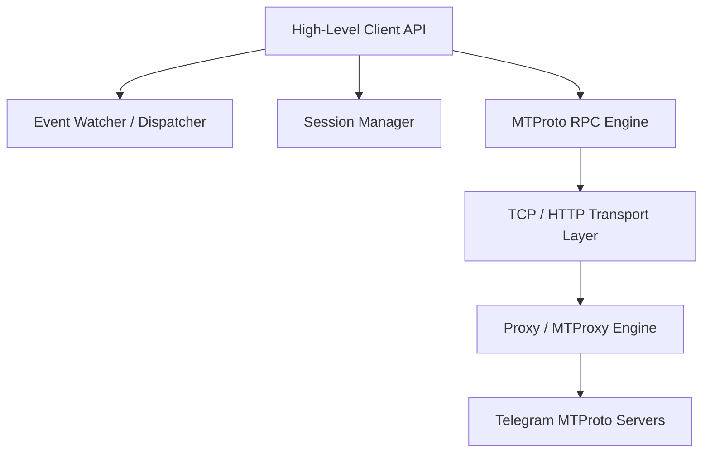

# DryGram Framework Documentation

DryGram is a production-grade, highly-optimized, fully asynchronous Telegram MTProto framework built from scratch in Python 3.13+. It features a pure asynchronous execution design, custom session serialization, and a modern event watcher/dispatcher pipeline.

## Architecture Overview

DryGram is designed as a modular, decoupled framework consisting of five primary layers:

1. **Transport & Network Layer**: Manages raw TCP and HTTP connections, proxy routing (SOCKS5/HTTP/MTProxy), obfuscated handshakes, and transport negotiation.
2. **MTProto RPC Engine**: Manages server time synchronization, session keys, AES-IGE encryption, message sequence tracking, message containerization, and acknowledgements.
3. **Session Management**: A pluggable storage system providing raw, encrypted, or database-backed session state persistence.
4. **Event Watcher & Dispatcher**: An asynchronous update routing pipeline utilizing composable boolean filters (Gates) and priority queues.
5. **High-Level Client API**: An intuitive interface exposing high-level async methods that internally execute structured MTProto schema functions.

## Features

- **No Pyrogram/Telethon Dependencies**: Built completely from scratch with a custom TL serializer/deserializer and packet format.
- **Pluggable Session Backends**: Built-in support for SQLite, Postgres, Redis, MongoDB, Binary files, Encrypted files, JSON, and Custom callback backends.
- **Robust Exception Handling**: A detailed MTProto RPC exception hierarchy containing FloodWait, PhoneMigrate, RetryAfter, and other protocol errors parsed dynamically.
- **Voice & Video Call Support**: High-level call hooks designed to integrate with `py-tgcalls` and `ntgcalls`.
- **Advanced Concurrency**: Task schedulers, priority worker pools, and parallel media transfer mechanisms.
